<div align="center">

# 🧠 PAM — Personal AI Memory

**A local-first AI memory system that turns your scattered notes, PDFs, and files into a searchable, connected knowledge base — answered by a local LLM, no cloud required.**


</div>

---

## 📋 Table of Contents

- [Overview](#overview)
- [Key Features](#key-features)
- [Architecture](#architecture)
- [How It Works](#how-it-works)
- [Document Intelligence](#document-intelligence)
- [Chunking](#chunking)
- [Retrieval & RAG](#retrieval--rag)
- [Local LLM](#local-llm)
- [Supported Documents](#supported-documents)
- [Installation](#installation)
- [Quick Start](#quick-start)
- [Usage](#usage)
- [Example Workflows](#example-workflows)
- [Watcher, Queue & Recovery](#watcher-queue--recovery)
- [Configuration](#configuration)
- [Core Concepts](#core-concepts)
- [Project Structure](#project-structure)
- [Development Guide](#development-guide)
- [Testing](#testing)
- [Troubleshooting](#troubleshooting)
- [Vision & Roadmap](#vision--roadmap)
- [Limitations](#limitations)
- [Contributing](#contributing)
- [License](#license)

---

## Overview

The problem PAM solves is **fragmentation**: useful information is scattered across notes, PDFs, Markdown files, code, transcripts, spreadsheets, and other local documents. PAM brings all of it into one local workflow — classify the source, extract or analyze the content, chunk it, embed it, store it, and retrieve it later with semantic and keyword search.

PAM is intentionally **local-first**: local filesystem storage, local [Ollama](https://ollama.com) inference, and a local Obsidian vault. Nothing is sent to an external service — the entire loop runs on the machine where your knowledge lives.

PAM has grown from a manual document processor into an automated, local-first **AI memory system** — where knowledge capture happens continuously in the background instead of through one-off commands. The foundations for semantic memory, a knowledge graph, and grounded RAG question-answering are already in place as of **V1.0.0**.

> **V1 is a stable, frozen local MVP** for document intake, retrieval, and RAG — not yet a full production knowledge platform. See [Limitations](#limitations) for what's intentionally out of scope, and [Vision & Roadmap](#vision--roadmap) for what's next.

---

## ✨ Key Features

- 📥 Local document ingestion through a CLI and workflow pipeline
- 🗂️ Routing and classification by document kind
- 📄 PDF text extraction and OCR for scanned PDFs and images
- 📝 Markdown, TXT, HTML/XML/JSON/RSS, CSV/TSV, XLSX, and code/config file handling
- ✂️ Semantic chunking with heading-aware splitting and overlap
- 🔢 Embedding generation through Ollama
- 🔍 Local vector-store search with JSON persistence
- 🔤 BM25 keyword search and hybrid retrieval via reciprocal rank fusion
- 💬 Grounded question answering over your local knowledge base
- 🕸️ Obsidian note generation and vault writes
- 👀 Watcher and queue support for automatic inbox processing
- ✅ CI, pytest, Ruff, and mypy validation

---

## 🏗️ Architecture

PAM is built as a layered local workflow:

1. Source files are added to the project or inbox
2. The document classifier determines the likely kind
3. A routed processor extracts or analyzes the content
4. OCR, table extraction, metadata extraction, and structure analysis run where relevant
5. Text is chunked into manageable segments
6. Chunks are embedded with Ollama
7. Vectors are stored locally and searched with hybrid retrieval
8. Query results are assembled into bounded context
9. A local LLM answers the question using only the retrieved context
10. The generated note or answer is written to the local vault or returned in the CLI

```mermaid
flowchart LR
    subgraph CLI[CLI and runtime orchestration]
        C1[pam CLI\napp/cli/entry.py]
        C2[Settings / config\napp/core/config.py]
        C3[Watcher + queue\napp/watcher/service.py\napp/queue/*.py]
    end

    subgraph INPUT[Inputs]
        D1[Document / inbox file]
        D2[GitHub / YouTube / local source]
    end

    subgraph INGEST[Ingestion]
        I1[DocumentIngestionService\napp/infrastructure/ingestion/service.py]
        I2[Source-specific ingestors\nMarkdown / PDF / Text / CSV / DOCX / image / etc.]
    end

    subgraph INTEL[Document intelligence]
        R1[DocumentClassifier\napp/infrastructure/routing/classifier.py]
        R2[ProcessorRouter\napp/infrastructure/routing/router.py]
        R3[Text extraction / OCR / tables / metadata / structure]
        R4[KnowledgeGraphBuilder\napp/infrastructure/knowledge_graph.py]
    end

    subgraph STORAGE[Persistence and storage]
        S1[VaultWriter\napp/infrastructure/vault]
        S2[VectorStore\napp/infrastructure/vector_store.py]
        S3[Manifest + JSON files\nsettings.paths.manifest_root]
        S4[Knowledge graph JSON / metadata]
    end

    subgraph RAG[Retrieval and grounding]
        A1[SemanticChunker\napp/infrastructure/semantic_chunking.py]
        A2[EmbeddingService\napp/infrastructure/embeddings.py]
        A3[BM25 + HybridSearch\napp/infrastructure/search.py]
        A4[SearchService\napp/infrastructure/search.py]
        A5[QAWorkflow\napp/application/qa_workflow.py]
        A6[OllamaClient\napp/infrastructure/llm]
    end

    subgraph OUTPUT[Output]
        O1[Grounded answer + sources]
        O2[Obsidian note / vault output]
    end

    D1 --> I1
    D2 --> I1
    C1 --> I1
    C2 --> C1
    C2 --> I1
    C3 --> I1

    I1 --> I2
    I2 --> R1
    R1 --> R2
    R2 --> R3
    R3 --> A1
    R3 --> R4

    A1 --> A2
    A2 --> S2
    S2 --> A3
    S2 --> A4
    A3 --> A4
    A4 --> A5
    A6 --> A5
    A5 --> O1

    R4 --> S4
    I2 --> S1
    S1 --> O2
    R3 --> S3
    I1 --> S3
```



<details>
<summary><strong>Verified components behind this diagram</strong></summary>

| Layer | Module |
|---|---|
| CLI entrypoint | `app/cli/entry.py` |
| Settings & runtime config | `app/core/config.py` |
| Watcher & queue | `app/watcher/service.py`, `app/queue/*.py` |
| Ingestion pipeline | `app/infrastructure/ingestion/service.py`, `app/pipelines/ingest_workflow.py` |
| Routing / classification | `app/infrastructure/routing/classifier.py`, `app/infrastructure/routing/router.py` |
| Semantic chunking | `app/infrastructure/semantic_chunking.py` |
| Embedding generation | `app/infrastructure/embeddings.py` |
| Vector storage & hybrid retrieval | `app/infrastructure/vector_store.py`, `app/infrastructure/search.py` |
| Local LLM access | `app/infrastructure/llm` |
| Grounded QA | `app/application/qa_workflow.py` |
| Knowledge graph builder | `app/infrastructure/knowledge_graph.py` |
| Vault output | `app/infrastructure/vault` |

</details>

---

## ⚙️ How It Works

A file entering the pipeline moves through classification, routing, AI analysis, and dual output (semantic search + knowledge graph) before it ever reaches the vault:

```text
Source Document
      │
      ▼
  Watcher / CLI
      │
      ▼
     Queue
      │
      ▼
Duplicate Detection (SHA-256)
      │
      ▼
  Classifier  (24 document kinds)
      │
      ▼
  Router      (20 processors)
      │
      ▼
  Routed Processor (OCR / Vision / Audio / ...)
      │
      ▼
  AI Analysis (21 extracted fields)
      │
      ├─→ Semantic Chunking → Embeddings → Vector Store
      ├─→ Knowledge Graph Builder → Graph Persistence
      ├─→ Cross-Document Linking (similarity search)
      │
      ▼
Markdown Generation
      │
      ▼
 Wiki Manager + Placeholder Notes
      │
      ▼
 Obsidian Vault
```

---

## 📄 Document Intelligence

- Text extraction from Markdown, TXT, PDF, CSV, and other text-oriented sources
- OCR for scanned PDFs and images via a vision-based OCR engine, with a Tesseract fallback
- Spreadsheet table extraction for XLSX-style workbooks
- Image metadata and processing hooks for image sources
- Structure analysis for text-bearing document kinds
- Relationship and entity extraction in the knowledge graph pipeline
- Metadata extraction for filename, language, MIME type, and document properties

This isn't a claim of universal document intelligence — it's a practical local processing pipeline that works well for the [supported kinds](#supported-documents) below.

## ✂️ Chunking

The V1 chunker is a **semantic chunker** built around headings and text boundaries:

- Heading-aware splitting with overlap
- Sentence-aware segmentation with tokenizer selection
- Chunk-size control and overlap tuning through configuration
- Chunk metadata carries source provenance and position information

## 🔍 Retrieval & RAG

- Embeddings generated through Ollama using an embedding model
- Dense vector retrieval over the local vector store
- BM25 lexical search for keyword matches
- Hybrid retrieval that fuses semantic and keyword results via reciprocal rank fusion
- Context bounded to a fixed number of chunks and character budget before prompt construction
- The QA workflow queries the model only *after* assembling grounded context
- Answers are returned with source references from the retrieved results

## 🤖 Local LLM

- Configuration defines the local Ollama host and model settings
- The embeddings service calls the Ollama embedding endpoint
- The QA workflow calls the Ollama text-generation endpoint
- OCR/vision processing can route through local vision-capable models

No document content ever needs to leave the machine.

---

## 📚 Supported Documents

| Category | Verified formats |
| --- | --- |
| Text and markup | Markdown, TXT, HTML, XML, JSON, RSS |
| PDF and scanned docs | PDF, scanned PDF via OCR |
| Data | CSV, TSV, XLSX-style spreadsheet tables |
| Code and config | Python, JavaScript, TypeScript, Java, C/C++, Go, Rust, Ruby, PHP, Swift, Kotlin, shell, SQL, TOML, INI, CFG, YAML, ENV |
| Notebooks | Jupyter notebooks |
| Images | PNG, JPG, JPEG, GIF, WebP, BMP, TIFF, HEIC, SVG |
| Audio | MP3, WAV, M4A, FLAC, OGG, AAC |
| Video | MP4, MKV, MOV, AVI, WebM |
| Documents | DOCX, ODT, RTF, PPTX, PPT, ODP, EPUB, LaTeX |
| Research | BibTeX, RIS |
| Email and archives | EML, ZIP, TAR, GZ |
| Databases | SQLite, DB |

> This table reflects file kinds present in the codebase and routing system. Some entries are recognized by the classifier while others are supported by dedicated processors — the project doesn't claim complete production parity across every listed format.

---

## 🚀 Installation

**Requirements**

- Python 3.11+
- Git
- [Ollama](https://ollama.com)
- Obsidian
- A local filesystem for the project and vault

```bash
git clone <repository-url>
cd LLM-Wiki
python -m venv .venv
source .venv/bin/activate
python -m pip install --upgrade pip
pip install -r requirements.txt
pip install -e ".[dev]"
```

A `pam` CLI entry point is registered through the packaging configuration.

## ⚡ Quick Start

```bash
pam doctor          # verify Ollama, config, and paths are healthy
pam status           # check current system status
pam watch            # start watching data/inbox for new files
pam ingest markdown notes/idea.md   # or ingest a file directly
pam ask "what is attention in transformers?"
```

---

## 💻 Usage

```bash
pam --help
pam status
pam doctor
pam config
pam config --json
pam watch
pam search "query"
pam ask "question"
pam ingest markdown path/to/file.md
pam ingest pdf path/to/file.pdf
pam ingest txt path/to/file.txt
pam ingest github https://github.com/owner/repository
pam ingest youtube https://www.youtube.com/watch?v=VIDEO_ID
```

## 🗂️ Example Workflows

**Markdown (manual ingestion)**

```bash
pam ingest markdown data/inbox/python.md
```

Produces `vault/Notes/Python.md` and updates `index.md`, `overview.md`, and `log.md`.

**GitHub repository**

```bash
pam ingest github https://github.com/ollama/ollama
```

Downloads and analyzes the repository README, then generates linked notes in the vault.

**YouTube**

```bash
pam ingest youtube https://www.youtube.com/watch?v=VIDEO_ID
```

Pulls the transcript, extracts knowledge, and generates vault notes.

**Watch mode (automatic)**

```bash
pam watch
```
```text
✔ Watcher started — monitoring data/inbox
```

```bash
# In another terminal, drop a file into the inbox
cp ~/Downloads/research-notes.md data/inbox/
```
```text
✔ Detected: research-notes.md
✔ Queued (1 pending)
✔ Duplicate check passed
✔ Processing... [██████████] 100%
✔ Vault updated: vault/Notes/Research-Notes.md
✔ Moved to data/processed/research-notes.md
```

---

## 👀 Watcher, Queue & Recovery

The pipeline for automatic processing:

```text
data/inbox → watcher → queue → duplicate check → ingestion → vault → manifest
```

New files are detected, queued, checked against previously processed files via SHA-256 hashing, processed one at a time, written into the Obsidian vault, recorded in `data/manifests/processed_files.json`, and moved to `data/processed`. Failed or unsupported files are moved to `data/failed`.

**Progress display** — Rich progress bars show the current step, percentage, elapsed time, and estimated remaining time, reporting each stage: reading the document, cleaning text, sending content to Ollama, generating knowledge, writing Markdown, updating the vault, and completion time.

**Recovery** — Missing runtime directories (inbox, processed, failed, logs, vault, cache, manifests) are recreated on startup. Pending queue items are stored in `data/manifests/queue_state.json` and restored on the next `pam watch` run after an interruption.

**Retry behavior** — Recoverable Ollama failures are retried with exponential backoff: 1s, then 2s, then 4s, before the file is marked failed and moved to `data/failed`.

**Graceful shutdown** — On `Ctrl+C`, `pam watch` stops accepting new file events, waits for the current file and any queued work to finish, saves queue state, flushes logs, stops the watcher, and exits with a clean goodbye message.

**Logs** (`data/logs/`, rotate at 10 MB, 5 backups kept):

| Log | Purpose |
|---|---|
| `application.log` | Startup, configuration, and general application events |
| `watcher.log` | Folder watcher startup, shutdown, and file detection |
| `processing.log` | Queue and ingestion processing events |
| `errors.log` | Errors from any application component |

**Watcher, queue & manifest config** (`config/default.yaml`):

```yaml
watcher:
  enabled: true
  inbox_path: ./data/inbox
  processed_path: ./data/processed
  failed_path: ./data/failed
  recursive: true
  interval_seconds: 1
  supported_extensions:
    - .md
    - .txt
    - .pdf

queue:
  enabled: true
  workers: 1
  max_size: 1000

manifest:
  enabled: true
  path: ./data/manifests/processed_files.json

processing:
  move_processed: true
  move_failed: true
```

```bash
PAM_WATCHER__ENABLED=false
PAM_WATCHER__INTERVAL_SECONDS=2
PAM_WATCHER__RECURSIVE=false
```

---

## ⚙️ Configuration

Configuration loads in layers, in this order:

1. `config/default.yaml`
2. `config/<environment>.yaml`
3. Environment variables (`PAM_*`)

Default environment is `development`. Switch with `PAM_ENVIRONMENT=production`. Nested values use double underscores, e.g. `PAM_OLLAMA__HOST=http://localhost:11434`. View the resolved configuration at any time with `pam config`.

<details>
<summary><strong>Full default configuration</strong></summary>

```yaml
app:
  name: personal-ai-memory
  environment: development

paths:
  vault_root: ./vault
  inbox_root: ./data/inbox
  staging_root: ./data/staging
  manifest_root: ./data/manifests
  cache_root: ./data/cache
  log_root: ./data/logs

ollama:
  host: http://localhost:11434
  model: qwen3:8b
  timeout_seconds: 1800
  request_retries: 3
  retry_backoff_seconds: 1.0

logging:
  level: INFO
  format: console
  console_enabled: true
  file_enabled: true
  use_colors: true
  filename: application.log
  max_bytes: 10485760
  backup_count: 5

watcher:
  enabled: true
  inbox_path: ./data/inbox
  processed_path: ./data/processed
  failed_path: ./data/failed
  recursive: true
  interval_seconds: 1
  supported_extensions:
    - .txt
    - .md
    - .pdf
    - .csv
    - .xlsx
    # ... code, image, audio, video extensions (90+ total)

queue:
  enabled: true
  workers: 1
  max_size: 1000
  state_path: ./data/manifests/queue_state.json

manifest:
  enabled: true
  path: ./data/manifests/processed_files.json

processing:
  move_processed: true
  move_failed: true
  processed_path: ./data/processed
  failed_path: ./data/failed

models:
  general_text: qwen3:8b
  programming: qwen2.5-coder:7b
  vision: qwen2.5vl:latest
  audio: faster-whisper
  embeddings: nomic-embed-text

intelligence:
  ocr: { enabled: true, engine: "auto", page_limit: 5, max_pages: 200 }
  metadata: { enabled: true, mime_enabled: true, language_detection_enabled: true, max_file_size_mb: 50, email_attachments: true }
  structure: { enabled: true }
  entities: { enabled: true }
  relationships: { enabled: true }
  graph: { enabled: true }
  tables: { enabled: true, pdf_engine: "pdfplumber" }
  images: { preprocess: false, exif_enabled: true, diagram_enabled: true }
  code: { enabled: true }

chunking:
  sentence_tokenizer: "auto"
  heading_size_step: 0
  min_chunk_chars: 200
  snap_overlap: false
  heading_overlap_boundary: false
```

</details>

**Generated note format** — every note PAM writes includes YAML frontmatter, a title and summary, key concepts, definitions, and important entities, related topics and tags, the generation date and source, and Obsidian wiki links where useful. Concepts, definitions, entities, and related topics render as `[[wiki links]]`, so the vault grows into a connected knowledge base over time.

---

## 📘 Core Concepts

| Concept | What it does |
|---|---|
| **Watcher** | A background service (`pam watch`) built on **Watchdog** that monitors `data/inbox` for file system events and hands new files to the queue. Runs on a configurable polling interval and can watch subdirectories recursively. |
| **Queue** | Receives files from the watcher and processes them sequentially, with a configurable size limit and worker count. Persists state to disk so pending work survives an unexpected stop. |
| **Manifest** | `data/manifests/processed_files.json` tracks every file PAM has processed, keyed by SHA-256 hash. `data/manifests/queue_state.json` stores pending queue items for recovery after a restart. |
| **Duplicate Detection** | Every file is hashed with SHA-256 before processing. A hash already in the manifest means the file is skipped, avoiding redundant AI processing and duplicate vault notes. |
| **Processed Folder** | `data/processed/` holds original source files that were successfully ingested, moved here once their vault notes are generated. |
| **Failed Folder** | `data/failed/` holds files that couldn't be processed — unsupported format, parsing error, or non-recoverable Ollama failure. Check `data/logs/errors.log` for the reason. |

---

## 📁 Project Structure

```text
AI-Memory/
├── app/
│   ├── application/       # Application services
│   ├── cli/                # Typer CLI (pam)
│   ├── core/                # Config, extensions, settings
│   ├── domain/              # Domain models
│   ├── infrastructure/      # Embeddings, search, BM25, vector store,
│   │                        # knowledge graph, semantic chunking,
│   │                        # routing (classifier + processors), ingestion
│   ├── pipelines/           # Ingest workflow orchestration
│   ├── prompts/             # Ollama prompt templates
│   ├── queue/                # Processing queue + recovery
│   ├── templates/            # Note templates
│   └── watcher/               # Background folder watching
├── config/
│   ├── default.yaml
│   ├── development.yaml
│   └── production.yaml
├── data/
│   ├── inbox/              # Input files awaiting processing
│   ├── processed/          # Successfully processed files
│   ├── failed/              # Failed files, for review
│   ├── cache/
│   ├── manifests/            # processed_files.json, queue_state.json
│   └── logs/
├── docs/                    # Engineering + release documentation
├── scripts/
├── tests/
│   ├── integration/          # 16 integration test files
│   └── unit/                  # 56 unit test files
├── vault/                    # Generated Obsidian vault
├── LICENSE
├── README.md
├── requirements.txt
└── pyproject.toml
```

| Directory | Purpose |
|---|---|
| `app/` | Main application source code |
| `app/watcher/` | Background folder watching service |
| `app/queue/` | Processing queue implementation |
| `app/infrastructure/` | Routing, ingestion, search, vector store, knowledge graph |
| `config/` | YAML configuration files |
| `data/inbox/` | Input files awaiting processing |
| `data/processed/` | Files successfully processed and archived |
| `data/failed/` | Files that failed processing, for review |
| `data/cache/` | Temporary cached data |
| `data/manifests/` | Persistent processing state |
| `data/logs/` | Application, watcher, processing, and error logs |
| `tests/` | Unit and integration tests |
| `vault/` | Generated Obsidian vault |
| `docs/` | Project documentation |

**Design principles:** Clean Architecture · SOLID Principles · Modular Components · Type Safety · Local-first Design · Offline AI · Extensibility · Comprehensive Testing

> Generated runtime files (Obsidian state, vault output, local caches, scratch/debug artifacts) may appear in a local working tree during normal use, but they're workspace-local — not product code or release assets.

---

## 🧑‍💻 Development Guide

```bash
# Install development dependencies
python -m pip install -e ".[dev]"

# Run the full unit + regression suite (default; 1377 tests verified)
python -m pytest

# Run integration tests (live Ollama required; environment-dependent tests may fail)
python -m pytest tests/integration -m "integration or not integration"

# Run a specific test file
python -m pytest tests/unit/test_knowledge_engine.py

# Coverage gate (fail_under = 80 in pyproject.toml)
coverage run -m pytest
coverage report

# Lint
ruff check .

# Type check
mypy app
```

**Principles:** keep the project runnable after every change · prefer typed models for cross-module communication · keep Ollama access behind `app.infrastructure.llm` · keep vault writes behind `app.infrastructure.vault` · keep watcher/queue logic behind `app.watcher` and `app.queue` · never overwrite user-written Obsidian content · add tests when changing shared behavior.

## 🧪 Testing

- **1377 passing tests**, 57 deselected, 1 warning (verified) 
- **89.80% coverage**
- Python 3.11, 3.12, and 3.13 all passing in CI
- Ruff and mypy both passing
- Coverage spans ingestion, classification, routing, processing, AI analysis, markdown generation, the knowledge engine, vector store, knowledge graph, semantic chunking, hybrid search, watcher, queue, CLI, configuration, and security
- External model behavior is mocked for deterministic tests

---

## 🩺 Troubleshooting

**Watcher isn't detecting new files**
- Confirm `pam watch` is running and `watcher.enabled` is `true` in your config
- Check that the file extension is listed in `watcher.supported_extensions`
- Verify `inbox_path` points to the correct directory (`pam config` shows the resolved path)
- Check `data/logs/watcher.log` for startup or permission errors

**Files stay in the queue and never process**
- Confirm Ollama is running (`ollama list`) and reachable at the configured host
- Check `data/logs/processing.log` for stuck or errored jobs
- Restart with `pam watch` — pending items are restored from `data/manifests/queue_state.json`

**A file isn't being reprocessed**
- Expected: PAM uses SHA-256 hashing to detect duplicates and skips files it has already processed
- To force reprocessing, remove the entry from `data/manifests/processed_files.json` or modify the file so its hash changes

**Files are ending up in `data/failed`**
- Check `data/logs/errors.log` for the specific reason
- Common causes: Ollama unavailable, a malformed or password-protected PDF, or an unsupported file type
- Fix the issue and move the file back into `data/inbox` to retry

**Manifest looks out of sync with the vault**
- Manifests only track *source files*, not vault edits — manually edited notes are never touched
- If a manifest file becomes corrupted, back it up and delete it; PAM recreates it and treats all inbox files as new on the next run

---

## 🔭 Vision & Roadmap

### ✅ Delivered — V1.0.0 (stable MVP, frozen)

All six roadmap phases plus the RAG QA phase are complete: `v0.1.0` → `v0.12.0` → **V1.0.0**, covering semantic memory, hybrid search, a knowledge graph, and grounded `pam ask` QA. See `docs/DEVELOPMENT_ROADMAP.md` for the phase-by-phase record, `docs/PHASE_6_FINAL_APPROVAL.md` for the Phase-6 approval, and `docs/PROJECT_STATUS.md` for the current state.

### 🔮 Future Vision (V2 — not yet implemented)

- External vector database support — ChromaDB / FAISS / Qdrant
- Cross-encoder re-ranking of retrieved chunks, plus query rewriting & parent-child retrieval
- Stronger retrieval evaluation and benchmarking (retrieval/hallucination metrics)
- Deeper multimodal document understanding — PDF-embedded image understanding, structured table querying
- Multi-strategy / per-document chunking selection
- Broader document coverage and deeper extraction workflows
- Neo4j / NetworkX for large-scale knowledge graph storage
- REST API, web UI, and multi-user architecture
- Production deployment tooling — Docker, monitoring, large-scale distributed ingestion
- An autonomous agent layer (Personal Tutor, Research Assistant, Daily Knowledge Summaries)

All of it stays local-first and offline by design.

---

## ⚠️ Limitations

PAM is upfront about what it does and doesn't do:

- It's a local MVP, not a full production SaaS platform
- It depends on a working local Ollama runtime
- Vectors and graph data are stored in local JSON structures, not a production external database
- Some file types are recognized by the classifier but not fully supported end-to-end
- No full evaluation framework, re-ranking pipeline, or external vector database layer yet
- OCR, table extraction, and knowledge extraction are feature-specific, not universal

---

## 🤝 Contributing

Contributions, issues, and feature requests are welcome — check the [issues page](https://github.com/GiridharBM/AI-Memory/issues) or open a pull request.

## 📄 License

Licensed under the **MIT License** — see [LICENSE](./LICENSE) for details.

---

<div align="center">

Made with 🧠 by [GiridharBM](https://github.com/GiridharBM)

</div>