```mermaid
flowchart LR
    subgraph CLI[CLI and runtime orchestration]
        C1[pam CLI\napp/cli/entry.py]
        C2[Settings / config\napp/core/config.py]
        C3[Watcher + queue\napp/watcher/service.py\napp/queue/*.py]
    end

    subgraph INPUT[Inputs]
        D1[Document / inbox file]
        D2[GitHub / YouTube / local source]
    end

    subgraph INGEST[Ingestion]
        I1[DocumentIngestionService\napp/infrastructure/ingestion/service.py]
        I2[Source-specific ingestors\nMarkdown / PDF / Text / CSV / DOCX / image / etc.]
    end

    subgraph INTEL[Document intelligence]
        R1[DocumentClassifier\napp/infrastructure/routing/classifier.py]
        R2[ProcessorRouter\napp/infrastructure/routing/router.py]
        R3[Text extraction / OCR / tables / metadata / structure]
        R4[KnowledgeGraphBuilder\napp/infrastructure/knowledge_graph.py]
    end

    subgraph STORAGE[Persistence and storage]
        S1[VaultWriter\napp/infrastructure/vault]
        S2[VectorStore\napp/infrastructure/vector_store.py]
        S3[Manifest + JSON files\nsettings.paths.manifest_root]
        S4[Knowledge graph JSON / metadata]
    end

    subgraph RAG[Retrieval and grounding]
        A1[SemanticChunker\napp/infrastructure/semantic_chunking.py]
        A2[EmbeddingService\napp/infrastructure/embeddings.py]
        A3[BM25 + HybridSearch\napp/infrastructure/search.py]
        A4[SearchService\napp/infrastructure/search.py]
        A5[QAWorkflow\napp/application/qa_workflow.py]
        A6[OllamaClient\napp/infrastructure/llm]
    end

    subgraph OUTPUT[Output]
        O1[Grounded answer + sources]
        O2[Obsidian note / vault output]
    end

    D1 --> I1
    D2 --> I1
    C1 --> I1
    C2 --> C1
    C2 --> I1
    C3 --> I1

    I1 --> I2
    I2 --> R1
    R1 --> R2
    R2 --> R3
    R3 --> A1
    R3 --> R4

    A1 --> A2
    A2 --> S2
    S2 --> A3
    S2 --> A4
    A3 --> A4
    A4 --> A5
    A6 --> A5
    A5 --> O1

    R4 --> S4
    I2 --> S1
    S1 --> O2
    R3 --> S3
    I1 --> S3
```

# PAM — Personal AI Memory / LLM-Wiki

PAM is a local-first AI memory project that ingests documents, indexes them into a searchable knowledge store, and lets you ask grounded questions over the resulting knowledge base using local Ollama models. The V1 release is a stable local MVP for document intake, retrieval, and RAG, not a full production knowledge platform.

## Overview

The core problem PAM solves is fragmentation: useful information is spread across notes, PDFs, Markdown files, code, transcripts, spreadsheets, and other local documents. PAM brings those materials into a single local workflow: classify the source, extract or analyze the content, chunk it, embed it, store it, and retrieve it later with semantic and keyword search.

The project is intentionally local-first. It uses local filesystem storage, local Ollama inference, and a local Obsidian vault. Instead of sending personal content to an external service, the system keeps the processing loop on the machine where the knowledge lives.

## V1 at a glance

PAM V1.0.0 is a stable local MVP for document ingestion, retrieval, and grounded question answering.

- Version: 1.0.0
- Runtime: Python 3.11–3.13 (validated in CI), local Ollama, local filesystem storage
- Scope: document intake, routing, document intelligence, chunking, embeddings, hybrid retrieval, and grounded QA
- Validation: 1375 passing tests, 89.80% coverage, Ruff and mypy checks in CI
- Status: V1 is frozen; future enhancements are explicitly deferred and not implemented in this release

## Key Features

The following features are implemented and verified in the repository:

- Local document ingestion through a CLI and workflow pipeline
- Routing and classification by document kind
- PDF text extraction and OCR support for scanned PDFs and images
- Markdown, TXT, HTML/XML/JSON/RSS, CSV/TSV, XLSX, and code/config file handling in the pipeline
- Semantic chunking with heading-aware splitting and overlap
- Embedding generation through Ollama
- Local vector-store search with JSON persistence
- BM25 keyword search and hybrid retrieval using reciprocal rank fusion
- Grounded question answering over the local knowledge base
- Obsidian note generation and vault writes
- Watcher and queue support for local inbox processing
- CI, pytest, Ruff, and mypy validation

## Architecture

PAM is built as a layered local workflow:

1. Source files are added to the project or inbox.
2. The document classifier determines the likely kind.
3. A routed processor extracts or analyzes the content.
4. OCR, table extraction, metadata extraction, and structure analysis run where relevant.
5. Text is chunked into manageable segments.
6. Chunks are embedded with Ollama.
7. Vectors are stored locally and searched with hybrid retrieval.
8. Query results are assembled into bounded context.
9. A local LLM answers the question using only the retrieved context.
10. The generated note or answer is written to the local vault or returned in the CLI.

## How It Works

The diagram below reflects the actual V1 implementation currently in the repository: CLI-driven document intake, configuration-backed processing, document intelligence, semantic chunking, local embeddings, and hybrid retrieval before grounded QA.



The major verified components represented in the diagram exist in the repository and were inspected directly in the current implementation:

- CLI entrypoint: `app/cli/entry.py`
- Settings and runtime config: `app/core/config.py`
- Watcher and queue: `app/watcher/service.py`, `app/queue/*.py`
- Ingestion pipeline: `app/infrastructure/ingestion/service.py`, `app/pipelines/ingest_workflow.py`
- Routing / classification: `app/infrastructure/routing/classifier.py`, `app/infrastructure/routing/router.py`
- Semantic chunking: `app/infrastructure/semantic_chunking.py`
- Embedding generation: `app/infrastructure/embeddings.py`
- Vector storage and hybrid retrieval: `app/infrastructure/vector_store.py`, `app/infrastructure/search.py`
- Local LLM access: `app/infrastructure/llm`
- Grounded question answering: `app/application/qa_workflow.py`
- Knowledge graph builder: `app/infrastructure/knowledge_graph.py`
- Vault output: `app/infrastructure/vault`

## Document Intelligence

The repository includes real document intelligence logic for the following verified features:

- Text extraction from Markdown, TXT, PDF, CSV, and other text-oriented sources
- OCR for scanned PDFs and images via a vision-based OCR engine and Tesseract fallback path
- Spreadsheet table extraction for XLSX-style workbooks
- Image metadata and processing hooks for image sources
- Structure analysis for text-bearing document kinds
- Relationship and entity extraction in the knowledge graph pipeline
- Metadata extraction for filename, language, MIME, and document properties

The code does not claim universal document intelligence. The implemented path is a practical local processing pipeline that works for the supported kinds described below.

## Chunking

The V1 chunking implementation is a semantic chunker built around headings and text boundaries.

Verified behavior:

- Heading-aware splitting and overlap
- Sentence-aware segmentation with tokenizer selection
- Chunk-size control and overlap tuning through configuration
- Chunk metadata carry source provenance and position information

This is not a generic full-text chunking framework; it is the project’s real semantic chunking strategy used before embedding.

## Retrieval / RAG

The project includes a real retrieval and grounding pipeline:

- Embeddings are generated through Ollama using an embedding model
- Dense vector retrieval searches the local vector store
- BM25 lexical search ranks keyword matches
- Hybrid retrieval fuses semantic and keyword results using reciprocal rank fusion
- Context is bounded to a fixed number of chunks and character budget before prompt construction
- The QA workflow asks the model only after assembling grounded context from retrieved hits
- Answers are returned with source references from the retrieved results

This is the V1 RAG path for the local knowledge base.

## Local LLM

The project uses local Ollama models for the runtime AI path.

Verified integration points:

- The configuration defines local Ollama host and model settings
- The embeddings service calls the Ollama embedding endpoint
- The QA workflow calls the Ollama text-generation endpoint
- OCR/vision processing can route through local vision-capable models

The system is designed to run locally and does not require sending document content to a remote service.

## Supported Documents

The project classifies and routes many formats, but the repository should be read honestly: some formats are recognized by the classifier and routed, while the verified working runtime path is narrower.

| Category | Verified formats in code and runtime path |
| --- | --- |
| Text and markup | Markdown, TXT, HTML, XML, JSON, RSS |
| PDF and scanned docs | PDF, scanned PDF via OCR |
| Data | CSV, TSV, XLSX-style spreadsheet tables |
| Code and config | Python, JavaScript, TypeScript, Java, C/C++, Go, Rust, Ruby, PHP, Swift, Kotlin, shell, SQL, TOML, INI, CFG, YAML, ENV |
| Notebooks | Jupyter notebooks |
| Images | PNG, JPG, JPEG, GIF, WebP, BMP, TIFF, HEIC, SVG |
| Audio | MP3, WAV, M4A, FLAC, OGG, AAC |
| Video | MP4, MKV, MOV, AVI, WebM |
| Documents | DOCX, ODT, RTF, PPTX, PPT, ODP, EPUB, LaTeX |
| Research | BibTeX, RIS |
| Email and archives | EML, ZIP, TAR, GZ |
| Databases | SQLite, DB |

Important note: this table reflects file kinds present in the codebase and the routing system. Some entries are recognized by the classifier and some are supported by specific processors. The project does not claim complete production parity across every listed format.

## Installation

Requirements:

- Python 3.11+
- Git
- Ollama
- Obsidian
- A local filesystem for the project and vault

Install steps:

1. Clone the repository.
2. Create a virtual environment.
3. Install dependencies from the project config.
4. Confirm the local Ollama endpoint is reachable.
5. Pull the required models if needed.

Example:

```bash
git clone <repository-url>
cd LLM-Wiki
python -m venv .venv
source .venv/bin/activate
python -m pip install --upgrade pip
pip install -r requirements.txt
pip install -e ".[dev]"
```

The project also defines a CLI entry point named pam through the packaging configuration.

## Usage

The CLI commands implemented in the repository are:

```bash
pam --help
pam status
pam doctor
pam config
pam config --json
pam watch
pam search "query"
pam ask "question"
pam ingest markdown path/to/file.md
pam ingest pdf path/to/file.pdf
pam ingest txt path/to/file.txt
pam ingest github https://github.com/owner/repository
pam ingest youtube https://www.youtube.com/watch?v=VIDEO_ID
```

Examples:

```bash
pam status
pam doctor
pam search "transformers attention"
pam ask "what is attention in transformers?"
pam ingest markdown notes/idea.md
pam ingest pdf papers/guide.pdf
```

## Example Workflow

Document
→ ingestion
→ classification and routing
→ OCR / extraction / metadata / table processing as needed
→ semantic chunking
→ embeddings
→ vector store + BM25 index
→ hybrid retrieval
→ grounded local LLM answer

## Testing

The project includes a real automated test suite and CI checks.

Verified status:

- 1377 tests passed
- 57 deselected
- Python 3.11, 3.12, and 3.13 CI passing
- Ruff passing
- Mypy passing
- Coverage approximately 89%

The project is configured to run pytest with the default non-integration subset and includes CI automation for linting, typing, and tests.

## V1.0.0

V1.0.0 is the frozen, locally stable MVP release for PAM / LLM-Wiki. It is a working local document memory and retrieval system built around:

- ingestion
- routing and classification
- OCR and metadata extraction where applicable
- semantic chunking
- embeddings and retrieval
- grounded QA over the local knowledge base
- Obsidian-based notes and vault output

The release tag remains frozen and should be treated as the V1 baseline.

## Limitations

This project is honest about what it does and does not do.

- It is a local MVP, not a full production SaaS platform
- It depends on a working local Ollama runtime
- It stores vectors and graph data in local persisted JSON structures rather than a production external database
- Some file types are recognized by the classifier but not fully supported end-to-end
- It does not include a full evaluation framework, re-ranking pipeline, or external vector database layer
- OCR, table extraction, and knowledge extraction are feature-specific, not universal

## V2 Roadmap

Future V2 work is explicitly separate from V1 functionality. High-level areas include:

- external vector database support
- stronger retrieval evaluation and benchmarking
- reranking and query expansion
- more robust multimodal document understanding
- broader document coverage and deeper extraction workflows
- web or API interfaces
- richer agentic automation

These are roadmap items, not existing V1 features.

## Project Structure

```text
app/
  application/
  cli/
  core/
  domain/
  infrastructure/
  pipelines/
  prompts/
  queue/
  templates/
  watcher/
config/
data/
requirements.txt
pyproject.toml
README.md
LICENSE
vault/
```

Key areas:

- app/cli: CLI entry point and commands
- app/pipelines: ingestion workflow orchestration
- app/infrastructure: routing, OCR, embeddings, vector store, search, chunking
- app/domain: models and domain logic
- app/watcher: inbox monitoring and queueing
- app/queue: asynchronous processing state and worker logic
- app/templates: note generation

## Local Workspace Notes

Generated runtime files such as Obsidian state, vault output, local caches, and scratch/debug artifacts are not part of the V1 application source. They may appear in a local working tree during normal use, but they are workspace-local and should not be treated as product code or release assets.

## Engineering Highlights

- Typed Python across the core runtime and project structure
- Modular ingestion and router-based processor design
- Local-first architecture with no remote dependency required for core workflows
- Document intelligence and OCR path architecture
- CI validation with pytest, Ruff, and mypy
- Cross-platform compatibility work for local runtime behavior
- Maintainable separation between ingestion, retrieval, generation, and vault output layers

## License

The repository license is MIT, as defined in the project files.

data/inbox -> watcher -> queue -> duplicate check -> ingestion -> vault -> manifest
```

New files are detected, queued, checked against previously processed files via SHA-256 hashing, processed one at a time, written into the Obsidian vault, recorded in `data/manifests/processed_files.json`, and moved to `data/processed`. Failed or unsupported files are moved to `data/failed`.

Stop watching with `Ctrl+C`. The watcher stops accepting new events, lets the current item finish, saves pending queue items to `data/manifests/queue_state.json`, flushes logs, and exits cleanly.

### Example workflow

```bash
# Start the watcher
pam watch
```
```text
✔ Watcher started — monitoring data/inbox
```

```bash
# In another terminal, drop a file into the inbox
cp ~/Downloads/research-notes.md data/inbox/
```
```text
✔ Detected: research-notes.md
✔ Queued (1 pending)
✔ Duplicate check passed
✔ Processing... [██████████] 100%
✔ Vault updated: vault/Notes/Research-Notes.md
✔ Moved to data/processed/research-notes.md
```

### Progress Display

Automatic processing uses Rich progress bars with the current step, percentage, elapsed time, and estimated remaining time. The CLI reports each major stage: reading the document, cleaning text, sending content to Ollama, generating knowledge, writing Markdown, updating the vault, and completion time.

### Recovery

AI Memory recreates missing runtime directories on startup, including inbox, processed, failed, logs, vault, cache, and manifests. Pending queue items are stored in `data/manifests/queue_state.json` and restored on the next `pam watch` run if the application was interrupted.

### Logs

Logs are written under `data/logs/`:

| Log | Purpose |
|---|---|
| `application.log` | Startup, configuration, and general application events |
| `watcher.log` | Folder watcher startup, shutdown, and file detection |
| `processing.log` | Queue and ingestion processing events |
| `errors.log` | Errors from any application component |

Log files rotate automatically at 10 MB and keep 5 backups.

### Retry Behaviour

Recoverable Ollama failures are retried with exponential backoff. With the default retry settings, failures wait 1 second, then 2 seconds, then 4 seconds before the file is marked failed and moved to the failed directory.

### Graceful Shutdown

On `Ctrl+C`, `pam watch` stops accepting new file events, waits for the current file and any queued work to finish, saves queue state, flushes logs, stops the watcher, and exits with a clean goodbye message.

### Watcher, Queue & Manifest Configuration

The watcher, queue, manifest, and processing behavior are configured in `config/default.yaml`:

```yaml
watcher:
  enabled: true
  inbox_path: ./data/inbox
  processed_path: ./data/processed
  failed_path: ./data/failed
  recursive: true
  interval_seconds: 1
  supported_extensions:
    - .md
    - .txt
    - .pdf

queue:
  enabled: true
  workers: 1
  max_size: 1000

manifest:
  enabled: true
  path: ./data/manifests/processed_files.json

processing:
  move_processed: true
  move_failed: true
```

Environment variables use double underscores:

```bash
PAM_WATCHER__ENABLED=false
PAM_WATCHER__INTERVAL_SECONDS=2
PAM_WATCHER__RECURSIVE=false
```

---

## 🔄 Processing Workflow

Every document — whether ingested manually or picked up automatically by the watcher — follows the same pipeline:

```text
User saves document
        │
        ▼
     Watcher
        │
        ▼
      Queue
        │
        ▼
Duplicate Detection
        │
        ▼
  AI Processing
        │
        ▼
Markdown Generation
        │
        ▼
   Vault Update
        │
        ▼
 Move to Processed
```

**Example — Watching Mode:**
```bash
pam watch
```
Detects `notes.md` in `data/inbox`, checks its SHA-256 hash against `data/manifests/processed_files.json`, processes it automatically, writes `vault/Notes/Notes.md`, and moves the source file to `data/processed/notes.md`.

**Example — Markdown (manual):**
```bash
pam ingest markdown data/inbox/python.md
```
produces `vault/Notes/Python.md` and updates `index.md`, `overview.md`, and `log.md`.

**Example — GitHub Repository:**
```bash
pam ingest github https://github.com/ollama/ollama
```
downloads and analyzes the repository README, then generates linked notes in the vault.

**Example — YouTube:**
```bash
pam ingest youtube https://www.youtube.com/watch?v=VIDEO_ID
```
pulls the transcript, extracts knowledge, and generates vault notes.

---

## 🏗️ Project Architecture

```text
Source Document
      │
      ▼
  Watcher / CLI
      │
      ▼
     Queue
      │
      ▼
Duplicate Detection
      │
      ▼
  Classifier (24 kinds)
      │
      ▼
  Router (20 processors)
      │
      ▼
  Routed Processor (OCR/Vision/Audio/...)
      │
      ▼
  AI Analysis (21 fields)
      │
      ├─→ Semantic Chunking → Embeddings → Vector Store
      ├─→ Knowledge Graph Builder → Graph Persistence
      ├─→ Cross-Document Linking (similarity search)
      │
      ▼
Markdown Generation
      │
      ▼
 Wiki Manager + Placeholder Notes
      │
      ▼
 Obsidian Vault
```

---

## 📁 Folder Structure

```text
AI-Memory/
├── app/
│   ├── application/       # Application services
│   ├── cli/               # Typer CLI (pam)
│   ├── core/              # Config, extensions, settings
│   ├── domain/            # Domain models
│   ├── infrastructure/    # Embeddings, search, BM25, vector store,
│   │                      # knowledge graph, semantic chunking,
│   │                      # routing (classifier + processors), ingestion
│   ├── pipelines/         # Ingest workflow
│   ├── prompts/           # Ollama prompt templates
│   ├── queue/             # Processing queue + recovery
│   ├── templates/         # Note templates
│   └── watcher/           # Background folder watching
├── config/
│   ├── default.yaml
│   ├── development.yaml
│   └── production.yaml
├── data/
│   ├── inbox/             # Input files awaiting processing
│   ├── processed/         # Successfully processed files
│   ├── failed/            # Failed files, for review
│   ├── cache/
│   ├── manifests/         # processed_files.json, queue_state.json
│   └── logs/
├── docs/                  # Engineering + release documentation
├── scripts/
├── tests/
│   ├── integration/       # 16 integration test files
│   └── unit/              # 56 unit test files
├── vault/                 # Generated Obsidian vault
├── LICENSE
├── README.md
├── requirements.txt
└── pyproject.toml
```

| Directory | Purpose |
|---|---|
| `app/` | Main application source code |
| `app/watcher/` | Background folder watching service |
| `app/queue/` | Processing queue implementation |
| `app/infrastructure/` | Routing, ingestion, search, vector store, knowledge graph |
| `config/` | YAML configuration files |
| `data/inbox/` | Input files awaiting processing |
| `data/processed/` | Files successfully processed and archived |
| `data/failed/` | Files that failed processing, for review |
| `data/cache/` | Temporary cached data |
| `data/manifests/` | Persistent processing state — `processed_files.json` and `queue_state.json` |
| `data/logs/` | Application, watcher, processing, and error logs |
| `tests/` | Unit and integration tests |
| `vault/` | Generated Obsidian vault |
| `docs/` | Project documentation |

### Design Principles
Clean Architecture · SOLID Principles · Modular Components · Type Safety · Local-first Design · Offline AI · Extensibility · Tested Code · Comprehensive Testing

---

## ⚙️ Configuration

Configuration is loaded in layers, in this order:
1. `config/default.yaml`
2. `config/<environment>.yaml`
3. Environment variables (`PAM_*`)

Default environment: `development`. Switch with:
```bash
PAM_ENVIRONMENT=production
```

Nested config values use double underscores:
```bash
PAM_OLLAMA__HOST=http://localhost:11434
PAM_OLLAMA__MODEL=qwen3:8b
PAM_PATHS__VAULT_ROOT=D:\Obsidian\PersonalAIWiki
PAM_WATCHER__ENABLED=false
```

Default configuration:
```yaml
app:
  name: personal-ai-memory
  environment: development

paths:
  vault_root: ./vault
  inbox_root: ./data/inbox
  staging_root: ./data/staging
  manifest_root: ./data/manifests
  cache_root: ./data/cache
  log_root: ./data/logs

ollama:
  host: http://localhost:11434
  model: qwen3:8b
  timeout_seconds: 1800
  request_retries: 3
  retry_backoff_seconds: 1.0

logging:
  level: INFO
  format: console
  console_enabled: true
  file_enabled: true
  use_colors: true
  filename: application.log
  max_bytes: 10485760
  backup_count: 5

watcher:
  enabled: true
  inbox_path: ./data/inbox
  processed_path: ./data/processed
  failed_path: ./data/failed
  recursive: true
  interval_seconds: 1
  supported_extensions:
    - .txt
    - .md
    - .pdf
    - .csv
    - .xlsx
    # ... code, image, audio, video extensions (90+ total)

queue:
  enabled: true
  workers: 1
  max_size: 1000
  state_path: ./data/manifests/queue_state.json

manifest:
  enabled: true
  path: ./data/manifests/processed_files.json

processing:
  move_processed: true
  move_failed: true
  processed_path: ./data/processed
  failed_path: ./data/failed

models:
  general_text: qwen3:8b
  programming: qwen2.5-coder:7b
  vision: qwen2.5vl:latest
  audio: faster-whisper
  embeddings: nomic-embed-text

intelligence:
  ocr: { enabled: true, engine: "auto", page_limit: 5, max_pages: 200 }
  metadata: { enabled: true, mime_enabled: true, language_detection_enabled: true, max_file_size_mb: 50, email_attachments: true }
  structure: { enabled: true }
  entities: { enabled: true }
  relationships: { enabled: true }
  graph: { enabled: true }
  tables: { enabled: true, pdf_engine: "pdfplumber" }
  images: { preprocess: false, exif_enabled: true, diagram_enabled: true }
  code: { enabled: true }

chunking:
  sentence_tokenizer: "auto"
  heading_size_step: 0
  min_chunk_chars: 200
  snap_overlap: false
  heading_overlap_boundary: false
```

View current configuration with `pam config`.

### Generated Note Format

Each generated note includes:
- YAML frontmatter, title, and summary
- Key concepts, definitions, and important entities
- Related topics, tags, and references
- Generated date and source
- Obsidian wiki links where useful

Concepts, definitions, entities, and related topics are rendered as `[[wiki links]]` so the vault grows into a connected knowledge base over time.

---

## 📘 Core Concepts

### Watcher
A background service (`pam watch`) built on **Watchdog** that monitors `data/inbox` for file system events. When a supported file is created or modified, it's handed off to the queue. The watcher runs on a configurable polling interval and can watch subdirectories recursively.

### Queue
An internal processing queue that receives files from the watcher and processes them sequentially. The queue has a configurable size limit (`max_size`) and worker count, and persists its state to disk so pending work is not lost if the application stops unexpectedly.

### Manifest
A JSON record — `data/manifests/processed_files.json` — that tracks every file AI Memory has processed, keyed by its SHA-256 hash. A second manifest, `data/manifests/queue_state.json`, stores pending queue items for recovery after a restart.

### Duplicate Detection
Before processing, every file is hashed with **SHA-256**. If the hash already exists in the manifest, the file is recognized as a duplicate and skipped, preventing redundant AI processing and duplicate vault notes.

### Processed Folder
`data/processed/` holds the original source files that were successfully ingested. Files are moved here automatically once their vault notes are generated.

### Failed Folder
`data/failed/` holds files that could not be processed — due to an unsupported format, a parsing error, or a non-recoverable Ollama failure. Check `data/logs/errors.log` for the reason before retrying.

---

## 🧑‍💻 Development Guide

```bash
# Install development dependencies
python -m pip install -e ".[dev]"

# Run the full unit + regression suite (default; 1375 tests)
python -m pytest

# Run integration tests (live Ollama required; environment-dependent tests may fail)
python -m pytest tests/integration -m "integration or not integration"

# Run a specific test file
python -m pytest tests/unit/test_knowledge_engine.py

# Coverage gate (fail_under = 80 in pyproject.toml)
coverage run -m pytest
coverage report

# Lint
ruff check .

# Type check
mypy app
```

### Test Suite

- **1375 passing tests** (57 deselected — integration/live tests requiring Ollama, Tesseract, or network)
- Tests cover: ingestion, classification, routing, processing, AI analysis, markdown generation, knowledge engine, vector store, knowledge graph, semantic chunking, hybrid search, watcher, queue, CLI, configuration, security, and more
- External model behavior is mocked for deterministic tests
- Run `python -m pytest` to execute the full suite

### Development Principles
- Keep the project runnable after every change
- Prefer typed models for cross-module communication
- Keep Ollama access behind `app.infrastructure.llm`
- Keep vault writes behind `app.infrastructure.vault`
- Keep watcher and queue logic behind `app.watcher` and `app.queue`
- Do not overwrite user-written Obsidian content
- Add tests when changing shared behavior

---

## 🩺 Troubleshooting

### Watcher isn't detecting new files
- Confirm `pam watch` is running and `watcher.enabled` is `true` in your config
- Check that the file extension is listed in `watcher.supported_extensions` in `config/default.yaml`
- Verify `inbox_path` points to the correct directory (`pam config` shows the resolved path)
- Check `data/logs/watcher.log` for startup or permission errors

### Files stay in the queue and never process
- Confirm Ollama is running (`ollama list`) and reachable at the configured host
- Check `data/logs/processing.log` for stuck or errored jobs
- Restart with `pam watch` — pending items are restored from `data/manifests/queue_state.json`

### A file isn't being reprocessed
- This is expected behavior: AI Memory uses SHA-256 hashing to detect duplicates and skips files it has already processed
- To force reprocessing, remove the corresponding entry from `data/manifests/processed_files.json` or modify the file so its hash changes

### Files are ending up in `data/failed`
- Check `data/logs/errors.log` for the specific failure reason
- Common causes: Ollama unavailable, a malformed or password-protected PDF, or an unsupported file type
- Fix the underlying issue and move the file back into `data/inbox` to retry

### Manifest looks out of sync with the vault
- Manifests only track *source files*, not vault edits — manually edited notes in `vault/` are never touched
- If a manifest file becomes corrupted, back it up and delete it; AI Memory will recreate it and treat all inbox files as new on the next run

---

## 🔭 Vision

AI Memory has evolved from a manual document processor into an automated, local-first AI Memory System — one where knowledge capture happens continuously in the background instead of through one-off commands.

Version 3 and 4 foundations are already in place: **semantic memory** (local embeddings, semantic + hybrid search over the in-memory vector store), a **knowledge graph** (entity/relationship extraction with JSON persistence), and **RAG question answering** (`pam ask`, v1.0.0). Future versions build on this with external vector databases, re-ranking, and an agent layer — all while staying local-first and offline by design.

---

## 🗺️ Roadmap

### ✅ Delivered — V1.0.0 (stable MVP, frozen)
All six roadmap phases plus the RAG QA phase are complete: `v0.1.0` → `v0.12.0` → **V1.0.0** (semantic memory, hybrid search, knowledge graph, and grounded `pam ask` QA). See `docs/DEVELOPMENT_ROADMAP.md` for the phase-by-phase record, `docs/PHASE_6_FINAL_APPROVAL.md` for the Phase-6 approval, and `docs/PROJECT_STATUS.md` for the current V1.0.0 state.

### 🔮 Future vision (V2, not implemented)
- Cross-encoder re-ranking of retrieved chunks
- External vector DB — ChromaDB / FAISS / Qdrant
- PDF-embedded image understanding; structured table querying
- Multi-strategy / per-document chunking selection
- Query rewriting & parent-child retrieval
- Neo4j / NetworkX for large-scale graph storage
- REST API, web UI, multi-user architecture
- Advanced evaluation framework (retrieval/hallucination metrics)
- Production deployment, Docker, monitoring
- Large-scale distributed ingestion
- Autonomous AI agent (Personal Tutor, Research Assistant, Daily Knowledge Summaries)

---

## 🤝 Contributing

Contributions, issues, and feature requests are welcome. Feel free to check the [issues page](https://github.com/GiridharBM/AI-Memory/issues) or open a pull request.

---

## 📄 License

This project is licensed under the **MIT License** — see the [LICENSE](./LICENSE) file for details.

---

<div align="center">

Made with 🧠 by [GiridharBM](https://github.com/GiridharBM)

</div>
