# Master Engineering Design Document

> **Project:** Personal AI Memory System (PAM) / LLM-Wiki
>
> **Version:** 0.12.0
>
> **Classification:** Internal — Single Source of Truth
>
> **Author:** Principal Software Architect & AI Systems Architect
>
> **Date:** 2026-08-09
>
> **Version history:**
> - **0.12.0 (2026-08-09)** — Phase 6 (Production Hardening & Final Validation, P6-101..P6-106) implemented and verified: performance benchmark (P6-102, 20k-document corpus, 352 ms/query), failure isolation — child attachment failures no longer abort the parent item and a manifest save failure keeps the item DONE (P6-103, +2 tests); security/configuration audit (P6-104) — 34 personal runtime files untracked from git (`.gitignore` extended to `data/inbox|processed|failed|manifests/*`, `.gitkeep` whitelist preserved), `PyMuPDF`/`openpyxl` added to `requirements.txt`, production/development config separation locked by test; independent end-to-end validation (P6-105) — 15 flows × 10 dimensions verified by 25 independent checks against the live application; final project approval (P6-106). Suite: 1398 tests, 90.04% coverage. No new features; no architectural changes; Phase 6 evaluation-tooling roadmap rows (§5 Phase 6) deferred to backlog — the executed Phase 6 delivered hardening + validation instead.
> - **0.11.0 (2026-08-09)** — Phase 5 (Hybrid Retrieval, P5-101..P5-105) implemented: deterministic Okapi-BM25 sparse index (`app/infrastructure/bm25.py`, `k1=1.5`, `b=0.75`, stdlib-only, P5-101/102); reciprocal rank fusion `_rrf_fuse` (k=60) replacing the weighted-sum hybrid (P5-102); scoring verification locking the roadmap 4.1 success criterion (P5-103); `SearchService` facade (`create_default` + `search(query, *, top_k=5, filter=None, min_score=0.0)`) and `pam search` CLI (P5-104); retrieval optimization — precomputed entry norms, version-keyed BM25 cache (`store.version`), deterministic `(-score, entry.id)` ordering, additive `start_char`/`end_char` on `VectorEntry`, exact-match metadata filtering, and embedder/BM25 failure fallback (P5-105). §7.6 Retrieval Module Current Implementation/Interfaces rewritten; Phase 4 roadmap §4.1/§4.2/§4.7 rows marked delivered, §4.5 marked partial (exact-match shipped, `$in` deferred); §4.3/§4.4/§4.6 deferred. Phase 5 adds no dependencies.
> - **0.10.0 (2026-08-08)** — Phase 4 (Document Knowledge Graph, P4-101..P4-105) implemented: validated `Entity`/`Relationship` domain models (`app/domain/entity_relationship.py`, P4-101); deterministic regex `EntityExtractor` (P4-102); co-occurrence `RelationshipDetector` (P4-103); `DocumentGraphBuilder` mapping entities/relationships onto the existing in-memory `KnowledgeGraph` with `find_relationships` + `graph_to_dict` (P4-104); query layer (`get_entity`, `related_entities`, `nodes_by_source`, `query_graph`, `graph_from_dict`) consuming the pipeline's `metadata.extra["knowledge_graph"]` artifact (P4-105). Phase 4 ships no graph storage/retrieval and no graph DB; additive `EntitySettings`/`RelationshipSettings`/`GraphSettings` toggles (R-4 rollback). §7.7 Knowledge Graph Module Current Implementation added; Phase 5 §5.2 roadmap Graph Query row marked delivered (P4-105 `query_graph`).
> - **0.9.0 (2026-08-08)** — Milestone 3.2 (Hierarchical Semantic Chunking, G14) implemented: `SemanticChunker` is now a block tokenizer over heading hierarchy — heading path/parent/level metadata on every chunk (P3-201, native in-chunker hierarchy per the P3-201 O-1 user decision over the `metadata.extra["structure"]` seam); list-aware splitting at whole top-level items (P3-202); fenced-code atomic blocks with language metadata + inline-code sentence masking (P3-203); structured content preserved byte-for-byte (Markdown/HTML tables, blockquotes, callouts, definition lists) with hard-boundary overlap (P3-204); and an adaptive `ChunkingPolicy` (dynamic heading-depth sizing, paragraph/list-snapped overlap, heading hard boundaries) with P3-204-identical defaults, configurable via `ChunkingSettings` + `config/default.yaml` + env (P3-205). §7.4 Current Implementation/Interfaces rewritten; Phase 3 §5 roadmap G14 row marked delivered.
> - **0.8.0 (2026-08-06)** — Milestone 3.1 (NLP Sentence Segmentation, G12) implemented: new `sentence_tokenizer.py` module (`SentenceTokenizer` protocol + engine registry + `get_sentence_tokenizer` factory; abbreviation-aware stdlib heuristic engine; optional NLTK `punkt_tab` engine via the `intelligence` extra); `SemanticChunker` sentence splitting now delegates to the configurable engine (`sentence_tokenizer: str = "auto"`), `overlap_chars` implemented (`_apply_overlap`), `_SENTENCE_END` regex removed; `ChunkingSettings` + `chunking:` config block plumbed end-to-end; regression suite proves all existing chunking tests pass under `heuristic`/`nltk`/`auto` (R-2). §7.4 Current Implementation rewritten; Phase 3 §5 roadmap G12 row marked delivered.
> - **0.7.0 (2026-08-04)** — Milestone 2.6 (Code & Notebook Intelligence) implemented: new `code/` module (`language_from_filename` registry + `_AstCodeParser`/`_HeuristicCodeParser` + `NotebookParser`); `_enrich_code` wiring at the shared P2-305 call site (`code_structure` / `notebook_structure` channels); `CodeSettings` config (frozen §4.6); notebook ingestor upgrade (Option 2); Phase 2 roadmap, gap matrix, and checklist marked delivered; §2.4 ingestion subsystem and new §7.3d module spec refreshed.
> - **0.6.0 (2026-08-04)** — Milestone 2.5 (Image Intelligence) implemented: new `images/` module (`ImageAnalyzer` single EXIF owner + `DiagramParser` Mermaid conversion); shared preprocessing wired into both OCR engines; config `max_dimensions`/`max_bytes` aligned to frozen §4.5; G37/G33 status and Epic 8 rows marked delivered; subsystem table refreshed.
> - **0.5.0 (2026-08-03)** — Milestone 2.4 (Table Intelligence) implemented: new Table Intelligence module (`TableExtractor` registry + CSV/spreadsheet/PDF extractors + `MarkdownTableRenderer`); tables ride `metadata.extra["tables"]` (R-1 channel, §7.3 cross-reference); G35/G36 marked delivered; ADR-002 consequence chain updated (pdfplumber default engine); subsystem table refreshed.
> - **0.4.0 (2026-08-02)** — Milestone 2.3 (Document Structure Analysis) implemented: new §7.3 module (`StructureAnalyzer` + heading/block detection + tree builder); §7.4 chunking target-architecture input contract; subsystem table and top-level architecture diagram refreshed; Phase 2 roadmap and Epic 2 rows marked delivered.
> - **0.3.0 (2026-08-01)** — Milestone 2.2 (Metadata Extraction Framework) synchronized: §2.4 subsystem rewritten (enrichment pipeline, hooks, MIME/language detection, email attachments); ADR-001 consequence chain updated; subsystem table refreshed.
> - **0.2.0 (2026-08-01)** — Milestone 2.1 (OCR Engine) implemented: OCR module §7.2 rewritten to the `DocumentOcrService` architecture; constraint 9 (No Tesseract OCR) and 8 (No image preprocessing) updated; Gap G33/G34 and Epic 8 status updated; subsystem table refreshed.
> - **0.1.0 (2026-07-30)** — Initial baseline; Phase 1 foundation fixes documented (atomic writes, PyMuPDF gate, DoD tests).

---

## Table of Contents

1. [Executive Architecture Review](#1-executive-architecture-review)
2. [System Design Specification](#2-system-design-specification)
3. [Gap Analysis](#3-gap-analysis)
4. [Technical Debt Report](#4-technical-debt-report)
5. [Master Engineering Roadmap](#5-master-engineering-roadmap)
6. [Engineering Backlog](#6-engineering-backlog)
7. [Module Specifications](#7-module-specifications)
8. [Non-Functional Requirements](#8-non-functional-requirements)
9. [Risk Register](#9-risk-register)
10. [Version 1.0 Checklist](#10-version-10-checklist)

---

# 1. Executive Architecture Review

## 1.1 What the Project Currently Is

Personal AI Memory System (PAM) is a **local-first, offline-capable** Obsidian knowledge-base builder that processes documents through an AI pipeline powered by Ollama. It ingests 100+ file types across 20+ categories, extracts structured knowledge via local LLMs, and generates interconnected Obsidian notes with YAML frontmatter, wiki-links, semantic chunking, embeddings, vector search, and a knowledge graph.

**Current version:** 0.12.0 (pre-1.0). Maturity: ~80%.

## 1.2 Overall Architecture

```
┌─────────────────────────────────────────────────────────────────────┐
│                           CLI (Typer)                                │
│              ingest / watch / status / doctor / config               │
└──────────────────────────┬──────────────────────────────────────────┘
                           │
┌──────────────────────────▼──────────────────────────────────────────┐
│                        WatchService                                  │
│  ┌────────────────┐  ┌──────────────┐  ┌─────────────────────────┐  │
│  │ watchdog.Observer│  │ QueueManager  │  │ QueueWorker (thread)   │  │
│  │ (FS events)      │  │ (in-memory)   │  │ (polls → processes)   │  │
│  └────────┬───────┘  └──────┬───────┘  └───────────┬─────────────┘  │
│           │                  │                       │               │
│           └──────────────────┼───────────────────────┘               │
│                              │                                       │
│              ┌───────────────▼───────────────┐                      │
│              │      QueueStateStore          │                      │
│              │    (JSON persistence)         │                      │
│              └───────────────────────────────┘                      │
└─────────────────────────────────────────────────────────────────────┘
                           │
                           ▼
┌─────────────────────────────────────────────────────────────────────┐
│                      IngestionWorkflow                               │
│                                                                      │
│  1. DocumentIngestionService ───→ 20+ ingestors                     │
│  2. DocumentClassifier ────────→ extension + MIME + language → kind  │
│  3. ProcessorRouter ───────────→ selects processor + model          │
│  4. RoutedProcessor ───────────→ OCR / Vision / Audio / Text        │
│  4a. StructureAnalyzer ────────→ heading/block tree → extra["structure"] (M2.3) │
│  5. DocumentAIProcessor ───────→ Ollama LLM analysis                │
│  6. SemanticChunker ───────────→ heading→paragraph→sentence         │
│  7. EmbeddingService ──────────→ nomic-embed-text vectors           │
│  8. VectorStore ───────────────→ in-memory + JSON persistence       │
│  9. KnowledgeGraphBuilder ─────→ entities, concepts, edges          │
│ 10. ObsidianMarkdownGenerator ─→ full markdown note                 │
│ 11. VaultWriter ───────────────→ write to vault/                    │
│ 12. VersionManager ────────────→ versioned backup                   │
└─────────────────────────────────────────────────────────────────────┘
```

### Architectural Style

- **Clean Architecture layers:** `domain/` (pure Pydantic models), `infrastructure/` (implementations), `pipelines/` (orchestration), `application/` (use cases), `core/` (cross-cutting), `cli/` (entry points).
- **Protocol-based dependency injection:** Major dependencies (processors, generators, writers) use `Protocol` classes for testability.
- **Plugin ingestor registry:** 20+ ingestors registered by extension.
- **Strategy-based routing:** Classifier → Router → Processor selection.
- **Layered configuration:** Defaults → environment YAML → PAM_* env vars.

### Current Subsystems

| Subsystem | Implementation | Lines | Status |
|-----------|---------------|-------|--------|
| **CLI** | Typer, Rich | 476 | Stable |
| **Configuration** | Pydantic settings + YAML merge | 402 | Stable |
| **Logging** | structlog, rotating files | 189 | Stable |
| **Document Ingestion** | 20+ Protocol-based ingestors | ~800 | Stable |
| **Classifier & Routing** | Extension mapping → processor selection | ~250 | Stable |
| **Document Processing** | 20 processors (text, OCR, vision, audio) | ~500 | Stable |
| **OCR Engine** | `DocumentOcrService` + vision/Tesseract engines + render service | ~400 | Stable (M2.1) |
| **Metadata Extraction** | `DocumentMetadataService` + extractors + MIME/language detection + hooks | ~800 | Stable (M2.2) |
| **Document Structure Analysis** | `StructureAnalyzer` + heading/block detection + tree builder | ~330 | Stable (M2.3) |
| **Table Intelligence** | `TableExtractor` registry + CSV/spreadsheet/PDF extractors + `MarkdownTableRenderer` | ~470 | Stable (M2.4) |
| **LLM Client** | Ollama with retry, JSON extraction | 323 | Stable |
| **Vision Client** | Ollama multimodal | 95 | Functional |
| **Whisper Transcriber** | faster-whisper integration | 39 | Basic |
| **Prompt System** | Detailed JSON schema prompt | 165 | Stable |
| **Note Template** | 21-field Obsidian markdown generator | 410 | Stable |
| **Semantic Chunking** | Heading→paragraph→sentence decomposition | 134 | **Unstable** |
| **Embeddings** | nomic-embed-text via Ollama | 72 | Functional |
| **Vector Store** | In-memory, O(n) search, JSON persistence | 114 | **Inadequate** |
| **Search** | Semantic + naive keyword hybrid | 92 | **Inadequate** |
| **Knowledge Graph** | In-memory graph, JSON persistence | 143 | Functional |
| **State Management** | SHA-256 dedup, manifest, queue state | ~300 | Stable |
| **Queue** | In-memory deque, background thread | ~200 | Stable |
| **Watcher** | watchdog-based filesystem monitoring | 187 | Stable |
| **Vault Writer** | Managed content blocks, index, overview, log | 343 | Stable |
| **Version Manager** | Per-note version history | 110 | Functional |
| **File Extensions** | 17 categories, 110+ frozensets | 62 | Stable |
| **Tests** | 1398 unit + integration, 90.04% coverage | ~6000 | Strong |

## 1.3 Strengths

1. **Local-first, offline-first architecture.** No cloud dependencies. All processing (LLM, embeddings, vision, transcription) runs locally via Ollama. This is the project's core differentiator and is correctly prioritized.

2. **Clean Architecture with Protocol-based DI.** The separation of domain, infrastructure, and pipelines layers is genuine, not aspirational. `Protocol` classes for `DocumentProcessor`, `NoteGenerator`, `NoteWriter`, and `BaseIngestor` make the system testable and replaceable.

3. **Exceptional test suite maturity.** 1398 tests at 90.04% coverage with unit, integration, and E2E layers. The structural consistency pattern (`test_all_return_processed_document`) that iterates ALL processors is a best practice rarely seen. The milestone report artifacts (MILESTONE_3_REPORT, MILESTONE_4_REPORT, PROJECT_HEALTH_REPORT) demonstrate engineering maturity beyond typical 0.1.0 projects.

4. **Comprehensive file type support.** 20+ ingestors covering 100+ extensions across 17 categories — from PDF and DOCX to YouTube transcripts, SQLite databases, and GitHub READMEs.

5. **Robust configuration system.** Three-layer configuration (defaults → environment → env vars) with deep merge, Pydantic validation, and path resolution.

6. **Managed content preservation.** The `<!-- PAM:BEGIN MANAGED -->` / `<!-- PAM:END MANAGED -->` block system correctly preserves user edits across regeneration — a critical UX requirement for an Obsidian wiki tool.

7. **Structured LLM extraction.** 21-field `DocumentAnalysis` model with detailed prompts, validation constraints, and retry logic produces rich, structured knowledge from unstructured documents.

8. **Atomic file operations.** `os.replace()` (temp file + rename) for vector store, manifest, and queue state persistence prevents data corruption on crash.

9. **Duplicate detection.** SHA-256 content hashing + manifest manager prevents reprocessing the same content regardless of filename, path, or modification time.

10. **Comprehensive logging.** Structured JSON logging with rotating files, component-specific log files (watcher, processing, errors), and HTTP library noise suppression.

## 1.4 Weaknesses

1. **O(n) vector search.** `VectorStore.search()` performs a full linear scan computing cosine similarity against every entry. No indexing, no ANN. At 100K entries, search latency is estimated at ~1 second.

2. **Dead or unused code.** `SemanticChunker.overlap_chars` is declared (default 200) but never referenced in any method. `NoteVersion.sha256` field exists but is never computed. These are trivial to fix but indicate incomplete implementation.

3. **Overly broad `DocumentAnalysis` god object.** The analysis model has 22 fields covering summaries, concepts, definitions, entities, questions, flashcards, MCQs, revision notes, and metadata. This violates Single Responsibility and creates a coupling point: any change to any field potentially affects prompts, validation, templates, retry logic, and the KG builder.

4. **Pattern inconsistency between Pydantic and dataclass models.** Domain models in `analysis.py`, `documents.py`, `notes.py`, `config.py` use Pydantic (validated). Domain models in `knowledge_graph.py`, `vector_store.py`, `semantic_chunking.py`, `routing.py` use `@dataclass` (unvalidated). This inconsistency makes the system harder to reason about and allows invalid states in dataclass models (e.g., `DocumentChunk` with `start_char > end_char`).

5. **Knowledge graph performance.** `KnowledgeGraph.neighbors()` is O(E) linear scan. `subgraph()` uses `list.pop(0)` (O(n) per pop). Neither scales beyond small graphs.

6. **Duplicate processor/construction knowledge.** `IngestionWorkflow` → `_run_routed_processor()` recreates processors on every `run()` call. The CLI's `_run_ingest()` duplicates the same `from_runtime()` construction logic found in `QueueWorker._build_workflow()`.

7. **Cross-document linking is hobbled.** `_find_cross_document_links` only inspects the first 3 chunks of any document — an arbitrary hardcoded limit that severely limits cross-document graph connectivity.

8. **Extension mismatch between watcher and worker.** The watcher's `SUPPORTED_EXTENSIONS` includes all categories, but the worker's `SUPPORTED_PROCESSING_EXTENSIONS` excludes docx, odt, rtf, pptx, odp, ipynb, tex, epub, drawio, vsdx, mmd, archives, emails, databases, research files, and web formats. Files in these categories are detected by the watcher and enqueued, then immediately failed by the worker with a `None` source type.

9. **No startup inbox scan.** The watcher only responds to filesystem `on_created` events. Files sitting in the inbox before the watcher starts are never processed. This is a fundamental reliability gap.

10. **Stats bug.** `RuntimeStats.average_queue_latency_seconds` includes `skipped_duplicates` and `failed` in its denominator but only counts latency for processed items, artificially deflating the metric.

## 1.5 Technical Debt

See [Section 4: Technical Debt Report](#4-technical-debt-report) for the complete catalog. Major items:

| Category | Items | Total Effort |
|----------|-------|-------------|
| Critical | 6 fixes | ~4 weeks |
| High | 12 fixes | ~8 weeks |
| Medium | 10 fixes | ~10 weeks |
| Low | 8 fixes | ~4 weeks |

## 1.6 Missing Capabilities

1. **No search CLI.** `SemanticSearch` and `HybridSearch` exist as library classes but have no CLI binding, no REST endpoint, and no way for users to query the vector store. The entire ingestion pipeline produces searchable data that nobody can search.

2. **No BM25 sparse retrieval.** Keyword search is a naive substring containment check with no TF-IDF, no IDF weighting, and no tokenization.

3. **No query rewriting.** The user's raw query is searched verbatim. No synonym expansion, no query decomposition, no multi-variant search.

4. **No metadata filtering.** Search cannot be scoped by source type, date range, tags, or difficulty. The data model supports it (`VectorEntry.source_type`, `chunk_index`, `metadata`) but the search API doesn't expose it.

5. **No re-ranking.** Single-stage retrieval only. No cross-encoder re-ranker.

6. **No tree-sitter code parsing.** Code files are ingested as plain text. No AST parsing, no function-level chunking, no language-aware extraction.

7. **No table intelligence.** Tables in PDFs are extracted as jumbled flat text. No `camelot`/`tabula` integration for structured table extraction. No markdown table formatting in notes.

8. **No image preprocessing by default.** Preprocessing (deskew, denoise, CLAHE) is implemented (Milestone 2.1) but disabled by default (`intelligence.ocr.preprocess: false`) and optional (Pillow/numpy absent → no-op). Documented in §7.2.

9. **Tesseract OCR is optional.** OCR defaults to the vision model (primary) with a Tesseract offline fallback (`engine="auto"`). The Tesseract binary and `pytesseract` package are optional dependencies; the vision path remains GPU/network-dependent, the Tesseract path CPU-only.

10. **No web UI.** Terminal-only CLI. No REST API, no web interface, no Obsidian plugin integration.

11. **No Docker packaging.** Manual `uv run` setup required. No `docker-compose.yml` for one-command startup with Ollama.

12. **No CI/CD pipeline.** Tests exist but don't run automatically on push/PR.

13. **No retrieval evaluation.** No labeled query-document dataset. No precision/recall/NDCG metrics. No way to measure search quality.

14. **No hallucination detection.** LLM output is accepted as-is. No claim verification against source text.

15. **No authentication.** Any process on localhost can use the system. No multi-user isolation.

## 1.7 Production Readiness

| Dimension | Score | Notes |
|-----------|-------|-------|
| **Test coverage** | 8/10 | 90.04%, strong unit + integration + E2E, but live-service tests fragile |
| **Error handling** | 6/10 | Inconsistent — some paths have retry with backoff, others have bare `except Exception` |
| **Observability** | 5/10 | Good structured logging, but no metrics, no tracing, no health endpoints |
| **Data integrity** | 6/10 | Atomic writes on critical paths, but no transactions across multi-step operations |
| **Security** | 4/10 | No auth, no input sanitization beyond model validation, no secrets management |
| **Performance** | 3/10 | O(n) on every critical path (search, manifest, graph) |
| **Packaging** | 4/10 | pip installable, but no Docker, no CI, no release automation |
| **Documentation** | 7/10 | Excellent README and reports, but no API docs, no deployment guide |
| **Overall** | **5.4/10** | Functional but not production-ready |

## 1.8 Engineering Maturity

The project demonstrates **above-average engineering maturity** for a pre-1.0 project:

- **Strong testing culture:** 1398 tests, 90.04% coverage, layered unit/integration/E2E strategy, structural consistency checks.
- **Clean architecture:** Genuine layer separation, dependency injection via Protocols, testable by design.
- **Professional documentation:** Milestone reports, health reports, convergence documents.
- **Good practices:** Atomic writes, structured logging, Pydantic validation, type annotations everywhere, pre-commit hooks.

Areas needing improvement:

- **Developer experience:** No local development environment setup script. Manual `uv sync` required. No hot-reload for development.
- **Code modularity:** `processor_impls.py` at 493 lines and `config.py` at 402 lines exceed the 200-300 line sweet spot for maintainability.
- **Configuration management:** 5 nearly-identical `_resolve_*_paths()` functions are a DRY violation.
- **Test isolation:** Some integration tests hit live services (YouTube, Ollama), making them fragile in CI.

## 1.9 Risk Assessment

| Risk | Probability | Impact | Mitigation |
|------|-----------|--------|------------|
| In-memory vector store loses data on crash | Medium | High | Atomic JSON saves mitigate, but not a real database |
| O(n) search becomes unusable at scale | High | Medium | FAISS index is a known, low-effort fix |
| Ollama dependency is a single point of failure | Medium | High | Cloud provider adapter planned but not started |
| LLM hallucination silently corrupts knowledge graph | Medium | High | No hallucination detection exists |
| Contributor onboarding friction | High | Medium | No Docker, no CI, no development setup script |
| File system watcher misses events on macOS/Linux | Low | Medium | watchdog library is mature but platform quirks exist |
| Configuration drift between code and docs | Medium | Low | Good current state, needs automated validation |
| Memory exhaustion from unbounded processing | Medium | Medium | No document size limits, no processing budget |

## 1.10 Subsystem Ratings

| Subsystem | Reliability | Performance | Maintainability | Testability | Overall |
|-----------|-----------|-------------|-----------------|-------------|---------|
| CLI | B | A | B | B | B+ |
| Configuration | A | A | B | A | A- |
| Logging | A | A | B | B | B+ |
| Document Ingestion | B | B | B | A | B+ |
| Classifier & Routing | A | A | B | A | A- |
| Document Processing | B | B | B | A | B+ |
| LLM Client | B | B | A | A | A- |
| Vision Client | C | C | B | B | C+ |
| Whisper Transcriber | C | C | B | C | C |
| Prompt System | B | A | A | B | B+ |
| Note Template | A | A | A | B | A- |
| Semantic Chunking | C | B | C | B | C+ |
| Embeddings | B | B | B | B | B |
| Vector Store | D | D | B | B | C- |
| Search | D | D | B | B | C- |
| Knowledge Graph | C | D | B | B | C+ |
| State Management | A | C | B | A | B+ |
| Queue | B | B | B | B | B+ |
| Watcher | B | B | B | A | B+ |
| Vault Writer | A | C | B | A | B+ |
| Version Manager | B | C | B | C | B- |

---

# 2. System Design Specification

## 2.1 Introduction

This System Design Specification (SDS) defines the target architecture for PAM v1.0. Every subsection below addresses a subsystem, starting from the existing implementation and evolving toward production readiness.

## 2.2 Design Principles

```
┌────────────────────────────────────────────────────┐
│                 Design Principles                    │
├────────────────────────────────────────────────────┤
│ Local First   │ Offline First   │ Modular          │
│ Plugin Based  │ Clean Arch      │ SOLID            │
│ Interface Drv │ High Cohesion   │ Low Coupling     │
│ Extensible    │ Replaceable     │ Testable         │
│ Observable    │ Secure by Design│ Perf-Conscious   │
│ Config over   │                 │                  │
│ Hardcoding    │                 │                  │
└────────────────────────────────────────────────────┘
```

## 2.3 Overall System Architecture

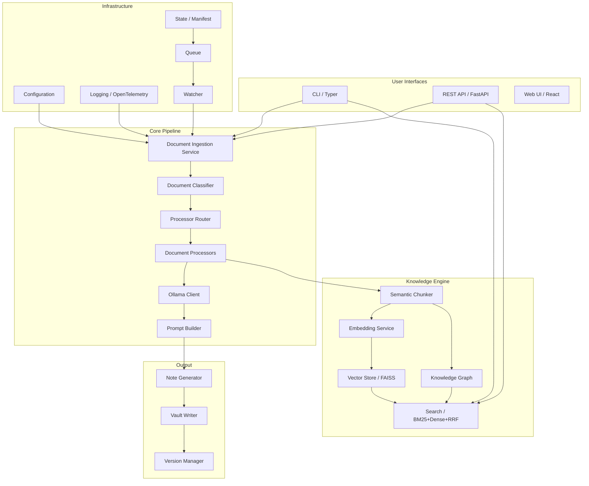

## 2.4 Subsystem: Document Ingestion

### Purpose
Convert source files (filesystem paths or URLs) into standardized `SourceDocument` objects with normalized text, metadata, and type classification.

### Responsibilities
- Accept file paths and URLs
- Select the correct ingestor by extension/content type
- Normalize text content (whitespace, encoding, structure preservation)
- Extract basic metadata (author, dates, page count)
- Return success/failure result

### Current Implementation
21 ingestors in `app/infrastructure/ingestion/`, each implementing `BaseIngestor` protocol. Registration is eager (all instantiated in `DocumentIngestionService.__init__()`). Selection is first-match by extension. The service additionally runs a metadata enrichment pipeline (Milestone 2.2): size guard → pre-hooks → ingestor → metadata extraction/merge → post-hooks.

The metadata subsystem lives in `app/infrastructure/document_intelligence/metadata/`:
- **Metadata registry** — `DocumentMetadataService` (in `__init__.py`) registers `MetadataExtractor` implementations, selects them by `source_types` in registration order, and merges their output into a `MetadataExtraction`; unknown keys route to `DocumentMetadata.extra`.
- **Built-in extractors** — `extractors.py`: `PdfExtractor` (pypdf metadata, moved out of `PdfIngestor`), `DocxExtractor`, `PptxExtractor` (OOXML core/app properties via stdlib `zipfile` + `ElementTree`), `NotebookExtractor`, `AudioExtractor`, `EmailExtractor`; all stdlib-only except PDF.
- **MIME detection** — `mime.py` `detect_mime(path)`: extension → magic-byte sniff → stdlib fallback table (see ADR-001). Consumed by `DocumentClassifier` for extensionless files.
- **Language detection** — `language.py` `detect_language(text)`: optional `py3langid`, else stdlib heuristic (en/fr/de/ja). Populated on `DocumentClassification.language` and drives the analysis prompt's respond-in-{language} instruction.
- **Hook system** — `hooks.py` `IngestionHook` protocol (pre/post); named hooks resolved from `intelligence.metadata.hooks.pre/post`; per-hook `try/except` containment.
- **Email attachment parsing** — `EmailIngestor` writes `Content-Disposition: attachment` parts to a per-run temp dir (sanitized filenames); `IngestionWorkflow._ingest_children` re-ingests them as child documents with `parent_id`, capped by `max_attachments` and depth-limited to one level.
- **Notebook structure** — `NotebookIngestor` attaches `metadata.extra["notebook_structure"]` via `parse_notebook` (M2.6, Option 2); consumed (passed through) by `_enrich_code` at the pipeline enrichment site. Flattened fenced text is preserved for backward compatibility.

### Problems
- Eager instantiation of all ingestors regardless of use
- First-match ingestor selection is extension-only (MIME type is applied by the classifier, not the ingestor registry)
- URL-based ingestors must override `can_ingest()` — inconsistent
- `url_timeout_seconds` config key defined but not yet consumed (URL ingestors use hardcoded timeouts)

### Goals
- ~~MIME-type based detection alongside extension~~ → **Implemented** (`detect_mime`, ADR-001)
- Lazy ingestor instantiation (future)
- ~~Pre/post processing hook system~~ → **Implemented** (`IngestionHook`, hook chain)
- ~~Size limits~~ → **Implemented** (`max_file_size_mb` reject-before-read); timeout config key defined, consumption pending
- Unified URL and file handling (future)

### Functional Requirements
- `FR-ING-1`: Accept file path (str or Path) and URL string
- `FR-ING-2`: Select ingestor by extension AND content MIME type
- `FR-ING-3`: Return `DocumentIngestionResult` with either document or error
- `FR-ING-4`: Extract and populate all `DocumentMetadata` fields
- `FR-ING-5`: Support pre-processing hooks (validation, decryption)
- `FR-ING-6`: Support post-processing hooks (normalization, enrichment)
- `FR-ING-7`: Timeout URL-based ingestion after configurable duration
- `FR-ING-8`: Reject files exceeding configurable size limit

### Non-Functional Requirements
- `NFR-ING-1`: Ingestion of a 10MB file completes in <5 seconds
- `NFR-ING-2`: Ingestor selection completes in <10ms
- `NFR-ING-3`: URL timeout default: 30 seconds
- `NFR-ING-4`: Default size limit: 50MB

### Architecture

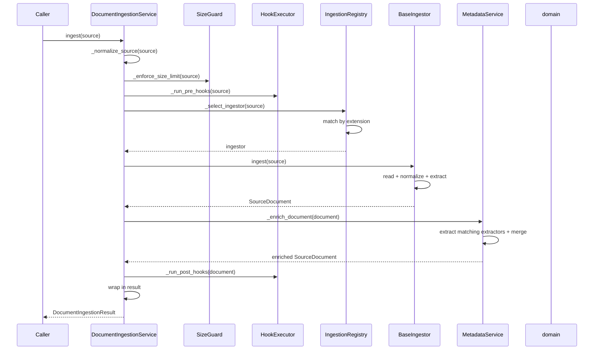
*Email attachments:* `IngestionWorkflow.run()` then calls `_ingest_children(document)` — each `attachment_paths` entry is re-ingested through the same service as a child document (`parent_id` set), capped by `max_attachments` and depth-limited to one level.

### Interfaces

```
class BaseIngestor(ABC):
    source_type: str  # "pdf", "markdown", etc.
    supported_suffixes: tuple[str, ...]

    def can_ingest(self, source: SourceReference) -> bool
    def ingest(self, source: SourceReference) -> SourceDocument  # abstract

class DocumentIngestionService:
    def __init__(self, ingestors: list[BaseIngestor] | None = None, *,
                 settings: Settings | None = None,
                 hooks: Iterable[IngestionHook] | None = None,
                 metadata_service: DocumentMetadataService | None = None)
    def ingest(self, source: str | Path) -> DocumentIngestionResult
    def register(self, ingestor: BaseIngestor) -> None
    def supported_extensions(self) -> tuple[str, ...]

class DocumentMetadataService:
    def register(self, extractor: MetadataExtractor) -> None
    def extractors_for(self, source_type: str) -> list[MetadataExtractor]
    def extract(self, document: SourceDocument) -> MetadataExtraction
    @staticmethod
    def merge(metadata: DocumentMetadata, extraction: MetadataExtraction) -> DocumentMetadata
```

### Public Contracts
- **Input:** `str | Path` (file path or URL)
- **Output:** `DocumentIngestionResult` with `SourceDocument` or `DocumentIngestionError`
- **Error:** `IngestionError` for unsupported sources, file read errors

### Data Models
- `SourceDocument`: source, source_path, source_type, filename, text, metadata
- `DocumentMetadata`: title, author, created_at, modified_at, page_count, mime_type, encoding, extra
- `MetadataExtraction` (`app/domain/document_intelligence.py`): source_type, values, extractor — produced by `DocumentMetadataService.extract`
- `DocumentIngestionResult`: document (optional), error (optional), succeeded (property)
- `DocumentIngestionError`: source, source_path, source_type, reason

### Error Handling
- File not found: `IngestionError` with descriptive message
- Unsupported format: `UnsupportedSourceError`
- Read failure: `IngestionError` wrapped from underlying I/O exception
- Timeout: configurable, raises `IngestionError`
- Size limit exceeded: raises `IngestionError` before reading
- Metadata enrichment failure: document returned unchanged (debug-logged), never raises
- Hook failure: pre-hook `IngestionError` aborts; any other hook exception logged and skipped

### Failure Modes
- **Corrupt file:** Ingestor raises, result returns error — no crash
- **Network timeout:** URL ingestor times out, returns error — pipeline continues
- **Out of memory:** Large file streaming — need chunked read protection
- **Encoding detection failure:** Falls back to UTF-8 with lossy decoding

### Performance Expectations
- File read + normalization: <1s for 1MB text
- Remote fetch + normalization: <30s for 10MB remote file
- Ingestor selection: O(1) via hash map

### Security Considerations
- Path traversal: `require_path_source` validates `source_path` is within allowed boundaries; email attachment filenames sanitized via `_safe_attachment_name` (strips path components)
- Remote URL timeout: prevents slow-loris style attacks
- Size limits: prevents disk or memory exhaustion
- Email attachments: `max_attachments` cap and shared per-file size limit bound per-run resource use; temp child files removed in `finally`
- No shell execution: all ingestors use pure Python or safe FFI

### Scalability
- Horizontal: Multiple instances can share a network filesystem (no local state)
- Vertical: Ingestion is I/O-bound, benefits from faster storage

### Extension Points
- `register(ingestor)`: add new file type support without modifying core
- `IngestionHook`: pre/post processing via plugin registration

### Trade-offs
- **Extension vs. MIME detection:** Extension is fast and file-system native; MIME detection (via `python-magic`) adds latency (~50ms) but detects real content. Solution (ADR-001): known extensions win without reading content; extensionless/unknown-extension files are sniffed (magic bytes → stdlib fallback table).
- **Eager vs. Lazy instantiation:** Eager catches import errors at startup but wastes memory. Lazy is memory-efficient but may fail mid-run. Recommendation: lazy with startup validation (ping each ingestor's can_ingest).

### Alternatives Considered
1. **Apache Tika** — powerful but a heavy Java dependency. Rejected for local-first principle.
2. **Unstructured.io** — excellent but adds a network service dependency. Rejected.
3. **Pure regex/text-based** — current approach. Works for text but not for binary formats.

### Architecture Decision Record

**ADR-001:** Extension-first MIME detection with magic-byte sniff and stdlib fallback.
- **Context:** `python-magic` is not available on all platforms (needs libmagic DLL on Windows), and libmagic does not reliably identify Markdown or plain text
- **Decision:** `python-magic` is optional and lazily imported. Detection precedence is:

  ```
  Extension (mimetypes.guess_type + .ipynb supplement)
      ↓  (extensionless or unknown extension only)
  Magic-byte sniff: python-magic from_buffer (if importable)
      ↓  (absent, or libmagic returns generic text/plain / application/octet-stream)
  Stdlib fallback table (_sniff_mime: PDF/zip/image/audio/XML/HTML/JSON/Markdown/plain-text)
  ```

- **Consequence:** A known extension resolves without reading file content (fast, deterministic); users on Windows without libmagic still get content detection for extensionless files via the stdlib magic-number table, and a warn-once log when `python-magic` is absent. Known extensions always win over content sniff.

### Acceptance Criteria
- All 20+ existing file types continue to ingest correctly — ✅ verified (M2.1/M2.2 suites)
- Extensionless file with known content is detected via MIME — ✅ `detect_mime` + classifier tests (AC 1)
- `python-magic` absence logs a warning but doesn't crash — ✅ warn-once test (AC 5)
- Pre-hook can reject a file before ingestion — ✅ pre-hook tests (AC 3a)
- Post-hook can modify text after ingestion — ✅ post-hook tests (AC 3b)
- Email with 3 PDF attachments produces 1 parent + 3 child notes — ✅ frozen AC integration test (AC 6)

### Testing Strategy
- Unit: Each ingestor tested with known-good and known-bad inputs
- Integration: Full round-trip with 20+ file types through real ingestion service
- Property: Arbitrary text content round-trips through normalization without data loss

### Future Enhancements
- Plugin-based ingestor discovery (entry points)
- Streaming ingestion for very large files
- Encrypted file support (GPG auto-decrypt)
- Consume `url_timeout_seconds` config in URL ingestors
- Nested email attachment recursion (currently depth-limited to one level)

## 2.5 Subsystem: Document Classifier & Router

### Purpose
Map a `SourceDocument` to a processing strategy (processor + model) based on file type, content characteristics, and configuration.

### Current Implementation
`DocumentClassifier` maps extensions to "kinds" via a long `if/elif` chain. `ProcessorRouter` maps kinds to `(processor_name, model_key)` pairs with first-match-wins semantics. `ModelRoutingSettings` resolves model keys to actual model names.

### Architecture

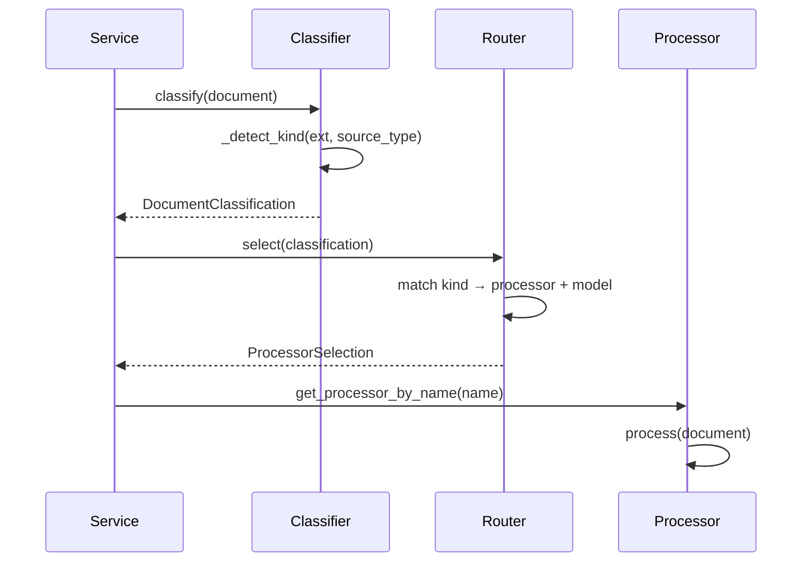

### Problems
- Extension-to-kind mapping is a fragile `if/elif` chain (classifier.py:38-107)
- First-match-wins routing is order-dependent
- No support for composite processing (e.g., OCR + text analysis)
- Model key routing is opaque — no way to see which model will be used

### Recommended Architecture
Replace the `if/elif` chain with a data-driven extension → kind mapping table:

```python
EXTENSION_KIND_MAP: dict[str, str] = {
    **{ext: "code" for ext in CODE_EXTENSIONS},
    **{ext: "image" for ext in IMAGE_EXTENSIONS},
    **{ext: "pdf" for ext in {".pdf"}},
    # ... etc
}
```

### Acceptance Criteria
- Every extension in `core/extensions.py` maps to exactly one kind
- Unknown extensions map to "unknown"
- Routing is order-independent (data-driven, not if/elif)
- `test_routing.py` 40+ tests continue to pass

## 2.6 Subsystem: Semantic Chunking

### Purpose
Decompose document text into semantically coherent, sized-bounded chunks suitable for embedding, retrieval, and LLM context windows.

### Current Implementation
`SemanticChunker` uses recursive decomposition: headings → paragraphs → sentences. Regex-based sentence splitting. 2000 character hard limit per chunk.

### Problems
- `overlap_chars` field is dead code (defined at `semantic_chunking.py:23`, never read)
- Sentence regex is English-centric, breaks on abbreviations and Unicode
- Character-based sizing ignores token counts (critical for CJK languages)
- No topic-based segmentation — chunks may mix unrelated content
- No hierarchical structure — chunks are flat, no parent section tracking

### Architecture

```mermaid
flowchart LR
    A[Source Text] --> B{Has headings?}
    B -->|Yes| C[Split by heading]
    B -->|No| D[Topic segmentation]
    C --> E[Split long sections<br/>by paragraph]
    D --> E
    E --> F[Split by sentence]
    F --> G{Chunk too large?}
    G -->|Yes| F
    G -->|No| H[Add overlap]
    H --> I[Assign parent IDs]
    I --> J[DocumentChunk[]]
```

### Goals
- Token-aware chunk sizing (512-1024 tokens per chunk)
- NLP sentence segmentation (spaCy or nltk)
- Implement chunk overlap (the dead `overlap_chars` field)
- Hierarchical chunk structure with parent section tracking
- Topic-based segmentation as optional enhancement

### Acceptance Criteria
- All existing chunking tests pass with new tokenizer
- Token count per chunk is within [384, 1152] for 95th percentile
- Adjacent chunks share configured overlap characters
- Each chunk has `parent_section_id` when headings are present
- English abbreviation handling: "Dr. Smith went to Washington." is 1 sentence, not 3

## 2.7 Subsystem: Embedding Service

### Purpose
Convert text chunks to dense vector representations for semantic search.

### Current Implementation
`EmbeddingService` wraps Ollama's `nomic-embed-text` model with `embed()` and `embed_batch()` methods. Single Ollama HTTP call per text.

### Problems
- No retry logic (unlike `OllamaClient` which has retry with backoff)
- `embed_batch` doesn't capture per-item `prompt_eval_count`
- Defensive `model_dump`/`dict` coercion on every response
- Single model only — no multi-model support

### Architecture

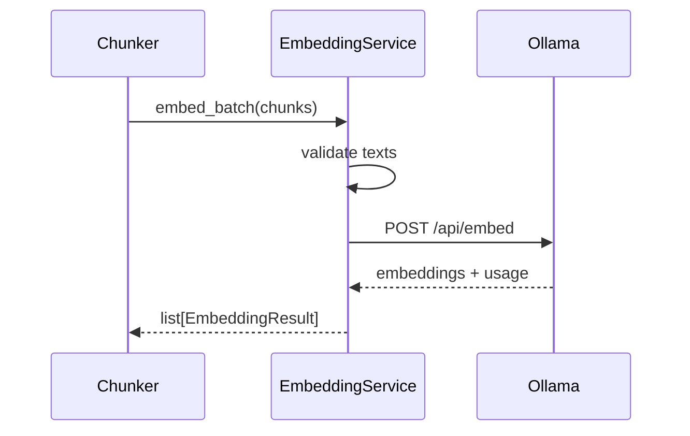

### Acceptance Criteria
- Empty text raises `ValueError`
- Batch of N texts returns N embeddings
- `prompt_eval_count` populated for all results
- Retry on transient Ollama errors with configurable backoff
- Response parsing handles both dict and Pydantic model responses

## 2.8 Subsystem: Vector Store

### Purpose
Store and retrieve dense vector embeddings for semantic similarity search.

### Current Implementation
In-memory `dict[str, VectorEntry]` with JSON file persistence. O(n) brute-force cosine similarity search. Atomic save using temp file + `os.replace()`.

### Problems
- O(n) linear scan — estimated ~1s at 100K entries
- No ANN index (FAISS, HNSW, IVFPQ)
- Full JSON serialization on every save (even if nothing changed)
- No eviction policy or TTL
- `_cosine_similarity` uses `strict=False` in `zip` — silently truncates longer vectors
- No dimension validation — 384-dim and 768-dim vectors coexist silently

### Target Architecture: FAISS IVF

```mermaid
flowchart LR
    A[Vector entry] --> B{FAISS built?}
    B -->|No| C[Build IVF index<br/>train on existing vectors]
    B -->|Yes| D[Add to FAISS index]
    D --> E[Update JSON metadata]
    
    F[Query vector] --> G{FAISS ready?}
    G -->|Yes| H[FAISS IVF search<br/>O(log n)]
    G -->|No| I[Fallback O(n) scan]
    H --> J[Filter + return]
    I --> J
```

### Key Design Decisions
- **FAISS IVF with ~100 centroids** — good accuracy/speed tradeoff for 10K-1M entries
- **Metadata store separate from vector index** — FAISS stores only vectors; metadata in JSON or SQLite
- **Lazy index build** — index is built on first search, not on every add
- **Graceful fallback** — if FAISS not installed, use O(n) scan
- **ID mapping** — FAISS IDs map to metadata store IDs via parallel array

### Acceptance Criteria
- Search of 100K vectors completes in <50ms
- Recall@10 >= 0.95 vs. brute-force search
- FAISS index persists across restarts (save + load)
- Adding vectors incrementally does not require full re-index
- Graceful fallback to O(n) when FAISS is unavailable

## 2.9 Subsystem: Search

### Purpose
Provide hybrid semantic + sparse retrieval with optional re-ranking and query expansion.

### Current Implementation
`SearchService` (facade) + `HybridSearch` in `search.py`: dense cosine over `VectorStore.search()` fused with deterministic Okapi-BM25 (`bm25.py`, k1=1.5, b=0.75) via reciprocal rank fusion (k=60). BM25 index is cached behind a version key (`store.version`) and rebuilt only when the corpus changes; failures degrade gracefully (embedder → lexical-only, BM25 → dense-only, no poisoned cache). `VectorStore.search` uses precomputed entry norms, exact-match metadata filtering, and deterministic `(-score, entry.id)` ordering. CLI: `pam search` (Rich table). No re-ranking, no query rewriting.

### Target Architecture: Hybrid Multi-Stage

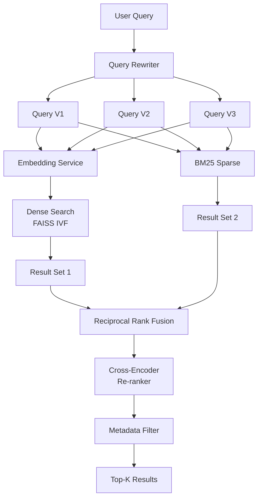

### Stages
1. **Query Rewriting:** Small LLM generates 3 search variants
2. **Dense Retrieval:** FAISS IVF search on all 3 query variants
3. **Sparse Retrieval:** BM25 search on all 3 query variants
4. **Fusion:** RRF (k=60) merges dense + sparse results
5. **Re-ranking:** Cross-encoder scores top-50 candidates
6. **Filtering:** Apply metadata filters (source_type, date_range, tags)
7. **Output:** Top-K results with scores and parent context

### Acceptance Criteria
- Hybrid search outperforms either dense or sparse alone (Recall@10 +10%)
- Query "python async" also searches "asyncio", "async/await"
- `search("attention", filter={"source_type": "pdf"})` returns only PDF results
- `pam search "attention mechanism"` CLI command returns top-5 with source/score/snippet
- Cross-encoder re-ranking improves NDCG@10 by >= 0.05

## 2.10 Subsystem: Knowledge Graph

### Purpose
Build and maintain an entity-relationship graph from document analysis, enabling cross-document discovery and graph-augmented retrieval.

### Current Implementation
`KnowledgeGraph` is an in-memory adjacency list (dict + list) with JSON persistence. `KnowledgeGraphBuilder` constructs graphs from `DocumentAnalysis` objects. `neighbors()` is O(E) linear scan. `subgraph()` uses O(n) `list.pop(0)`.

### Target Architecture

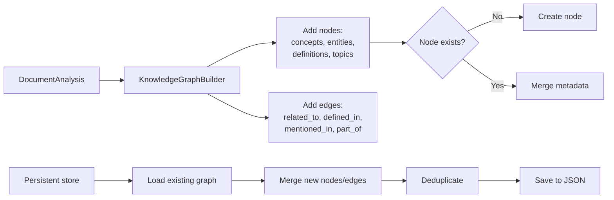

### Key Improvements Required
1. **`neighbors()` O(E) → O(1):** Add adjacency dict `{node_id: list[Edge]}` alongside edge list
2. **`subgraph()` `pop(0)` → `popleft()`:** Use `collections.deque`
3. **`add_edge` validate endpoints:** Raise error (or return False) if endpoint nodes don't exist
4. **Entity resolution:** Merge duplicate entities by label similarity
5. **Graph query API:** Method-chaining query interface (not full Cypher)

### Acceptance Criteria
- Neighbors query for node with 1000 edges completes in <1ms (not 1s)
- Subgraph extraction with `pop(0)` replaced by `deque.popleft()`
- Adding edge to non-existent node raises `ValueError`
- "Supply-side" and "supply side" resolved to same node (fuzzy match)
- `graph.query(start_node="X", edge_type="mentioned_in")` returns connected nodes

## 2.11 Subsystem: LLM Client

### Purpose
Communicate with local LLM (Ollama) for text generation, structured JSON extraction, vision processing, and embedding generation.

### Current Implementation
`OllamaClient` with retry logic (exponential backoff, 3 attempts), separate `generate_text()` and `generate_json()` methods, Pydantic model validation for structured outputs. Exception hierarchy: `OllamaClientError` → `OllamaConnectionError`, `OllamaTimeoutError`, `OllamaResponseError`.

### Architecture

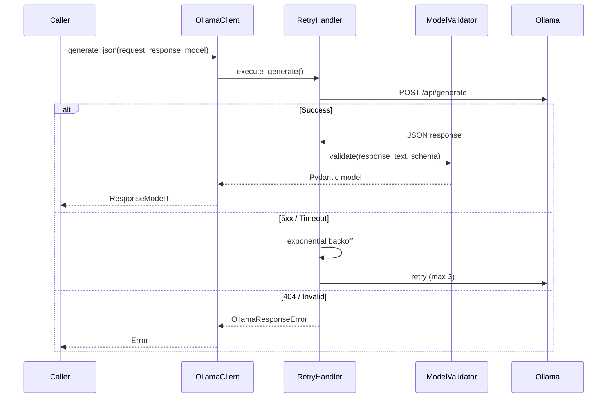

### Problems
- No streaming support for long generations
- `generate_json` with `response_model` returns a union type (confusing API)
- `model_exists` is fragile (parses `ollama.Client().list()` output)
- No latency tracking or token usage aggregation
- Single Ollama provider — no abstraction for cloud LLMs

### Key Design Decisions
- **Keep Protocol-based DI:** `JsonGeneratingClient` protocol enables test swapping
- **Add streaming callback:** `generate_text_stream(request, on_token)`
- **No cloud provider abstraction yet:** Add in Phase 9 (low priority)
- **Token usage tracking:** Return cumulative usage stats per session

### Acceptance Criteria
- All existing client tests pass
- Retry fires on 5xx, timeout, connection errors (verified by `FakeTransport`)
- Non-retriable errors (404, 400) propagate immediately
- `model_exists` correctly identifies available models
- Streaming callback invoked per token for generate_text

## 2.12 Subsystem: Note Generation

### Purpose
Transform `DocumentAnalysis` into structured Obsidian markdown notes with YAML frontmatter, wiki-links, TOC, and all 21 intelligence sections.

### Current Implementation
`ObsidianMarkdownGenerator` assembles notes section by section. Each section is a standalone pure function. Output includes frontmatter, summary, concepts, definitions, entities, Q&A, flashcards, MCQs, revision notes, tags, metadata, and references.

### Key Design Decisions
- **Keep:** Modular section builders (one function per section)
- **Keep:** `_safe_filename()`, `_clean_title()`, `_clean_tags()` utilities
- **Keep:** Wiki-link formatting with output escaping
- **Improve:** Maximum note size guard (warn if >100KB)
- **Improve:** Add `generated_at` timestamp from workflow (currently defaults internally)

### Acceptance Criteria
- All 21 intelligence fields render correctly when present
- All 21 sections are absent when their source data is empty
- `pam ingest` produces correct Obsidian notes with frontmatter
- User content outside `<!-- PAM:BEGIN/END MANAGED -->` survives regeneration

## 2.13 Subsystem: Prompt Builder

### Purpose
Construct effective LLM prompts that produce parseable, structured JSON output.

### Current Implementation
A single 165-line system prompt in `app/prompts/document_analysis.py` with embedded JSON schema and extraction rules. `build_document_analysis_user_prompt()` appends source document text.

### Problems
- Extremely long single prompt (~140 lines) exceeds instruction-following capacity of small models
- No few-shot examples, only schema description
- Prompt drifts independently from `DocumentAnalysis` model — no compile-time validation

### Key Design Decisions
- **Add versioning:** Include prompt version in output for traceability
- **Add few-shot examples:** 2-3 examples for complex fields (flashcards, MCQs)
- **Validation at test time:** Test that prompt schema matches Pydantic model schema
- **Optional prompt compression:** For models with small context windows

## 2.14 Subsystem: State Management

### Purpose
Track processed files via SHA-256 content hashing to prevent reprocessing and enable crash recovery.

### Current Implementation
`ManifestManager` with atomic JSON persistence. `ManifestEntry` per file with SHA-256, path, extension, timestamp. `QueueStateStore` with atomic save. `ManifestEntry.from_dict` has a bug: missing `generated_note` produces string `"None"` instead of Python `None`.

### Key Problems
- `ManifestEntry.from_dict` bug: `str(data.get("generated_note"))` → `str(None)` = `"None"`
- O(n) scan for `contains_hash()` and `contains_path()`
- No version migration strategy (version field exists but is unused)
- No concurrent access protection

### Recommended Fixes
- Fix `from_dict` `generated_note` bug (highest priority)
- Add index: `dict[str, ManifestEntry]` by SHA-256 for O(1) hash lookup
- Add manifest version migration function
- Add `threading.Lock` for concurrent access (mirrors QueueManager pattern)

## 2.15 Subsystem: Watcher + Queue

### Purpose
Monitor a directory for new files, enqueue them for processing, and process them sequentially with crash recovery.

### Current Implementation
`WatchService` uses `watchdog.Observer` for filesystem events. `QueueManager` is an in-memory deque with thread-safe operations. `QueueWorker` runs in a background thread, polling the queue. `QueueStateStore` persists state to disk atomically.

### Key Problems
- **No startup scan:** Files in inbox before watcher starts are not processed
- **Extension mismatch:** Watcher accepts extensions the worker cannot process
- **No file stability check:** Watcher enqueues immediately on `on_created`, potentially processing partially-written files
- **Single worker thread:** `QueueSettings.workers` has `le=1` — hardcoded max of 1

### Architecture

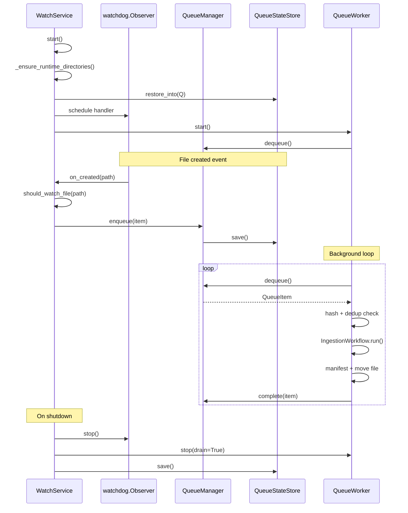

### Recommended Fixes
- Add startup directory scan: iterate inbox on `start()`, enqueue existing files
- Unify extension lists: single source of truth for supported extensions
- Add file stability check: verify file size unchanged over 2 checks, 500ms apart
- Remove `le=1` constraint on queue workers (or justify with comment)
- Add `on_modified` event handling for files that are modified after initial processing

## 2.16 Subsystem: Vault Writer

### Purpose
Write generated Obsidian notes to the vault directory, maintaining index, overview, and log files while preserving user edits.

### Current Implementation
`WikiManager` writes notes with `<!-- PAM:BEGIN/END MANAGED -->` markers to protect user content. Frontmatter-based identity tracking (by `source` field). Auto-index, auto-overview, append-only log. Safe filename generation with collision avoidance.

### Architecture

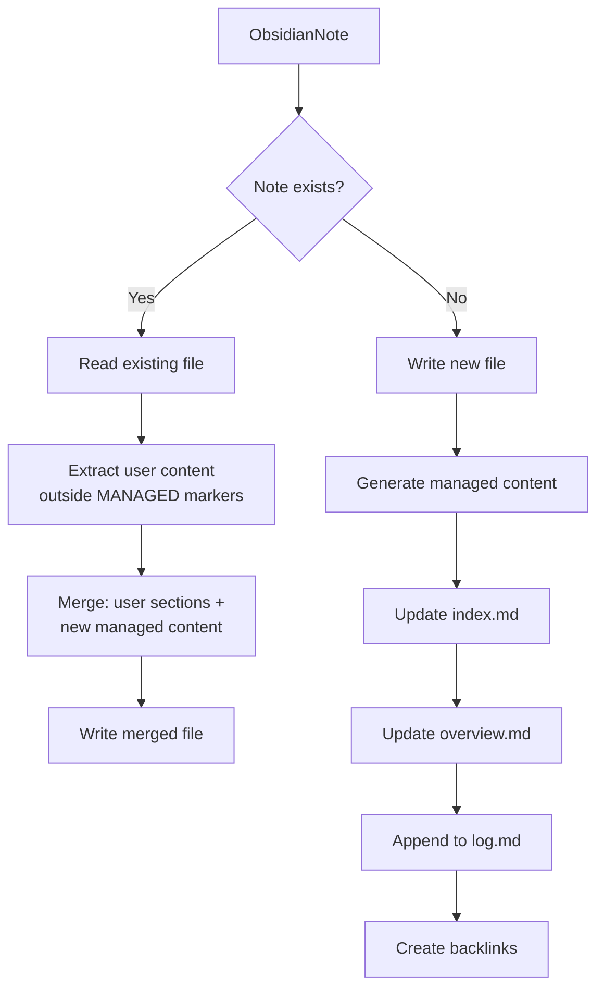

### Key Design Decisions
- **Keep:** Managed content markers for user edit preservation — critical UX
- **Keep:** Frontmatter `source` field for identity tracking (supports filename changes)
- **Keep:** Conflict resolution via `_available_note_path()` (appends " 2", " 3")
- **Keep:** Auto-generated index, overview, log
- **Improve:** Add backlink update (currently never updates stale backlinks)
- **Improve:** Extract frontmatter via YAML parser instead of regex

### Acceptance Criteria
- New note is created with correct frontmatter and managed sections
- Re-ingestion of updated source preserves user edits outside markers
- Filename collision creates `filename 2.md`
- Index.md lists all notes with correct links
- Backlinks section is created on first write AND updated on subsequent writes
- Overview.md is kept under 1000 lines (paginate if needed)

## 2.17 Subsystem: Version Manager

### Purpose
Maintain per-note version history by saving snapshots of note content at each write.

### Current Implementation
`VersionManager` saves versioned copies of notes to subdirectories. Each version has a sequential number, timestamp, and content file. History tracked as JSON metadata.

### Key Design Decisions
- **Fix:** Populate the `sha256` field in `NoteVersion` (currently always empty string)
- **Keep:** UTC timestamps, directory-per-note organization
- **Add:** Version pruning — keep last N versions (configurable, default 50)
- **Add:** Locking for concurrent access

## 2.18 Subsystem: CLI

### Purpose
Provide command-line access to all PAM functionality: ingest, watch, status, doctor, config.

### Current Implementation
Typer-based CLI with subcommands. Rich formatting for tables, panels, and progress bars. 476 lines.

### Key Design Decisions
- **Keep:** Typer framework, Rich formatting, `_print_ingest_success()` result tables
- **Keep:** `doctor` command with comprehensive health checks
- **Add:** `pam search` command (see Search subsystem)
- **Add:** `pam eval` command for running evaluations
- **Fix:** `status` command shows real `RuntimeStats` (currently shows hardcoded zeros)
- **Fix:** Eliminate duplicate `_build_workflow` / `from_runtime` construction logic

---

# 3. Gap Analysis

## 3.1 Overview

This section compares the **current architecture** (v0.2.0) against the **desired architecture** (v1.0 target as defined in Section 2). Each gap identifies what exists, what's needed, and the recommended path.

## 3.2 Gap Matrix

| # | Area | Current State | Desired State | Impact | Priority | Complexity |
|---|------|--------------|---------------|--------|----------|------------|
| G01 | Vector Search | O(n) linear scan | FAISS IVF O(log n) | Search unusable at scale | Critical | Low |
| G02 | Token Counting | No token counting | Truncate before LLM call | Silent context overflow | Critical | Low |
| G03 | KG Persistence | `save()`/`load()` exist but never called | Called in pipeline | Graph data lost each run | Critical | Trivial |
| G04 | Chunk Overlap | `overlap_chars` declared, never used | Adjacent chunks overlap | Context discontinuity | Critical | Low |
| G05 | Atomic Writes | Direct `write_text()` | temp file + `os.replace()` | Data corruption on crash | Critical | Trivial |
| G06 | PyMuPDF Dependency | Optional, silent fallback | Required, clear error | Silent data loss on scan PDFs | Critical | Trivial |
| G07 | Search CLI | Library classes only, no CLI | `pam search` command | Core feature invisible to users | High | Low |
| G08 | BM25 Sparse Retrieval | Naive keyword containment | Proper BM25 | Poor keyword matching | High | Low |
| G09 | Query Rewriting | Raw query only | 3 variants via small LLM | Misses synonym matches | High | Low |
| G10 | Metadata Filtering | No filter support | `search(q, filter={...})` | Cannot scope searches | High | Medium |
| G11 | Parent-Child Retrieval | Flat chunks only | Return parent section context | Missing context for answers | High | Low |
| G12 | NLP Sentence Splitting | English-centric regex | spaCy/nltk tokenization | Broken on abbreviations, Unicode | High | Low |
| G13 | Token-Aware Chunking | Character-based (2000 chars) | Token-based (512-1024 tokens) | Inconsistent across languages | High | Low |
| G14 | Hierarchical Chunks | Flat chunk list | Parent section tracking | No context for matched chunk | High | Medium | ✅ implemented M3.2 (heading path/parent/level metadata; native in-chunker seam P3-201 O-1) |
| G15 | MIME Type Detection | Extension only | Content-based MIME detection | Misclassified extensionless files | High | Low |
| G16 | Language Detection | `language` field never populated | Detect + use in prompts | English-only prompts for non-English | High | Low |
| G17 | Retrieval Evaluation | No evaluation | Labeled dataset + metrics | Cannot measure search quality | High | Medium |
| G18 | LLM Quality Evaluation | Informal only | Labeled dataset + metrics | Cannot measure analysis quality | High | Medium |
| G19 | Startup Inbox Scan | No scan | Enqueue existing files on start | Files before watcher ignored | High | Low |
| G20 | Extension Mismatch | Watcher accepts more than worker | Unified extension list | Silent failures on enqueue | High | Trivial |
| G21 | Docker Packaging | Manual uv run | `docker compose up` | High onboarding friction | High | Low |
| G22 | Cross-Encoder Re-ranking | Single-stage only | Cross-encoder on top-50 | Missing +10-20% relevance | Medium | Medium |
| G23 | Graph Query API | `neighbors()` + `subgraph()` only | Declarative query interface | Limited graph exploration | Medium | Medium |
| G24 | Entity Resolution | No duplicate detection | Fuzzy label matching | Duplicate graph nodes | Medium | High |
| G25 | RRF Fusion | Weighted sum | RRF (rank-based, k=60) | Score normalization issues | High | Low |
| G26 | File Stability Check | No stability check | Verify size over time window | Partially-written files processed | Medium | Low |
| G27 | Web UI | Terminal only | HTML/JS search + upload | Non-technical users excluded | Medium | Medium |
| G28 | REST API | No HTTP interface | FastAPI endpoints | No remote access | Medium | Medium |
| G29 | Auth + Rate Limiting | No auth | JWT + rate limiting | No multi-user isolation | Medium | Medium |
| G30 | Monitoring | Basic logging | OpenTelemetry + metrics | No performance visibility | Low | Medium |
| G31 | Cloud LLM Providers | Ollama only | OpenAI/Anthropic/Gemini adapters | Vendor lock-in | Low | Medium |
| G32 | Hallucination Detection | None | Claim verification against source | Untrusted LLM output | Medium | High |
| G33 | Image Preprocessing | Raw image bytes | Deskew, denoise, CLAHE | Poor OCR on real-world photos | Medium | Medium | **Implemented (M2.1)** — `imaging/preprocess.py`; default off |
| G34 | Tesseract OCR | Vision-model only | Tesseract for printed text | Slow OCR, GPU-dependent | Medium | Medium | **Implemented (M2.1)** — `TesseractOcrEngine`, `engine="auto"` fallback |
| G35 | Table Detection | Flat text extraction | Camelot/Tabula integration | Unreadable tables in notes | High | Medium | **Implemented (M2.4)** — `tables/extractor.py` (CSV/spreadsheet/PDF); pdfplumber default, camelot optional (ADR-002) |
| G36 | Table-to-Markdown | Tables are flat text | Markdown table formatting | Unreadable tables | High | Low | **Implemented (M2.4)** — `tables/render.py` `MarkdownTableRenderer` |
| G37 | Diagram Conversion | Raw XML in notes | Mermaid.js representation | Unreadable diagrams | Low | High | **Implemented (M2.5)** — `images/diagram.py` `drawio_to_mermaid` + `DiagramParser` (`.drawio` → Mermaid skeleton, `.mmd` passthrough, raw fallback) |
| G38 | Chunking Quality Metric | No metrics | Coherence/distinction scores | No objective chunking quality | Medium | Low |
| G39 | CI/CD Pipeline | No automation | GitHub Actions on push/PR | Tests don't run automatically | High | Low |
| G40 | Conftest Migration | Some tests use local fixtures | All tests use conftest | Fixture duplication | Low | Low |

## 3.3 Priority Distribution

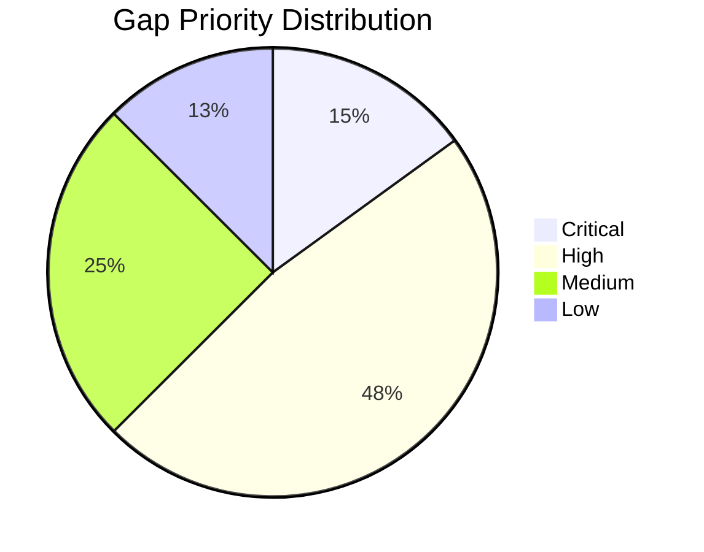

## 3.4 Most Impactful Gaps

### Top 5 by Impact

| Rank | Gap | Impact | Effort | Impact/Effort Ratio |
|------|-----|--------|--------|-------------------|
| 1 | G03: KG Persistence | Graph data lost every run | 1 day | ∞ (zero cost, huge impact) |
| 2 | G04: Chunk Overlap | Context discontinuity | 1 day | Very high |
| 3 | G07: Search CLI | Core feature invisible | 3 days | Very high |
| 4 | G01: FAISS Index | Search unusable at scale | 2 weeks | High |
| 5 | G25: RRF Fusion | Better keyword search | 2 days | High |

---

# 4. Technical Debt Report

## 4.1 Critical Items

### TD-01: ManifestEntry.from_dict generates_note Bug
- **Problem:** `str(data.get("generated_note"))` converts `None` to `"None"`
- **Cause:** Incorrect use of `str()` on a potentially-None value at `state/models.py:51`
- **Impact:** Missing `generated_note` field becomes string "None" instead of Python `None`
- **Risk:** Downstream code that checks `if entry.generated_note` will incorrectly treat "None" as truthy
- **Fix:** Change to `data.get("generated_note")` without wrapping in `str()`
- **Difficulty:** Trivial (1 line)

### TD-02: overlap_chars Dead Code
- **Problem:** `SemanticChunker.overlap_chars` defined at `semantic_chunking.py:23` but never read
- **Cause:** Feature was planned but implementation was never completed
- **Impact:** Chunks have no overlap — sentence split across two chunks loses context in both
- **Risk:** Retrieval quality degradation for documents with content at chunk boundaries
- **Fix:** Implement overlap logic in `_split_by_sentences` and `_split_long_section`
- **Difficulty:** Low (1-2 days)

### TD-03: NoteVersion.sha256 Never Populated
- **Problem:** `NoteVersion.sha256` field exists at `versioning.py:14` but `record_version()` at `versioning.py:51` never computes it
- **Cause:** Feature partially implemented — field added but usage code was not completed
- **Impact:** Version integrity cannot be verified. Cannot detect if archived version was tampered with
- **Risk:** Low for current usage, but security-relevant metadata silently missing
- **Fix:** Compute `hashlib.sha256(content.encode()).hexdigest()` in `record_version()`
- **Difficulty:** Trivial (1 line)

### TD-04: KnowledgeGraph Not Saved in Pipeline
- **Problem:** `KnowledgeGraph.save()` and `load()` exist but are never called in `IngestionWorkflow`
- **Cause:** Pipeline implementation omitted the persistence step at `ingest_workflow.py:199-204`
- **Impact:** Knowledge graph is built and discarded every run. Cross-document graph never accumulates
- **Risk:** Core feature (cross-document knowledge graph) is completely non-functional in automation
- **Fix:** Add `if kg: kg.save(kg_path)` after `_run_knowledge_engine()`
- **Difficulty:** Trivial (2 lines)

### TD-05: Stats Latency Bug
- **Problem:** `RuntimeStats.average_queue_latency_seconds` includes `skipped_duplicates` and `failed` in denominator but numerator only accumulates for processed items at `stats.py:31`
- **Cause:** Formula error in `average_queue_latency_seconds` property
- **Impact:** Average latency is artificially deflated. High-latency failures are hidden
- **Risk:** Operations team cannot trust the latency metric for capacity planning
- **Fix:** Exclude duplicates and failures from denominator, or record latency for all completions
- **Difficulty:** Trivial (1 line)

### TD-06: KnowledgeGraph add_edge Silent Drop
- **Problem:** `KnowledgeGraph.add_edge()` at `knowledge_graph.py:56` silently drops edges whose endpoints don't exist
- **Cause:** No validation — just iterates edges and skips if condition fails
- **Impact:** Callers have no way to know their edge was discarded. Graph may be silently incomplete
- **Risk:** Silent data loss in the knowledge graph
- **Fix:** Validate endpoint existence and raise `ValueError` or return `False`
- **Difficulty:** Trivial

## 4.2 High Items

### TD-07: Five Duplicate _resolve_*_paths Functions
- **File:** `config.py:227-310`
- **Problem:** `_resolve_paths`, `_resolve_watcher_paths`, `_resolve_processing_paths`, `_resolve_queue_paths`, `_resolve_manifest_paths` are nearly identical
- **Impact:** ~80 lines of duplicated code. Adding a new path-aware config section requires copying the pattern
- **Fix:** One generic `_resolve_relative_paths(config: dict, keys: set[str], root: Path)` function
- **Difficulty:** Low

### TD-08: Pydantic/Dataclass Model Inconsistency
- **Files:** analysis.py, documents.py, notes.py (Pydantic) vs knowledge_graph.py, vector_store.py, semantic_chunking.py, routing.py (dataclass)
- **Problem:** Data classes have zero validation. Invalid states are representable
- **Impact:** A `DocumentChunk` with `start_char=100, end_char=50` passes silently. A `VectorEntry` with 10-dim and 1000-dim embeddings coexists
- **Fix:** Migrate all dataclass models to Pydantic (or add manual validation)
- **Difficulty:** Medium (affects 4 files, ~150 lines each)

### TD-09: DocumentAnalysis God Object
- **File:** `analysis.py`
- **Problem:** 22-field aggregate model bundles summaries, concepts, entities, questions, flashcards, MCQs, revision notes, and metadata
- **Impact:** Any change to any field potentially affects prompts, templates, KG builder, retry logic. Testing one field requires constructing the full object
- **Fix:** Split into focused models: `AnalysisSummary`, `AnalysisEducational` (Q&A, flashcards, MCQs), `AnalysisMetadata`, `AnalysisConcepts`
- **Difficulty:** Medium

### TD-10: Extension W/Worker Mismatch
- **Files:** `watcher/filters.py` vs `queue/worker.py`
- **Problem:** Watcher accepts DOCX, PPTX, IPYNB, TEX, EPUB, DIAGRAM, ARCHIVE, EMAIL, DATABASE, RESEARCH, WEB extensions; worker only processes CODE, IMAGE, AUDIO, VIDEO + md/txt/pdf/csv/xlsx
- **Impact:** Users place supported-looking files → silently fail → frustration
- **Fix:** Single shared `SUPPORTED_EXTENSIONS` set consumed by both watcher and worker
- **Difficulty:** Low

### TD-11: CLI _run_ingest Duplicates Worker _build_workflow
- **Files:** `cli/entry.py:331-357` and `queue/worker.py:211-233`
- **Problem:** Same `IngestionWorkflow.from_runtime()` construction with same optional client setup duplicated
- **Impact:** Adding a new optional dependency requires updating both locations
- **Fix:** Extract to `WorkflowFactory` or share a function
- **Difficulty:** Low

### TD-12: Classifier if/elif Chain
- **File:** `classifier.py:38-107`
- **Problem:** 70-line if/elif chain mapping extensions to kinds. Brittle, order-dependent, easy to introduce gaps
- **Impact:** Adding a new extension category requires extending an if/elif chain
- **Fix:** Replace with data-driven dict: `EXTENSION_KIND_MAP: dict[str, str]`
- **Difficulty:** Low

### TD-13: No Startup Inbox Scan
- **File:** `watcher/service.py`
- **Problem:** Watcher only responds to filesystem events. Files in inbox before watcher starts are never processed
- **Impact:** Reliability gap — files must be placed after watcher starts
- **Fix:** Add `_scan_inbox()` called at end of `start()` before returning
- **Difficulty:** Low

### TD-14: Metadata dict[str, str] Overuse
- **Files:** VectorEntry, DocumentChunk, KnowledgeNode, KnowledgeEdge
- **Problem:** All metadata fields typed as `dict[str, str]` — cannot store numeric or boolean values
- **Impact:** Cannot store `confidence: 0.95`, `page_count: 42`, `is_handwritten: true` in metadata
- **Fix:** Change to `dict[str, Any]` or use Pydantic models
- **Difficulty:** Low

### TD-15: Missing Cross-Model References
- **Problem:** All cross-model references are by string (ObsidianNote.source, DocumentChunk.source, VectorEntry.source, KnowledgeNode.source)
- **Impact:** Tracing provenance requires string matching — brittle and opaque. No referential integrity
- **Fix:** Add typed foreign key fields (e.g., `source_document_id: UUID`) across all models
- **Difficulty:** Medium (schema change across 5+ models)

### TD-16: No Rollback in Multi-Step Pipeline
- **File:** `ingest_workflow.py`
- **Problem:** Pipeline operations (ingest → classify → process → embed → store → write) have no rollback. If step 5 fails, steps 1-4 have already modified state
- **Impact:** Partial state corruption. Vector store may have entries for documents that never completed processing
- **Fix:** Wrap pipeline in a transaction-like context manager with compensation actions
- **Difficulty:** High

### TD-17: Single Queue Worker Hard Limit
- **File:** `config.py:160`, `QueueSettings.workers: int` has `le=1`
- **Problem:** Configurable-but-capped-at-1. If intentional, should not be configurable
- **Impact:** Misleading configuration surface. Cannot parallelize processing
- **Fix:** Either remove config knob (hardcode 1) or remove `le=1` constraint
- **Difficulty:** Trivial

### TD-18: No Debounce on Watcher
- **File:** `watcher/service.py`
- **Problem:** Immediate `on_created` response processes potentially partially-written files
- **Impact:** Corrupted documents, failed processing, duplicate work on rewrite
- **Fix:** Add configurable stability delay (check file size unchanged over 2 polls, 500ms apart)
- **Difficulty:** Medium

## 4.3 Medium Items

### TD-19: EmbeddingService No Retry
- **File:** `embeddings.py`
- **Problem:** `OllamaClient` has retry with backoff; `EmbeddingService` does not
- **Fix:** Add retry wrapper to `embed()` and `embed_batch()`
- **Difficulty:** Low

### TD-20: VisionClient No Retry
- **File:** `vision_client.py`
- **Problem:** No retry logic, broad `except Exception` suppression in `_ensure_vision_model`
- **Fix:** Add retry, narrow exception handling
- **Difficulty:** Low

### TD-21: DocumentAnalysis Fields Shadow Builtins
- **File:** `analysis.py:105`
- **Problem:** `license: str = ""` shadows the builtin `license()` function
- **Fix:** Rename to `document_license` or `license_info`
- **Difficulty:** Trivial

### TD-22: Dict[str, str] Validator Duplication
- **File:** `analysis.py`
- **Problem:** `_validate_tags`, `_validate_keywords`, `_validate_categories` are nearly identical (differ only in normalization rule)
- **Fix:** Extract shared `_deduplicate_and_normalize(items, transform)` helper
- **Difficulty:** Low

### TD-23: KnowledgeGraph subgraph O(n²)
- **File:** `knowledge_graph.py:80`
- **Problem:** `list.pop(0)` is O(n) per call, and BFS calls it O(V) times → O(V²) for dense subgraphs
- **Fix:** Replace with `collections.deque.popleft()` (O(1))
- **Difficulty:** Trivial

### TD-24: WikiManager Backlinks Never Updated
- **File:** `wiki_manager.py:178`
- **Problem:** `write_backlinks` only creates `## Backlinks` once — never updates stale backlinks
- **Impact:** Stale backlinks persist after notes are renamed or deleted
- **Fix:** Rewrite backlinks section on each call instead of skipping existing
- **Difficulty:** Low

### TD-25: Frontmatter Regex Fragile
- **File:** `wiki_manager.py`
- **Problem:** `_extract_frontmatter_value` uses regex on line-by-line basis. Breaks on multi-line YAML values and nested structures
- **Fix:** Use YAML parser (`yaml.safe_load`) for frontmatter extraction
- **Difficulty:** Low

### TD-26: No Lock on Log Append
- **File:** `wiki_manager.py:_append_log_entry`
- **Problem:** Uses `with open(log_path, "a")` without locking. Concurrent writes could interleave
- **Fix:** Add `threading.Lock` or use atomic append
- **Difficulty:** Low

### TD-27: IngestResult Allows Impossible States
- **File:** `documents.py`
- **Problem:** `DocumentIngestionResult` allows both `document=None` and `error=None` simultaneously, or both set
- **Fix:** Use discriminated union or make `error` required when `document` is None
- **Difficulty:** Low

## 4.4 Low Items

### TD-28: No code comments or docstrings (by requirement)
- Self-imposed convention for LLM-generated code. Acceptable but reduces maintainability for human readers.

### TD-29: GraphBuildResult Not Used Upstream
- **File:** `knowledge_graph.py`
- `GraphBuildResult` (`nodes_added`, `edges_added`) is returned but never consumed by the pipeline. Metrics are silently discarded.

### TD-30: model_for() Silent Fallback
- **File:** `config.py`
- `ModelRoutingSettings.model_for()` silently returns `general_text` for unknown keys. Should log warning.

### TD-31: Processor Instance Created Per Call
- **File:** `processor_impls.py`
- `get_processor_by_name()` creates a new instance each time. No caching.

### TD-32: VideoProcessor Does Nothing
- **File:** `processor_impls.py`
- VideoProcessor.process() is a pure `_passthrough()` — no actual video processing. Documented but not implemented.

### TD-33: Cosine Similarity Mismatch Truncation
- **File:** `vector_store.py`
- `_cosine_similarity` uses `strict=False` in `zip`, silently truncating the longer vector. Should raise or log.

### TD-34: SHA-256 Unsupported Extensions Raise ValueError
- **File:** `hashing.py`
- `compute_file_hash` raises `ValueError` for unsupported extensions. Caller (`manifest.py`) has no try/except. Unsupported file crashes the worker.

### TD-35: No Document Size Limits
- No protection against processing multi-GB files. Memory exhaustion risk.

---

# 5. Master Engineering Roadmap

## Phase 1: Foundation Fixes

**Objective:** Eliminate critical correctness and data-loss bugs that undermine all other features.

**Scope:** 6 critical bugs, 6 high-priority gaps.

| Deliverable | Gaps Addressed | Est. Effort |
|------------|----------------|-------------|
| Fix ManifestEntry `generated_note` bug | TD-01 | 1 hr |
| Fix `overlap_chars` dead code → implement chunk overlap | TD-02, G04 | 2 days |
| Populate `NoteVersion.sha256` | TD-03 | 1 hr |
| Wire KG save/load into pipeline | G03, TD-04 | 1 day |
| Fix stats latency bug | TD-05 | 1 hr |
| Fix KnowledgeGraph add_edge silent drop | TD-06 | 1 day |
| Add atomic vector store writes | G05 | 1 day |
| Make PyMuPDF required with clear error | G06 | 1 hr |
| Add token counting + LLM truncation | G02 | 1 week |
| Replace if/elif classifier with data-driven table | TD-12 | 2 days |
| Fix extension mismatch between watcher and worker | TD-10 | 2 days |
| Add startup inbox scan to watcher | TD-13 | 1 day |
| Add FAISS IVF vector index | G01 | 2 weeks |

**Dependencies:** None (standalone fixes).

**Complexity:** Low overall, moderate for FAISS.

**Success Criteria:**
- All critical debt items (TD-01 through TD-06) resolved
- Pipeline persists knowledge graph across documents
- Chunks have configurable overlap
- No silent data loss paths remain
- FAISS index with O(log n) search replaces O(n) scan

**Risks:**
- FAISS installation on Windows may need pre-built wheels (`faiss-cpu` has Windows support)
- Token counting accuracy depends on tokenizer choice

## Phase 2: Document Intelligence Improvements

**Objective:** Expand document detection, language support, ingestion hooks, and table intelligence.

**Scope:** MIME detection, language detection, table extraction, hook system.

| Deliverable | Gaps Addressed | Est. Effort |
|------------|----------------|-------------|
| MIME-type based content detection | G15 | 3 days — ✅ delivered (M2.2, `detect_mime`) |
| Language detection for source documents | G16 | 2 days — ✅ delivered (M2.2, `detect_language`) |
| Intelligent ingestion pre/post hooks | — | 1 week — ✅ delivered (M2.2, `IngestionHook`) |
| Email attachment parsing | — | 1 week — ✅ delivered (M2.2, `EmailIngestor` + `_ingest_children`) |
| Document structure analysis | — | 4 dev-days — ✅ delivered (M2.3, `StructureAnalyzer` → `metadata.extra["structure"]`) |
| Code & notebook structure intelligence | — | 3-4 dev-days — ✅ delivered (M2.6, `code/` module → `metadata.extra["code_structure"]` / `["notebook_structure"]`) |
| Table detection in PDFs (Camelot/Tabula) | G35 | 2 weeks |
| Table-to-Markdown formatting | G36 | 2 days |

**Dependencies:** Phase 1 complete.

**Complexity:** Low-Medium.

**Success Criteria:**
- Extensionless files classified correctly by content
- French/German/Japanese documents detected and analyzed with appropriate language
- Pre-hook can reject files before ingestion
- Tables in PDFs appear as structured Markdown tables in notes

## Phase 3: Semantic Chunking

**Objective:** Replace regex-based chunking with NLP-driven, token-aware, hierarchical chunking.

| Deliverable | Gaps Addressed | Est. Effort |
|------------|----------------|-------------|
| NLP sentence segmentation (nltk `punkt_tab`, D1 — deviation from spaCy) | G12 | 3 days — ✅ delivered (M3.1, `sentence_tokenizer.py` engines + `SemanticChunker.sentence_tokenizer`) |
| Token-aware chunk sizing | G13 | 3 days |
| Hierarchical chunk structure with parent tracking | G14 | ✅ delivered (M3.2, `semantic_chunking.py` heading path/parent/level metadata) |
| Semantic topic segmentation | — | 2 weeks |

**Dependencies:** Phase 2.

**Complexity:** Medium.

**Success Criteria:**
- Sentence boundaries respect abbreviations (Dr., Mr., U.S.A.)
- CJK documents produce similar token counts as English
- Each chunk has `parent_section_id` pointing to its section
- Topic shifts detected in heading-less documents

## Phase 4: Retrieval

**Objective:** Build production-quality hybrid search with CLI access.

| Deliverable | Gaps Addressed | Est. Effort |
|------------|----------------|-------------|
| BM25 sparse retrieval | G08 | 1 week |
| Reciprocal Rank Fusion | G25 | 2 days |
| Query rewriting | G09 | 1 week |
| Metadata filtering | G10 | 1 week |
| Parent-child retrieval | G11 | 3 days |
| Cross-encoder re-ranking | G22 | 2 weeks |
| Wire search into CLI (`pam search`) | G07 | 3 days |

**Dependencies:** Phase 1.1 (FAISS), Phase 3 (hierarchical chunks).

**Complexity:** Medium-High.

**Success Criteria:**
- `pam search "python async"` returns relevant results
- BM25 + Dense fusion outperforms either alone
- `--source-type pdf` filter works
- Cross-encoder improves NDCG@10 by >= 0.05
- Query rewriting expands single query to 3 variants

## Phase 5: Knowledge Graph

**Objective:** Make the knowledge graph persistent, queryable, and resistant to duplicate entities.

| Deliverable | Gaps Addressed | Est. Effort |
|------------|----------------|-------------|
| Graph persistence with merge-on-write | — | 1 week |
| Graph query API (method-chaining) | G23 | 2 weeks |
| Entity resolution (fuzzy matching) | G24 | 3 weeks |
| Graph-augmented retrieval | — | 3 weeks |

**Dependencies:** Phase 4 (retrieval), Phase 1.3 (KG persistence).

**Complexity:** High.

**Success Criteria:**
- Node from 2 documents has merged metadata (not overwritten)
- `graph.query(start="X", edge="mentioned_in")` returns connected nodes
- "Supply-side" and "supply side" resolve to same entity
- Graph-augmented retrieval improves answer quality

## Phase 6: Evaluation & Quality

> **Status note (0.12.0):** The executed Phase 6 (P6-101..P6-106) delivered **Production Hardening & Final Validation** — performance benchmark, failure isolation, security/configuration audit, and independent end-to-end validation — per the version history above. The evaluation-tooling deliverables below (chunking/retrieval/LLM quality metrics, hallucination detection) were **not** built and remain in the engineering backlog.

**Objective:** Measure quality objectively. Catch regressions automatically.

| Deliverable | Gaps Addressed | Est. Effort |
|------------|----------------|-------------|
| Chunking quality metric | G38 | 3 days |
| LLM analysis quality evaluation | G18 | 2 weeks |
| Retrieval evaluation framework | G17 | 3 weeks |
| Halucination rate detection | G32 | 4 weeks |

**Dependencies:** Phase 4 (for retrieval eval), Phase 3 (for chunking quality).

**Complexity:** Medium-High.

**Success Criteria:**
- `pam eval retrieval` reports precision@5, recall@10, MRR, NDCG@10
- Hallucination detection flags >80% of injected false claims
- CI blocks PR if any metric drops >5%

## Phase 7: Production Readiness

**Objective:** Dockerize, add REST API, web UI, auth, and monitoring.

| Deliverable | Gaps Addressed | Est. Effort |
|------------|----------------|-------------|
| Docker Compose setup (PAM + Ollama) | G21 | 1 week |
| FastAPI REST API | G28 | 3 weeks |
| Basic web UI (React or plain HTML/JS) | G27 | 4 weeks |
| JWT authentication + rate limiting | G29 | 2 weeks |
| OpenTelemetry + Prometheus metrics | G30 | 2 weeks |
| Cloud LLM provider support (OpenAI, Anthropic) | G31 | 3 weeks |
| CI/CD pipeline (GitHub Actions) | G39 | 2 days |
| Image preprocessing pipeline | G33 | **Done (M2.1)** — `imaging/preprocess.py` |
| Tesseract full-page OCR | G34 | **Done (M2.1)** — `TesseractOcrEngine`, auto fallback |
| Layout preservation for OCR | — | 3 weeks |

**Dependencies:** Phase 1-6.

**Complexity:** High.

**Success Criteria:**
- `docker compose up -d` starts entire system
- `POST /ingest` with file upload returns note URL
- User can search via web UI
- Prometheus metrics at `/metrics`
- GPT-4o or Claude available as analysis provider

---

# 6. Engineering Backlog

## Epic 1: Critical Bug Fixes

**Description:** Eliminate all data-loss and correctness bugs before any feature work.

**Features:**
- Fix ManifestEntry `generated_note` `"None"` bug
- Implement chunk overlap (unused `overlap_chars` field)
- Wire KnowledgeGraph save/load into pipeline
- Add token counting with LLM prompt truncation
- Implement atomic vector store writes
- Require PyMuPDF with clear ImportError
- Add FAISS IVF vector index

**Dependencies:** None.

**Priority:** P0 — Critical.

**Estimated effort:** 4 weeks.

**Acceptance Criteria:**
- Knowledge graph persists across documents
- Chunks have configurable character overlap
- Documents >8K tokens are truncated before LLM call
- Vector store survives crash during save
- Missing PyMuPDF raises clear error, not silent fallback
- FAISS search <50ms for 100K entries

**Definition of Done:** All items code-reviewed, tested, and merged to main.

## Epic 2: Document Intelligence

**Description:** Expand file detection, add language awareness, extract tables from PDFs.

**Features:**
- MIME-type based file detection — ✅ delivered (M2.2)
- Language detection with prompt adaptation — ✅ delivered (M2.2)
- Ingestion pre/post processing hooks — ✅ delivered (M2.2)
- Email attachment parsing — ✅ delivered (M2.2)
- Document structure analysis — ✅ delivered (M2.3)
- PDF table detection (Camelot/Tabula)
- Table-to-Markdown formatting

**Dependencies:** Epic 1.

**Priority:** P1 — High.

**Estimated effort:** 5 weeks.

**Acceptance Criteria:**
- `.data` file containing markdown text classified correctly
- French documents prompt LLM in French
- Pre-hook rejects files >50MB
- PDF with 3 attachments produces 4 notes (1 parent + 3 children)
- PDF table renders as Markdown table

**Definition of Done:** All items pass integration tests, documentation updated.

## Epic 3: Semantic Chunking

**Description:** Modernize chunking with NLP, token awareness, and hierarchy.

**Features:**
- spaCy sentence segmentation
- Token-aware chunk sizing (tiktoken)
- Hierarchical chunk parent tracking
- Semantic topic segmentation

**Dependencies:** Epic 2.

**Priority:** P1 — High.

**Estimated effort:** 5 weeks.

**Acceptance Criteria:**
- "Dr. Smith went to Washington" = 1 sentence
- 95% of chunks within [384, 1152] tokens
- Every chunk has `parent_section_id` when headings exist
- Topic shifts detected without heading markers

**Definition of Done:** All chunking tests pass. Performance benchmark documented.

## Epic 4: Retrieval

**Description:** Build hybrid search with BM25, RRF, re-ranking, query expansion, and CLI.

**Features:**
- BM25 sparse retrieval
- Reciprocal Rank Fusion
- Query rewriting via small LLM
- Metadata filtering
- Parent-child retrieval
- Cross-encoder re-ranking
- `pam search` CLI command

**Dependencies:** Epic 3 (hierarchical chunks for parent-child), Epic 1 (FAISS).

**Priority:** P1 — High.

**Estimated effort:** 8 weeks.

**Acceptance Criteria:**
- `pam search "attention mechanism"` returns top-5 with scores and snippets
- Hybrid recall@10 exceeds either dense or sparse alone
- Cross-encoder improves NDCG@10 by >= 0.05
- `--source-type pdf` filter returns only PDF results

**Definition of Done:** CLI functional. Hybrid search benchmarked. Evaluation dataset created.

## Epic 5: Knowledge Graph

**Description:** Persistent, queryable, deduplicated knowledge graph.

**Features:**
- Graph merge-on-write with conflict resolution
- Method-chaining graph query API
- Entity resolution (fuzzy + embedding-based)
- Graph-augmented retrieval

**Dependencies:** Epic 1 (KG persistence), Epic 4 (retrieval).

**Priority:** P2 — Medium.

**Estimated effort:** 8 weeks.

**Acceptance Criteria:**
- Same concept from N documents has 1 merged node
- `graph.query(start="Attention", edge_type="mentioned_in")` returns notes
- "supply side" and "supply-side" resolve to same node
- Graph-augmented retrieval improves 5-point human rating by >= 1

**Definition of Done:** Graph query API documented. Entity resolution precision >= 0.95.

## Epic 6: Evaluation & Quality

**Description:** Measure and gate quality objectively.

**Features:**
- Chunking quality metrics (coherence, distinction, size distribution)
- LLM analysis quality evaluation dataset
- Retrieval evaluation framework (precision, recall, NDCG)
- Hallucination rate detection

**Dependencies:** Epics 3, 4.

**Priority:** P2 — Medium.

**Estimated effort:** 8 weeks.

**Acceptance Criteria:**
- `pam eval retrieval` reports 4 metrics
- `pam eval analysis` reports field completion and correctness
- Hallucination detection flags >80% of injected false claims
- CI blocks PRs with >5% metric regression

**Definition of Done:** Eval datasets committed to repo. CI pipeline gates active.

## Epic 7: Production Readiness

**Description:** Docker, REST API, web UI, auth, monitoring, cloud LLMs.

**Features:**
- Docker Compose with Ollama service
- FastAPI REST endpoints
- Web UI (search, upload, browse)
- JWT auth + rate limiting
- OpenTelemetry instrumentation
- Cloud LLM providers (OpenAI, Anthropic)

**Dependencies:** Epics 1-6.

**Priority:** P2 — Medium.

**Estimated effort:** 16 weeks.

**Acceptance Criteria:**
- `docker compose up` starts PAM + Ollama
- `POST /ingest` accepts file upload
- Web search returns clickable results
- Unauthenticated requests return 401
- Prometheus `/metrics` endpoint
- `PAM_LLM__PROVIDER=openai` switches provider

**Definition of Done:** e2e integration tests pass against Docker deployment.

## Epic 8: Image & OCR Improvements

**Description:** Robust image preprocessing, Tesseract OCR, layout preservation.

**Status:** Partially implemented (Milestone 2.1 delivered preprocessing + Tesseract; Milestone 2.5 delivered diagram→Mermaid + EXIF image intelligence; layout preservation remains).

**Features:**
- ~~Image preprocessing (deskew, denoise, CLAHE)~~ — **Implemented (M2.1)** in `app/infrastructure/document_intelligence/imaging/preprocess.py`; wired into both OCR engines (M2.5 remediation)
- ~~Tesseract OCR integration~~ — **Implemented (M2.1)** via `TesseractOcrEngine` (CPU-only offline fallback; `engine="auto"` or explicit selection)
- ~~EXIF / image intelligence~~ — **Implemented (M2.5)** via `images/metadata.py` `ImageAnalyzer` (single EXIF owner, R-3) + `images/diagram.py`
- Document layout analysis and preservation — Remaining
- ~~Diagram-to-Mermaid conversion~~ — **Implemented (M2.5)** via `images/diagram.py` `drawio_to_mermaid` / `DiagramParser` (.drawio → Mermaid skeleton; .mmd passthrough)

**Dependencies:** None (standalone).

**Priority:** P3 — Low.

**Estimated effort:** 10 weeks (3 completed in M2.1/M2.5; ~7 weeks remaining).

**Acceptance Criteria:**
- ~~Rotated 5° image deskewed before OCR~~ — **Met (M2.1)** when `preprocess: true`
- ~~Tesseract OCR 50-page PDF in <60s~~ — **Met (M2.1)** via `TesseractOcrEngine` + `page_limit`
- Two-column paper produces correct reading order — Remaining
- ~~.drawio → valid Mermaid flowchart~~ — **Met (M2.5)** via `drawio_to_mermaid` (fixed-fixture comparison)

**Definition of Done:** CER reduced by >= 25% vs. baseline.

---

# 7. Module Specifications

## 7.1 Document Ingestion Module

### Responsibilities
- Accept file paths and URLs
- Route to correct ingestor by extension + MIME type
- Normalize text content
- Extract and populate metadata
- Return result or structured error

### Interfaces
```python
class BaseIngestor(ABC):
    source_type: str
    supported_suffixes: tuple[str, ...]
    def can_ingest(self, source: SourceReference) -> bool
    def ingest(self, source: SourceReference) -> SourceDocument

class DocumentIngestionService:
    def __init__(self, ingestors: list[BaseIngestor] | None = None)
    def ingest(self, source: str | Path) -> DocumentIngestionResult
    def register(self, ingestor: BaseIngestor) -> None
    def supported_extensions(self) -> tuple[str, ...]
```

### Data Flow
```
Source (str | Path)
    → _normalize_source() → SourceReference
    → _select_ingestor() → BaseIngestor
    → ingestor.ingest() → SourceDocument
    → DocumentIngestionResult(document=...)
```

### Sequence Diagram
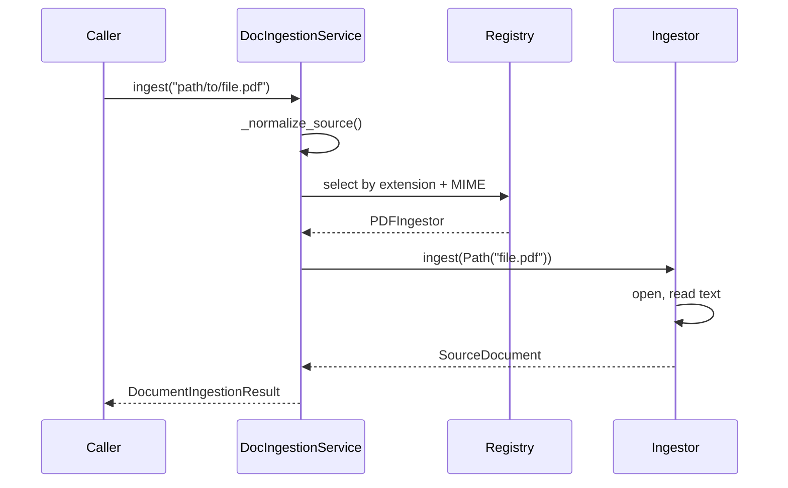

### State Diagram
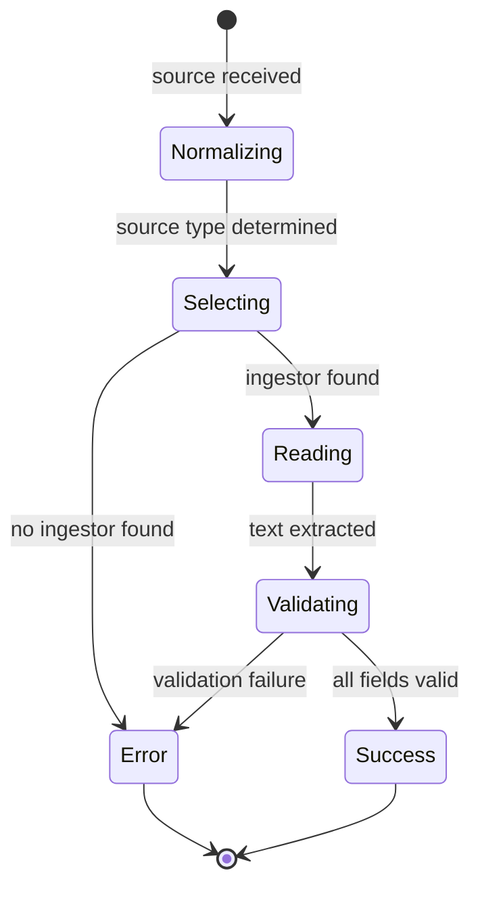

### Dependencies
- `app.domain.documents.*`
- `app.domain.routing.SourceReference` (shared type)
- 20+ ingestor implementations

### Inputs
- `str | Path` — file path or URL

### Outputs
- `DocumentIngestionResult` with `SourceDocument` or `error`

### Extension Points
- `register(ingestor)` — third-party ingestors
- `IngestionHook` protocol for pre/post processing — implemented (M2.2); `register_hook()` / `intelligence.metadata.hooks.{pre,post}`

### Future Work
- Plugin-based ingestor discovery via entry points
- Streaming ingestion for large files
- Encrypted file support (GPG auto-decrypt)

## 7.2 OCR Module

### Responsibilities
- Extract text from scanned PDFs and images
- Coordinate between PyMuPDF (page rendering), vision model (primary text extraction), and optional Tesseract (CPU-only local OCR fallback)
- Report per-page confidence scores and flag empty/low-confidence pages

### Current Implementation (Milestone 2.1)
Decoupled `DocumentOcrService` registry in `app/infrastructure/document_intelligence/ocr/`:

- **`OcrEngine` protocol** — `name: str`, `supported_kinds: set[str]`, `run(source: Path, *, prompt: str, preprocess: bool = False) -> OcrResult`. Engines:
  - **`VisionOcrEngine`** — primary. Renders PDF pages via `render_pdf_pages` (PyMuPDF, configurable zoom/`page_limit`/`max_pages`), sends each rendered page to `OllamaVisionClient` sequentially with a bounded retry and early stop on empty page. Per-page failures degrade, never abort the pass.
  - **`TesseractOcrEngine`** — optional offline fallback. Lazy-imports pytesseract (clear `ImportError` if missing), maps `image_to_data` confidence per page, supports `tesseract_cmd`/`tesseract_lang`.
- **`DocumentOcrService`** — selects the first registered engine matching the document kind (`engine="auto"` → vision primary, Tesseract fallback; explicit `engine=` selects directly), runs it, and returns a single `OcrResult`.
- **`OcrResult` / `PageOcrResult`** — text, per-page confidence, mean confidence, empty/low-confidence page flags.
- **`get_default_ocr_service(settings)`** factory — `enabled: false` → empty registry → processors passthrough (Phase-1 behavior); also the injection point used by `IngestionWorkflow` and the three processors.
- **`imaging/preprocess.py`** — shared deskew → denoise (median) → CLAHE pipeline, disabled by default (`intelligence.ocr.preprocess: false`), optional Pillow/numpy.
- **Prompts** — configurable via `intelligence.prompts.{ocr,handwriting,vision}` with a `{language}` slot; defaults byte-identical to the Phase-1 hardcoded prompts.

### Data Flow
```
Scanned PDF / image
    → DocumentClassifier (scanned_pdf | handwritten | image kind)
    → ProcessorRouter → OCRProcessor | HandwritingProcessor | VisionProcessor
    → DocumentOcrService.extract()
    → VisionOcrEngine: render_pdf_pages (PyMuPDF, zoom) → [preprocess] → OllamaVisionClient.describe_image() per page
    → TesseractOcrEngine (fallback/explicit): pytesseract per page
    → OcrResult (text + per-page confidence)
    → ProcessedDocument.ocr → frontmatter ocr_confidence → note reference line
```

### Interfaces
```python
from pathlib import Path
from typing import Protocol, runtime_checkable

from app.domain.documents import SourceDocument
from app.infrastructure.document_intelligence.ocr.models import OcrResult


@runtime_checkable
class OcrEngine(Protocol):
    """Contract implemented by every OCR engine."""

    name: str
    supported_kinds: set[str]

    def run(self, source: Path, *, prompt: str, preprocess: bool = False) -> OcrResult:
        """Extract text from a rendered PDF or image path."""
        ...


class DocumentOcrService:
    """Registry that selects an OCR engine for a document and runs it."""

    def __init__(self, engines: list[OcrEngine] | None = None) -> None: ...

    def register(self, engine: OcrEngine) -> None:
        """Register an OCR engine."""
        ...

    @property
    def engines(self) -> list[OcrEngine]:
        """Registered engines in registration order."""
        ...

    def select(self, kind: str, *, engine: str = "auto") -> OcrEngine:
        """First registered engine matching ``kind``.

        ``engine="auto"`` returns the first engine (registration order) that
        supports the kind; an explicit engine name requires both the name and
        the kind to match. Raises ``OCRSelectionError`` if none matches.
        """
        ...

    def extract(
        self,
        document: SourceDocument,
        *,
        prompt: str,
        engine: str = "auto",
        preprocess: bool = False,
    ) -> OcrResult:
        """Run OCR on a document's source file via the selected engine."""
        ...


class PageOcrResult(BaseModel):
    """OCR result for a single page."""

    page_no: int
    text: str
    confidence: float | None = None


class OcrResult(BaseModel):
    """Aggregated OCR result for a document."""

    pages: list[PageOcrResult] = Field(default_factory=list)
    confidence: float | None = None            # mean of per-page confidences
    empty_pages: list[int] = Field(default_factory=list)
    low_confidence_pages: list[int] = Field(default_factory=list)

    @property
    def text(self) -> str:
        """Concatenated non-empty page text (legacy joined output)."""
        ...

    @classmethod
    def from_pages(
        cls,
        pages: list[PageOcrResult],
        *,
        confidence_threshold: float = 50.0,
    ) -> "OcrResult":
        """Aggregate per-page results and flag empty/low-confidence pages."""
        ...


def get_default_ocr_service(settings: Settings) -> DocumentOcrService:
    """Build the OCR service from ``intelligence.ocr`` config (P2-108).

    ``enabled: false`` returns an empty registry (no OCR). ``engine="auto"``
    registers vision first, then Tesseract. Explicit ``engine="vision"`` /
    ``"tesseract"`` registers only that engine.
    """
    ...
```

### Configuration
`intelligence.ocr.*` in `config/default.yaml` (bound in `OcrSettings`):
`enabled` (default true; false → passthrough), `engine` (`auto`/`vision`/`tesseract`), `page_limit` (default 5, 0 = all), `zoom` (default 2.0), `preprocess` (default false), `tesseract_cmd`, `tesseract_lang`, `confidence_threshold`, `max_pages` (default 200).

### Dependencies
- `pymupdf` — required for scanned-PDF rendering (clear `ImportError` if absent, G06)
- `ollama` — required, vision model for primary path
- `pytesseract` + Tesseract binary + `Pillow` — optional, for offline fallback and preprocessing

### Extension Points
- New `OcrEngine` implementations registered into `DocumentOcrService`
- Layout analysis for multi-column documents (planned)
- Multi-language Tesseract selection via `tesseract_lang`
- ML-based handwriting recognition engine (planned)

### Future Work
- Layout preservation (reading order, tables, columns)
- Benchmark report of vision vs. Tesseract CER/latency on a fixed corpus

## 7.3 Document Structure Analysis Module

### Responsibilities
- Detect the hierarchical structure of source text — ATX headings, sections, paragraphs, lists, code fences, blockquotes, tables — and represent it in typed models
- Provide the Phase 3 hierarchical-chunking input contract (MEDD G14): `DocumentSection.id` → chunk `parent_id`
- Enrich the document that survives the pipeline (`metadata.extra["structure"]`) without modifying `ProcessedDocument` or changing chunker behavior

### Current Implementation (Milestone 2.3)
Pure-stdlib `StructureAnalyzer` in `app/infrastructure/document_intelligence/structure/detector.py`:

- **`_detect_headings(lines)`** — nested ATX heading hierarchy (rule `^#{1,6}\s+\S`); document-global triple-backtick fence state so fenced `#` lines are never headings; each heading attaches to the nearest preceding lower-level heading (level-skip handled); levels > 6 normalize to 6 (`MAX_HEADING_LEVEL`).
- **`_detect_blocks(text, ranges)`** — typed blocks (paragraph / list / code fence / blockquote / Markdown table) with exact `start_char`/`end_char` into the analyzed text; list-continuation and pipe-table separator heuristics; bisect membership over sorted range starts keeps the scan O(n).
- **`_build_tree(sections)` + `analyze(text, source)`** — sections contain their blocks; stable path-style section IDs (`s-1`, `s-1-1`, …) and block IDs (`b-<section_id>-<n>`); degenerate/empty input → empty structure, never raises; `MAX_SECTIONS = 10_000` (warn + truncate) and `max_structure_text_bytes = 5_000_000` (skip + single warning) caps.
- **Enrichment (P2-305)** — `IngestionWorkflow._run_routed_processor` calls `_enrich_structure` after processor success; when `structure.enabled` is true and `source_type in TEXT_BEARING_KINDS` (`{"markdown", "text"}`), the serialized structure is stored as `enriched.metadata.extra["structure"] = structure.model_dump(mode="json")` (the same channel `parent_id` uses). A raised analyzer is logged and skipped — ingestion continues (L4).
- **Domain models** — `DocumentStructure` / `DocumentSection` / `DocumentBlock` (+ `BlockType` literal) in `app/domain/document_intelligence.py`, with offset validators (`end_char >= start_char`; blocks require `len(text) == end_char - start_char`).
- **Composition root** — `app/infrastructure/document_intelligence/__init__.py` exposes `analyze_document_structure` + `get_default_structure_analyzer`.

### Data Flow
```
Routed processor success
    → _run_routed_processor → _enrich_structure(text=result.extracted_text or doc.text)
    → gated: structure.enabled && source_type in TEXT_BEARING_KINDS && ≤ 5 MB
    → StructureAnalyzer.analyze() → _detect_headings → _detect_blocks → _build_tree
    → metadata.extra["structure"] = structure.model_dump(mode="json")
    → SemanticChunker (unchanged)  /  note generation (unchanged)
    → Phase 3 input contract: read extra["structure"] → DocumentStructure.model_validate
      → map DocumentSection.id → chunk parent_id
```

### Interfaces
```python
from app.domain.document_intelligence import DocumentStructure


class StructureAnalyzer:
    """Detect and build the hierarchical structure of source text."""

    def analyze(self, text: str, source: str) -> DocumentStructure:
        """Return a DocumentStructure; never raises (empty structure for degenerate input)."""
        ...


def get_default_structure_analyzer() -> StructureAnalyzer:
    """Return a StructureAnalyzer (stateless; reentrant-safe)."""
    ...


def analyze_document_structure(text: str, source: str) -> DocumentStructure:
    """Analyze source text into a DocumentStructure (public API)."""
    ...
```

### Configuration
`intelligence.structure.*` in `config/default.yaml` (bound in `StructureSettings` in `app/core/config.py`):
- `enabled` (default true) — `false` ⇒ no `"structure"` key; M2.2-identical documents (R-4 rollback contract)
- `enrich_analysis_input` (default false) — **contract-only** this milestone (baseline addendum 3 / R-7); declared for future structure-aware prompting, read by no code

Caps are code constants (`ponytail:` fixed defaults), not config keys: `TEXT_BEARING_KINDS = {"markdown", "text"}`, `MAX_HEADING_LEVEL = 6`, `MAX_SECTIONS = 10_000`, `max_structure_text_bytes = 5_000_000`.

### Dependencies
- `re` (stdlib) — heading/block line classification
- `pydantic` — domain models (existing dependency)
- None new — zero new runtime or optional dependencies

### Extension Points
- `TEXT_BEARING_KINDS` extension (e.g. PDF/OCR-prose kinds) when a consumer exists
- Shared enrichment call site (`_run_routed_processor`) reused by M2.4 tables (P2-406), M2.5 images (P2-506), M2.6 code/notebook (P2-606)
- Phase 3 hierarchical chunking consumes `metadata.extra["structure"]` (G14)
- Structure-aware prompting via the `enrich_analysis_input` contract field (future)

### Future Work
- NLP sentence segmentation and semantic topic segmentation (Phase 3)
- Structure-aware note-template/TOC rendering
- Richer block classification (HTML/markup-aware beyond regex)

## 7.3b Table Intelligence Module

### Responsibilities
- Extract structured tables from CSV/TSV, spreadsheet, and PDF sources
- Render extracted tables as GitHub-flavored Markdown in notes
- Degrade gracefully when an optional engine is absent (flat fallback + logged warning)

### Current Implementation
`app/infrastructure/document_intelligence/tables/`:
- `extractor.py` — `TableExtractor` protocol (`source_kinds` + `extract`), `TableExtractorRegistry` (select by kind; empty registry/unknown kind → `None`, never raises), `CsvTableExtractor` (csv.Sniffer dialect sniff + header sniffing), `SpreadsheetTableExtractor` (per-sheet tables; merged cells flattened by propagating the top-left value; loaded non-read-only with `data_only=True` for `merged_cells.ranges`, spec R1), `PdfTableExtractor` (pdfplumber default engine, ADR-002; camelot optional plugin with fallback), `get_table_extractor` / `get_default_table_extractor` / `extract_tables`
- `render.py` — `MarkdownTableRenderer` (`\|` and newline `<br>` escaping) + `render_tables_to_markdown`
- Domain models `Table` / `TableCell` / `TableRow` / `TableHeader` in `app/domain/document_intelligence.py` (`extra="forbid"`, `source_position` provenance)

### Enrichment Channel (R-1)
`_run_routed_processor` in `app/pipelines/ingest_workflow.py` calls `_enrich_tables(document, kind)` beside `_enrich_structure` and writes `document.metadata.extra["tables"] = [table.model_dump(mode="json")]` when `intelligence.tables.enabled` AND kind is `csv`/`spreadsheet`/`database`/`pdf` (R2 gate). `ObsidianMarkdownGenerator` renders a `## Tables` note-body section from that key; no key ⇒ Phase-1-identical output (AC5). `ProcessedDocument` untouched; `database` kind has no extractor this milestone (registry miss ⇒ no tables, flat text preserved).

### Configuration
`intelligence.tables.*` in `config/default.yaml` (bound in `TableSettings` in `app/core/config.py`):
- `enabled` (default true) — `false` ⇒ no `"tables"` key; Phase-1-identical notes (R-4 rollback contract)
- `pdf_engine` (default `"pdfplumber"`) — `"camelot"` = optional plugin with fallback (ADR-002)
- `max_rows` (200), `max_cols` (30), `header_sniffing` (true) — the frozen §2.4 `min_confidence` key was removed: pdfplumber exposes no per-table confidence to gate on (review R1; deviation recorded in the M2.4 remediation report)

### Dependencies
- `openpyxl>=3.1.0` (core) — spreadsheet extraction
- `pdfplumber` (optional `intelligence` extra, ADR-002) — PDF tables
- `camelot` (optional plugin) — alternate PDF engine with pdfplumber fallback

### Extension Points
- Shared enrichment call site (`_run_routed_processor`, R-2) — reused by M2.5 images / M2.6 code
- `database` kind extractor (registry registration) when a consumer exists
- Additional PDF engines or layout algorithms behind the `TableExtractor` protocol

## 7.3c Image Intelligence Module

### Responsibilities
- Extract EXIF/metadata from images (single owner, R-3)
- Apply optional preprocessing (deskew → denoise → CLAHE) before vision OCR
- Convert `.drawio` diagrams to Mermaid skeleton; `.mmd` passthrough
- Extract embedded images from PDFs with page provenance
- Provide configurable vision/OCR/handwriting prompts with `{language}` substitution

### Current Implementation (Milestone 2.5)

`app/infrastructure/document_intelligence/images/`:
- `metadata.py` — `ImageAnalyzer`/`analyze_image` (P2-502): sole raw-EXIF reader (R-3); returns `ImageInfo` (dimensions, format, EXIF raw+decoded, optional GPS); corrupt EXIF → empty `ImageExif`, no crash; absent Pillow → file-level info only + logged warning (C-3 DoD)
- `diagram.py` — `drawio_to_mermaid`/`DiagramParser` (P2-504): `.drawio` XML → Mermaid skeleton (fixed-fixture comparison); `.mmd` passthrough; parse failure → raw text fallback; gated by `intelligence.images.diagram_enabled`
- `multi.py` — `MultiImageExtractor` (P2-506): PDF embedded image extraction with page provenance (`page_no`, `index`); byte-stream open fixes Windows PyMuPDF handle leak on failed open; `kind == "pdf"` classifier trigger (R2 precedent); `_enrich_images` helper at shared P2-305 call site coexists with table gate
- `preprocess.py` — shared `imaging/preprocess.py` guard contract (P2-503): `max_dimensions`/`max_bytes` kwargs resolved at call time from `intelligence.images.*` (single source of truth, supersedes module `MAX_EDGE = 8000`)

### Data Flow

```
Image file (.jpg/.png/.tiff/etc.)
    → ImageIngestor (reads bytes, returns SourceDocument with placeholder text)
    → DocumentClassifier (kind="image", requires_vision=True)
    → VisionProcessor (delegates to DocumentOcrService with vision prompt)
    → DocumentOcrService.extract()
    → VisionOcrEngine: render_pdf_pages / direct image → [preprocess if images.preprocess] → OllamaVisionClient.describe_image()

.drawio file
    → DiagramIngestor (classifies as "diagram")
    → DiagramProcessor (delegates to DiagramParser)
    → Mermaid skeleton → note body / raw fallback

PDF with embedded images (kind="pdf")
    → _run_routed_processor → _enrich_images (shared P2-305 site)
    → MultiImageExtractor (byte-stream open)
    → Per-image ImageInfo → metadata.extra["images"] = [ImageInfo.model_dump()] with page_no/index provenance
```

### Enrichment Channels (R-1)

- `metadata.extra["image_info"]` — `ImageInfo` for image kinds, gated by `intelligence.images.exif_enabled` (P2-502)
- `metadata.extra["images"]` — list of `ImageInfo` for PDF embedded images, gated by `kind == "pdf"` (P2-506)
- `metadata.extra["diagram"]` — Mermaid string from `.drawio`, gated by `intelligence.images.diagram_enabled` (P2-504)

### Preprocessing Wiring (Post-Remediation)

The shared `imaging/preprocess.py` `Preprocessor` is bridged into both OCR engines via `ocr/__init__.py` `_shared_preprocessor`:

- Bridge is only built when at least one preprocess toggle (`ocr.preprocess` or `images.preprocess`) is enabled
- All three processors carry an explicit `preprocess` kwarg driven by per-path config:
  - `VisionProcessor` consumes `intelligence.images.preprocess`
  - `OCRProcessor` and `HandwritingProcessor` consume `intelligence.ocr.preprocess`
- `_extract_via_service` helper and `DocumentOcrService.extract` / `OcrEngine.run` defaults are `False` — no production path enables preprocessing without config

### Interfaces

```python
from app.domain.document_intelligence import ImageInfo, ImageExif
from pathlib import Path

class ImageAnalyzer:
    """Sole owner of raw EXIF read (R-3)."""
    def analyze_image(self, path: Path, *, include_exif: bool = True) -> ImageInfo:
        """Extract dimensions, format, EXIF, optional GPS. Corrupt EXIF → empty ImageExif."""

def drawio_to_mermaid(path: Path) -> str:
    """Convert .drawio XML to Mermaid skeleton. Parse failure → empty string."""

class DiagramParser:
    """Parse .drawio/.vsdx/.puml files."""
    def parse(self, path: Path) -> str:
        """Return Mermaid string or raw fallback."""

class MultiImageExtractor:
    """Extract embedded images from PDF with page provenance."""
    def extract(self, pdf_bytes: bytes) -> list[ImageInfo]:
        """Return per-image ImageInfo with page_no/index provenance."""

class Preprocessor:
    """Shared deskew → denoise → CLAHE pipeline."""
    def __init__(
        self,
        *,
        enabled: bool = False,
        max_dimensions: int | tuple[int, int] | None = None,
        max_bytes: int | None = None,
    ) -> None: ...
    def process(self, path: Path) -> Path:
        """Return preprocessed temp path, or original path unchanged when disabled/failed."""
```

### Configuration

`intelligence.images.*` in `config/default.yaml` (bound in `ImageSettings` in `app/core/config.py`):

| Key | Default | Meaning |
|-----|---------|---------|
| `preprocess` | `false` | Opt-in preprocessing (deskew → denoise → CLAHE) |
| `exif_enabled` | `true` | `false` ⇒ no `image_info` key; Phase-1-identical (R-4) |
| `diagram_enabled` | `true` | `false` ⇒ `.drawio` raw text passthrough (R-4) |
| `max_dimensions` | `[8192, 8192]` | Scalar max-edge or `[width, height]` pair (frozen §4.5) |
| `max_bytes` | `20971520` | 20 MiB preprocessing cap (frozen §4.5) |

`ImageSettings.max_dimensions` is `int | tuple[int, int] = (8192, 8192)`; invalid values rejected at parse time.

### Dependencies

- `pymupdf` (core, existing) — PDF page rendering + embedded image extraction
- `pillow>=10.0.0`, `numpy>=1.24.0` (optional `intelligence` extra) — EXIF, preprocessing, diagram parsing; absent → logged-warning no-op (C-3 DoD)
- No new dependencies beyond existing optional extra

### Extension Points

- Shared enrichment call site (`_run_routed_processor`, R-2) — reused by M2.4 tables (P2-406), M2.6 code/notebook (P2-606)
- Additional diagram formats (`vsdx`, `puml`) behind `DiagramParser` protocol
- ML-based handwriting detection to replace source-type routing

### Future Work

- Layout preservation from OCR output
- Multi-language Tesseract selection for image OCR
- Vectorization/vision-heavy diagram semantic understanding (beyond Mermaid skeleton)

## 7.3d Code & Notebook Intelligence Module

### Responsibilities
- Parse code files into structured `CodeStructure` (imports, functions, classes, docstrings, offsets)
- Parse Jupyter notebooks into structured `NotebookStructure` (ordered typed cells, outputs, kernel, language)
- Attach structure to `metadata.extra` via the shared P2-305 enrichment call site (R-2)
- Provide a rollback toggle (`intelligence.code.enabled: false` ⇒ Phase-1-identical passthrough, R-4)

### Current Implementation (Milestone 2.6)

`app/infrastructure/document_intelligence/code/`:
- `languages.py` — `language_from_filename(filename)`: pure-dict suffix→language map covering every `extensions.CODE_EXTENSIONS` entry; unknown → `"generic"`; case-insensitive (P2-602)
- `parser.py` — `parse_code(text, filename, max_chars=None)`: dispatches Python → `_AstCodeParser` (stdlib `ast`, exact offsets via 3.12 `end_lineno`/`end_col_offset`), all other languages + syntax-invalid Python → `_HeuristicCodeParser` (line-based regex, approximate char offsets, **never raises**) (P2-603/P2-604)
- `notebook.py` — `NotebookParser`/`parse_notebook(raw, max_cell_outputs=None)`: ordered typed cells (`markdown`/`code`/`raw`), `execution_count`, outputs capped at `max_cell_outputs` (beyond-cap → `"[truncated]"`), kernel/language from notebook metadata; never raises on malformed cells (P2-605)
- `__init__.py` — public re-exports

Domain models (`app/domain/document_intelligence.py`, P2-601): `CodeStructure`, `CodeImport`, `CodeFunction`, `CodeClass`, `NotebookCell`, `NotebookStructure` — additive, `extra="forbid"`, `end >= start` validated.

Wiring: `NotebookIngestor` attaches `metadata.extra["notebook_structure"]` at ingestion (Option 2); `_enrich_code` in `ingest_workflow.py` runs at the shared P2-305 call site for `kind == "code"` (parses `document.text`) and `kind == "notebook"` (passes through the ingestor-attached structure). `CodeProcessor`/`NotebookProcessor` remain passthrough (M2.4 TableProcessor pattern).

### Data Flow

```
Code file (.py/.js/.java/etc.)
    → CodeIngestor (direct text read)
    → DocumentClassifier (kind="code")
    → CodeProcessor (passthrough)
    → _enrich_code (kind in {"code","notebook"} + code.enabled)
    → parse_code(text, filename, max_chars=max_code_chars)
    → CodeStructure → metadata.extra["code_structure"]

Notebook (.ipynb)
    → NotebookIngestor (JSON parse → flattened fenced text + NotebookStructure)
    → DocumentClassifier (kind="notebook")
    → NotebookProcessor (passthrough)
    → _enrich_code (passthrough of metadata.extra["notebook_structure"])
```

### Enrichment Channels (R-1)

- `metadata.extra["code_structure"]` — `CodeStructure` for code kinds, gated by `intelligence.code.enabled` (P2-606)
- `metadata.extra["notebook_structure"]` — `NotebookStructure` for notebook kinds, gated by `intelligence.code.enabled` (P2-605/P2-606)

### Interfaces

```python
from app.domain.document_intelligence import (
    CodeStructure, NotebookStructure, NotebookCell,
)

def language_from_filename(filename: str) -> str:
    """Map filename extension to a language name; "generic" for unknown."""

def parse_code(text: str, filename: str, max_chars: int | None = None) -> CodeStructure:
    """Python → AST parser; others/syntax-invalid Python → heuristic. Never raises."""

def parse_notebook(raw: dict, max_cell_outputs: int | None = None) -> NotebookStructure:
    """Parse a notebook JSON dict into NotebookStructure. Never raises."""

class NotebookIngestor:
    def ingest(self, source: SourceReference) -> SourceDocument:
        """Attaches metadata.extra["notebook_structure"] (Option 2)."""
```

### Configuration

`intelligence.code.*` in `config/default.yaml` (bound in `CodeSettings` in `app/core/config.py`):

| Key | Default | Meaning |
|-----|---------|---------|
| `enabled` | `true` | `false` ⇒ no `code_structure`/`notebook_structure` keys; Phase-1-identical (R-4) |
| `languages` | `"default"` | Contract-only (C-5): built-in `code/languages.py` suffix→language map over the `CODE_EXTENSIONS` suffix set; other values deferred |
| `max_cell_outputs` | `10` | Notebook cell outputs capped during `NotebookParser.parse()`; beyond-cap → `"[truncated]"` |
| `max_code_chars` | `100000` | Python `str`-length cap; oversized code truncated at parse time with logged warning |
| `include_docstrings` | `true` | Contract-only (C-5); read by no code this milestone |

### Dependencies

- Stdlib only (`ast`, `re`, `json`) — no new runtime dependencies

### Extension Points

- Shared enrichment call site (`_run_routed_processor`, R-2) — same site reused by M2.4 tables, M2.5 images, M2.6 code/notebook
- Additional language parsers can be registered behind `parse_code` dispatch (C-5 `languages` extensibility deferred)
- Heuristic parser covers all `CODE_EXTENSIONS`; per-language refinements future work

### Future Work

- Consumer for `code_structure`/`notebook_structure` (e.g., structure-aware prompts; `include_docstrings`/`languages` contract fields)
- Exact offsets for non-Python languages (beyond line-based approximation)
- Notebook cell-level chunking (structure-aware, aligned with Phase 3)

## 7.4 Chunking Module

### Responsibilities
- Decompose document text into semantically coherent chunks
- Track character offsets for provenance
- Support hierarchical structure (document → section → chunk)
- Enforce token budget per chunk

### Current Implementation
`SemanticChunker` (`app/infrastructure/semantic_chunking.py`) is a **block tokenizer over the heading hierarchy** (Milestone 3.2, G14). It first parses top-level blocks with `_split_blocks` (Markdown/HTML tables, fenced code, blockquotes, callouts, definition lists — see Structured kinds below — plus heading-led sections, paragraphs, and lists), then tokenizes each block with heading-aware recursive decomposition. Every emitted chunk carries heading metadata: `metadata.extra["heading"]`, `heading_path` (the heading ancestry, e.g. `"M3 » §1 » ¶"`), and `heading_level`; the heading-parent ID assignment is derived natively in-chunker (P3-201 O-1 — the user-selected hierarchy seam, replacing the Milestone 2.3 `metadata.extra["structure"]` consumption contract; the `DocumentStructure` input seam is retained only as a fallback for pre-structured inputs). Lists split at whole top-level items (P3-202); fenced code blocks are emitted as single atomic chunks with `language` metadata and inline code is masked during sentence splitting so backticks cannot fragment it (P3-203); structured content is preserved byte-for-byte (P3-204). Overlap is a live, configurable policy: `_apply_overlap` snap-splits at sentence boundaries within `max_overlap_back` characters, honors paragraph/list boundaries, and treats headings as hard boundaries (the `snap_overlap` / `snap_max_back` / `heading_overlap_boundary` policy knobs, P3-205). Sentence splitting delegates to the pluggable `sentence_tokenizer` engine (Milestone 3.1, G12): `"auto"` prefers NLTK `punkt_tab` when the `intelligence` extra is installed, else degrades to the stdlib abbreviation-aware heuristic engine with one logged warning; `"heuristic"` and `"nltk"` select explicitly. The engine is resolved **once per chunker instance** at construction (`sentence_tokenizer.py` `get_sentence_tokenizer`, D8). NLTK is an optional dependency (`nltk>=3.9` in the `intelligence` extra; runtime stays offline).

### Target Architecture
```
Text → top-level block parse (tables/code/quotes/callouts/definitions/sections/lists)
  → heading-aware decomposition → heading path/parent/level metadata
  → sentence segmentation (engine, G12) → adaptive overlap application
    (snap/back-off/heading hard boundaries, P3-205) → DocumentChunk[]
```

**Hierarchy seam (P3-201 O-1):** Milestone 3.2 delivers the G14 `parent ID assignment` step using **native in-chunker heading detection** (user-selected over the Milestone 2.3 `DocumentStructure` consumption seam, which is documented as a deviation in the P3-201 engineering review). The seam is pinned: chunk `parent_id` = the most recent chunk belonging to the nearest ancestor heading, and every chunk's `metadata.extra` carries `heading` / `heading_path` / `heading_level` for downstream retrieval context.

### Interfaces
```python
@dataclass(frozen=True)
class ChunkingPolicy:
    max_chunk_chars: int = 2000          # config.max_chunk_chars
    overlap_chars: int = 200             # config.overlap_chars
    sentence_tokenizer: str = "auto"     # "auto"|"heuristic"|"nltk"; resolved once per instance (D8)
    heading_size_step: int = 0           # adaptive: +per-level char budget (0 = flat, P3-205)
    min_chunk_chars: int = 200           # adaptive floor; short items coalesce under it
    snap_overlap: bool = False           # overlap snaps to sentence/paragraph/list boundaries
    snap_max_back: int = 2000            # max backward scan for the snap boundary (0 = none)
    heading_overlap_boundary: bool = False  # headings are hard boundaries (no cross-heading overlap)

@dataclass
class SemanticChunker:
    policy: ChunkingPolicy = ChunkingPolicy()   # flat: identical to the M3.1 recursive algorithm (P3-204 defaults)

    def chunk(self, text: str, source: str, source_type: str) -> list[DocumentChunk]
```

> **Naming (G12 vs G13):** `sentence_tokenizer` is the ratified M3.1 field for sentence segmentation (G12). `tokenizer: str = "cl100k_base"` and `max_chunk_tokens` remain the **future token-aware fields** (G13 / Milestone 3.3) and are intentionally not present in the current implementation (roadmap naming decision C-1).

### Dependencies
- `nltk>=3.9` (optional, `intelligence` extra) for sentence segmentation (M3.1, D1 — nltk over spaCy; deviation recorded, pending Phase 3 spec ratification)
- `app.domain.semantic_chunking.DocumentChunk`
- `tiktoken` for token counting is a **future G13 dependency** — importable but undeclared in `pyproject.toml` today (C-3); M3.3 must declare it formally and preflight wheels

### Future Work
- ML-based topic segmentation
- Code-aware chunking for programming files
- Query-aware chunk retrieval

## 7.5 Embedding Module

### Responsibilities
- Convert text to dense vector representations
- Support batch operations
- Report token usage per request

### Interfaces
```python
@dataclass
class EmbeddingResult:
    model: str
    embedding: list[float]
    prompt_eval_count: int | None = None

class EmbeddingService:
    def __init__(self, settings: OllamaSettings, *, model: str = "nomic-embed-text")
    def embed(self, text: str) -> EmbeddingResult
    def embed_batch(self, texts: list[str]) -> list[EmbeddingResult]
```

### Dependencies
- `app.core.config.OllamaSettings`
- `ollama` library

### Future Work
- Multi-model support (e.g., all-MiniLM-L6-v2 for speed, nomic-embed-text for quality)
- Caching layer for repeated texts
- GPU acceleration support

## 7.6 Retrieval Module

### Responsibilities
- Execute hybrid search (dense + sparse) with multi-stage pipeline
- Support metadata filtering
- Return ranked results with scores and context

### Current Implementation
`SearchService` + `HybridSearch` in `search.py` (0.11.0): dense cosine (precomputed-norm `VectorStore.search`) fused with deterministic Okapi-BM25 (`bm25.py`, k1=1.5, b=0.75) via reciprocal rank fusion `_rrf_fuse` (k=60, roadmap 4.2). BM25 index cached behind a version key (`store.version`) — rebuilt exactly when the corpus changes; build/search failures degrade to the surviving leg (dense-only / lexical-only) with cache reset (no poisoning). Exact-match metadata filtering (`filter=` on `SearchService`, `filters=` on `VectorStore.search`) — entry fields win, then metadata keys; structured `$in` syntax is roadmap 4.5. `SearchService.create_default` reads the same persisted `manifest_root/vector_store.json` the ingest pipeline writes; `pam search` CLI (Rich table). `SearchHit` carries `text`, `source`, `score`, `entry_id`, `parent_section` (metadata `parent_section_id`; roadmap 4.6 slot, `None` until parent-child retrieval ships), `source_type`, `chunk_index`, `start_char`, `end_char`, `metadata`. No re-ranking (4.3), no query rewriting (4.4) — deferred.

### Target Architecture
```
Query → Query Rewriter → [3 query variants]
  → Dense Search (FAISS IVF)
  → Sparse Search (BM25)
  → RRF Fusion
  → Cross-Encoder Re-ranking (top-50)
  → Metadata Filtering
  → Top-K results
```

### Interfaces
```python
@dataclass
class SearchHit:
    text: str
    source: str
    score: float
    entry_id: str
    parent_section: str | None = None

class SearchService:
    def search(self, query: str, *, top_k: int = 5,
               filter: dict | None = None,
               min_score: float = 0.0) -> list[SearchHit]
```

### Dependencies
- `app.infrastructure.vector_store.VectorStore` (or FAISS equivalent)
- `rank_bm25` or custom BM25 implementation
- Cross-encoder model (BGE-reranker-v2-m3 or similar)

### Extension Points
- Custom re-rankers
- Custom sparse retrieval implementations
- Custom fusion strategies

## 7.7 Knowledge Graph Module

### Responsibilities
- Build entity-relationship graphs from document analysis
- Support cross-document merging and deduplication
- Provide query interface for graph exploration
- Persist graph state between runs

### Interfaces
```python
@dataclass(slots=True)
class KnowledgeNode:
    id: str
    label: str
    node_type: NodeType
    source: str = ""
    metadata: dict[str, str]

@dataclass(slots=True)
class KnowledgeEdge:
    source_id: str
    target_id: str
    edge_type: EdgeType
    weight: float = 1.0
    metadata: dict[str, str]

class KnowledgeGraph:
    def add_node(self, node: KnowledgeNode) -> None
    def add_edge(self, edge: KnowledgeEdge) -> None
    def neighbors(self, node_id: str) -> list[tuple[KnowledgeNode, KnowledgeEdge]]
    def subgraph(self, node_id: str, depth: int = 1) -> KnowledgeGraph
    def query(self, *, start_node: str | None = None,
              edge_type: EdgeType | None = None,
              target_type: NodeType | None = None) -> list[KnowledgeNode]
    def save(self, path: Path) -> None
    @classmethod
    def load(cls, path: Path) -> KnowledgeGraph | None
```

### Dependencies
- `app.domain.knowledge_graph.*`
- `app.domain.analysis.DocumentAnalysis`

### Current Implementation (Phase 4, P4-101…P4-105)
Phase 4 adds a deterministic, offline, **document-level** graph pipeline on top of the persistent M4 graph (which continues to own cross-document merge + JSON persistence). It ships **no graph storage/retrieval and no graph database** — construction and queries run over the in-memory `KnowledgeGraph`; the pipeline artifact rides `metadata.extra["knowledge_graph"]`:

- **Domain models** — `app/domain/entity_relationship.py` (P4-101): `Entity`, `Relationship`, `EntityMetadata`, `RelationshipMetadata`, `SourceReference`; validated Pydantic models reusing the `EntityType`/`ImportanceLevel`/`EdgeType` vocabulary and `DocumentChunk` provenance conventions; deterministic JSON (`to_dict`/`to_json`/`from_dict`/`from_json`), `extra="forbid"`, JSON-safe metadata, offset-pairing and self-loop rejection.
- **Entity extraction** — `app/infrastructure/document_intelligence/entities/extractor.py` (P4-102): deterministic regex `EntityExtractor` (technology + person patterns), structure-block-aware with global offset stitching, code blocks excluded, "first rule wins" overlap resolution, `Entity.make_id` normalization.
- **Relationship detection** — `app/infrastructure/document_intelligence/relationships/detector.py` (P4-103): deterministic `RelationshipDetector` emitting `related_to` from co-occurrence within a shared section/document; canonical lexicographic direction, evidence-merge dedup, deterministic ordering.
- **Graph construction** — `app/infrastructure/document_intelligence/graph/builder.py` (P4-104): `DocumentGraphBuilder` maps entities/relationships onto the in-memory `KnowledgeGraph`; deterministic ordering, dedup, missing-endpoint edges skipped with a warning; `find_relationships` conjunctive filter; `graph_to_dict` mirrors `KnowledgeGraph.save`.
- **Graph queries** — `app/infrastructure/document_intelligence/graph/query.py` (P4-105): `get_entity`, `related_entities` (undirected BFS, visited set, `max_depth`/`limit`), `nodes_by_source`, `query_graph` (roadmap §5.2 shape), `graph_from_dict` (loads the `metadata.extra["knowledge_graph"]` artifact without a disk round-trip). All queries deterministic, cycle-safe, `None`/`[]` on unknown ids and empty graphs.
- **Wiring** — `IngestionWorkflow` enrichment stages `_enrich_entities`/`_enrich_relationships`/`_enrich_graph` (`ingest_workflow.py:576-598`), each failure-contained (no key + ingestion continues) and gated by `intelligence.{entities,relationships,graph}.enabled` (R-4 rollback: disabled toggle → key absent → M2.2-identical documents).

## 7.8 LLM Module

### Responsibilities
- Communicate with local LLM (Ollama) for text and JSON generation
- Retry with exponential backoff on transient errors
- Validate structured JSON output against Pydantic models
- Report token usage and latency

### Interfaces
```python
class OllamaRequest:
    prompt: str
    system_prompt: str | None = None
    model: str | None = None
    options: dict[str, Any] = field(default_factory=dict)

class OllamaClient:
    def __init__(self, settings: OllamaSettings)
    def is_available(self) -> bool
    def model_exists(self, model_name: str | None = None) -> bool
    def generate_text(self, request: OllamaRequest) -> OllamaTextResponse
    def generate_json(self, request: OllamaRequest,
                      *, response_model: type[ResponseModelT] | None = None
                      ) -> OllamaJsonResponse | ResponseModelT
```

### Error Hierarchy
```
OllamaClientError(RuntimeError)
├── OllamaConnectionError    — network unreachable
├── OllamaTimeoutError       — request exceeded timeout
└── OllamaResponseError      — invalid or unexpected response
```

### Dependencies
- `app.core.config.OllamaSettings`
- `ollama` Python SDK
- `pydantic` for response validation

## 7.9 Storage Module (Vector Store)

### Responsibilities
- Persist vector embeddings to disk
- Support ANN search (FAISS IVF)
- Maintain metadata store alongside vectors

### Current Implementation
In-memory `dict[str, VectorEntry]` with JSON persistence. O(n) search.

### Target Architecture
```
VectorEntr(y)ies 
    → Two stores:
      → FAISS index: vectors only (numpy array + IVF index)
      → Metadata store: id → text + source + type + chunk_index
    Search:
      → FAISS search returns IDs and distances
      → Metadata lookup by ID
      → Filter + format as SearchResult[]
```

## 7.10 Pipeline Module

### Responsibilities
- Orchestrate the end-to-end ingestion workflow
- Coordinate routing, processing, analysis, chunking, embedding, graph building, note generation, and vault writing
- Handle errors gracefully with appropriate fallbacks

### Interfaces
```python
class IngestionWorkflow:
    def __init__(self, ..., 17 optional params)
    @classmethod
    def from_runtime(cls, ollama_client, vault_writer, ...) -> IngestionWorkflow
    def run(self, source: str | Path, *,
            expected_source_type: str | None = None) -> IngestionWorkflowResult

@dataclass
class IngestionWorkflowResult:
    document: SourceDocument | None
    ai_result: AIProcessingResult | None
    note: ObsidianNote | None
    write_result: WikiUpdateResult | None
    knowledge_graph: KnowledgeGraph | None
    chunks_stored: int
    cross_links_added: int
```

### Pipeline Steps
```
1. DocumentIngestionService.ingest(source)
2. DocumentClassifier.classify(document)
3. ProcessorRouter.select(classification)
4. RoutedProcessor.process(document)  [optional OCR/vision]
5. DocumentAIProcessor.process(document) [LLM analysis]
6. SemanticChunker.chunk(processed_text)
7. EmbeddingService.embed_batch(chunks)
8. VectorStore.add_batch(entries)
9. KnowledgeGraphBuilder.build_from_analysis(analysis)
10. Knowledge Graph save + cross-document linking
11. ObsidianMarkdownGenerator.generate(document, analysis)
12. VaultWriter.save(note)
13. VersionManager.record_version(note)
```

## 7.11 Configuration Module

### Responsibilities
- Load and merge layered configuration (defaults → YAML → env vars)
- Validate all settings at startup
- Provide typed access to all configuration values
- Resolve relative paths to absolute

### Interfaces
```python
def load_settings(environment: str | None = None,
                  config_dir: str | None = None) -> Settings

class Settings(BaseSettings):
    app: AppSettings
    paths: PathSettings
    ollama: OllamaSettings
    logging: LoggingSettings
    watcher: WatcherSettings
    queue: QueueSettings
    manifest: ManifestSettings
    processing: ProcessingSettings
    models: ModelRoutingSettings
```

### Configuration Layers
```
1. Default values in Pydantic models
2. config/default.yaml
3. config/{environment}.yaml  (deep merged over default)
4. PAM_* environment variables (highest priority)
```

## 7.12 Logging Module

### Responsibilities
- Structured logging with JSON formatter
- Rotating file handlers with size limits
- Component-specific log files (watcher, processing, errors)
- Rich console output with colors

### Log Files
| File | Content |
|------|---------|
| `pam.log` | All application logs |
| `watcher.log` | Watcher-specific events |
| `processing.log` | Pipeline and queue events |
| `errors.log` | All ERROR+ entries across all loggers |

## 7.13 Evaluation Module

### Responsibilities
- Measure retrieval quality (precision, recall, NDCG)
- Measure LLM analysis quality (field completion, correctness)
- Measure chunking quality (coherence, distinction, size distribution)
- Detect hallucinated claims in LLM output
- Report results in standard format

### Interfaces (Target)
```python
class RetrievalEvaluator:
    def __init__(self, search_service, eval_dataset: list[QueryDocPair])
    def evaluate(self) -> EvalResult  # precision, recall, MRR, NDCG

class AnalysisEvaluator:
    def evaluate(self, dataset: list[DocAnalysisPair]) -> AnalysisEvalResult

class ChunkingEvaluator:
    def evaluate(self, chunks: list[DocumentChunk]) -> ChunkingEvalResult
```

---

# 8. Non-Functional Requirements

## 8.1 Performance

| Metric | Target | Measurement Method |
|--------|--------|-------------------|
| FAISS search (100K vectors) | <50ms | `pam eval performance` |
| O(n) search (10K vectors) | <100ms | Baseline measure |
| Ingestion throughput | >10 files/min | Wall clock for 20-file batch |
| LLM generation (avg doc) | <30s | Client-reported total_duration |
| Embedding (avg chunk) | <500ms | Client-reported duration |
| Startup time | <5s | Wall clock from CLI invocation to ready |
| Memory idle | <200MB | `psutil` or OS reporting |
| Memory peak (processing) | <1GB | Peak during large document |

## 8.2 Latency

| Operation | Target (p50) | Target (p95) |
|-----------|-------------|-------------|
| `pam ingest` small file | 10s | 30s |
| `pam search` | 100ms | 500ms |
| CLI startup | 1s | 3s |
| Config load | 10ms | 50ms |
| LLM call (short prompt) | 5s | 15s |

## 8.3 Memory

| Component | Idle | Processing |
|-----------|------|-----------|
| Vector Store (10K entries) | 50MB | 100MB |
| Knowledge Graph (1000 nodes) | 10MB | 20MB |
| Ollama (model loaded) | 4-8GB | 8-16GB |
| Pipeline (per document) | — | 100MB |

## 8.4 CPU

| Operation | Target |
|-----------|--------|
| Embedding (batch of 10) | <2s CPU |
| BM25 indexing (1000 docs) | <5s CPU |
| FAISS index build (10K) | <10s CPU |
| OCR (single page via Tesseract) | <1s CPU |
| OCR (single page via vision model) | <5s CPU + GPU |

## 8.5 Disk

| Component | Current | Target |
|-----------|---------|--------|
| Vector store (10K entries) | ~10MB JSON | ~5MB FAISS + ~5MB metadata |
| Knowledge graph (1000 nodes) | ~1MB | ~1MB |
| Manifest (10K entries) | ~5MB | ~5MB |
| Vault (1000 notes) | ~50MB | ~50MB |
| Version history (1000 notes, 10 versions) | — | ~500MB |
| Logs (30 days) | ~100MB | ~100MB (auto-rotated) |

## 8.6 Scalability

| Dimension | Current Limit | Target |
|-----------|-------------|--------|
| Vector store size | Unlimited (O(n)) | 1M vectors with FAISS |
| Documents per repo | Unlimited | 100K files |
| Concurrent queue workers | 1 (hardcoded) | Configurable 1-4 |
| Knowledge graph nodes | Unlimited (O(E) neighbors) | 100K nodes |
| File size | No limit | 50MB default, configurable |

## 8.7 Reliability

| Metric | Target |
|--------|--------|
| Crash recovery | Queue + manifest state survive process kill |
| Data integrity | No partial writes (atomic saves) |
| Uptime (watcher mode) | 99% (excl. Ollama restarts) |
| Error handling | Every exception caught, logged, and results in structured error |

## 8.8 Availability

| Scenario | Behavior |
|----------|----------|
| Ollama restart | Worker retries on connection error |
| Disk full | Graceful error, pipeline stops, existing data intact |
| Corrupted config | Loads defaults, logs warning |
| Corrupted manifest | Quarantines corrupted file, creates fresh state |
| Corrupted vector store | Falls back to empty store, logs warning |

## 8.9 Security

| Requirement | Implementation |
|-------------|---------------|
| No secrets in code | API keys via environment variables only |
| No remote code execution | All processing local, no eval() |
| Path traversal protection | `require_path_source()` validates source path |
| No shell injection | All file operations via pathlib, no shell=True |
| Stale file lock protection | Temp file + atomic rename pattern |

## 8.10 Maintainability

| Metric | Target | Current |
|--------|--------|---------|
| Lines per file | <300 avg | ~200 avg (good) |
| Test coverage | >= 85% | 90.04% |
| Mypy strictness | strict | disallow_untyped_defs=True |
| Ruff rules | All recommended | All recommended |
| Complexity (per file) | < 15 McCabe | Most < 10 |

## 8.11 Testability

| Requirement | Implementation |
|-------------|---------------|
| Protocol-based DI | All major dependencies injectable |
| Mock-free tests via fakes | FakeTransport, FakeProcessor, FakeClient |
| Deterministic E2E | FakeEmbeddingService (hash-based) |
| CI compatibility | All tests pass without external dependencies |

## 8.12 Observability

| Requirement | Implementation |
|-------------|---------------|
| Structured logging | JSON format, per-component files |
| Error tracking | `errors.log` captures all ERROR+ entries |
| Performance tracking | Prometheus metrics (planned) |
| Distributed tracing | OpenTelemetry (planned) |
| Health endpoint | REST `/health` (planned) |

## 8.13 Portability

| Platform | Support |
|----------|---------|
| Linux (x86_64) | Primary target, fully tested |
| macOS (arm64, x86_64) | Secondary, tested |
| Windows | Tertiary, works but MIME detection optional |
| CPU architecture | x86_64, arm64 |

## 8.14 Usability

| Requirement | Implementation |
|-------------|---------------|
| One-command setup | `pip install` + `pam doctor` |
| One-command watch | `pam watch` |
| Clear error messages | `doctor` command + Rich error panels |
| Progress indication | Rich progress bars during processing |
| Help | Typer auto-generated `--help` |

---

# 9. Risk Register

## 9.1 Technical Risks

| ID | Risk | Probability | Impact | Mitigation | Owner |
|----|------|-----------|--------|------------|-------|
| R01 | Ollama model output quality degrades with model swap | Medium | High | Version-lock model names in config. Add model-specific prompt tuning. | AI Team |
| R02 | FAISS IVF recall degrades with incremental vector additions | Medium | Medium | Periodic full re-index. Track recall vs brute-force baseline. | Search Team |
| R03 | Cross-encoder model too large for CPU inference | Medium | High | Support ONNX runtime models. Fall back to hybrid-only when unavailable. | Search Team |
| R04 | Tesseract OCR not installed or wrong version | Medium | Medium | Clear error message with install instructions. Fall back to vision model. | OCR Team |
| R05 | spaCy model download fails in CI | Low | Medium | Cache model downloads. Fall back to regex tokenizer. | Chunking Team |
| R06 | faster-whisper model download fails | Low | Low | Clear error. Audio processing skipped with warning. | Audio Team |
| R07 | python-magic libmagic missing on Windows | Medium | Low | Optional dependency. Known extensions resolve by extension; extensionless files fall back to stdlib magic-number sniff table (`_sniff_mime`) with a warn-once log. | Ingestion Team |

## 9.2 Architecture Risks

| ID | Risk | Probability | Impact | Mitigation |
|----|------|-----------|--------|------------|
| R08 | DocumentAnalysis god object becomes unmanageable | Medium | High | Split before reaching 30 fields. Introduce sub-models for education, metadata, concepts. |
| R09 | String-typed cross-references cause silent data loss | Medium | High | Add typed foreign keys (UUID). Add referential integrity tests. |
| R10 | Pipeline transaction boundaries undefined | Medium | Medium | Add transaction context manager with compensation actions. |
| R11 | Config system becomes too complex with 9 sub-models | Low | Low | Keep flat where possible. Avoid deep nesting. |

## 9.3 Security Risks

| ID | Risk | Probability | Impact | Mitigation |
|----|------|-----------|--------|------------|
| R12 | Path traversal via crafted source_path | Low | High | `require_path_source()` validates source is within allowed directories. Add integration test. |
| R13 | API key exposure in logs or config | Low | High | Never log config values. Mask keys in debug output. |
| R14 | LLM prompt injection via document content | Medium | Medium | No shell execution from prompts. Prompt is used only for LLM generation. |
| R15 | Queue state file tampering | Low | Low | State file is JSON with no security. Acceptable for local-first. |

## 9.4 Performance Risks

| ID | Risk | Probability | Impact | Mitigation |
|----|------|-----------|--------|------------|
| R16 | Memory exhaustion from unbounded document processing | Medium | Medium | Add size limit enforcement. Stream large files. |
| R17 | Full queue memory usage | Low | Low | Queue max_size = 1000. Prevents unbounded growth. |
| R18 | Knowledge graph JSON grows unbounded | Medium | Low | Add versioned graph snapshots. Archive old graphs. |
| R19 | Version manager disk growth unbounded | Medium | Low | Add configurable version retention (default: keep last 50). |

## 9.5 Reliability Risks

| ID | Risk | Probability | Impact | Mitigation |
|----|------|-----------|--------|------------|
| R20 | Process crash mid-pipeline leaves partial state | Medium | High | Add compensation actions for each pipeline step. No rollback currently. |
| R21 | Filesystem watcher misses events | Low | Medium | Add periodic inbox scan as fallback. |
| R22 | Corrupted vector store on disk | Low | Medium | Atomic saves prevent corruption. Fall back to empty store on load failure. |
| R23 | Ollama process silently dies | Low | High | Health check endpoint. Auto-restart via Docker. |

## 9.6 Deployment Risks

| ID | Risk | Probability | Impact | Mitigation |
|----|------|-----------|--------|------------|
| R24 | Docker image too large due to Python + Ollama | Medium | Medium | Use slim base images. Separate Ollama into service container. |
| R25 | Port conflicts with existing services | Low | Low | Configurable ports. Docker Compose uses non-standard ports. |
| R26 | Volume permissions in Docker | Medium | Low | Document required permissions. Use `:Z` for SELinux. |

## 9.7 Maintenance Risks

| ID | Risk | Probability | Impact | Mitigation |
|----|------|-----------|--------|------------|
| R27 | Dependency version conflicts | Medium | High | Use `uv.lock` for deterministic builds. Dependabot for automated updates. |
| R28 | Pydantic v2 breaking changes | Low | Medium | Pin major version. Upgrade only with tested migration. |
| R29 | Ollama API changes | Low | High | Version-lock ollama SDK. Integration tests catch API drift. |
| R30 | Solo developer bus factor | High | High | Comprehensive documentation. All architecture decisions documented. Open source contribution guide. |

---

# 10. Version 1.0 Checklist

## 10.1 Architecture

- [x] **ADR-001** Documented: extension-first MIME detection with magic-byte sniff + stdlib fallback table
- [ ] **ADR-002** Resolve Pydantic/dataclass inconsistency — all domain models use same pattern
- [ ] **ADR-003** Decide on transaction strategy for multi-step pipeline
- [ ] **ADR-004** Choose between SQLite and JSON for vector store metadata
- [ ] **ADR-005** Document cloud provider abstraction design (when to add)

## 10.2 Testing

- [ ] **All critical bugs fixed:** TD-01 through TD-06 resolved
- [ ] **Coverage >= 85%:** Current 90.04% (meets target; CI enforcement still pending)
- [ ] **CI pipeline active:** GitHub Actions runs on push/PR to main
- [ ] **Live-service tests excluded from CI:** YouTube, Ollama tests marked `@pytest.mark.integration`
- [ ] **Retrieval evaluation dataset committed:** 20+ labeled query-doc pairs
- [ ] **LLM analysis evaluation dataset committed:** 10+ documents with known analysis values
- [ ] **Performance benchmarks documented:** In `docs/archive/04_Evaluation_Benchmark_Report.md`
- [ ] **E2E smoke test passes in CI:** FakeProcessor-based, no external dependencies
- [ ] **All 20+ processors structurally validated:** Existing pattern maintained

## 10.3 Performance

- [ ] **FAISS IVF vector index** replaces O(n) scan
- [ ] **Token counting + truncation** prevents LLM context overflow
- [ ] **BM25 + RRF** provides hybrid search
- [ ] **Search CLI** `pam search` functional
- [ ] **Chunk overlap** implemented (unused `overlap_chars` field activated)
- [ ] **P95 search latency <500ms** at 100K entries
- [ ] **P95 ingestion latency <30s** for average document
- [ ] **Memory <1GB** peak during processing
- [ ] **File size limit** enforced (default 50MB)

## 10.4 Packaging

- [ ] **pyproject.toml** has complete metadata (current: adequate)
- [ ] **`pam` CLI entry point** registered and working
- [ ] **Dockerfile** for PAM application
- [ ] **docker-compose.yml** with Ollama service
- [ ] **`docker compose up`** works as documented
- [ ] **README** updated with Docker instructions
- [ ] **`uv.lock`** committed for deterministic builds
- [ ] **Minimum Python version** enforced (current: >=3.11)

## 10.5 Documentation

- [ ] **README** covers: install, configure, run, Docker, FAQ (current: 858 lines, excellent)
- [x] **Document Structure Analysis documented** — MEDD §7.3 module + chunking input contract (§7.4), 01 report §8, changelog `[0.4.0]` (M2.3)
- [x] **Table Intelligence documented** — MEDD §7.3b module, 01 report §10, changelog `[0.5.0]` (M2.4)
- [x] **Image Intelligence documented** — MEDD Epic 8/G37/G33, 01 report image/EXIF + diagram rows, changelog `[0.6.0]` (M2.5)
- [x] **Code & Notebook Intelligence documented** — MEDD §7.3d module + Phase 2 roadmap, 01 report §10b, changelog `[0.7.0]` (M2.6)
- [ ] **Architecture diagram** in docs (Mermaid)
- [ ] **API documentation** (if REST API exists)
- [ ] **Troubleshooting guide** (current: `pam doctor` covers)
- [ ] **CHANGELOG** maintained (current: exists)
- [ ] **CONTRIBUTING.md** with dev setup, test run, PR workflow
- [ ] **SECURITY.md** with reporting process
- [ ] **Expected output format** documented (note template structure)

## 10.6 Deployment

- [ ] **Docker Compose** tested on Linux, macOS, Windows
- [ ] **Volume mounts** documented (vault, config, data, logs)
- [ ] **Health checks** configured in docker-compose.yml
- [ ] **Graceful shutdown** tested (Ctrl+C during processing)
- [ ] **Crash recovery** tested (kill -9 during processing, verify state)
- [ ] **Environment variable reference** documented in README
- [ ] **Minimum system requirements** documented (RAM, disk, CPU)

## 10.7 Monitoring

- [ ] **Structured logging** with JSON format (current: implemented)
- [ ] **Rotating file handlers** configured (current: 10MB, 5 backups)
- [ ] **Component-specific logs** (current: watcher, processing, errors)
- [ ] **Prometheus metrics endpoint** (`/metrics`)
- [ ] **Health check endpoint** (`/health`) for Docker orchestration
- [ ] **Error rate tracking** with configurable alert threshold
- [ ] **Performance regression detection** via CI benchmark comparison

## 10.8 Backup and Recovery

- [ ] **Vault backup strategy** documented (rsync, git, or Obsidian sync)
- [ ] **Vector store backup** via JSON + FAISS file copies
- [ ] **Manifest backup** via atomic save (current: implemented)
- [ ] **Queue state recovery** on restart (current: implemented)
- [ ] **Corrupted manifest recovery** (current: quarantine + fresh)
- [ ] **Corrupted vector store recovery** (current: fallback to empty)
- [ ] **Knowledge graph recovery** from JSON (current: implemented)

## 10.9 Security

- [ ] **No secrets in code** verified by pre-commit hook
- [ ] **API keys** via environment variables only
- [ ] **Path traversal** prevented (current: `require_path_source()`)
- [ ] **No eval() or exec()** in codebase
- [ ] **Dependencies** scanned for known vulnerabilities
- [ ] **Authentication** for REST API (if exposed to network)
- [ ] **Rate limiting** for API endpoints (if REST API exists)
- [ ] **Input size limits** enforced

## 10.10 Evaluation

- [ ] **Retrieval evaluation dataset** created and committed
- [ ] **Baseline metrics** documented (precision@5, recall@10, MRR, NDCG@10)
- [ ] **Analysis quality dataset** created and committed
- [ ] **Hallucination detection** implemented (basic keyword-level minimum)
- [ ] **CI gates** active: PRs blocked if any metric drops >5%
- [ ] **`pam eval` CLI** command functional
- [ ] **Evaluation results** posted as PR comment (CI artifact)

---

## Appendix A: Subsystem Dependency Graph

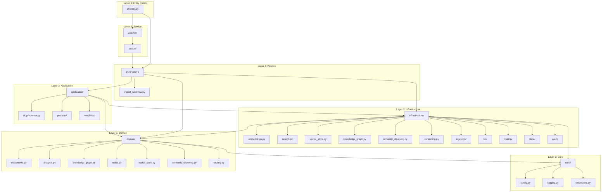

## Appendix B: Configuration Reference

| Environment Variable | Type | Default | Description |
|---------------------|------|---------|-------------|
| `PAM_APP__NAME` | str | `"personal-ai-memory"` | Application name |
| `PAM_APP__ENVIRONMENT` | str | `"development"` | Runtime environment |
| `PAM_OLLAMA__HOST` | HttpUrl | `http://localhost:11434` | Ollama server URL |
| `PAM_OLLAMA__MODEL` | str | `"qwen3:8b"` | Default LLM model |
| `PAM_OLLAMA__TIMEOUT_SECONDS` | int | `300` | LLM request timeout |
| `PAM_OLLAMA__REQUEST_RETRIES` | int | `3` | Max retries on failure |
| `PAM_LOGGING__LEVEL` | str | `"INFO"` | Log level |
| `PAM_LOGGING__FORMAT` | str | `"console"` | Log format (console/json) |
| `PAM_WATCHER__ENABLED` | bool | `True` | Enable file watcher |
| `PAM_WATCHER__INTERVAL_SECONDS` | float | `1.0` | Watcher poll interval |
| `PAM_QUEUE__WORKERS` | int | `1` | Number of queue workers |
| `PAM_QUEUE__MAX_SIZE` | int | `1000` | Maximum queue length |
| `PAM_MANIFEST__ENABLED` | bool | `True` | Enable dedup manifest |

## Appendix C: Key File Paths

| Path | Purpose | Created by |
|------|---------|------------|
| `./vault/` | Generated Obsidian notes | `VaultWriter` |
| `./data/inbox/` | Incoming files for watcher | User |
| `./data/processed/` | Files after successful processing | `QueueWorker` |
| `./data/failed/` | Files after failed processing | `QueueWorker` |
| `./data/manifests/processed_files.json` | SHA-256 dedup manifest | `ManifestManager` |
| `./data/manifests/queue_state.json` | Queue state for crash recovery | `QueueStateStore` |
| `./data/logs/` | Rotating log files | `setup_logging` |
| `./data/cache/` | Cache directory | Applications |
| `./config/default.yaml` | Default configuration | Developer |
| `./config/{environment}.yaml` | Environment overrides | Developer |

## Appendix D: Module Line Counts

| File | Lines | Category |
|------|-------|----------|
| `cli/entry.py` | 476 | CLI |
| `core/config.py` | 402 | Infrastructure |
| `templates/obsidian_note.py` | 410 | Templates |
| `pipelines/ingest_workflow.py` | 411 | Pipeline |
| `nodes.py` + `store.py` routing | 250 | Routing |
| `processor_impls.py` | 493 | Processing |
| `wiki_manager.py` | 343 | Vault |
| `ollama_client.py` | 323 | LLM |
| `queue/worker.py` | 322 | Queue |
| `watcher/service.py` | 187 | Watcher |
| `analysis.py` | 222 | Domain |
| `tests/unit/test_knowledge_engine.py` | 779 | Tests |
| `tests/integration/test_e2e_complete.py` | 1261 | Tests |

---

*End of Master Engineering Design Document*
