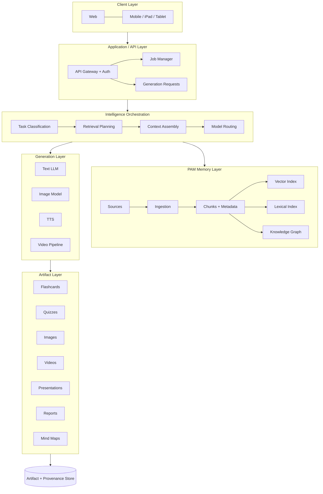
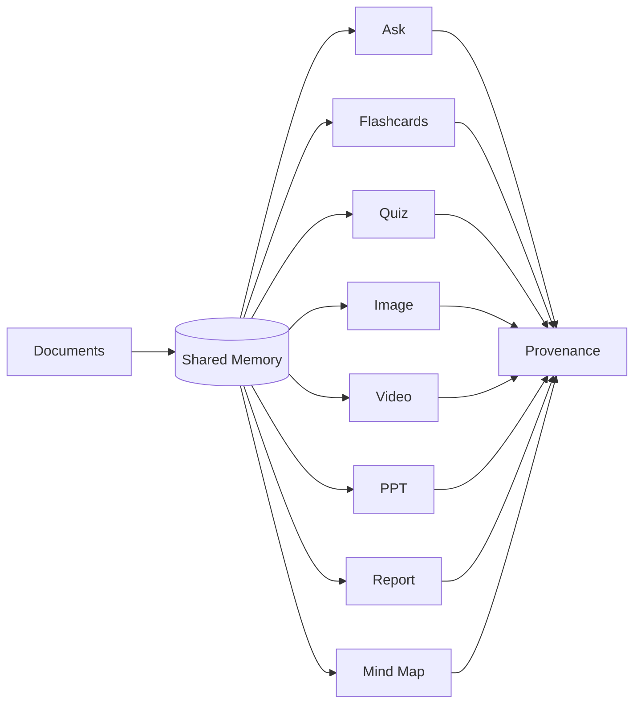
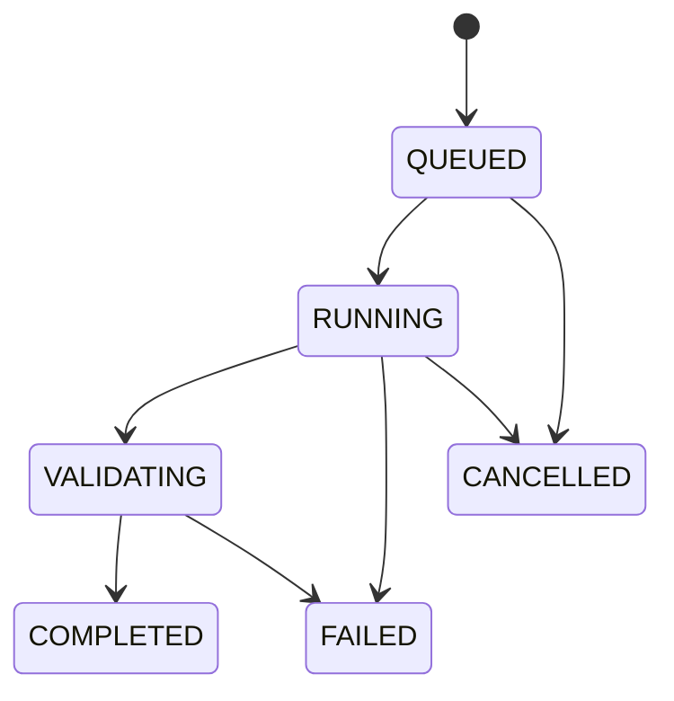
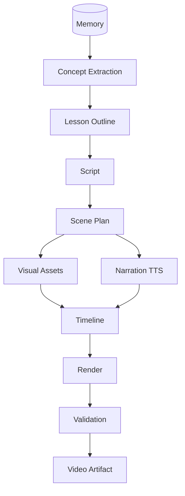
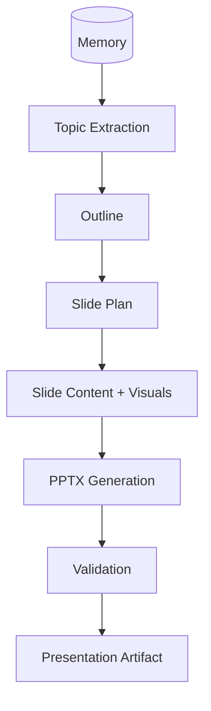
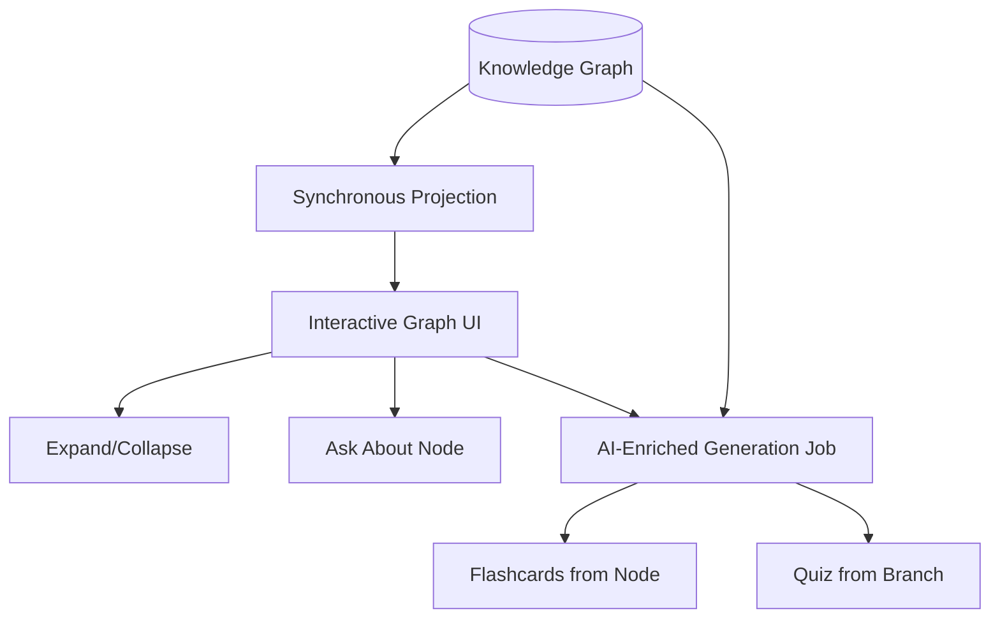
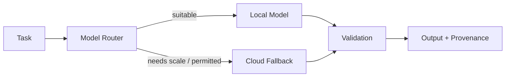

# PAM V2 Product & Multimodal Architecture Blueprint

**Status:** DESIGN ONLY — no implementation performed.
**Date:** 2026-10-02.
**Baseline:** HEAD `5a6f9992c2ba193f680f2609211ab08341da37f4` (= origin/main).
**Scope:** Product and multimodal architecture for PAM V2. V1.1.0 lifecycle is closed; retrieval baseline is frozen; evidence-verification research remains a separate track.

---

## 1. Executive Vision

PAM evolves from a local-first RAG memory system into a **unified personal knowledge and learning platform** built on one principle:

**ONE SHARED MEMORY → MANY AI CAPABILITIES**

The user uploads documents once. The same persistent memory then powers asking, flashcards, quizzes, images, videos, presentations, reports, study material, and interactive mind maps — across web, phone, tablet, and iPad — with every artifact traceable to its sources.

V2 does not replace V1.1.0. It **extends** it: the validated ingestion pipeline, vector store, hybrid retrieval, knowledge graph, QA workflow, CLI, FastAPI backend, and manifest ledger remain the foundation. V2 adds an intelligence-orchestration layer, a generation layer, an artifact layer, a job system, and a unified cross-platform API contract on top.

---

## 2. Current V1.1.0 Foundation

Verified from the repository at the baseline commit:

| Layer | Implementation | State |
|---|---|---|
| Ingestion | `app/infrastructure/ingestion/` — ~28 ingestors, routing classifier, secret guard | Validated |
| Chunking | `semantic_chunking.py` + `sentence_tokenizer.py` | Frozen |
| Embeddings | `embeddings.py` — nomic-embed-text, 768-dim | Frozen |
| Vector store | `vector_store.py` — in-memory dict + atomic JSON persistence | Validated |
| Lexical | `bm25.py` — Okapi BM25 | Frozen |
| Retrieval | `search.py` — dense + BM25 + RRF (k=60) | Frozen |
| Knowledge graph | `domain/knowledge_graph.py` + `infrastructure/knowledge_graph.py` | Validated |
| QA | `qa_workflow.py` — AbstentionGate (min_cosine=0.25), citations, system facts | Validated |
| Manifest | `state/manifest.py` + `models.py` — append-only attempt ledger (D4 Option A) | Closed |
| Queue/worker | `app/queue/` — background ingestion, SHA-256 dedup | Validated |
| CLI | `app/cli/entry.py` — ingest/status/sources/remove/ask/search/doctor/watch | Implemented |
| API | `app/interfaces/web/` — `/api/system`, `/api/sources`, `/api/ingest`, search/ask routes | Validated |
| Model routing | `ModelRoutingSettings` — general_text, programming, vision, OCR, audio, embeddings (all local Ollama) | Validated |
| Notes | `templates/obsidian_note.py` — generated study notes | Validated |
| Experiments | reranker, HyDE, answerability, banded verifier | Disabled, research-only |

---

## 3. Product Capabilities

| Capability | V1.1.0 State | V2 State |
|---|---|---|
| Ask PAM | ✅ Shipped | Same memory, richer provenance |
| Flashcards | ❌ Absent | New — retrieval-grounded generation |
| Quizzes | ❌ Absent | New — MCQ/TF/mixed, scoring, history |
| Images | ❌ Absent | New — local-first pipeline |
| Educational videos | ❌ Absent | New — compositional pipeline, short-form first |
| Presentations | ❌ Absent | New — PPTX from memory outline |
| Reports | ❌ Absent | New — structured doc model, multi-format export |
| Study material | Partial (notes) | Full — generated packs |
| Interactive mind maps | ❌ Absent | New — structured KG projection, not an image |
| Knowledge graph explorer | ❌ Absent (data only) | New — interactive UI over existing KG |
| Artifact library | ❌ Absent | New — versioned, reusable artifacts |

---

## 4. Shared Memory Architecture

The invariant: **every generation feature operates over the same persistent memory. No feature-specific knowledge stores.**

```
Source documents (files, URLs, uploads)
  → Ingestion (existing pipeline, unchanged)
    → Chunks + metadata (existing chunking)
      → Embeddings (existing model)
        → Vector index + Lexical index (existing stores)
          → Knowledge graph (existing KG + extensions)
            → MEMORY SCOPES:
                • all memory
                • selected documents
                • selected topics
                • selected projects
                • selected knowledge nodes
```

Memory scopes are **query-time filters**, not separate stores. A scope resolves to: a set of source identifiers + optional KG node set + optional vector filter. All generation features accept a `memory_scope` parameter with the same semantics.

---

## 5. Knowledge Graph Architecture

Distinguish five graph projections over one store:

| Graph | Nodes | Edges | Role |
|---|---|---|---|
| Document graph | Documents/sources | contains, derived-from | Provenance backbone |
| Concept graph | Key concepts, topics | related-to, part-of | Learning navigation |
| Entity graph | Named entities | co-occurs, relates | Fact exploration |
| Source graph | Sources, authors | cites, same-topic | Attribution |
| Artifact graph | Generated artifacts | generated-from, uses-chunk, uses-node | Reuse + lineage |

Vector retrieval remains the primary recall mechanism (frozen). Graph retrieval **complements** it: concept/entity traversal for mind maps, topic scoping for generation, and artifact lineage for reuse. Never a replacement.

---

## 6. Intelligence Orchestration

New layer between API and generation:

```
GenerationRequest
  → Task classification (ask / flashcards / quiz / image / video / ppt / report / mindmap)
    → Retrieval planning (scope → queries → top-k per query)
      → Context assembly (chunks + KG nodes, budget-bounded, deterministic)
        → Model routing (role → local model, cloud fallback if permitted)
          → Prompt construction (task template + context + provenance placeholders)
            → Generation
              → Validation (grounding, schema, completeness)
                → Provenance recording
                  → Artifact persistence
```

Each step is independently testable. Retrieval planning and context assembly reuse the frozen retrieval pipeline unchanged.

---

## 7. Model Architecture

Provider/model-agnostic. Roles (not models) are the architectural contract:

| Role | Responsibility | Current V1.1.0 Binding |
|---|---|---|
| Reasoning/text | QA, outlines, scripts, quiz/flashcard content | qwen3:8b (local) |
| Embedding | Chunk vectors | nomic-embed-text (local, frozen) |
| Vision | OCR, image understanding, visual QA | qwen2.5vl (local) |
| Image generation | Educational diagrams, illustrations | None — new role |
| Speech/TTS | Video narration | None — new role |
| Video composition | Scene assembly, rendering | None — new role (pipeline, not single model) |

`ModelRoutingSettings` extends with new keys (`image`, `tts`, `video_narrator`) following the existing `model_for(key)` fallback pattern.

---

## 8. Generation Architecture

Each capability is a **first-class module** with the same interface:

```
retrieve(memory_scope, task_queries) → context
generate(context, config) → draft artifact
validate(draft, context) → pass/fail + reasons
persist(draft, provenance) → artifact record
```

- **Flashcards:** concept extraction → Q/A pairs → answer-grounding check → set.
- **Quizzes:** same + distractors (MCQ), answer key, scoring rubric.
- **Images:** memory concepts → visual specification (structured prompt) → image model → prompt-adherence check.
- **Video (short-form):** concept → outline → script → scene plan → visuals + TTS → timeline → render → completeness check.
- **PPT:** topic → outline → slide plan → content + visuals → PPTX → schema check.
- **Reports:** topic → outline → sections → multi-format render (MD/PDF/DOCX) from one intermediate doc model.
- **Mind maps:** see §8.1 — two execution models.

### 8.1 Mind-Map Execution Model

Mind-map operations use **two distinct execution models**. This distinction is normative throughout the blueprint:

1. **Basic knowledge-graph → mind-map projection — synchronous.**
   A deterministic projection of existing knowledge-graph data into an interactive graph structure. No LLM generation is required. The client requests a scope (documents, topics, nodes); the backend returns nodes, edges, and source references derived directly from the stored graph. Bounded, fast, and cacheable. Used for: browsing the memory graph, expanding/collapsing nodes, inspecting sources, zooming, and selecting nodes as input to other features.

2. **AI-enriched mind-map generation — asynchronous job.**
   May involve concept extraction, relationship inference, node summaries, explanations, or generated learning content attached to nodes. Because it invokes models and may run long, it executes as a job (`QUEUED → RUNNING → VALIDATING → COMPLETED / FAILED / CANCELLED`) with progress reporting, and its outputs carry full artifact provenance like any other generated artifact. Used for: generating a study mind map from a topic, enriching a branch with summaries, or producing learning content bound to graph nodes.

The API, job system (§10, §14), frontend (§12), and workflows (§19) all respect this split: projection endpoints are synchronous reads; enrichment requests return job handles.

---

## 9. Artifact Architecture

Every artifact is a persistent, versioned record:

```
Artifact { id, kind, version, created_at, config, content_ref,
           sources: [ArtifactSource], job_id, model_info }
ArtifactSource { artifact_id, source_doc, chunk_ids?, kg_node_ids?,
                 quote_or_span?, role }
```

Regeneration creates a new version; previous versions are retained. Artifacts are reusable inputs (a flashcard set can seed a quiz; a report section can seed slides). AI-enriched mind maps (§8.1) are artifacts; basic projections are transient reads, not artifacts.

---

## 10. Job Architecture

All long-running operations are asynchronous jobs:

```
QUEUED → RUNNING → VALIDATING → COMPLETED
              ↘ FAILED | CANCELLED
```

Applies to: ingestion, flashcard/quiz/image/video/PPT/report generation, and **AI-enriched mind-map generation** (§8.1). Progress events stream (percent, stage, message). Cancellation is cooperative. Job state persists so clients can poll or reconnect. Short operations (ask, **basic mind-map projection**) stay synchronous.

---

## 11. Provenance Architecture

Core platform capability, not per-feature glue. Every artifact records: source documents, chunk IDs where applicable, KG node IDs where applicable, generation task + config, model + version, timestamp. Provenance is queryable ("show me everything generated from document X") and drives the Library UI and regeneration. Basic mind-map projections (§8.1) reference live graph data rather than storing provenance, because they are deterministic reads, not generations.

---

## 12. Frontend Architecture

Unified navigation (conceptual):

```
Home | Ask | Learn | Create | Knowledge | Mind Map | Library | Activity | Settings
```

- **Learn:** flashcards, quizzes, study packs, progress/history.
- **Create:** image, video, presentation, report, mind map (generation wizards; mind-map creation distinguishes instant projection from AI-enriched generation jobs).
- **Knowledge:** documents, sources, topics, KG explorer, memory scopes.
- **Library:** artifacts, versions, provenance, reuse, export.
- **Activity:** jobs, logs, latency, lineage.

No UI implementation in this phase.

---

## 13. Mobile Architecture

No separate mobile apps yet. The backend/API contract is designed so web, Android, iPhone, iPad, and tablets consume **the same endpoints** with no backend rewrite:

- Server-side: auth, memory, retrieval, generation, jobs, artifacts, provenance.
- Client-side: rendering, input, download caching, notifications, upload capture.
- Offline: read cached artifacts; queue uploads/generation requests for sync. Full offline memory is explicitly out of scope.
- Streaming/progress over the same job-progress channel for all clients (including AI-enriched mind-map jobs).

---

## 14. API Architecture

| Group | Responsibility | Sync/Async |
|---|---|---|
| `/memory` | upload, list, scopes | sync (upload may enqueue job) |
| `/knowledge` | sources, topics, KG, mind-map projection | sync |
| `/ask` | grounded QA | sync |
| `/generation` | flashcard/quiz/image/video/ppt/report/AI-mind-map requests | async (returns job) |
| `/artifacts` | get, list, versions, export, reuse | sync |
| `/jobs` | status, progress, cancel | sync |
| `/mindmap` | projection (sync), expand/collapse, node actions; enrichment via `/generation` | sync projection, async enrichment |
| `/flashcards`, `/quizzes`, `/presentations`, `/reports`, `/images`, `/videos` | capability-specific CRUD + history | sync reads, async generation |

The `/mindmap` projection endpoints are synchronous reads over the knowledge graph; AI-enriched mind-map generation is requested through `/generation` and tracked through `/jobs`, consistent with every other long-running generation feature.

---

## 15. Data Model

`Source → Document → Chunk → MemoryItem`; `KnowledgeNode ↔ KnowledgeEdge`; `GenerationRequest → GenerationJob → Artifact → ArtifactSource`; `FlashcardSet → Flashcard`; `Quiz → QuizQuestion`; `Presentation → Slide`; `Report → Section`; `MindMap → MindMapNode ↔ MindMapEdge`. Artifacts reference memory (never duplicate it); jobs reference requests; mind-map nodes reference KG nodes. A persisted enriched mind map is an `Artifact` of kind `mindmap`; a transient projection is a read model, not stored.

---

## 16. Security

Auth/session at the API gateway; user/project/memory boundaries enforced server-side; artifact access scoped to owner; local storage inherits PAM's local-first posture; secrets and model-provider credentials never logged; upload size/type limits; provenance records are integrity-protected (hash-chained per artifact version). No absolute privacy claims beyond what the architecture enforces.

---

## 17. Observability

Job logs, model latency, token usage (where exposed), GPU utilization, generation duration, failure reasons, cache hits, artifact lineage. No telemetry leaves the machine in local-first mode; cloud-fallback calls log provider, model, and cost-relevant counters only.

---

## 18. Versioning

Artifacts, prompts, model configurations, mind maps, presentations, reports, and (where needed) memory snapshots are versioned. Regeneration never silently overwrites. Prompts are content-addressed so an artifact records the exact prompt version used.

---

## 19. Feature Workflows

- **A. Upload:** client → `/memory` → ingestion (existing pipeline) → chunks/embeddings/KG → manifest entry.
- **B. Ask:** query → retrieval plan → context → gate → LLM → cited answer.
- **C–H. Generate (flashcards/quiz/image/video/PPT/report):** config → job → retrieval plan → context → model → validation → artifact + provenance → Library.
- **I. Mind map:** two paths —
  - *Projection (synchronous):* KG scope → deterministic projection → interactive structured data (expand/collapse/zoom/select/inspect).
  - *AI-enriched generation (asynchronous):* topic/scope → job → concept extraction/inference/summaries → validated artifact + provenance → Library.
- **J. Open artifact:** `/artifacts/{id}` → content + provenance + version history.
- **K. Node → Ask:** mind-map node (from either path) → scoped ask (memory_scope = node + neighbors).

---

## 20. Roadmap

| Stage | Objective | Dependencies | Acceptance |
|---|---|---|---|
| V2-A | Architecture foundation (scopes, jobs, provenance, API contracts) | V1.1.0 frozen | Contracts reviewed; no behavior change |
| V2-B | Shared generation infrastructure (orchestration, validation, artifacts) | V2-A | Ask-via-orchestration parity with V1.1.0 |
| V2-C | Flashcards + quizzes | V2-B | Grounded sets, scoring, history |
| V2-D | Reports + PPT | V2-B | Multi-format export, slide schema |
| V2-E | Interactive mind maps | V2-A (KG) | Sync projection live; async enrichment live; expand/collapse/select/ask-from-node |
| V2-F | Local image generation | V2-B + model benchmark | Prompt-adherent diagrams |
| V2-G | Short educational video pipeline | V2-B + V2-F + TTS benchmark | ≤3-min rendered lesson |
| V2-H | Unified web product | V2-C–E | Navigation + Library + Activity live |
| V2-I | Cross-platform mobile | V2-H API contracts | Same backend, mobile clients |

---

## 21. Model-Role Matrix

| Capability | Model Role | Local Candidate | Cloud Fallback | Requirements |
|---|---|---|---|---|
| Ask / outlines / scripts | Reasoning/text | qwen3:8b (verified) | Permitted provider — to be decided | Existing |
| Embeddings | Embedding | nomic-embed-text (frozen) | None (frozen) | Frozen |
| OCR / vision | Vision | qwen2.5vl (verified) | To be decided | Existing |
| Image generation | Image | **Candidate — requires benchmark** | To be decided | VRAM/quality/speed/license TBD |
| Narration | TTS | **Candidate — requires benchmark** | To be decided | Voice quality, local inference TBD |
| Video | Composition pipeline | **Candidate — requires benchmark** | To be decided | Render feasibility TBD |
| Quiz/flashcards | Reasoning/text | qwen3:8b (reuse) | Same as Ask | Grounding validation |
| Mind-map enrichment | Reasoning/text | qwen3:8b (reuse) | Same as Ask | Async job; provenance |
| Mind-map projection | None (KG read) | N/A | N/A | Structured data, no model |

No specific image/video/TTS model is selected. No benchmarks invented.

---

## 22. Architectural Principles

1. One shared memory. 2. Retrieval before generation. 3. Provenance by default. 4. Model-provider agnostic. 5. Local-first where practical. 6. Cloud fallback where permitted. 7. Long-running jobs are asynchronous. 8. Generated artifacts are persistent/versioned. 9. Feature modules do not create isolated memories. 10. Retrieval baseline remains frozen. 11. Research experiments remain isolated. 12. Mobile clients consume the same backend contracts. 13. Models do not silently retrain from user data. 14. User controls what enters memory. 15. Generated content retains source lineage.

RAG is retrieval + contextual generation over persistent memory. It is **not** model training. No foundation-model weights change when documents are uploaded. If future fine-tuning/LoRA/adapters prove useful, they are a **future research capability**, not a V2 requirement.

---

## 23. Mermaid Diagrams















---

## 24. Locked Decisions

- V1.1.0 lifecycle behavior frozen and closed (A1–A5 implemented; D1–D5 closed; D3-C pushed; D4 Option A).
- Validated retrieval baseline frozen (embeddings, chunking, BM25, RRF, QA abstention).
- One shared memory; no per-feature stores.
- Provenance recorded for every artifact.
- Jobs for all long-running operations; synchronous reads stay synchronous.
- Mind-map projection is synchronous; AI-enriched mind-map generation is an asynchronous job (§8.1).
- Same backend contracts for all clients.
- RAG ≠ model training; no silent retraining.
- Research (evidence verification, model selection, image/video, fine-tuning) stays isolated.

---

## 25. Open Engineering Questions

Exact image model; exact video strategy (compositional vs end-to-end); mobile framework; job-queue implementation; artifact storage implementation; model-routing implementation; graph DB vs current JSON graph storage; GPU scheduling; offline sync; fine-tuning/adapters; cloud provider policy; TTS voice selection; PPT theme engine; video render backend; mind-map enrichment prompt strategy.

---

## 26. Risks

Model VRAM vs local hardware; video render feasibility locally; LLM grounding quality for generated study content; scope creep per capability; provenance storage growth; mobile offline expectations; cloud-fallback privacy implications; job-system complexity.

---

## 27. Acceptance Criteria

Each stage: objective met, dependencies satisfied, generated artifacts grounded (spot-checked provenance), jobs observable/cancellable (including AI-enriched mind-map jobs), basic projections respond synchronously, no V1.1.0 regression (full suite green), retrieval byte-identical, no silent retraining, API contracts reviewed.

---

## 28. Recommended Implementation Order

V2-A → V2-B → V2-C → V2-D → V2-E → V2-F → V2-G → V2-H → V2-I, per dependency order in §20. Evidence-verification research proceeds in parallel under its own gate and merges only as a validated answering-layer component.

---

## V1.1.0 Boundary (Normative)

- V1.1.0 lifecycle remains closed.
- Retrieval remains frozen.
- V2 extends rather than replaces the V1.1.0 foundation.
- V2 generation features must not create independent knowledge stores.
- Evidence verification remains a separate research track.
- No production answerability changes are part of V2-A unless separately approved.

---

*End of blueprint — DESIGN ONLY. No implementation performed. No files other than this document created or modified.*
