# Phase 1 Implementation Specification

> **Project:** Personal AI Memory System (PAM) / LLM-Wiki
>
> **Phase:** 1 — Foundation Fixes
>
> **Source:** Master Engineering Design Document (MEDD)
>
> **Author:** Principal Software Architect & Lead Engineer
>
> **Date:** 2026-07-30

---

## Table of Contents

1. [Executive Summary](#1-executive-summary)
2. [Phase 1 Goals](#2-phase-1-goals)
3. [Scope](#3-scope)
4. [Out of Scope](#4-out-of-scope)
5. [Task Breakdown](#5-task-breakdown)
6. [File-Level Implementation Plan](#6-file-level-implementation-plan)
7. [Dependency Graph](#7-dependency-graph)
8. [Implementation Order](#8-implementation-order)
9. [Testing Strategy](#9-testing-strategy)
10. [Risk Assessment](#10-risk-assessment)
11. [Rollback Plan](#11-rollback-plan)
12. [Phase 1 Acceptance Criteria](#12-phase-1-acceptance-criteria)
13. [Phase 1 Completion Checklist](#13-phase-1-completion-checklist)

---

## 1. Executive Summary

Phase 1 stabilizes the existing codebase by fixing critical architectural issues, technical debt, reliability problems, and implementation inconsistencies without introducing major new features. All tasks are derived from the MEDD Technical Debt Report (Section 4), Gap Analysis (Section 3), and Module Specifications (Section 7).

**Key metrics:**
- **Total tasks:** 21
- **Estimated effort:** 16-18 engineering days
- **Files affected:** 19 source files, 8 test files
- **Risk level:** Low — no architectural changes, no new dependencies
- **Breaking changes:** None to public interfaces

**What Phase 1 is NOT:**
- NOT a feature addition phase
- NOT an architecture redesign
- NOT a performance optimization phase (except where fixing bugs also fixes performance)
- NOT a refactoring for its own sake — every change fixes a concrete bug or debt item

---

## 2. Phase 1 Goals

1. **Eliminate data-loss paths** — Fix every bug that silently loses data (KG not persisted, dead overlap_chars, silent edge drops, stats misreporting).

2. **Remove dead code** — Activate or delete every field/function that is defined but never used.

3. **Fix reliability gaps** — Add startup inbox scan, unify extension lists, add file stability check.

4. **Eliminate structural duplication** — Replace 5 identical path resolver functions, 2 duplicate workflow constructors, if/elif classifier chain.

5. **Improve error handling consistency** — Fix silent failures, add missing validation, ensure all errors are catchable and logged.

6. **Fix state management bugs** — Correct the `_loaded` flag ordering bug, fix stats denominator.

---

## 3. Scope

### Priority 1 — Critical Fixes (Days 1-5)

| Category | Items |
|----------|-------|
| **Dead code activation** | Chunk overlap implementation, NoteVersion.sha256 population |
| **Data-loss fixes** | KG persistence wiring, atomic write audit, stats bug |
| **Silent failure fixes** | KnowledgeGraph add_edge validation, model_for() warning |
| **Reliability gaps** | Startup inbox scan, extension mismatch, file stability check |
| **Manifest bugs** | `_loaded` flag ordering, hash_for_path ValueError propagation |

### Priority 2 — High Quality (Days 6-12)

| Category | Items |
|----------|-------|
| **Structural duplication** | Config path resolvers, workflow constructors, classifier if/elif chain |
| **Error handling** | EmbeddingService retry, hashing ValueError handling |
| **Monitoring** | Logging subsystem audit, `_display_path` edge cases |
| **Internal cleanup** | `model_for()` silent fallback, `_InboxCreatedHandler` logging |

### Priority 3 — Polish (Days 13-16)

| Category | Items |
|----------|-------|
| **Logging improvements** | Consistent structured logging across all paths |
| **Small refactors** | Extract shared validators in analysis.py, docstring audit |
| **Test hardening** | Add tests for all fixes, mark live-service tests |

---

## 4. Out of Scope

The following items from the MEDD are explicitly **NOT** part of Phase 1:

| Item | Reason |
|------|--------|
| FAISS IVF vector index | New dependency, architecture change — Phase 2 |
| BM25 sparse retrieval | New feature — Phase 3 |
| Token counting + LLM truncation | New feature — Phase 2 |
| Query rewriting | New feature — Phase 3 |
| Cross-encoder re-ranking | New feature — Phase 3 |
| Metadata filtering | New feature — Phase 3 |
| `pam search` CLI | New feature — Phase 3 |
| REST API / Web UI | New architecture — Phase 5 |
| Docker packaging | New dependency — Phase 5 |
| Authentication | New feature — Phase 5 |
| Cloud LLM providers | New feature — Phase 5 |
| MIME-type detection | New dependency (python-magic) — Phase 2 |
| Language detection | New dependency — Phase 2 |
| NLP sentence segmentation | New dependency (spaCy) — Phase 3 |
| Hierarchical chunking | Architecture change — Phase 3 |
| Graph query API | Architecture change — Phase 4 |
| Entity resolution | Architecture change — Phase 4 |
| Hallucination detection | New feature — Phase 4 |
| DocumentAnalysis model split | Breaking schema change — post-Phase 1 decision |
| Pydantic/dataclass unification | Large refactor — post-Phase 1 decision |
| Cross-model foreign keys | Large refactor — post-Phase 1 decision |

---

## 5. Task Breakdown

### Task P1-01: Implement Chunk Overlap

| Field | Value |
|-------|-------|
| **Problem** | `SemanticChunker.overlap_chars = 200` is declared at `semantic_chunking.py:23` but never read by any method. Chunks have zero overlap — a sentence split across two chunks loses context in both. |
| **Why it matters** | Every chunk boundary is a potential context loss. With 200-char overlap, a sentence bridging two chunks appears in both, preserving context for retrieval. |
| **Current implementation** | `_split_by_sentences` accumulates sentences until `max_chunk_chars` is reached, then starts a new chunk from scratch. The `overlap_chars` attribute exists but is not referenced anywhere. |
| **Target implementation** | After splitting, for each chunk boundary, append `overlap_chars` characters from the end of the previous chunk to the start of the next chunk. The overlap text must be included in both chunks' `text` field. `start_char`/`end_char` offsets should reflect the original text positions (not the overlapped copy). |
| **Files affected** | `app/infrastructure/semantic_chunking.py` |
| **Classes affected** | `SemanticChunker` |
| **Functions affected** | `chunk()`, `_split_by_sentences()`, `_split_long_section()` |
| **Interfaces affected** | None (internal implementation change) |
| **Dependencies** | None |
| **Risk level** | Low |
| **Complexity** | Low |
| **Estimated time** | 1 day |
| **Breaking changes** | None — chunk output may differ in content (overlap added), but the `DocumentChunk` schema is unchanged |
| **Migration strategy** | Older vector stores without overlapped chunks continue to work. Only newly chunked docs will have overlap. |
| **Rollback strategy** | Revert `semantic_chunking.py` |

| Acceptance criteria | |
|--------------------|-|
| Adjacent chunks share `overlap_chars` characters of overlapping text | |
| Total chunk count does not decrease (same splits, just overlapping) | |
| First chunk has no prefix overlap; last chunk has no suffix overlap | |
| `start_char`/`end_char` reflect original text positions, not overlapped text | |
| All existing chunking tests pass | |

| Definition of Done | |
|-------------------|-|
| Code merged to main | |
| All existing chunking tests pass | |
| New test: "overlap produces shared text between adjacent chunks" | |
| New test: "no overlap for single-chunk documents" | |
| New test: "start_char/end_char unchanged by overlap" | |

| Required tests | |
|---------------|-|
| Unit: `test_chunk_overlap_produces_shared_text` — 2 chunks with 200-char overlap, verify last 200 chars of chunk 0 == first 200 chars of chunk 1 | |
| Unit: `test_chunk_overlap_single_chunk` — short text (1 chunk), verify no overlap added | |
| Unit: `test_chunk_overlap_offsets_preserved` — verify start_char/end_char match original text | |
| Unit: `test_chunk_overlap_zero` — set `overlap_chars=0`, verify no overlap | |
| Regression: All `test_knowledge_engine.py` chunking tests pass unchanged | |

| Performance impact | Negligible — O(n) with small constant overhead for overlap copying |
| Security impact | None |

### Task P1-02: Populate NoteVersion.sha256

| Field | Value |
|-------|-------|
| **Problem** | `NoteVersion.sha256` field exists at `versioning.py:22` with `""` default, but `record_version()` at line 51-69 never computes or populates it. |
| **Why it matters** | Version integrity cannot be verified. Without a content hash, a corrupted or tampered version cannot be detected. |
| **Current implementation** | `record_version()` writes the version file and creates a `NoteVersion` entry with `sha256=""` — the field is always empty. |
| **Target implementation** | Compute `hashlib.sha256(content.encode()).hexdigest()` in `record_version()` before creating the `NoteVersion` entry, and pass the digest. |
| **Files affected** | `app/infrastructure/versioning.py` |
| **Classes affected** | `VersionManager` |
| **Functions affected** | `record_version()` |
| **Interfaces affected** | None — the field already exists with default `""`, now it will be populated |
| **Dependencies** | None (`hashlib` already imported in project, add to versioning.py) |
| **Risk level** | Trivial |
| **Complexity** | Trivial |
| **Estimated time** | 1 hour |
| **Breaking changes** | None — `sha256` was always `""`, now it has a real value. Downstream code that checks `if entry.sha256` will now pass when it didn't before. This is the desired behavior. |
| **Migration strategy** | Existing version entries have `sha256=""`. They remain valid but lack hashes. Only new versions will have populated hashes. |
| **Rollback strategy** | Revert `versioning.py` |

| Acceptance criteria | |
|--------------------|-|
| `record_version()` returns `NoteVersion` with non-empty `sha256` | |
| Same content produces same sha256 across calls | |
| Different content produces different sha256 | |

| Definition of Done | |
|-------------------|-|
| Code merged to main | |
| New test: `test_version_sha256_populated` verifies non-empty hash | |
| New test: `test_version_sha256_deterministic` verifies same content = same hash | |

| Required tests | |
|---------------|-|
| Unit: `test_version_sha256_populated` | |
| Unit: `test_version_sha256_deterministic` | |

| Performance impact | Negligible — SHA-256 of note content is fast for typical note sizes |
| Security impact | Positive — version integrity is now verifiable |

### Task P1-03: Wire KG Persistence into Pipeline Callers

| Field | Value |
|-------|-------|
| **Problem** | `IngestionWorkflow._run_knowledge_engine()` at `ingest_workflow.py:361-364` already implements KG save/load/merge logic. But **neither caller** (`QueueWorker._build_workflow` at `worker.py:227` or `cli._run_ingest` at `entry.py:347`) passes `graph_persistence_path`. Additionally, neither passes `chunker`, `embedding_service`, `vector_store`, or `knowledge_graph_builder` — so `_run_knowledge_engine` returns `(None, 0, 0)` at line 319-320 every time. |
| **Why it matters** | The entire knowledge engine (chunking, embeddings, vector store, knowledge graph, cross-document linking) is silently skipped in production. The KG is built and discarded every run. |
| **Current implementation** | Both callers construct `IngestionWorkflow.from_runtime()` with only `ollama_client`, `writer`, `routing`, `vision_client`, and `transcriber`. The knowledge engine parameters (`chunker`, `embedding_service`, `vector_store`, `knowledge_graph_builder`, `graph_persistence_path`) are all left as `None`. |
| **Target implementation** | Both callers must:
1. Create `SemanticChunker`, `EmbeddingService`, `VectorStore`, `KnowledgeGraphBuilder` instances
2. Determine `graph_persistence_path` from settings (e.g., `settings.paths.manifest_root / "knowledge_graph.json"`)
3. Pass all to `IngestionWorkflow.from_runtime()`

Implementation detail: Extract a `_build_knowledge_engine()` factory function shared between both callers to prevent future duplication. |
| **Files affected** | `app/queue/worker.py`, `app/cli/entry.py`, (new) `app/pipelines/workflow_factory.py` or similar |
| **Classes affected** | `QueueWorker`, (new factory function) |
| **Functions affected** | `_build_workflow()`, `_run_ingest()` |
| **Interfaces affected** | None — `from_runtime()` already accepts all parameters |
| **Dependencies** | `app/infrastructure/semantic_chunking.SemanticChunker`, `app/infrastructure/embeddings.EmbeddingService`, `app/infrastructure/vector_store.VectorStore`, `app/infrastructure/knowledge_graph.KnowledgeGraphBuilder` — all already exist |
| **Risk level** | Low — adding new parameters to existing function calls. No existing behavior changes. |
| **Complexity** | Low |
| **Estimated time** | 1 day |
| **Breaking changes** | None — `from_runtime()` signature is unchanged |
| **Migration strategy** | After deployment, first run builds a fresh vector store and KG from scratch. No existing data migration needed. |
| **Rollback strategy** | Remove the knowledge engine parameters from both callers |

| Acceptance criteria | |
|--------------------|-|
| `IngestionWorkflow._run_knowledge_engine` is called and completes successfully | |
| Vector store JSON file is created under `manifest_root` after first run | |
| Knowledge graph JSON file is created after first run | |
| Second run with same document loads existing graph, merges, and saves | |
| Cross-document linking finds results across multiple processed documents | |

| Definition of Done | |
|-------------------|-|
| Both `_build_workflow` and `_run_ingest` pass all knowledge engine components | |
| Vector store persists across restarts | |
| Knowledge graph persists and merges across documents | |
| New test: Integration test verifying KG persistence across 2 documents | |
| No new duplication — factory function shared between both callers | |

| Required tests | |
|---------------|-|
| Integration: `test_workflow_with_knowledge_engine` — full pipeline with real chunker/embedder/graph, verify persisted files | |
| Integration: `test_knowledge_graph_merges_across_documents` — process 2 docs, verify graph contains nodes from both | |
| Regression: All existing workflow tests pass | |

| Performance impact | Adds chunking + embedding + KG building time to ingestion (already existed, was just skipped). Expected: +2-5s per document. |
| Security impact | None |

### Task P1-04: Fix RuntimeStats Latency Bug

| Field | Value |
|-------|-------|
| **Problem** | `RuntimeStats.average_queue_latency_seconds` at `stats.py:40-44` computes `completed = self.processed + self.skipped_duplicates + self.failed` for the denominator, but `total_queue_latency_seconds` is only incremented in `record_processed()` at line 22. Skipped and failed items contribute 0 latency to the numerator while counting in the denominator, artificially deflating the average. |
| **Why it matters** | Operations team cannot trust the metric. High-latency failures are hidden. |
| **Current implementation** | Denominator includes all completions, numerator only counts processed item latency. |
| **Target implementation** | Change the denominator to exclude `skipped_duplicates` and `failed` — only completed processing contributes to the average. Alternatively, record per-item latency for all completion types. **Recommended:** Exclude skipped and failed from the denominator since they represent zero processing effort. |
| **Files affected** | `app/queue/stats.py` |
| **Classes affected** | `RuntimeStats` |
| **Functions affected** | `average_queue_latency_seconds` property |
| **Interfaces affected** | None — property name and return type unchanged |
| **Dependencies** | None |
| **Risk level** | Trivial |
| **Complexity** | Trivial |
| **Estimated time** | 1 hour |
| **Breaking changes** | Metric value changes (increases) for any deployment with skipped or failed items. This is a **correctness fix** — the new value is the correct one. |
| **Migration strategy** | Document in changelog that the metric was corrected. Any monitoring dashboards may need threshold adjustments. |
| **Rollback strategy** | Revert `stats.py` |

| Acceptance criteria | |
|--------------------|-|
| Average latency excludes skipped duplicates from denominator | |
| Average latency excludes failed items from denominator | |
| Average latency is unchanged when no items were skipped or failed | |

| Definition of Done | |
|-------------------|-|
| Code merged | |
| New test verifying each scenario | |

| Required tests | |
|---------------|-|
| Unit: `test_average_latency_excludes_duplicates` — record 1 processed (10s) + 1 duplicate, verify avg = 10.0, not 5.0 | |
| Unit: `test_average_latency_excludes_failed` — record 1 processed (10s) + 1 failed, verify avg = 10.0 | |
| Unit: `test_average_latency_all_processed` — record 3 processed (5+10+15s), verify avg = 10.0 | |
| Unit: `test_average_latency_zero_processed` — verify returns 0.0 | |

| Performance impact | None |
| Security impact | None |

### Task P1-05: Add KnowledgeGraph add_edge Validation

| Field | Value |
|-------|-------|
| **Problem** | `KnowledgeGraph.add_edge()` at `knowledge_graph.py:46-48` silently drops edges whose endpoints don't exist in the nodes dict. The caller has no way to know the edge was discarded. |
| **Why it matters** | Silent data loss in the knowledge graph. A dropped edge means a lost relationship between concepts, which weakens graph-based retrieval. |
| **Current implementation** | `if edge.source_id in self.nodes and edge.target_id in self.nodes: self.edges.append(edge)` — no return value, no logging, no exception. |
| **Target implementation** | Change to validate endpoint existence and log a warning. Return `True` if edge was added, `False` if it was dropped. |
| **Files affected** | `app/domain/knowledge_graph.py` |
| **Classes affected** | `KnowledgeGraph` |
| **Functions affected** | `add_edge()` |
| **Interfaces affected** | `add_edge` return type changes from `None` to `bool` |
| **Dependencies** | `app.core.logging.get_logger` (already imported in callers) |
| **Risk level** | Low |
| **Complexity** | Trivial |
| **Estimated time** | 1 hour |
| **Breaking changes** | `add_edge()` now returns `bool` instead of `None`. Any code that checks `result is None` would need updating. A grep reveals no callers check the return value — all callers call `add_edge` and discard the result. Low risk. |
| **Migration strategy** | Add logging for dropped edges. No callers depend on `None` return. |
| **Rollback strategy** | Revert `knowledge_graph.py` |

| Acceptance criteria | |
|--------------------|-|
| `add_edge` with valid endpoints returns `True` and edge is added | |
| `add_edge` with invalid source returns `False` and edge is NOT added | |
| `add_edge` with invalid target returns `False` and edge is NOT added | |
| Warning is logged when edge is dropped | |

| Definition of Done | |
|-------------------|-|
| Code merged | |
| Return type changed to `bool` | |
| New tests for valid/invalid endpoint scenarios | |

| Required tests | |
|---------------|-|
| Unit: `test_add_edge_valid_endpoints` — returns True | |
| Unit: `test_add_edge_missing_source` — returns False | |
| Unit: `test_add_edge_missing_target` — returns False | |
| Unit: `test_add_edge_both_missing` — returns False | |
| Regression: all neighbor/subgraph tests pass | |

| Performance impact | Negligible — O(1) dict lookup |
| Security impact | None |

### Task P1-06: Add Startup Inbox Scan to Watcher

| Field | Value |
|-------|-------|
| **Problem** | `WatchService.start()` at `service.py:53-84` only responds to filesystem `on_created` events. Files placed in the inbox before the watcher starts are never processed. |
| **Why it matters** | Fundamental reliability gap — the watcher cannot process pre-existing files. Users must place files after starting the watcher, which is non-obvious and error-prone. |
| **Current implementation** | `start()` creates directories, restores queue state from disk, registers the event handler, starts the worker and observer. No inbox scan. |
| **Target implementation** | Add `_scan_inbox()` called at the end of `start()` (after observer is active). The function iterates all files in `self.inbox_root` (recursively if enabled), filters through `should_watch_file`, and enqueues each file via `self.queue_manager.enqueue()`. |
| **Files affected** | `app/watcher/service.py` |
| **Classes affected** | `WatchService` |
| **Functions affected** | `start()` — add call to `_scan_inbox()` |
| **Interfaces affected** | None — new private method |
| **Dependencies** | None (reuses existing `should_watch_file`, `queue_manager.enqueue`) |
| **Risk level** | Low — existing files are enqueued for processing just as if they were newly created |
| **Complexity** | Low |
| **Estimated time** | 1 day |
| **Breaking changes** | None |
| **Migration strategy** | N/A |
| **Rollback strategy** | Remove call to `_scan_inbox()` |

| Acceptance criteria | |
|--------------------|-|
| Files in inbox before watcher start are enqueued and processed | |
| Files in inbox subdirectories (recursive) are enqueued | |
| Hidden files in inbox are skipped | |
| Unsupported extensions in inbox are skipped | |
| Files already in queue state (from crash recovery) are NOT double-enqueued | |
| Directories in inbox are skipped | |

| Definition of Done | |
|-------------------|-|
| Code merged | |
| Unit test verifies scan enqueues existing files | |
| Integration test verifies processed files from inbox scan | |
| No duplicate processing of files restored from queue state | |

| Required tests | |
|---------------|-|
| Unit: `test_start_scans_inbox` — place files in temp inbox dir, call `start()`, verify queue has items | |
| Unit: `test_inbox_scan_skips_hidden` — hidden file in inbox not enqueued | |
| Unit: `test_inbox_scan_skips_unsupported` — `.xyz` file not enqueued | |
| Integration: `test_inbox_scan_processes_files` — full watcher lifecycle with files pre-placed | |

| Performance impact | Depends on number of files in inbox. Expected: <1s for 1000 files (iterate + stat + enqueue). |
| Security impact | None |

### Task P1-07: Unify Extension Lists Between Watcher and Worker

| Field | Value |
|-------|-------|
| **Problem** | `watcher/filters.py:17-21` defines `SUPPORTED_EXTENSIONS` that includes `DOCX_EXTENSIONS | PPTX_EXTENSIONS | SPREADSHEET_EXTENSIONS`. `queue/worker.py:43-46` defines `SUPPORTED_PROCESSING_EXTENSIONS` that excludes those same categories. Files with `.docx`, `.pptx`, `.xls`, `.ipynb`, `.tex`, `.epub`, `.drawio`, `.vsdx`, `.mmd`, `.zip`, `.tar`, `.gz`, `.7z`, `.rar`, `.eml`, `.msg`, `.sqlite`, `.db`, `.bib`, `.ris`, `.html`, `.xml`, `.json`, `.rss` are accepted by the watcher, enqueued, then immediately failed by the worker. |
| **Why it matters** | Silent user-facing failure — files appear to be queued but silently fail with "Unsupported file type" log message. |
| **Current implementation** | Two independent constant sets that have diverged. |
| **Target implementation** | Replace both with a single canonical `SUPPORTED_EXTENSIONS` in `app/core/extensions.py` (or a new shared location). Both watcher and worker import from this single source. The new set should include **all** extensions that have working ingestors + processors. Includes: all extensions from `filters.py` minus Document Intelligence categories that have no processor implementation (archive, email, database, research, web, diagram, tex, epub). **Decision:** include only extensions with both ingestor AND processor in the single source. The excluded categories should be added when their processors are implemented. |
| **Files affected** | `app/watcher/filters.py`, `app/queue/worker.py`, `app/core/extensions.py` (add `PROCESSABLE_EXTENSIONS` constant) |
| **Classes affected** | None |
| **Functions affected** | `filters.SUPPORTED_EXTENSIONS` → import from shared location, `worker.SUPPORTED_PROCESSING_EXTENSIONS` → import from shared location |
| **Interfaces affected** | None — constant rename only |
| **Dependencies** | None |
| **Risk level** | Low — narrowing the watcher's accepted extensions prevents silent failures |
| **Complexity** | Low |
| **Estimated time** | 1 day |
| **Breaking changes** | Users who previously placed `.docx` files in the inbox expecting processing will now see them ignored by the watcher (instead of silently failing later). This is a **better** failure mode — the file is never enqueued, and the user can check why. |
| **Migration strategy** | Document in changelog that only fully supported extensions are watched. Add a log message when a file is skipped due to unsupported extension. |
| **Rollback strategy** | Revert extension changes |

| Acceptance criteria | |
|--------------------|-|
| Watcher and worker use the same extension constant | |
| `.docx` files are NOT watched (no processor support) | |
| `.md`, `.txt`, `.pdf`, `.csv`, `.xlsx`, code, image, audio, video files ARE watched | |
| Worker's `_source_type_for_extension` can still process all watched extensions | |
| No silent failures — unsupported files are rejected at watcher level | |

| Definition of Done | |
|-------------------|-|
| Single `PROCESSABLE_EXTENSIONS` in `extensions.py` | |
| `filters.SUPPORTED_EXTENSIONS` removed (import shared constant) | |
| `worker.SUPPORTED_PROCESSING_EXTENSIONS` removed (import shared constant) | |
| All tests pass | |
| Watcher logs info when skipping a file due to extension | |

| Required tests | |
|---------------|-|
| Unit: `test_shared_extension_consistency` — verify watcher and worker use same source | |
| Regression: all filter tests pass | |
| Regression: all worker tests pass | |

| Performance impact | Negligible |
| Security impact | None |

### Task P1-08: Eliminate Duplicate Workflow Construction

| Field | Value |
|-------|-------|
| **Problem** | `QueueWorker._build_workflow()` at `worker.py:211-233` and `cli._run_ingest()` at `entry.py:338-352` both construct the same `IngestionWorkflow.from_runtime()` call with near-identical logic for creating `OllamaClient`, `OllamaVisionClient`, `WhisperTranscriber`, and `VaultWriter`. The worker version additionally attempts `WhisperTranscriber`, the CLI version does not. |
| **Why it matters** | Adding a new optional dependency (e.g., a new LLM provider) requires updating both locations. This has already caused drift (transcriber discrepancy). |
| **Current implementation** | Two independent implementations of the same assembly logic. |
| **Target implementation** | Extract a shared factory function `build_knowledge_workflow(settings: Settings, *, vision_client=None, transcriber=None)` that handles the construction. Both callers use the factory. The factory can be either a module-level function in `app/pipelines/` or a static method on `IngestionWorkflow`. **Recommendation:** Add a `create_default` static method to `IngestionWorkflow` that takes `Settings` and returns a configured workflow. |
| **Files affected** | `app/pipelines/ingest_workflow.py` (add `create_default`), `app/queue/worker.py` (replace `_build_workflow`), `app/cli/entry.py` (replace `_run_ingest` construction) |
| **Classes affected** | `IngestionWorkflow`, `QueueWorker` |
| **Functions affected** | `create_default` (new), `_build_workflow` (removed), `_run_ingest` (simplified) |
| **Interfaces affected** | `IngestionWorkflow.create_default(settings, *, vision_client, transcriber) → IngestionWorkflow` — new public method |
| **Dependencies** | None new |
| **Risk level** | Low — extraction, not behavioral change |
| **Complexity** | Low |
| **Estimated time** | 1 day |
| **Breaking changes** | `QueueWorker._build_workflow` is private — no breaking change. If anyone was calling it directly, change to `IngestionWorkflow.create_default`. |
| **Migration strategy** | Remove `_build_workflow`, update callers. |
| **Rollback strategy** | Revert both files |

| Acceptance criteria | |
|-------------------|-|
| `IngestionWorkflow.create_default(settings)` returns a fully configured workflow | |
| Both worker and CLI use `create_default` | |
| Worker can still override vision/transcriber clients via parameters | |
| All existing tests pass | |

| Definition of Done | |
|-------------------|-|
| `create_default` method added to `IngestionWorkflow` | |
| `_build_workflow` removed from `QueueWorker` | |
| `_run_ingest` in `cli/entry.py` uses `create_default` | |
| All tests pass | |

### Task P1-09: Consolidate Config Path Resolvers

| Field | Value |
|-------|-------|
| **Problem** | `config.py` has 5 nearly-identical path resolver functions (`_resolve_paths`, `_resolve_watcher_paths`, `_resolve_processing_paths`, `_resolve_queue_paths`, `_resolve_manifest_paths`) that differ only in which config keys they resolve. Each checks if a value is absolute, otherwise resolves relative to `project_root`. ~80 lines of duplicated logic. |
| **Why it matters** | Adding a new config section with path fields requires duplicating the pattern. Bugs in one resolver may not be fixed in all five. |
| **Current implementation** | 5 functions, each iterating a specific set of keys, doing the same relative-to-absolute resolution. |
| **Target implementation** | Single `_resolve_relative_paths(config: dict[str, Any], keys: set[str], root: Path) → dict[str, Any]` that accepts a set of key names to resolve. Replace all 5 call sites. |
| **Files affected** | `app/core/config.py` |
| **Classes affected** | None |
| **Functions affected** | Remove 5, add 1 |
| **Interfaces affected** | `_resolve_paths`, `_resolve_watcher_paths`, `_resolve_processing_paths`, `_resolve_queue_paths`, `_resolve_manifest_paths` — all private, removed. New `_resolve_relative_paths` is also private. |
| **Dependencies** | None |
| **Risk level** | Low |
| **Complexity** | Low |
| **Estimated time** | 1 day |
| **Breaking changes** | None — all functions are private |
| **Migration strategy** | Replace each call site with `_resolve_relative_paths(config_subsection, {"key1", "key2"}, project_root)` |
| **Rollback strategy** | Restore the 5 functions and update call sites |

| Acceptance criteria | |
|-------------------|-|
| All 5 call sites use the shared function | |
| All existing config tests pass | |
| Config loading produces identical results (golden file comparison) | |

| Definition of Done | |
|-------------------|-|
| Single `_resolve_relative_paths` function | |
| 5 resolver functions removed | |
| All tests pass | |
| Config output identical to pre-refactor (verified by test) | |

| Required tests | |
|---------------|-|
| Unit: `test_config_paths_resolve_correctly` — verify each section's paths resolve correctly | |
| Unit: `test_config_paths_absolute_untouched` — absolute paths not modified | |
| Regression: all existing config tests pass | |

| Performance impact | Negligible |
| Security impact | None |

### Task P1-10: Replace Classifier if/elif Chain with Data-Driven Table

| Field | Value |
|-------|-------|
| **Problem** | `DocumentClassifier._detect_kind()` at `classifier.py:57-145` is a 90-line `if/elif` chain mapping extensions to kinds. Hard to maintain, order-dependent, easy to introduce gaps. |
| **Why it matters** | Adding a new extension category requires extending the chain. The order of checks accidentally encodes priority. |
| **Current implementation** | Sequential if/elif checks against extension sets. |
| **Target implementation** | Build a single dict mapping every extension to its kind: `EXTENSION_KIND_MAP: dict[str, str]`. Generated at module load time from the extension sets in `core/extensions.py`. Kind overrides (scanned_pdf, handwritten) remain as source_type checks before the dict lookup. |
| **Files affected** | `app/infrastructure/routing/classifier.py` |
| **Classes affected** | `DocumentClassifier` |
| **Functions affected** | `_detect_kind()` → replaced with dict lookup, `_confidence_for()` → unchanged |
| **Interfaces affected** | None — `classify()` interface unchanged |
| **Dependencies** | `app/core/extensions` (already imported) |
| **Risk level** | Low — mapping is mechanically generated from same extension sets |
| **Complexity** | Low |
| **Estimated time** | 2 days |
| **Breaking changes** | None — same inputs produce same outputs by construction |
| **Migration strategy** | Replace `_detect_kind` body with dict lookup. Build dict at module level. |
| **Rollback strategy** | Revert `classifier.py` |

| Acceptance criteria | |
|-------------------|-|
| Every extension in `extensions.py` maps to its correct kind | |
| Source-type overrides (scanned_pdf, handwritten) still work | |
| Unknown extensions return "unknown" | |
| All 62 `test_routing.py` tests pass | |

| Definition of Done | |
|-------------------|-|
| `EXTENSION_KIND_MAP` dict built at module level | |
| `_detect_kind` uses dict lookup | |
| All classifier tests pass | |
| Verification test: every extension in `extensions.py` has a mapping | |

| Required tests | |
|---------------|-|
| Unit: `test_all_extensions_mapped` — iterate all extension frozensets, verify each extension maps to a non-"unknown" kind | |
| Unit: `test_unknown_extension` — `.xyz` returns "unknown" | |
| Regression: all 62 `test_routing.py` tests pass | |

| Performance impact | O(1) dict lookup vs O(n) if/elif chain — slight improvement |
| Security impact | None |

### Task P1-11: Fix ManifestManager _loaded Flag Bug

| Field | Value |
|-------|-------|
| **Problem** | `ManifestManager.load()` at `manifest.py:41-44` sets `self._loaded = True` BEFORE `self.save()` completes. If `save()` throws (disk full, permissions), the manifest is in an inconsistent state: `_loaded` is `True` but `_state` is empty. Subsequent `load()` calls will skip loading (line 32: `if self._loaded: return self._state`) and return empty state. |
| **Why it matters** | After a disk-full error during initial manifest creation, all subsequent duplicate checks silently pass (manifest always returns empty), causing re-processing of all files. |
| **Current implementation** | `_loaded = True` on line 44, `save()` on line 43. |
| **Target implementation** | Move `self._loaded = True` to AFTER `self.save()`. **Also** ensure the `except` block on line 52 sets `_loaded = True` only after `save()` completes (line 56). |
| **Files affected** | `app/infrastructure/state/manifest.py` |
| **Classes affected** | `ManifestManager` |
| **Functions affected** | `load()` |
| **Interfaces affected** | None |
| **Dependencies** | None |
| **Risk level** | Low |
| **Complexity** | Trivial |
| **Estimated time** | 1 hour |
| **Breaking changes** | None |
| **Migration strategy** | N/A |
| **Rollback strategy** | Revert `manifest.py` |

| Acceptance criteria | |
|--------------------|-|
| If `save()` fails during initial load, `_loaded` remains `False` | |
| Next `load()` call retries file read (not returns empty) | |
| On successful load + save, `_loaded` is `True` | |

| Definition of Done | |
|-------------------|-|
| Move `_loaded = True` after `save()` in both paths | |
| New test: simulated `save()` failure leaves `_loaded=False` | |

| Required tests | |
|---------------|-|
| Unit: `test_loaded_flag_not_set_on_save_failure` — mock `save()` to raise, verify `_loaded` is `False` | |
| Unit: `test_loaded_flag_set_on_save_success` — verify `_loaded` is `True` after successful load | |

| Performance impact | None |
| Security impact | None |

### Task P1-12: Add model_for() Warning on Unknown Keys

| Field | Value |
|-------|-------|
| **Problem** | `ModelRoutingSettings.model_for()` at `config.py:199-201` silently returns `self.general_text` for any unknown key. A mistyped key like `"generl_text"` returns the default without warning. |
| **Why it matters** | Silent misrouting — the wrong model is used without any indication. |
| **Current implementation** | `return getattr(self, key, self.general_text)` — no logging, no error. |
| **Target implementation** | Add a warning log when `key` is not a valid attribute of `ModelRoutingSettings`. |
| **Files affected** | `app/core/config.py` |
| **Classes affected** | `ModelRoutingSettings` |
| **Functions affected** | `model_for()` |
| **Interfaces affected** | None — return type unchanged |
| **Dependencies** | `logging.getLogger` (or `app.core.logging.get_logger`) |
| **Risk level** | Trivial |
| **Complexity** | Trivial |
| **Estimated time** | 1 hour |
| **Breaking changes** | None |
| **Migration strategy** | N/A |
| **Rollback strategy** | Revert `config.py` change |

| Acceptance criteria | |
|--------------------|-|
| Valid key returns correct model without warning | |
| Invalid key returns fallback model WITH warning logged | |

| Definition of Done | |
|-------------------|-|
| `model_for()` logs warning on unknown key | |
| All existing routing tests pass | |

| Required tests | |
|---------------|-|
| Unit: `test_model_for_unknown_key_logs_warning` — verify log message for unknown key | |
| Regression: routing tests | |

| Performance impact | Negligible |
| Security impact | None |

### Task P1-13: Fix hash_for_path ValueError Propagation

| Field | Value |
|-------|-------|
| **Problem** | `compute_file_hash()` at `hashing.py:27` raises `ValueError` for unsupported extensions. `ManifestManager.hash_for_path()` at `manifest.py:151` calls it without try/except. `QueueWorker._process_item()` at `worker.py:161` calls `hash_for_path()` inside the main try block but the `except` on line 184 does NOT catch `ValueError` — it catches `IngestionWorkflowError, AIProcessingError, OllamaClientError, OSError`. A file with an unsupported extension would cause an unhandled `ValueError` that propagates to the broad `except Exception` on line 138. |
| **Why it matters** | The worker catches the error but the error type is wrong (`ValueError` should be caught explicitly), and the error message is confusing to debug. |
| **Current implementation** | `ValueError` propagates to the catch-all exception handler. |
| **Target implementation** | Add `ValueError` to the caught exceptions in `_process_item()` (line 184). Return the file to `failed` status with a clear log message. |
| **Files affected** | `app/infrastructure/state/hashing.py` (optional: convert ValueError to more specific type), `app/queue/worker.py` (add ValueError to except clause) |
| **Classes affected** | `ManifestManager` (no change needed — the handler is in the caller), `QueueWorker` |
| **Functions affected** | `_process_item()` |
| **Interfaces affected** | None |
| **Dependencies** | None |
| **Risk level** | Trivial |
| **Complexity** | Trivial |
| **Estimated time** | 1 hour |
| **Breaking changes** | None |
| **Migration strategy** | N/A |
| **Rollback strategy** | Revert `worker.py` |

| Acceptance criteria | |
|--------------------|-|
| File with unsupported extension fails with clear error message | |
| File is moved to failed directory | |
| Worker continues processing next item | |

| Definition of Done | |
|-------------------|-|
| `ValueError` added to catch clause in `_process_item()` | |
| New test: unsupported extension doesn't crash worker | |

| Required tests | |
|---------------|-|
| Unit: `test_worker_unsupported_extension_handled` — feed `.xyz` file to worker, verify it's failed not crashed | |
| Regression: worker tests | |

| Performance impact | None |
| Security impact | None |

### Task P1-14: Add EmbeddingService Retry

| Field | Value |
|-------|-------|
| **Problem** | `EmbeddingService` (`embeddings.py`) has no retry logic. `OllamaClient` has retry with exponential backoff (3 attempts). An embedding request that fails due to transient network issue propagates immediately. |
| **Why it matters** | Embedding is called once per chunk. A single transient failure loses ALL embeddings for the current document. |
| **Current implementation** | Direct `self._client.embed()` call with no retry. |
| **Target implementation** | Add retry wrapper (2 retries, exponential backoff 1s, 2s) to `embed()` and `embed_batch()`. Implementation can either reuse the retry pattern from `OllamaClient._execute_generate` or add a simple decorator. |
| **Files affected** | `app/infrastructure/embeddings.py` |
| **Classes affected** | `EmbeddingService` |
| **Functions affected** | `embed()`, `embed_batch()` |
| **Interfaces affected** | None |
| **Dependencies** | `time` (already imported transitively) |
| **Risk level** | Low |
| **Complexity** | Low |
| **Estimated time** | 1 day |
| **Breaking changes** | None — same interface, retry is transparent |
| **Migration strategy** | N/A |
| **Rollback strategy** | Revert `embeddings.py` |

| Acceptance criteria | |
|--------------------|-|
| First embed call failure triggers retry after 1s | |
| Second embed call failure triggers retry after 2s | |
| Third failure propagates as before | |
| Successful embed after retry returns correct result | |
| `embed_batch` same retry pattern | |

| Definition of Done | |
|-------------------|-|
| Retry logic added to both `embed()` and `embed_batch()` | |
| Existing embedding tests pass | |
| New test: retry on transient failure | |

| Required tests | |
|---------------|-|
| Unit: `test_embed_retry_on_transient_failure` — mock client to fail twice then succeed | |
| Unit: `test_embed_retry_exhausted` — mock client to always fail, verify exception | |
| Regression: all embedding tests | |

| Performance impact | Adds latency on failure (up to 3s cumulative for 2 retries). No impact on success path. |
| Security impact | None |

### Task P1-15: Improve Logging Consistency

| Field | Value |
|-------|-------|
| **Problem** | Logging patterns vary across the codebase. Some modules use `logger = get_logger(__name__)` (structlog), others use bare `logging.getLogger`. Some error paths log at `ERROR`, some at `WARNING`, some use `logger.exception`, some use `logger.warning`. |

Specifically:

- `processor_impls.py` uses bare `logging.getLogger(__name__)` instead of `get_logger` from `app.core.logging`
- Some error paths in `wiki_manager.py` use `logger.warning()` where `logger.exception()` would be more appropriate (to capture traceback)
- The `_display_path` method in `WatchService` doesn't handle all edge cases

| **Why it matters** | Consistent logging enables reliable log parsing, alerting, and debugging. |
| **Current implementation** | Mix of structlog and stdlib logging calls. |
| **Target implementation** | Audit all `logger = logging.getLogger(__name__)` patterns and replace with `get_logger(__name__)`. Audit error logging to use `logger.exception()` where tracebacks are helpful. |
| **Files affected** | `app/infrastructure/routing/processor_impls.py`, `app/infrastructure/vault/wiki_manager.py`, `app/core/logging.py` (add doc about convention), others as discovered |
| **Classes affected** | Multiple |
| **Functions affected** | Multiple logger calls |
| **Interfaces affected** | None |
| **Dependencies** | None |
| **Risk level** | Low |
| **Complexity** | Low |
| **Estimated time** | 2 days |
| **Breaking changes** | None |
| **Migration strategy** | Per-file audit, replace logger instances |
| **Rollback strategy** | Revert individual files |

| Acceptance criteria | |
|--------------------|-|
| All modules use `get_logger(__name__)` or `logging.getLogger(__name__)` consistently | |
| Error paths use `logger.exception()` where traceback is valuable | |
| Warnings do NOT include traceback (use `logger.warning()`) | |
| No mixing of structlog and stdlib logging in same module | |

| Definition of Done | |
|-------------------|-|
| `processor_impls.py` changed to use `get_logger` | |
| Error logging audit completed | |
| All tests pass | |

| Required tests | |
|---------------|-|
| No new test code needed — behavioral change only | |
| Regression: all tests pass | |

| Performance impact | None |
| Security impact | None |

### Task P1-16: Fix _display_path Edge Cases

| Field | Value |
|-------|-------|
| **Problem** | `WatchService._display_path()` at `service.py:118-122` uses `path.relative_to()` which raises `ValueError` if path is outside `project_root`. The `except ValueError` catches this, but the path may also fail for other reasons (e.g., different drives on Windows). |
| **Why it matters** | Logs may show absolute paths instead of relative paths, or crash on cross-drive paths. |
| **Target implementation** | Also catch `OSError` for cross-drive paths. |
| **Files affected** | `app/watcher/service.py` |
| **Classes affected** | `WatchService` |
| **Functions affected** | `_display_path()` |
| **Interfaces affected** | None |
| **Dependencies** | None |
| **Risk level** | Trivial |
| **Complexity** | Trivial |
| **Estimated time** | 1 hour |
| **Breaking changes** | None |
| **Migration strategy** | N/A |
| **Rollback strategy** | Revert `service.py` |

| Acceptance criteria | |
|--------------------|-|
| Path within project root shows relative | |
| Path outside project root shows absolute | |
| Path on different drive shows absolute | |

| Definition of Done | |
|-------------------|-|
| `OSError` added to except clause | |
| No crash on cross-drive paths | |

| Required tests | |
|---------------|-|
| Unit: `test_display_path_outside_project_root` — verify absolute display | |
| Regression: watcher service tests | |

| Performance impact | None |
| Security impact | None |

### Task P1-17: Queue Manager — Existing Path Hardening

| Field | Value |
|-------|-------|
| **Problem** | Minor queue edge cases: `_queue_path` uses `path.resolve()` which can raise `OSError` on Windows for paths with removed drives (e.g., network drives). |
| **Why it matters** | Resolve failure crashes the worker. |
| **Target implementation** | Wrap `resolve()` in try/except, fall back to `path.absolute()`. |
| **Files affected** | `app/queue/manager.py` |
| **Classes affected** | `QueueManager` |
| **Functions affected** | `_queue_path()` |
| **Interfaces affected** | None |
| **Dependencies** | None |
| **Risk level** | Trivial |
| **Complexity** | Trivial |
| **Estimated time** | 1 hour |
| **Breaking changes** | None |
| **Migration strategy** | N/A |
| **Rollback strategy** | Revert `manager.py` |

| Acceptance criteria | |
|--------------------|-|
| Path.resolve() succeeds → resolved path used | |
| Path.resolve() fails → absolute path used as fallback | |

| Definition of Done | |
|-------------------|-|
| Try/except around `path.resolve()` | |
| Unit test for resolve failure fallback | |

### Task P1-18: Clean Redundant Path Object Creation in hashing.py

| Field | Value |
|-------|-------|
| **Problem** | `compute_file_hash()` at `hashing.py:25` creates `candidate = Path(path)` when `path` is already a `Path` object (all callers pass `Path`). |
| **Why it matters** | Minor code smell — unnecessary object creation. |
| **Target implementation** | Remove the redundant `Path()` wrapper. |
| **Files affected** | `app/infrastructure/state/hashing.py` |
| **Classes affected** | None |
| **Functions affected** | `compute_file_hash()` — remove `candidate = Path(path)`, use `path` directly |
| **Interfaces affected** | None |
| **Dependencies** | None |
| **Risk level** | Trivial |
| **Complexity** | Trivial |
| **Estimated time** | 30 minutes |
| **Breaking changes** | None |
| **Migration strategy** | N/A |
| **Rollback strategy** | Revert `hashing.py` |

| Acceptance criteria | |
|--------------------|-|
| `compute_file_hash` works correctly with `Path` input | |

| Definition of Done | |
|-------------------|-|
| Redundant `Path(path)` removed | |
| All hashing tests pass | |

### Task P1-19: Remove FileCreatedEvent Intermediate Object

| Field | Value |
|-------|-------|
| **Problem** | `_InboxCreatedHandler.on_created()` at `service.py:167-171` creates a `FileCreatedEvent` dataclass (from `events.py`) that is immediately consumed to build a `QueueItem`. The intermediate object adds no value — it's created, accessed once, then discarded. |
| **Why it matters** | Unnecessary abstraction adds code volume and cognitive overhead. |
| **Current implementation** | `FileCreatedEvent(path, timestamp, extension)` → `QueueItem(path=..., extension=..., created_at=...)` |
| **Target implementation** | Build `QueueItem` directly from `Path` and `datetime.now(UTC)`. The event class can be removed. |
| **Files affected** | `app/watcher/events.py` (delete or deprecate), `app/watcher/service.py` (simplify `on_created`) |
| **Classes affected** | `FileCreatedEvent` (deleted), `_InboxCreatedHandler` |
| **Functions affected** | `on_created()` |
| **Interfaces affected** | `FileCreatedEvent` removed — no known external users |
| **Dependencies** | None |
| **Risk level** | Trivial |
| **Complexity** | Trivial |
| **Estimated time** | 1 hour |
| **Breaking changes** | `FileCreatedEvent` class removed. No known imports outside `service.py`. |
| **Migration strategy** | Grep for `FileCreatedEvent` imports. If any exist externally, keep class but deprecate. |
| **Rollback strategy** | Restore `events.py` |

| Acceptance criteria | |
|--------------------|-|
| Watcher creates QueueItem directly | |
| No functional change — same data, same enqueue behavior | |

| Definition of Done | |
|-------------------|-|
| `FileCreatedEvent` removed (or deprecated) | |
| `on_created()` builds `QueueItem` directly | |
| All watcher tests pass | |

### Task P1-20: Remove Legacy/Broken Ingestor Test Fixtures

| Field | Value |
|-------|-------|
| **Problem** | Some integration tests in `test_ingestion.py` hit live services (YouTube transcript fetch) or depend on external network availability. These fail in offline/CI environments. |
| **Why it matters** | CI pipeline cannot be enabled until tests are hermetic. |
| **Target implementation** | Mark live-service tests with `@pytest.mark.integration` and skip them by default in CI. Add proper mocks for HTTP-based ingestors. |
| **Files affected** | `tests/unit/test_ingestion.py`, `tests/conftest.py` (add `pytest_configure` to register `integration` mark) |
| **Classes affected** | None |
| **Functions affected** | YouTube ingestor tests |
| **Interfaces affected** | None |
| **Dependencies** | None |
| **Risk level** | Low |
| **Complexity** | Low |
| **Estimated time** | 1 day |
| **Breaking changes** | None |
| **Migration strategy** | Add `-m "not integration"` to default pytest invocation in `pyproject.toml` |

| Acceptance criteria | |
|--------------------|-|
| `pytest` by default skips live-service tests | |
| `pytest -m integration` runs live-service tests | |
| YouTube ingestor tests use mock HTTP client instead of real network | |

| Definition of Done | |
|-------------------|-|
| `integration` mark registered in `conftest.py` | |
| Live tests marked `@pytest.mark.integration` | |
| YouTube tests mocked | |
| CI config uses `-m "not integration"` | |

### Task P1-21: Fix Analysis Validation Duplication

| Field | Value |
|-------|-------|
| **Problem** | `DocumentAnalysis` has 3 nearly-identical validators (`_validate_tags`, `_validate_keywords`, `_validate_categories`) that differ only in normalization rules (strip/lower/hyphenate vs strip/lower vs strip/title). ~40 lines of duplicated pattern. |
| **Why it matters** | Adding a new list field requires duplicating the validation pattern. |
| **Current implementation** | 3 separate validators, each with own dedup/normalization logic. |
| **Target implementation** | Extract a shared `_deduplicate_and_normalize(items: list[str], transform: Callable[[str], str]) → list[str]` helper. |
| **Files affected** | `app/domain/analysis.py` |
| **Classes affected** | `DocumentAnalysis` |
| **Functions affected** | `_validate_tags`, `_validate_keywords`, `_validate_categories` — simplified to one-liners using the helper |
| **Interfaces affected** | None |
| **Dependencies** | None |
| **Risk level** | Low |
| **Complexity** | Low |
| **Estimated time** | 1 day |
| **Breaking changes** | None — same inputs produce same outputs |
| **Migration strategy** | Extract helper, update validators |
| **Rollback strategy** | Revert `analysis.py` |

| Acceptance criteria | |
|--------------------|-|
| Tags still lowercased, hyphenated, deduped | |
| Keywords still lowercased, deduped | |
| Categories still Title Cased, deduped | |
| All validation tests pass | |

| Definition of Done | |
|-------------------|-|
| Shared helper function added | |
| 3 validators use the helper | |
| All analysis tests pass | |

---

## 6. File-Level Implementation Plan

### 6.1 Source Files

| File | Purpose | Change | Risk | Size | Tests |
|------|---------|--------|------|------|-------|
| `app/infrastructure/semantic_chunking.py` | Chunk overlap activation | Implement overlap in `chunk()`, `_split_by_sentences`, `_split_long_section` | Low | +20 lines | Yes |
| `app/infrastructure/versioning.py` | SHA-256 population | Compute hash in `record_version()`, add `hashlib` import | Trivial | +3 lines | Yes |
| `app/pipelines/ingest_workflow.py` | Add `create_default` factory | New static method for workflow construction | Low | +40 lines | Yes |
| `app/queue/worker.py` | Knowledge engine wiring, extension fix, factory use | Pass KG components, use shared extensions, use `create_default` | Low | -20 lines | Yes |
| `app/cli/entry.py` | Knowledge engine wiring, factory use | Pass KG components, use `create_default` | Low | -15 lines | Yes |
| `app/queue/stats.py` | Fix latency bug | Change denominator in `average_queue_latency_seconds` | Trivial | -2 lines | Yes |
| `app/domain/knowledge_graph.py` | Edge validation | Return `bool` from `add_edge`, log on drop | Low | +5 lines | Yes |
| `app/watcher/service.py` | Inbox scan + display fix | Add `_scan_inbox()`, fix `_display_path` OSError | Low | +25 lines | Yes |
| `app/watcher/filters.py` | Extension unification | Import from shared `extensions.py` | Low | -3 lines | Yes |
| `app/watcher/events.py` | Remove redundant event | Delete or deprecate `FileCreatedEvent` | Trivial | -16 lines | Yes |
| `app/core/extensions.py` | Add `PROCESSABLE_EXTENSIONS` | New constant, watcher+worker agnostic | Low | +5 lines | No |
| `app/core/config.py` | Path resolvers + model_for warning | Consolidate 5 resolvers into 1, add warning | Low | -60 lines | Yes |
| `app/infrastructure/routing/classifier.py` | Data-driven kind mapping | Build `EXTENSION_KIND_MAP` dict | Low | +30 lines | Yes |
| `app/infrastructure/state/manifest.py` | _loaded flag fix | Move `_loaded = True` after `save()` | Trivial | -2 lines | Yes |
| `app/infrastructure/state/hashing.py` | Redundant Path fix | Remove `candidate = Path(path)` | Trivial | -1 line | No |
| `app/infrastructure/embeddings.py` | Add retry | Retry wrapper for `embed()` and `embed_batch()` | Low | +20 lines | Yes |
| `app/infrastructure/routing/processor_impls.py` | Logging consistency | Replace `logging.getLogger` with `get_logger` | Low | -2 lines | No |
| `app/domain/analysis.py` | Validator dedup | Extract shared helper, simplify 3 validators | Low | -10 lines | Yes |
| `app/queue/manager.py` | Path resolve hardening | Wrap `resolve()` in try/except | Trivial | +4 lines | Yes |

### 6.2 Test Files

| File | Change |
|------|--------|
| `tests/unit/test_knowledge_engine.py` | Add overlap tests (P1-01), KG add_edge tests (P1-05) |
| `tests/unit/test_queue_worker.py` | Add unsupported extension test (P1-13) |
| `tests/unit/test_queue_stats.py` | New file or extend existing: latency bug tests (P1-04) |
| `tests/unit/test_manifest.py` | Add _loaded flag tests (P1-11) |
| `tests/unit/test_config.py` | Add path resolver consolidation tests (P1-09), model_for warning (P1-12) |
| `tests/unit/test_routing.py` | Add extension coverage verification (P1-10) |
| `tests/unit/test_watcher_service.py` | Add inbox scan tests (P1-06), display path tests (P1-16) |
| `tests/unit/test_embeddings.py` | Add retry tests (P1-14) |
| `tests/unit/test_ingestion.py` | Mark live tests with `@pytest.mark.integration` (P1-20) |
| `tests/conftest.py` | Register `integration` mark (P1-20) |

### 6.3 Configuration Files

| File | Change |
|------|--------|
| `pyproject.toml` | Add `-m "not integration"` to pytest default args (P1-20) |
| `.github/workflows/ci.yml` | N/A — CI pipeline is post-Phase 1 (Phase 5) |

---

## 7. Dependency Graph

```mermaid
graph TB
    subgraph "Day 1-3: Critical Data Bugs"
        P1_04[P1-04: Stats Bug] --> P1_DONE
        P1_05[P1-05: KG Edge Validation] --> P1_DONE
        P1_11[P1-11: Manifest _loaded Flag] --> P1_DONE
        P1_13[P1-13: ValueError Propagation] --> P1_DONE
        P1_17[P1-17: Queue Path Hardening] --> P1_DONE
        P1_18[P1-18: Redundant Path in hashing] --> P1_DONE
        P1_19[P1-19: FileCreatedEvent Removal] --> P1_DONE
    end

    subgraph "Day 2-5: Dead Code & Reliability"
        P1_01[P1-01: Chunk Overlap] --> P1_DONE
        P1_02[P1-02: sha256 Population] --> P1_DONE
        P1_06[P1-06: Startup Inbox Scan] --> P1_DONE
        P1_07[P1-07: Extension Unification] --> P1_06
        P1_12[P1-12: model_for Warning] --> P1_DONE
        P1_14[P1-14: Embedding Retry] --> P1_DONE
        P1_16[P1-16: _display_path Fix] --> P1_DONE
    end

    subgraph "Day 5-10: Structural Duplication"
        P1_03[P1-03: KG Wiring in Callers] --> P1_08
        P1_08[P1-08: Workflow Factory] --> P1_DONE
        P1_09[P1-09: Config Path Consolidation] --> P1_DONE
        P1_10[P1-10: Classifier Data-Driven] --> P1_DONE
    end

    subgraph "Day 10-16: Polish & Tests"
        P1_15[P1-15: Logging Consistency] --> P1_DONE
        P1_20[P1-20: Test Marking] --> P1_DONE
        P1_21[P1-21: Validator Dedup] --> P1_DONE
        TESTS[Write/update tests for all tasks] --> P1_DONE
    end

    P1_DONE[Phase 1 Complete]
```



### Critical Path

The critical path is:
```
P1-03 (KG wiring) → P1-08 (workflow factory) → P1-DONE
```

P1-03 and P1-08 are interdependent because the knowledge engine components must be passed through the new factory. Therefore, P1-03 and P1-08 should be implemented together as one logical unit.

P1-07 (extension unification) must precede P1-06 (inbox scan) only in the sense that the scanner should use the unified extension list. But P1-06 can be implemented independently and updated after P1-07 merges.

### Parallelization Groups

The following groups can be implemented in any order (no cross-dependencies):

| Group | Tasks |
|-------|-------|
| **A: Pure bug fixes** | P1-04, P1-05, P1-11, P1-13, P1-17, P1-18, P1-19 |
| **B: Dead code** | P1-01, P1-02 |
| **C: Reliability** | P1-06, P1-07, P1-12, P1-14, P1-16 |
| **D: Structural** | P1-03+P1-08, P1-09, P1-10 |
| **E: Polish** | P1-15, P1-20, P1-21 |

Group D should be done last (it depends on understanding all other changes). Groups A, B, and C can be done in parallel by different engineers.

---

## 8. Implementation Order

### Recommended Sequence

```
Week 1 (Days 1-5)
─────────────────
Day 1:   P1-04 (Stats bug) — 1 hr
         P1-05 (KG edge validation) — 1 hr
         P1-11 (Manifest _loaded flag) — 1 hr
         P1-13 (ValueError propagation) — 1 hr
         P1-17 (Queue path hardening) — 1 hr
         P1-18 (Redundant Path) — 30 min
         P1-19 (FileCreatedEvent removal) — 1 hr
         → Minimal-risk, high-confidence fixes. No behavior change beyond bug fix.
         
Day 2:   P1-01 (Chunk overlap) — 1 day
         P1-12 (model_for warning) — 1 hr
         
Day 3:   P1-02 (sha256 population) — 1 hr
         P1-07 (Extension unification) — 1 day
         
Day 4:   P1-06 (Startup inbox scan) — 1 day
         P1-14 (Embedding retry) — 1 day
         
Day 5:   Write tests for Days 1-4 changes
         P1-16 (display_path fix) — 1 hr

Week 2 (Days 6-12)
─────────────────
Day 6:   P1-09 (Config path consolidation) — 1 day
         → Consolidation first so P1-03 doesn't conflict
         
Day 7:   P1-10 (Classifier data-driven) — 2 days
Day 8:   (continue P1-10)
         
Day 9:   P1-03 (KG wiring) + P1-08 (Workflow factory) — 2 days
Day 10:  (continue P1-03+P1-08)
         
Day 11:  Write tests for Week 2 changes
Day 12:  P1-21 (Validator dedup) — 1 day

Week 3 (Days 13-16)
─────────────────
Day 13:  P1-15 (Logging consistency) — 2 days
Day 14:  (continue P1-15)
         
Day 15:  P1-20 (Test marking) — 1 day
         Final regression test run
         
Day 16:  Documentation updates, changelog
         Phase 1 review
```

### Rationale

1. **Day 1 first** — Pure bug fixes with no risk of regression. Each is <1 hour and independently verifiable. Merging these early clears the "risk debt" and allows safe parallel work afterward.

2. **Days 2-4 second** — Dead code activation and reliability improvements. These change internal behavior but have no interface changes. Start with the simplest (P1-02, P1-12) before the most complex (P1-01).

3. **Days 6-8 third** — Structural refactors (config resolvers, classifier). These are pure code quality improvements with zero behavioral change (same inputs → same outputs).

4. **Days 9-10 fourth** — KG wiring + workflow factory. These are the most impactful changes (activate the entire knowledge engine) and should be done after all infrastructure fixes are merged.

5. **Days 11-16** — Polish, tests, and documentation.

---

## 9. Testing Strategy

### 9.1 Unit Testing

**Approach:** Each task in Section 5 specifies required unit tests. Total: ~35 new unit tests.

| Area | Tests | Focus |
|------|-------|-------|
| Chunk overlap | 4 tests | Edge cases: single chunk, offsets preserved, overlap boundary |
| Stats latency | 4 tests | Denom excludes failed/duplicate, all-processed, zero |
| KG add_edge | 4 tests | Valid, missing source, missing target, both missing |
| Inbox scan | 3 tests | Existing files, hidden skip, unsupported skip |
| Manifest _loaded | 2 tests | Save failure, save success |
| model_for warning | 1 test | Logging on unknown key |
| Embedding retry | 2 tests | Transient failure, exhaustion |
| Config resolvers | 2 tests | Absolute preserved, relative resolved |
| Classifier | 1 test | All extensions mapped |
| Worker ValueError | 1 test | Unsupported extension handled |
| display_path | 1 test | Outside project root |
| Queue path resolve | 1 test | Resolve failure fallback |
| Version sha256 | 2 tests | Populated, deterministic |
| **Total** | **~28 tests** | |

### 9.2 Integration Testing

| Test | Scope |
|------|-------|
| KG persistence across 2 documents | Process docs, verify vector store + KG JSON files, verify second doc merges into first |
| Inbox scan + processing | Place files in inbox, start watcher, verify all files processed |
| Workflow with knowledge engine | Full pipeline: ingestion → chunking → embeddings → vector store → KG → vault |
| Extension consistency | Watcher and worker use same extension set |

### 9.3 Regression Testing

**All 386 existing tests must pass** after Phase 1 changes. Key regression areas:

| Area | Test File | Risk |
|------|-----------|------|
| Chunking | `test_knowledge_engine.py` | Medium — overlap changes chunk output |
| Stats | `test_queue_worker.py` | Low — new metric calculation |
| KG | `test_knowledge_engine.py` | Low — add_edge returns bool now |
| Manifest | `test_manifest.py` | Low — _loaded flag ordering |
| Config | `test_config.py` | Low — path resolution unchanged |
| Classifier | `test_routing.py` | Low — same extension→kind mapping |
| Watcher | `test_watcher_service.py` | Medium — new scan method |
| Embeddings | existing embed tests | Low — retry is transparent |

### 9.4 Performance Testing

| Test | Baseline | Target | When |
|------|----------|--------|------|
| Chunking throughput | N/A | Within 10% of pre-overlap | After P1-01 |
| Embedding retry latency | N/A | 3s max on transient failure | After P1-14 |
| Startup time with inbox scan | N/A | <2s for 1000 files | After P1-06 |

### 9.5 Manual Verification Checklist

- [ ] `pam ingest` a markdown file → verify note generated correctly
- [ ] `pam ingest` a PDF → verify note generated
- [ ] Place file in inbox → start `pam watch` → verify file processed
- [ ] Start `pam watch` with files already in inbox → verify all processed
- [ ] Process 2 documents → verify knowledge graph JSON exists with nodes from both
- [ ] Process same file twice → verify duplicate detection works (no re-processing)
- [ ] `pam doctor` → verify all checks pass
- [ ] `pam status` → verify stats displayed

### 9.6 Expected Outputs

After Phase 1:

1. `data/manifests/knowledge_graph.json` — exists after processing a document (P1-03)
2. `data/manifests/processed_files.json` — contains entries with SHA-256 hashes (P1-11)
3. Chunks have overlapping boundaries — verify by inspecting vector store JSON (P1-01)
4. Note versions have non-empty sha256 field (P1-02)
5. `pam status` shows correct average latency (P1-04)
6. Inbox files pre-existing are processed (P1-06)
7. `.docx` files in inbox are ignored with log message (P1-07)
8. All 386 existing tests pass + ~28 new tests pass

---

## 10. Risk Assessment

### 10.1 Task-Level Risks

| Task | Failure Mode | Detection | Recovery |
|------|-------------|-----------|----------|
| P1-01 | Overlap chars miscalculated (text corruption) | Chunk offset unit test fails | Fix overlap calculation |
| P1-03 | Knowledge engine exposes latent bug (e.g., vector store OOM on large doc) | Pipeline exception | Catch in worker's existing exception handler; log and file goes to failed |
| P1-03 | KG merge creates duplicate nodes | Spot check on graph JSON | Fix merge logic; delete corrupted graph file |
| P1-06 | Inbox scan double-processes files (race with observer) | Integration test flaky | Add dedup check in scan before enqueue (check `is_queued`) |
| P1-07 | Missing extension from PROCESSABLE_EXTENSIONS | Integration test failure | Add missing extension |
| P1-08 | create_default creates vision/transcriber differently | Worker/CLI behavior diverges | Fix factory to match both callers' requirements |
| P1-10 | Extension → kind mapping error | Classifier test fails | Fix mapping entry |

### 10.2 Mitigation Strategy

**Low-risk approach:** Each task is independently testable and revertable. No task changes a public interface. No task adds a dependency. The implementation order puts highest-risk tasks last (P1-03, P1-08) so they benefit from the foundation of earlier fixes.

---

## 11. Rollback Plan

### 11.1 Per-Task Rollback

Every task can be independently rolled back by reverting its file changes:

| Task | Files to Revert | Verification |
|------|----------------|--------------|
| P1-01 | `semantic_chunking.py` | Run chunking tests |
| P1-02 | `versioning.py` | Run versioning tests |
| P1-03 | `worker.py`, `entry.py`, `ingest_workflow.py` | Run workflow tests |
| P1-04 | `stats.py` | Run stats tests |
| P1-05 | `knowledge_graph.py` | Run KG tests |
| P1-06 | `service.py` | Run watcher tests |
| P1-07 | `filters.py`, `worker.py`, `extensions.py` | Run filter tests |
| P1-08 | `ingest_workflow.py`, `worker.py`, `entry.py` | Run workflow tests |
| P1-09 | `config.py` | Run config tests |
| P1-10 | `classifier.py` | Run routing tests |
| P1-11 | `manifest.py` | Run manifest tests |
| P1-12 | `config.py` | Run config tests |
| P1-13 | `worker.py` | Run worker tests |
| P1-14 | `embeddings.py` | Run embedding tests |
| P1-15 | `processor_impls.py` | Run processor tests |
| P1-16 | `service.py` | Run watcher tests |
| P1-17 | `manager.py` | Run queue tests |
| P1-18 | `hashing.py` | Run hashing tests |
| P1-19 | `events.py`, `service.py` | Run watcher tests |
| P1-20 | `conftest.py`, `pyproject.toml` | Run test suite |
| P1-21 | `analysis.py` | Run analysis tests |

### 11.2 Full Phase Rollback

If Phase 1 as a whole causes unexpected issues, the full rollback is:

1. `git log --oneline -20` to identify Phase 1 commits
2. `git revert <oldest-commit>..<newest-commit>` to revert the entire phase
3. Verify with `pytest tests/`

**Expected revert time:** 10 minutes (automated revert, no manual cleanup).

---

## 12. Phase 1 Acceptance Criteria

### 12.1 Correctness

- [ ] **AC-01:** Knowledge graph persists across document processing sessions (P1-03)
- [ ] **AC-02:** Adjacent chunks share `overlap_chars` characters of overlapping text (P1-01)
- [ ] **AC-03:** `NoteVersion.sha256` is populated with real SHA-256 digest (P1-02)
- [ ] **AC-04:** Average latency metric correctly excludes skipped/failed items (P1-04)
- [ ] **AC-05:** `KnowledgeGraph.add_edge()` returns `False` when endpoints are missing (P1-05)
- [ ] **AC-06:** Files in inbox before watcher start are processed (P1-06)
- [ ] **AC-07:** Watcher and worker use the same extension set (P1-07)
- [ ] **AC-08:** Manifest `_loaded` flag is not set until save completes (P1-11)
- [ ] **AC-09:** Unknown model routing keys log a warning (P1-12)
- [ ] **AC-10:** Embedding calls retry on transient failure (P1-14)

### 12.2 Structural Quality

- [ ] **AC-11:** Worker and CLI share a single workflow factory (P1-08)
- [ ] **AC-12:** 5 config path resolvers consolidated into 1 (P1-09)
- [ ] **AC-13:** Classifier if/elif chain replaced with data-driven dict (P1-10)
- [ ] **AC-14:** 3 analysis validators share a common helper (P1-21)
- [ ] **AC-15:** `FileCreatedEvent` intermediate object removed (P1-19)

### 12.3 Reliability

- [ ] **AC-16:** Unsupported extension in worker fails gracefully (P1-13)
- [ ] **AC-17:** `_display_path` handles cross-drive paths (P1-16)
- [ ] **AC-18:** `_queue_path` handles resolve failure (P1-17)
- [ ] **AC-19:** Live-service tests marked and skipped in CI (P1-20)
- [ ] **AC-20:** All processor modules use consistent logging (P1-15)

### 12.4 Test Coverage

- [ ] **AC-21:** All 386 existing tests pass unchanged
- [ ] **AC-22:** ~28 new unit tests verify all Phase 1 fixes
- [ ] **AC-23:** Integration test for KG persistence across 2 documents
- [ ] **AC-24:** Integration test for inbox scan

---

## 13. Phase 1 Completion Checklist

### 13.1 Code Changes

- [ ] All 21 tasks implemented
- [ ] All 19 source files modified (see Section 6.1)
- [ ] All 10 test files modified (see Section 6.2)
- [ ] `pyproject.toml` updated for integration test marking
- [ ] No new external dependencies added
- [ ] No architectural changes beyond Phase 1 scope

### 13.2 Testing

- [ ] Full test suite passes: `pytest tests/ -ra --tb=short`
- [ ] Coverage >= 80%: `pytest --cov=app`
- [ ] Integration tests pass: `pytest -m integration`
- [ ] Manual verification checklist completed (Section 9.5)
- [ ] No regressions in existing functionality

### 13.3 Documentation

- [ ] `changelog.md` updated with Phase 1 changes
- [ ] MEDD updated if Phase 1 revealed architecture conflicts
- [ ] README updated if CLI behavior changed (unlikely)
- [ ] New public methods documented (`create_default`)

### 13.4 Quality Gates

- [ ] `ruff check app/ tests/` — no new errors
- [ ] `mypy app/` — no new type errors
- [ ] All acceptance criteria (Section 12) met
- [ ] Code review completed for each task

### 13.5 Post-Phase Verification

- [ ] `pam doctor` passes
- [ ] `pam ingest markdown sample.md` produces correct note
- [ ] `pam watch` processes files from inbox
- [ ] Knowledge graph persists across restart
- [ ] Latency metric shows correct values in `pam status`

---

## Appendix A: Conflicts with MEDD

During this analysis, the following discrepancies were found between the MEDD and the actual codebase:

| MEDD Claim | Code Reality | Action |
|-----------|-------------|--------|
| `ManifestEntry.from_dict` has `str(None)` bug (TD-01) | Already fixed: `None if data.get("generated_note") is None else str(data["generated_note"])` correctly handles None | No action needed — code is correct |
| KG save/load never called in pipeline (TD-04) | `_run_knowledge_engine` already implements save/load at lines 361-364. The issue is that callers don't wire the components. | Task P1-03 addresses this |
| `QueueSettings.workers` has `le=1` (TD-17) | Confirmed. The constraint exists. MEDD suggests either removing the config knob or removing the constraint. | Deferred to post-Phase 1 — not in scope |
| `_cosine_similarity` `strict=False` truncation (TD-33) | Confirmed at `vector_store.py`. | Deferred — FAISS replacement will eliminate this code |

---

## Appendix B: Quick Reference — Key Code Locations

| Location | Purpose |
|----------|---------|
| `app/infrastructure/semantic_chunking.py:23` | `overlap_chars: int = 200` — dead code target (P1-01) |
| `app/infrastructure/versioning.py:57-62` | `NoteVersion` creation — missing sha256 (P1-02) |
| `app/pipelines/ingest_workflow.py:361-364` | Existing KG save/load — not reached by callers (P1-03) |
| `app/queue/worker.py:211-233` | Duplicate workflow construction (P1-08) |
| `app/cli/entry.py:338-352` | Duplicate workflow construction (P1-08) |
| `app/queue/stats.py:39-44` | `average_queue_latency_seconds` — wrong denominator (P1-04) |
| `app/domain/knowledge_graph.py:46-48` | `add_edge` — silent drop (P1-05) |
| `app/watcher/service.py:53-84` | `start()` — no inbox scan (P1-06) |
| `app/watcher/filters.py:17-21` | Extension list — broader than worker's (P1-07) |
| `app/queue/worker.py:43-46` | Extension list — narrower than watcher's (P1-07) |
| `app/core/config.py:310-371` | 5 duplicated path resolvers (P1-09) |
| `app/infrastructure/routing/classifier.py:57-145` | 90-line if/elif chain (P1-10) |
| `app/infrastructure/state/manifest.py:41-44` | `_loaded` flag before `save()` (P1-11) |
| `app/core/config.py:199-201` | `model_for()` — silent fallback (P1-12) |
| `app/queue/worker.py:184` | Missing `ValueError` in except (P1-13) |
| `app/infrastructure/embeddings.py` | No retry logic (P1-14) |
| `app/watcher/service.py:118-122` | Missing `OSError` in except (P1-16) |
| `app/queue/manager.py:112-113` | `resolve()` may raise on some platforms (P1-17) |
| `app/infrastructure/state/hashing.py:25` | Redundant `Path(path)` (P1-18) |
| `app/watcher/events.py` | Remove `FileCreatedEvent` (P1-19) |
| `app/infrastructure/routing/processor_impls.py` | `logging.getLogger` → `get_logger` (P1-15) |
| `app/domain/analysis.py` | 3 duplicate validators (P1-21) |

---

*End of Phase 1 Implementation Specification*
