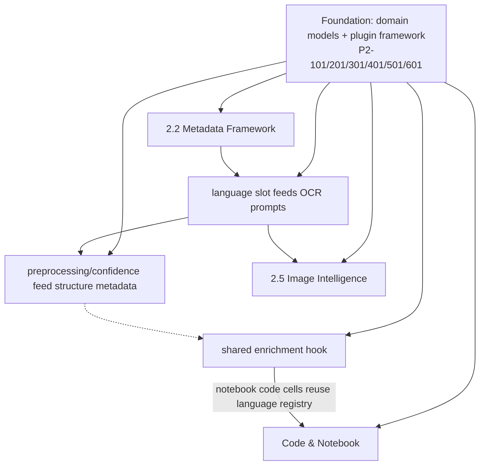

# Phase 2 – Implementation Specification

**Phase:** 2 — Document Intelligence Improvements
**Source of Truth:** `MASTER_ENGINEERING_DESIGN_DOCUMENT.md` (MEDD) — architecture unchanged.
**Prerequisite:** Phase 1 complete and approved (`4a8525e`; 432 passed, coverage 86.02%; all Phase 1 review findings closed).
**Version:** 1.3 — v1.1 incorporated Phase 2 Specification Review findings (Required R-1…R-8, Recommended C-1…C-5); v1.2 incorporated Milestone 2.4 specification review remediations; v1.3 incorporates Milestone 2.5 specification review remediations (Required F-1/F-2, Recommended R-a…R-d). See §14 Change Log. **No code is implemented by this document.**
**Status:** 🔒 **FROZEN — Engineering Baseline (2026-08-01).** Future implementation must follow this document (including the binding addenda in `docs/PHASE_2_ENGINEERING_BASELINE.md` §10) unless a formal design revision is approved per the Change Control Policy (Baseline §11).

---

## 1. Executive Summary

Phase 2 builds a **production-quality Document Intelligence layer** whose goal is to **maximize the quality and structure of extracted information before chunking, embeddings, and retrieval**. It addresses the MEDD gaps that make current notes lossy and unstructured: OCR that silently truncates, metadata that is never populated, tables that are flattened to unreadable text, images that produce empty notes, and code/notebooks that lose their structure.

The layer is delivered as **six additive milestones** (2.1 OCR Engine, 2.2 Metadata Extraction Framework, 2.3 Document Structure Analysis, 2.4 Table Intelligence, 2.5 Image Intelligence, 2.6 Code & Notebook Intelligence). Everything is built as **local-first, offline-first plugins** behind small interfaces, registered exactly like the existing processor router. No pipeline stages are added and no existing flow is reordered: extractors attach structured results to documents inside the layers that already own them (ingestion, classification, routed processing). All new dependencies are **optional** with graceful `ImportError` fallbacks (the established `openpyxl` pattern), preserving backward compatibility and fault tolerance.

**Design principles honored:** modular, extensible, plugin-based, local-first, offline-first, backward compatible, testable, performance-conscious, fault tolerant, easy to extend with future document types.

### 1.1 Current Document Intelligence Layer Inventory

Components that belong to the Document Intelligence layer today (identified by source audit):

| Component | File(s) | What it does today |
|-----------|---------|--------------------|
| PDF text + scanned-PDF detection | `app/infrastructure/ingestion/pdf_ingestor.py` | pypdf text extraction; empty-text ⇒ `scanned_pdf`; basic PDF metadata |
| Image ingestion | `app/infrastructure/ingestion/image_ingestor.py` | metadata only, `text=""` |
| CSV / spreadsheet ingestion | `csv_ingestor.py`, `spreadsheet_ingestor.py` | raw text / pipe-joined flat cells |
| Code / notebook ingestion | `code_ingestor.py`, `notebook_ingestor.py` | raw code; flattened cell text with fences |
| Classifier | `app/infrastructure/routing/classifier.py` | extension→kind map; weak stdlib MIME; flags (`requires_ocr/vision/table/code`); `language` never populated |
| Router + registry | `router.py`, `processors.py` | first-match processor selection; model routing keys |
| 20 processors | `processor_impls.py` | mostly passthrough; OCR/Handwriting/Vision use vision model; Table passthrough; Code/Notebook passthrough |
| Vision client | `app/infrastructure/llm/vision_client.py` | base64 image → Ollama vision model |
| Analysis models | `app/domain/analysis.py` (`DocumentAnalysis`, `ExtractedMetadata`) | LLM-extracted metadata; `language` default `"en"`, LLM-filled only |
| Document models | `documents.py`, `processed_document.py`, `routing.py` | `DocumentMetadata` (partial fill), `ProcessedDocument.language` (never set), `DocumentClassification.language` (never set) |
| Analysis prompt | `app/prompts/document_analysis.py` | single English, hardcoded JSON schema; no language adaptation |
| OCR / table / vision logic | `processor_impls.py` | hardcoded prompts, 5-page limit, no confidence, no preprocessing, `requires_table_extraction` dead flag |

### 1.2 What Phase 2 Delivers (map to MEDD gaps)

| Gap | Milestone | Outcome |
|-----|-----------|---------|
| G33 Image preprocessing, G34 Tesseract, Epic 8 OCR | 2.1 | Pluggable OCR engines + preprocessing + confidence |
| G15 MIME detection, G16 language detection, FR-ING-4/5/6/7/8 | 2.2 | Metadata extractor framework, MIME, language, hooks, limits |
| G14 Hierarchical structure foundation (§7.3 target) | 2.3 | `DocumentStructure` model feeding Phase 3 chunking |
| G35 Table detection, G36 Table-to-Markdown | 2.4 | Structured `Table` + Markdown rendering in notes |
| G33, G37 diagram conversion, Epic 8 | 2.5 | EXIF, preprocessing, diagram intelligence, configurable prompts |
| §7.3 code-aware chunking foundation | 2.6 | Code + notebook structure preservation |
| MEDD Phase 2 roadmap — "Email attachment parsing" | 2.2 | Email parent note + recursive ingestion of attachments as child documents (P2-208) |

**Explicitly deferred (per MEDD roadmap, not Phase 2):** NLP sentence segmentation (G12), token-aware chunking (G13), hierarchical chunk consumption (G14), BM25/RRF/retrieval (G08/G25), FAISS (G01), layout preservation (Epic 8), Docker/UI/API (Epic 7).

### 1.3 Data-flow contract for extracted structures (R-7)

Extracted structures — tables, `DocumentStructure`, code/notebook structure, `ImageInfo`, and OCR results — **attach to `ProcessedDocument` and render into the note template only**. The LLM **analysis prompt input remains the raw/OCR text plus the existing metadata fields**; no extracted structure is injected into the analysis prompt by default. This keeps prompt size bounded (no token counting until Phase 3, G02 deferred) and keeps note output the single user-visible rendering surface. A milestone author who wants structure-aware prompting must opt in via a config flag (`intelligence.structure.enrich_analysis_input: false` default; see §11.9).

---

## 2. Phase Goals

1. **Improve extraction quality**: eliminate silent truncation and flat-text loss for OCR, tables, images, and code/notebooks.
2. **Populate metadata**: fully populate `DocumentMetadata` and `ExtractedMetadata` from deterministic local extractors, not just the LLM.
3. **Language + MIME awareness**: detect language and content type locally and adapt the analysis prompt accordingly (MEDD G15/G16).
4. **Establish a plugin foundation**: every new capability is a registered plugin behind a small protocol, so Phase 3+ and future document types extend without core edits. (Scope note, review C-1: **OCR engines, metadata extractors, and table extractors are registered plugins**; image and code/notebook components are intentionally fixed, non-pluggable services — the registry is reserved for genuinely extensible kinds.)
5. **Stay local-first and backward compatible**: zero new *required* runtime dependencies; all changes additive with feature-flag defaults; all 432 existing tests remain green.
6. **Lay Phase 3 groundwork**: `DocumentStructure` with stable IDs/offsets becomes the input contract for hierarchical chunking.
7. **Keep quality gates**: coverage ≥ 80%, `ruff check` introduces no new errors, mypy introduces no new type errors.

**Success criteria (from MEDD Phase 2 / Epic 2, adapted):**
- Extensionless files with known content classified correctly (G15).
- French/German/Japanese documents detected and analyzed with appropriate language (G16).
- Pre-hook can reject a file before ingestion; post-hook can enrich after ingestion (FR-ING-5/6).
- Tables in PDFs/CSVs/spreadsheets appear as structured Markdown tables in notes (G35/G36).
- Scanned PDFs > 5 pages are OCR'd in full when configured; OCR reports per-page confidence (G34/G33 foundation).
- **Email with 3 PDF attachments produces 4 notes: 1 parent + 3 children (MEDD Epic 2 acceptance criterion, R-1).**
- `ProcessedDocument` carries structure, tables, language, image, and code/notebook intelligence with zero required-dep changes.

---

## 3. Milestones

Each milestone specifies the full engineering contract (Objective → Documentation Updates) per the Phase 2 template.

---

### Milestone 2.1 — OCR Engine

| Field | Value |
|-------|-------|
| **Executive Summary** | Extract text from scanned PDFs and images through a pluggable OCR engine. Refactors today's hardcoded vision-model path (`_ocr_extract_from_pdf`) into a `DocumentOcrService` with plugin engines (vision-model default; optional Tesseract for offline printed text), an optional image-preprocessing step, configurable page limits/zoom, per-page confidence, and diagnostics. |
| **Objective** | Maximize OCR completeness and reliability: no silent page truncation (configurable limit), an offline fallback, preprocessing for noisy images, and confidence surfaced to notes/frontmatter. |
| **Scope** | In-scope: OCR engine interface + registry; `VisionOcrEngine` (refactor of current path with page batching + retry); `TesseractOcrEngine` (optional offline plugin); preprocessing module (deskew/denoise/CLAHE, optional); PDF page-render service; OcrResult model with per-page confidence; config. Out-of-scope: layout preservation (Phase 7 per MEDD), multi-language OCR model selection (Phase 2.2 language feeds later), ML handwriting recognition. |
| **Business Value** | Scanned PDFs and handwritten notes are a primary personal-KM use case. Today pages ≥6 are silently lost and there is no offline option; OCR quality directly determines whether any downstream note is useful. |
| **Engineering Value** | Isolates the vision dependency behind a stable interface (MEDD §7.2 "coordinate between PyMuPDF, vision model, optional Tesseract"); removes 100+ lines of hardcoded logic from `processor_impls.py`; enables benchmarking and engine swap without touching processors. |
| **Current Implementation** | `_ocr_extract_from_pdf()` (`app/infrastructure/routing/processor_impls.py:71-104`): PyMuPDF render (hardcoded 2× zoom, hardcoded 5-page cap `min(len(doc), 5)`), temp PNG files, per-page `describe_image`, no confidence, no preprocessing, no retry. Vision/Handwriting processors embed their own hardcoded prompts. |
| **Problems** | Hardcoded page limit truncates long scans silently; vision-only (slow, GPU/network dependent, unavailable offline); no confidence scoring (MEDD §7.2 responsibility); no preprocessing ⇒ poor results on dark/noisy images; temp-file churn; a single failed page aborts the whole OCR pass. |
| **Target State** | `DocumentOcrService` orchestrates engines; per-page `PageOcrResult(page_no, text, confidence)`; engine selection by config; preprocessing applied before engine; failures degrade per-page with warnings; confidence flows to `ProcessedDocument` and note frontmatter. |
| **Dependencies** | Existing: `PyMuPDF>=1.24.0`, `OllamaVisionClient`. Optional (new, dev-time only unless enabled): `Pillow`, `pytesseract` + Tesseract binary. |
| **Risks** | Tesseract binary absent on Windows PATH (mitigate: clear error + `tesseract_cmd` config); vision model unavailability (mitigate: engine fallback + existing no-fallback guard preserved); OCR latency 10–30 s/page (mitigate: page limit config, batch, `pam status`-style logging); Pillow HEIC support; `pytesseract`/Pillow wheel availability on Python 3.14.6 Windows `cp314-win_amd64` (mitigate: verify at milestone start, review R-5). |
| **Complexity** | Medium. |
| **Estimated Effort** | 4–5 dev-days. |
| **Files Likely Affected** | `app/infrastructure/routing/processor_impls.py` (OCR/Handwriting/Vision processors consume service), `app/pipelines/ingest_workflow.py` (service wiring), `app/core/config.py`, `config/default.yaml`, `pyproject.toml`, `tests/unit/test_processors.py`, `tests/unit/test_ocr_engine.py` (new), `tests/integration/test_ocr_pipeline.py` (new). |
| **Classes Likely Affected** | `OCRProcessor`, `HandwritingProcessor`, `VisionProcessor`, `IngestionWorkflow`, `Settings`, `OllamaVisionClient` (minor: batch helper). |
| **Interfaces** | `class OcrEngine(Protocol): supported_kinds: set[str]; def run(self, source: Path, *, prompt: str, preprocess: bool = True) -> OcrResult`. `class DocumentOcrService: def __init__(engines: list[OcrEngine]); def register(engine); def extract(document) -> OcrResult`. |
| **Required Refactoring** | Extract `_ocr_extract`, `_ocr_extract_from_pdf`, `_looks_handwritten` into the OCR module; processors delegate to `DocumentOcrService`; remove hardcoded prompt strings into prompt/config constants for all three processors (OCR, Handwriting, Vision — R-6). No pipeline re-ordering. |
| **Public APIs** | `DocumentOcrService`, `OcrResult`, `PageOcrResult`, `get_default_ocr_service(settings)` factory. |
| **Internal APIs** | `VisionOcrEngine`, `TesseractOcrEngine`, `render_pdf_pages(pdf_path, zoom)`, `preprocess_image(path)`. |
| **Configuration Changes** | New `intelligence.ocr` block: `enabled: true`, `engine: "auto"` (auto = vision, tesseract fallback), `page_limit: 5` (0 = all), `zoom: 2.0`, `preprocess: false`, `tesseract_cmd`, `tesseract_lang: "eng"`, `confidence_threshold: 0.0`, `max_pages: 200`; `intelligence.prompts.ocr` and `intelligence.prompts.handwriting` hold the OCR/Handwriting processor prompt templates (defaults reproduce today's strings, `{language}` slot — R-6). |
| **Performance Considerations** | Page limit must bound worst case (200-page PDF cap); batching by sequential page loop with early stop on empty; preprocessing adds ≤ 300 ms/page; cache rendered page PNGs per-document temp dir; log per-page timing. |
| **Security Considerations** | Temp files use `tempfile` + `finally` unlink (existing pattern, no repo writes); size guard before render; no shell execution (Tesseract invoked via library API, not subprocess shell). |
| **Backward Compatibility** | Default `engine="auto"` with `page_limit=5` reproduces today's behavior exactly; `ProcessedDocument` gains optional `ocr: OcrResult | None`; processors keep identical `process()` signatures; existing tests untouched. |
| **Failure Modes** | Engine import missing → clear `ImportError` with install instructions (G06 pattern); page render fail → per-page `""` + warning; vision unavailable for vision-required kinds → preserved raise (current behavior); empty OCR → `confidence=0` result, document kept. |
| **Rollback Strategy** | `intelligence.ocr.enabled: false` (feature flag) restores Phase-1 in-processor behavior with zero code change; **no legacy engine value or deprecated branch is retained** (review R-4); no schema migration (additive field). |
| **Definition of Done** | Plugin registry works; both engines implemented (Tesseract optional, guarded); preprocessing applied when enabled; per-page confidence aggregated; page limit configurable incl. 0=all; all processors consume the service; tests green; no new lint errors. |
| **Acceptance Criteria** | (1) `page_limit=10` OCRs all 10 pages of a 10-page scanned PDF fixture; (2) with Tesseract installed and vision disabled, a printed-page PNG returns non-empty text offline; (3) `OcrResult` contains per-page confidence ≥ threshold values; (4) enabling preprocessing changes the image bytes sent to vision (verified via mocked client); (5) default config selects the same engine and page limit as Phase 1, and the full existing `test_processors.py` OCR suite passes unchanged (review C-5); (6) OCR/Handwriting processor prompts resolve from config with defaults byte-identical to Phase 1 (R-6). |
| **Required Unit Tests** | Engine registry + selection; page-limit (0, 5, 10) behavior; confidence aggregation; preprocessing transform applied (mock); Tesseract ImportError message when binary missing; PDF render error → per-page skip; temp files cleaned. |
| **Required Integration Tests** | End-to-end scanned-PDF fixture through `IngestionWorkflow` with mocked vision client asserting text length grows with `page_limit`; Tesseract path on a real PNG fixture (skipped if binary absent, `@pytest.mark.integration`). |
| **Required Regression Tests** | All existing `test_processors.py` (incl. `test_scanned_pdf_requires_pymupdf`), `test_processor_wiring.py`, workflow routing tests must pass unchanged. |
| **Documentation Updates** | `changelog.md`; MEDD §7.2 OCR module "current implementation" paragraph; `docs/` OCR status section (01 report §6) marked implemented; README note on optional Tesseract install. |

---

### Milestone 2.2 — Metadata Extraction Framework

| Field | Value |
|-------|-------|
| **Executive Summary** | A plugin-based metadata layer that populates `DocumentMetadata` and `ExtractedMetadata` deterministically at ingestion time, adds local MIME-type (G15) and language detection (G16), adapts the analysis prompt to detected language, and provides pre/post ingestion hooks (FR-ING-5/6) plus size/time enforcement (FR-ING-7/8). |
| **Objective** | Metadata is complete, consistent across source types, language-aware, and filterable (Phase 4 search metadata filtering depends on it). |
| **Scope** | In-scope: `MetadataExtractor` interface + registry; built-in extractors (PDF, audio, email, docx/pptx, notebook); **email attachment parsing** (MIME parse → parent email note + recursive ingestion of attachments as child documents — MEDD Phase 2 roadmap, P2-208); image/EXIF **DocumentMetadata-level fields** only (the raw EXIF read and `ImageInfo` are owned by Milestone 2.5 P2-502 — single-owner boundary, R-3); MIME detection service (stdlib + optional `python-magic` per ADR-001); language detection service (optional `py3langid` + pure-heuristic fallback); prompt adaptation; hook chain; size/time limits. Out-of-scope: metadata *search filtering* (Phase 4), remote URL timeout deep-tuning beyond defaults. |
| **Business Value** | Enables "search only PDFs from 2024" (MEDD §10), multilingual analysis, and richer notes; today `language` is never populated and most `DocumentMetadata` fields are empty for non-PDF types. |
| **Engineering Value** | One deterministic metadata path replaces per-ingestor ad-hoc code; extractors are the extension point for new document types (design principle "easy to extend"). |
| **Current Implementation** | Only `PdfIngestor` fills title/author/dates/producer; `ImageIngestor` MIME via static map; `DocumentClassification.language` and `ProcessedDocument.language` never set; `classifier.py` uses stdlib `mimetypes.guess_type`; analysis prompt is English-only; **no email ingestion or attachment parsing exists today** (R-1). |
| **Problems** | Extension-only detection misreads extensionless/renamed files; English prompts for non-English docs; metadata inconsistent; no pre/post hooks (MEDD §2.4 problems list). |
| **Target State** | Ingestion runs registered metadata extractors → merged `MetadataExtraction` → `DocumentMetadata`; classifier consults MIME service; language service populates `DocumentClassification.language`; analysis prompt includes a language instruction; hooks execute before/after `ingestor.ingest()`; emails parse into a parent document and each attachment ingests as a child document carrying `parent_id` (R-1). |
| **Dependencies** | Optional: `python-magic` (ADR-001: optional, warning-only if absent), `py3langid`. Required new: none. |
| **Risks** | `python-magic` needs libmagic DLL on Windows (mitigate: magic-number fallback table for common formats, never crash); language detection mis-classifies short/technical text (mitigate: heuristic fallback + confidence threshold); hook exceptions must not break ingestion (mitigate: per-hook try/except); `py3langid`/`python-magic` wheel availability on `cp314-win_amd64` (mitigate: verify at milestone start — review R-5); email attachment bombs / deep nesting (mitigate: `max_attachments` cap + reuse of size limit, no infinite recursion). |
| **Complexity** | Low–Medium. |
| **Estimated Effort** | 3–4 dev-days. |
| **Files Likely Affected** | `app/infrastructure/routing/classifier.py`, `app/infrastructure/ingestion/service.py`, `app/pipelines/ingest_workflow.py`, `app/core/config.py`, `app/prompts/document_analysis.py`, `app/domain/analysis.py` (minor: no schema change), `config/default.yaml`, `tests/unit/test_classifier.py`, `tests/unit/test_metadata_extraction.py` (new), `tests/integration/test_ingestion_metadata.py` (new). |
| **Classes Likely Affected** | `DocumentClassifier`, `DocumentIngestionService`, `IngestionWorkflow`, `Settings`, `build_document_analysis_user_prompt`. |
| **Interfaces** | `class MetadataExtractor(Protocol): source_types: tuple[str, ...]; def extract(self, document: SourceDocument) -> dict[str, Any]`. `class IngestionHook(Protocol): name; def pre(self, source: SourceReference) -> SourceReference; def post(self, document: SourceDocument) -> SourceDocument`. `class LanguageDetector(Protocol): def detect(self, text: str) -> tuple[str, float]`. |
| **Required Refactoring** | Add post-ingestion metadata enrichment inside `DocumentIngestionService.ingest()` (one call site); classifier gains a MIME-service consult; no flow re-ordering. |
| **Public APIs** | `MetadataExtraction`, `DocumentMetadataService`, `detect_language(text)`, `detect_mime(path)`, `register_extractor()`, `register_hook()`. |
| **Internal APIs** | Per-type built-in extractors; `_magic_fallback(path)`; `_language_heuristic(text)`. |
| **Configuration Changes** | New `intelligence.metadata` block: `extractors: "default"`, `mime_enabled: true`, `language_detection_enabled: true`, `max_file_size_mb: 50`, `url_timeout_seconds: 30`, `email_attachments: true`, `max_attachments: 20`; `hooks.pre: []`, `hooks.post: []` (plugin names). |
| **Performance Considerations** | MIME sniff ≤ 50 ms (read first 512 bytes only); language detection on first ≤ 10 KB only; extractors run once per document; hook chain short-circuits on reject. |
| **Security Considerations** | Size limit enforced before file read (disk/memory exhaustion guard, MEDD §2.4 security); URL timeout prevents slow-loris; hooks are trusted internal plugins only (no user-supplied code execution). |
| **Backward Compatibility** | All new fields additive; metadata enrichment is a superset of today's values; MIME detection never overrides an explicit ingestor match for known extensions (ADR-001). |
| **Failure Modes** | libmagic missing → warning + fallback table; detector returns low confidence → keep `"en"` + log; hook raises → logged, hook skipped, ingestion continues; file > limit → `IngestionError` before read. |
| **Rollback Strategy** | `intelligence.metadata.enabled: false` bypasses enrichment and returns Phase-1-identical documents; language/mime toggles independently disableable. |
| **Definition of Done** | Registry + ≥5 built-in extractors; MIME service with fallback; language service with fallback; prompt adaptation; hook chain with pre-reject and post-modify tests; size/time enforcement; email attachment parsing with parent/child documents (P2-208); all tests green; no new lint errors. |
| **Acceptance Criteria** | (1) Extensionless file containing Markdown is classified `markdown` via MIME; (2) French text document ⇒ `language="fr"` in classification, and the analysis user-prompt contains a respond-in-French instruction; (3) a `pre` hook rejecting >50 MB prevents ingestion; a `post` hook appends text; (4) every `DocumentMetadata` field is populated where determinable (image fields populated by 2.5's `ImageInfo` once it lands — R-3); (5) `python-magic` absent logs one warning, system still works; (6) an RFC822 email with 3 PDF attachments produces 1 parent note + 3 child notes with `parent_id` set (R-1). |
| **Required Unit Tests** | Extractor per type; MIME fallback table; language detect/fallback; prompt adaptation string; hook pre-reject/post-modify; size-limit error path; URL timeout config plumbing. |
| **Required Integration Tests** | Real `pam ingest`-equivalent on a French `.md` and a renamed extensionless file asserting metadata + prompt; hooks wired through `DocumentIngestionService`. |
| **Required Regression Tests** | `test_routing.py` extension-map loop, `test_classifier`, `test_ingestion.py`, `test_workflow_routing.py`, all existing ingestion tests pass unchanged. |
| **Documentation Updates** | `changelog.md`; MEDD §2.4 problems/goals marked addressed; ADR-001 consequence note updated; README language/MIME feature note. |

---

### Milestone 2.3 — Document Structure Analysis

| Field | Value |
|-------|-------|
| **Executive Summary** | Detect the hierarchical structure of a document (headings, sections, paragraphs, lists, code fences, blockquotes, tables) and attach a typed `DocumentStructure` to `ProcessedDocument`. This is the foundation contract for Phase 3 hierarchical chunking (MEDD G14 / §7.3) and Phase 4 parent-child retrieval. This phase's own consumer is the enrichment path itself: 2.3 validates the shared `_run_routed_processor` attachment point that 2.4/2.5/2.6 reuse (review O-4). |
| **Objective** | Preserve document structure between processing and chunking so chunk-level context and section hierarchy exist before retrieval work begins. |
| **Scope** | In-scope: `DocumentStructure`/`DocumentSection`/`DocumentBlock` models; ATX-heading hierarchy detector; block detector (paragraph, list, code fence, blockquote, markdown table); structure tree builder with char offsets and stable section IDs; enrichment into `ProcessedDocument.structure`. Out-of-scope: NLP sentence segmentation (G12, Phase 3), semantic topic segmentation, chunk consumption (Phase 3). |
| **Business Value** | Hierarchical context directly improves retrieval answers and note TOC quality; every markdown/text document becomes navigable. |
| **Engineering Value** | A stable, testable structure representation that Phase 3 consumes as a documented input; removes heading-splitting logic duplication from `SemanticChunker` (which keeps its own internal copy this phase — no behavior change). |
| **Current Implementation** | Heading split exists only inside `SemanticChunker` (`semantic_chunking.py:_split_by_headings`) as regex for chunking; no shared structure model; block-level detection absent; structure is discarded after chunking. |
| **Problems** | Structure knowledge is ephemeral and duplicated; no section IDs/offsets retained; `ProcessedDocument` carries only flat text. |
| **Target State** | After routed processing, `document.structure` is a nested `DocumentStructure` (sections with `id`, `title`, `level`, `parent_id`, `blocks`, `start_char`, `end_char`) for text-bearing kinds; structure is stored with the note/analysis and exposed for Phase 3. |
| **Dependencies** | None new (stdlib `re` + pydantic). |
| **Risks** | Regex edge cases (fenced code containing `#`, headings in HTML, list nesting); offsets drift if text is normalized elsewhere (mitigate: structure built on the exact text the pipeline will chunk). |
| **Complexity** | Low–Medium. |
| **Estimated Effort** | 3 dev-days. |
| **Files Likely Affected** | `app/domain/processed_document.py`, `app/domain/document_intelligence.py` (new), `app/infrastructure/document_intelligence/structure/detector.py` (new), `app/infrastructure/document_intelligence/__init__.py` (new), `app/pipelines/ingest_workflow.py` (enrichment hook), `tests/unit/test_structure_analysis.py` (new). |
| **Classes Likely Affected** | `ProcessedDocument` (additive field), `IngestionWorkflow._run_routed_processor`, new `StructureAnalyzer`. |
| **Interfaces** | `class StructureAnalyzer: def analyze(self, text: str, source: str) -> DocumentStructure`. `DocumentStructure` holds `sections: list[DocumentSection]`. |
| **Required Refactoring** | None to existing components; enrichment call is additive inside `_run_routed_processor` after processor success. |
| **Public APIs** | `analyze_document_structure(text, source)`, `StructureAnalyzer`, `DocumentStructure`, `DocumentSection`, `DocumentBlock`. |
| **Internal APIs** | `_detect_headings(lines)`, `_detect_blocks(text, ranges)`, `_build_tree(sections)`. |
| **Configuration Changes** | `intelligence.structure.enabled: true` (additive, cheap). |
| **Performance Considerations** | Single linear scan with a hand-rolled line classifier; O(n) time, O(n) memory; no external calls; skip for binary-extracted text if > 5 MB. |
| **Security Considerations** | None (pure text parsing, no I/O). |
| **Backward Compatibility** | `ProcessedDocument.structure` defaults `None`; chunker untouched this phase; notes render unchanged. |
| **Failure Modes** | Malformed/mixed markup → best-effort tree, never raise; degenerate input (empty text) → empty structure. |
| **Rollback Strategy** | `structure.enabled: false`; field is optional so all consumers must null-check. |
| **Definition of Done** | Models, detector, builder, enrichment, tests, offsets verified against sample docs. |
| **Acceptance Criteria** | (1) Nested ATX headings produce correct parent/child hierarchy; (2) code fences and fenced headings are not mis-split; (3) blocks (paragraph/list/fence/table) detected with accurate `start_char`/`end_char`; (4) `ProcessedDocument.structure` populated for markdown/text kinds when enabled; (5) chunker behavior byte-identical (regression). |
| **Required Unit Tests** | Heading hierarchy; fence vs heading disambiguation; list/paragraph/blockquote detection; offset accuracy on a fixture; empty/invalid input; nested-depth cap. |
| **Required Integration Tests** | Markdown + text file through `IngestionWorkflow` asserting `document.structure` non-empty and stable section IDs. |
| **Required Regression Tests** | All chunking tests (`test_knowledge_engine.py` overlap suite, `test_text_preprocessing.py`) pass unchanged. |
| **Documentation Updates** | `changelog.md`; MEDD §7.3 chunking "target architecture" input contract section; note template docs if TOC uses structure later (not this phase). |

---

### Milestone 2.4 — Table Intelligence

| Field | Value |
|-------|-------|
| **Executive Summary** | Extract structured tables from CSV/TSV, spreadsheets, and PDFs into a typed `Table` model and render them as proper Markdown tables in notes (MEDD G35/G36). Activates the currently-dead `requires_table_extraction` classifier flag. |
| **Objective** | Tables — the most information-dense content — become readable, structured, and retrievable instead of jumbled flat text. |
| **Scope** | In-scope: `Table`/`TableCell`/`TableRow`/`TableHeader` models; `TableExtractor` plugin interface; CSV extractor; spreadsheet extractor (openpyxl, multi-sheet, merged-cell flatten); PDF table extractor (default `pdfplumber` pure-Python impl; optional `camelot` plugin); Markdown renderer; wiring of `requires_table_extraction` through classifier → enrichment (no router change — the flag and `kind` both travel on the existing `DocumentClassification`); integration into note generation. PDF extraction triggers on the **existing** classifier `kind == "pdf"` (already produced by the classifier's `EXTENSION_KIND_MAP`); no new routing conditions are invented. Out-of-scope: table embeddings/search (MEDD §14 phase 4+), formula-aware cells. |
| **Business Value** | "Find the table about model benchmarks" becomes possible; notes stop losing column semantics. |
| **Engineering Value** | Plugins for each source format behind one interface; renderer reusable by note generation and future export paths. |
| **Current Implementation** | `TableProcessor` is `_passthrough`; `CSVIngestor` returns raw text; `SpreadsheetIngestor` returns pipe-joined rows; `requires_table_extraction` is set by the classifier (`classifier.py:94`) but consumed nowhere; PDF tables are jumbled by pypdf text extraction. |
| **Problems** | Flat text loses header/row/column meaning; no Markdown tables in notes; dead flag indicates incomplete wiring (found in Phase 1 review). |
| **Target State** | Tables detected per-format, normalized, rendered as `| col | col |` Markdown blocks in the enriched document and note; when no table is found, current flat text is kept. |
| **Dependencies** | Required: `openpyxl` (declared in core `dependencies` — already a hard runtime import of `spreadsheet_ingestor.py`; **must be declared in `pyproject.toml` core dependencies as part of this milestone**, R4). Optional: `pdfplumber` (default PDF engine), `camelot` (optional plugin). Existing: `PyMuPDF`, `pypdf`. Note: defaulting to pdfplumber deviates from MEDD G35's named tool (Camelot/Tabula); the decision is recorded as ADR-002 (§13, review R-8). |
| **Risks** | PDF table detection accuracy varies by layout (borderless tables); camelot's Windows dependency weight; merged cells lose data if not flattened carefully; note output changes are user-visible. |
| **Complexity** | Medium (PDF path), Low (CSV/spreadsheet). |
| **Estimated Effort** | 4–5 dev-days. |
| **Files Likely Affected** | `app/infrastructure/routing/processor_impls.py` (`TableProcessor` → `_SpreadsheetTableExtractor`/`_PdfTableExtractor` delegation), `app/domain/document_intelligence.py` (Table models), `app/infrastructure/document_intelligence/tables/` (new: `extractor.py`, `render.py`), `app/pipelines/ingest_workflow.py`, `app/templates/obsidian_note.py` (render tables in note body), `config/default.yaml`, `pyproject.toml` (openpyxl core dep — R4), `tests/unit/test_table_intelligence.py` (new), `tests/integration/test_table_pipeline.py` (new). No router change (C3). |
| **Classes Likely Affected** | `TableProcessor`, `IngestionWorkflow`, `ObsidianMarkdownGenerator`, `DocumentClassifier` (already emits `kind` + `requires_table_extraction` — read-only). |
| **Interfaces** | `class TableExtractor(Protocol): source_kinds: set[str]; def extract(self, document: SourceDocument) -> list[Table]`. `class MarkdownTableRenderer: def to_markdown(self, table: Table) -> str`. `class Table` (title, header: `TableHeader`, rows: `list[TableRow]`, source_position); `TableHeader` and `TableRow` wrap `list[TableCell]`. |
| **Required Refactoring** | Replace `TableProcessor._passthrough` with table-aware enrichment; classifier flag consumed by the enrichment stage (gated on `kind` in {"csv","spreadsheet","database","pdf"}; no router change — C3); note generator gains an optional tables section (renders Markdown). |
| **Public APIs** | `extract_tables(document)`, `TableExtractor`, `MarkdownTableRenderer`, `Table`. |
| **Internal APIs** | `_CsvTableExtractor`, `_SpreadsheetTableExtractor`, `_PdfTableExtractor`, `_flatten_merged_cells`. |
| **Configuration Changes** | `intelligence.tables` block: `enabled: true`, `pdf_engine: "pdfplumber"`, `max_rows: 200`, `max_cols: 30`, `header_sniffing: true`, `min_confidence: 0.5` (consumed by the PDF extractor to discard low-confidence candidate lines, default pdfplumber `table_settings` tuning — no `Table.confidence` field needed; C1). |
| **Performance Considerations** | pdfplumber PDF parsing is the slowest step (~1–5 s per table page); cap pages scanned for tables (reuse OCR page budget); spreadsheet **extractor** loads the workbook non-read-only (`read_only=False`, `data_only=True`) so `merged_cells.ranges` is available (R1), bounded by `max_file_size_mb: 50` + `max_rows: 200`/`max_cols: 30`; the ingestor's flat-text pass keeps the existing read-only pattern. |
| **Security Considerations** | PDF parsing of untrusted files: pdfplumber/camelot are pure parsing libs (no JS/network); zip-bomb-style spreadsheets guarded by size limit + row cap. |
| **Backward Compatibility** | Notes change **only** when `tables.enabled=true` and a table is detected; CSV/spreadsheet without detected tables keep current flat text; tables attach to `document.metadata.extra["tables"]` (M2.3 R-1 precedent — no new `ProcessedDocument.tables` field; C5). Default `enabled: true` is a **reviewed, changelogged user-visible behavior change** (notes gain Markdown tables when tables are detected); recorded in `changelog.md` and the completion report per the Phase 1 latency-metric precedent (C-2). |
| **Failure Modes** | PDF engine import missing → warning + flat-text fallback (no crash); malformed CSV → best-effort parse, error row retained; camelot missing → falls back to pdfplumber; renderer escaping broken (careful: `|` and newlines in cells must be escaped). |
| **Rollback Strategy** | `intelligence.tables.enabled: false` restores Phase-1 note output exactly. |
| **Definition of Done** | Models, 3 extractors, renderer with escaping tests, flag consumed, note rendering, tests green, no new lint errors. |
| **Acceptance Criteria** | (1) CSV fixture → valid Markdown table with header row, `source_position` carrying row provenance (O3); (2) multi-sheet `.xlsx` → per-sheet tables with merged cells flattened; (3) PDF fixture with a ruled table → Markdown table via pdfplumber (integration, optional engine); (4) `requires_table_extraction` flag now reaches the enrichment stage (wiring test); (5) no-table inputs render exactly as Phase 1. |
| **Required Unit Tests** | CSV parser + header sniffing; spreadsheet multi-sheet + merged cells; Markdown renderer escaping (`\|`, newlines, alignment); row/col caps; flag→enrichment wiring (gated on `kind`, incl. `pdf`); no-table fallback. |
| **Required Integration Tests** | End-to-end CSV through `IngestionWorkflow` → note contains a `| ... |` table; PDF table path marked `integration`. |
| **Required Regression Tests** | `test_processors.py` table cases, `test_routing.py` (extension map unchanged), `test_ingestion.py` CSV/spreadsheet, note-generation tests (`test_document_intelligence.py`, `test_obsidian_note_generation.py`) updated only where table section is additive. |
| **Documentation Updates** | `changelog.md`; MEDD §14 table intelligence status; 01 report §8 marked implemented; README table support note. |

---

### Milestone 2.5 — Image Intelligence

| Field | Value |
|-------|-------|
| **Executive Summary** | Extract maximum information from images: EXIF/IPTC metadata, dimension/format info, optional preprocessing before vision OCR (G33), diagram intelligence (.drawio/.mmd → Mermaid/structured description, G37 foundation), multi-image documents, and configurable vision prompts. |
| **Objective** | Images — screenshots, photos, diagrams — produce rich, structured notes instead of near-empty passthrough. |
| **Scope** | In-scope: `ImageInfo` model; EXIF extractor (Pillow) — **single owner of the raw EXIF read**, consumed by 2.2's `DocumentMetadata`-level image fields (R-3); preprocessing service in the **shared `imaging/preprocess.py` module** reused by 2.1 (R-3); diagram parser for `.drawio` (XML → Mermaid skeleton) and `.mmd` passthrough; prompt config (remove hardcoded prompts); size/dimension guards; multi-image (PDF-with-images) handling **gated on the existing classifier condition `kind == "pdf"` via a self-contained `_enrich_images` helper at the shared P2-305 call site — no invented routing conditions (M2.4 review R2 precedent)**. Out-of-scope: full layout preservation, Tesseract-on-images tuning (covered by 2.1 engine), vectorization/vision-heavy diagram semantic understanding. |
| **Business Value** | Real-world photos are poorly OCR'd today; screenshots/diagrams are core knowledge artifacts; empty image notes are a visible quality gap. |
| **Engineering Value** | Reuses OCR preprocessing (2.1) and metadata framework (2.2); prompts move to config enabling per-kind tuning without code. |
| **Current Implementation** | `ImageIngestor` returns `text=""` with static MIME map; `VisionProcessor` does one blind vision pass with a hardcoded prompt; no EXIF; `.drawio` treated as generic text/diagram via `DiagramProcessor` passthrough. |
| **Problems** | No preprocessing ⇒ poor OCR on dark/rotated/compressed photos; EXIF (date, GPS, camera) lost; diagrams appear as raw XML; prompts not configurable (MEDD §7 current state + 01 report §7 limitations). |
| **Target State** | `ImageIngestor` yields metadata-rich `SourceDocument`; enrichment attaches `ImageInfo`; preprocessing (deskew/denoise/CLAHE) applied before vision when enabled; `.drawio` → Mermaid skeleton or structured description; vision prompt from the shared `intelligence.prompts.vision` block with `{language}` slot (R-6). |
| **Dependencies** | Optional: `Pillow` (image ops). Existing: vision client, PyMuPDF. |
| **Risks** | Pillow HEIC/format support gaps (mitigate: error per-format, keep metadata-only fallback); preprocessing changes can degrade OCR (mitigate: toggles + unit-tested transforms); EXIF missing on screenshots (mitigate: nullable). |
| **Complexity** | Medium. |
| **Estimated Effort** | 4 dev-days. |
| **Files Likely Affected** | `app/infrastructure/ingestion/image_ingestor.py`, `app/infrastructure/routing/processor_impls.py` (`VisionProcessor`, `DiagramProcessor`), `app/infrastructure/document_intelligence/images/` (new: `metadata.py`, `diagram.py`, `multi.py`), `app/infrastructure/document_intelligence/imaging/preprocess.py` (shared with 2.1 — R-3), `app/domain/document_intelligence.py` (`ImageInfo`), `app/core/config.py`, `config/default.yaml`, `tests/unit/test_image_intelligence.py` (new), `tests/integration/test_image_pipeline.py` (new). |
| **Classes Likely Affected** | `ImageIngestor`, `VisionProcessor`, `DiagramProcessor`, `Settings`. |
| **Interfaces** | `class ImageAnalyzer: def analyze(self, path: Path) -> ImageInfo`. `class Preprocessor: def process(self, path: Path) -> Path` (returns temp processed path; implemented once in shared `imaging/preprocess.py` — R-3). `class DiagramParser: def parse(self, path: Path) -> str` (Mermaid). |
| **Required Refactoring** | `ImageIngestor` gains EXIF/metadata extraction; `VisionProcessor` consumes preprocessor + config prompt; `DiagramProcessor` delegates to diagram parser. |
| **Public APIs** | `analyze_image(path)` (thin module function delegating to `ImageAnalyzer.analyze`), `preprocess_image(path)` (delegates to the shared `Preprocessor`), `drawio_to_mermaid(path)` (delegates to `DiagramParser.parse`), `ImageInfo`. |
| **Internal APIs** | `_read_exif(img)`, `_dimensions`, `_normalize_format`. |
| **Configuration Changes** | `intelligence.images` block: `preprocess: false`, `exif_enabled: true`, `diagram_enabled: true`, `max_dimensions: [8192, 8192]`, `max_bytes: 20MB`; the vision prompt template lives in the shared `intelligence.prompts.vision` block (with `{language}` slot) per R-6 — no hardcoded string is re-introduced here. **Preprocess toggle ownership:** `intelligence.images.preprocess` governs the image-analysis path (pre-processing before `VisionProcessor`); the pre-existing `intelligence.ocr.preprocess` (P2-104) governs the OCR-engine path. Both consume the same shared `imaging/preprocess.py` module — one implementation, two toggles (R-3). **`max_dimensions`/`max_bytes` are the single source of truth for the P2-503 dimension/size guards, superseding the module's fixed `MAX_EDGE = 8000` constant.** |
| **Performance Considerations** | Preprocessing bounded (max dimensions guard prevents decompression bombs); EXIF read is cheap; diagram XML parse capped by file size; no thumbnail generation this phase. |
| **Security Considerations** | Pillow decompression-bomb guards via `Image.MAX_IMAGE_PIXELS` + size checks; EXIF GPS not written to notes verbatim by default. |
| **Backward Compatibility** | `SourceDocument.text` for images may gain extracted alt/description text only when enabled; note output for images remains vision-derived (unchanged default); `ImageInfo` additive. |
| **Failure Modes** | Unreadable/corrupt EXIF → `None` fields, no crash; preprocessing error → original image used + warning; diagram parse fail → raw text fallback; vision unavailable → existing guarded raise preserved. |
| **Rollback Strategy** | Per-feature toggles (`preprocess`, `exif_enabled`, `diagram_enabled`, `prompt` revert) restore Phase-1 behavior. |
| **Definition of Done** | `ImageAnalyzer`, `Preprocessor` (shared module), `DiagramParser`, prompt config, wiring, tests green, no new lint errors. |
| **Acceptance Criteria** | (1) JPEG with EXIF → `ImageInfo` carries dimensions/date/camera; (2) preprocessing toggle causes different bytes sent to mocked vision client; (3) a `.drawio` fixture → Mermaid skeleton that passes a Mermaid syntax guard (or fixed fixture comparison) — review C-5; (4) vision prompt comes from config (change a word, assert it propagates) **and `{language}` substitution lands the detected language into the OCR/vision prompt** (R-6 base is already landed in M2.1; P2-505's delta is the `{language}` call-site wiring per P2-205); (5) corrupt image returns metadata-only doc, pipeline continues. |
| **Required Unit Tests** | EXIF extraction; dimension/format; preprocessor transforms applied (deskew angle test on synthetic 5°-rotated image); drawio→mermaid; corrupt image resilience; prompt templating with `{language}`. |
| **Required Integration Tests** | Real photo fixture through `IngestionWorkflow` with mocked vision asserting `ImageInfo` + prompt content; marked `integration` for Tesseract-free envs. |
| **Required Regression Tests** | `test_processors.py` VisionProcessor cases, `test_routing.py`, image ingestion tests pass unchanged. |
| **Documentation Updates** | `changelog.md`; MEDD Epic 8/G33 status; 01 report §7 marked implemented; README image preprocessing note. |

---

### Milestone 2.6 — Code & Notebook Intelligence

| Field | Value |
|-------|-------|
| **Executive Summary** | Preserve the structure of code files and Jupyter notebooks: extract imports, functions, classes, and docstrings (AST-based for Python, heuristic for others), and model notebooks as ordered typed cells (markdown/code with execution counts and separated outputs) instead of flattened text. |
| **Objective** | Code and notebooks become structured, queryable, and chunk-friendly — the foundation for MEDD §7.3 "code-aware chunking" in Phase 3. |
| **Scope** | In-scope: `CodeStructure` model (language, imports, functions, classes, docstrings, char ranges); per-file language detection + grammar registry; Python AST parser; heuristic fallback parser for other languages; `NotebookStructure` model (cells: id, type, source, outputs, execution_count); notebook ingestor upgrade; enrichment into `ProcessedDocument`. Out-of-scope: tree-sitter or ML code parsing; execution of notebook cells; output rendering beyond presence flags. |
| **Business Value** | Notebooks/code are dense knowledge artifacts; current flattening mixes prose, code, and huge outputs, degrading analysis and retrieval. |
| **Engineering Value** | Language registry is a clean extension point; AST fallback keeps zero required deps; structure feeds Phase 3 chunking and future code search. |
| **Current Implementation** | `CodeProcessor` passthrough; `NotebookIngestor` flattens cells into text with ` ```python ` fences and concatenated outputs; no code language detection beyond extension mapping in `extensions.py`. |
| **Problems** | No function/class/import granularity; outputs (often huge/HTML) pollute analysis prompts; cell structure irreversibly lost before the LLM. |
| **Target State** | `ProcessedDocument` carries `code_structure`/`notebook_structure`; enriched markdown separates prose, code, and outputs; cell-level metadata retained for Phase 3 chunking. |
| **Dependencies** | None new required (`ast` stdlib). |
| **Risks** | AST fails on syntax-invalid files (mitigate: fallback to heuristic); heuristic mis-parse on exotic languages (mitigate: degrade to line-based); notebook JSON schema drift (mitigate: tolerant parsing). |
| **Complexity** | Medium. |
| **Estimated Effort** | 3–4 dev-days. |
| **Files Likely Affected** | `app/infrastructure/ingestion/notebook_ingestor.py`, `app/infrastructure/routing/processor_impls.py` (`CodeProcessor`, `NotebookProcessor`), `app/infrastructure/document_intelligence/code/` (new: `model.py`, `parser.py`, `languages.py`, `notebook.py`), `app/domain/document_intelligence.py` (`CodeStructure`, `NotebookStructure`), `app/pipelines/ingest_workflow.py`, `config/default.yaml`, `tests/unit/test_code_intelligence.py` (new), `tests/unit/test_notebook_ingestor.py` (extend), `tests/integration/test_code_pipeline.py` (new). |
| **Classes Likely Affected** | `NotebookIngestor`, `CodeProcessor`, `NotebookProcessor`, `IngestionWorkflow`. |
| **Interfaces** | `class CodeParser(Protocol): languages: frozenset[str]; def parse(self, text: str, filename: str) -> CodeStructure`. `class NotebookParser: def parse(self, raw: dict) -> NotebookStructure` where `raw` is the full notebook dict (output of `json.loads`); parser extracts `cells`, `metadata.kernelspec`, and `metadata.language_info` internally. |
| **Required Refactoring** | `NotebookIngestor` upgrades to **Option 2**: `NotebookIngestor.ingest()` calls `NotebookParser.parse(raw)` and attaches the result to `metadata.extra["notebook_structure"]` (consistent with how `PdfIngestor` populates `metadata.extra["page_count"]`); processors remain passthrough and structure attachment happens in a new `_enrich_code()` method at the P2-305 shared hook. |
| **Public APIs** | `parse_code(text, filename)`, `parse_notebook(raw)`, `CodeStructure`, `NotebookStructure`, `NotebookCell`. |
| **Internal APIs** | `_AstCodeParser`, `_HeuristicCodeParser`, `_language_from_filename`. |
| **Configuration Changes** | `intelligence.code` block added to `IntelligenceSettings` and `default.yaml`: `CodeSettings(enabled: bool = True, languages: Literal["default"] = "default", max_cell_outputs: int = 10, max_code_chars: int = 100000, include_docstrings: bool = True)`. `"default"` means the built-in `extensions.py` suffix-to-language mapping; other values not supported in M2.6 (extensibility deferred). `max_code_chars` is Python `str` length; files exceeding this are truncated with a logged warning. |
| **Performance Considerations** | AST is fast (< 50 ms for 100 KB); heuristic parsers line-based O(n); notebook cell outputs capped at `max_cell_outputs` during `NotebookParser.parse()` — entries beyond the cap are replaced with a `[truncated]` marker; `max_code_chars` truncates oversized code at parse time. |
| **Security Considerations** | AST is read-only parse (no `exec`/`eval` — critical); cell output sizes capped; untrusted JSON handled by tolerant parsing. |
| **Backward Compatibility** | Notebook text output may reorder/render differently only when `intelligence.code.enabled=true` (default true after review); empty-output cells trimmed; `ProcessedDocument` fields additive. Default `enabled: true` is a **reviewed, changelogged user-visible behavior change** (enriched notebook/code notes when structure is detected); recorded in `changelog.md` and the completion report per the Phase 1 precedent (review C-2). |
| **Failure Modes** | Syntax error → heuristic fallback; language unknown → generic text structure; notebook parse error → existing `IngestionError` path preserved; AST timeout not applicable (pure CPU, bounded size). |
| **Rollback Strategy** | `intelligence.code.enabled: false` restores Phase-1 notebook flattening and code passthrough. |
| **Definition of Done** | Models, AST + heuristic parsers, language registry, notebook parser, ingestor/processor wiring, tests green, no new lint errors. Phase 3 concern: analysis prompt no longer contains megabyte-scale outputs (requires DocumentAIProcessor prompt construction — M2.6 attaches the structure; Phase 3 consumes it). |
| **Acceptance Criteria** | (1) Python file → structure lists imports/functions/classes with offsets and docstrings; (2) invalid-Python file → heuristic structure, no crash; (3) `.ipynb` fixture → ordered cells with types and execution counts, outputs capped at `max_cell_outputs` during `NotebookParser.parse()` (entries beyond the cap replaced with `[truncated]` marker); (4) non-Python file → line-based fallback. |
| **Required Unit Tests** | AST parsing; heuristic fallback; language registry lookup; notebook cell model + caps; output trimming; docstring extraction; invalid-syntax resilience. |
| **Required Integration Tests** | Real `.py` and `.ipynb` fixtures through `IngestionWorkflow` asserting attached structures; marked `integration` where notebook fixtures need building. |
| **Required Regression Tests** | Existing `test_notebook_ingestor` and code ingestion tests updated/additive; `test_ingestion.py`, `test_routing.py` extension maps unchanged. |
| **Documentation Updates** | `changelog.md`; MEDD §7.3 future-work code-aware chunking status; 01 report code/notebook status; README note. |

---

## 4. Task Breakdown

Conventions: **Difficulty** = Trivial / Low / Medium / High. **Risk** = L / M / H (likelihood/impact of *the task* failing). Files use short paths under `app/`, `config/`, `tests/`.

**Optional-dependency DoD clause (review C-3):** every task that adds an optional dependency states in its DoD *"with the dependency absent, the task degrades to <X> with a logged warning"*. Applies to P2-104, P2-405, P2-502, P2-503 (Pillow, pytesseract, pdfplumber/camelot).

### 4.1 Milestone 2.1 — OCR Engine

| ID | Title | Priority | Deps | Difficulty | Time | Risk | Files Expected To Change | Acceptance Criteria | Definition of Done |
|----|-------|----------|------|------------|------|------|--------------------------|---------------------|--------------------|
| P2-101 | OCR plugin interface + registry | P0 | — | Low | 0.5 d | L | `infrastructure/document_intelligence/ocr/__init__.py`, `base.py` (new) | `OcrEngine` protocol + `DocumentOcrService.register/select/extract` with empty-engines error | Interface reviewed, unit-tested, no behavior change |
| P2-102 | `VisionOcrEngine` (refactor of current path) | P0 | P2-101 | Medium | 1 d | M | `ocr/engines.py`, `routing/processor_impls.py` | Extracts same text as Phase 1 for ≤5 pages; page limit now configurable; temp files cleaned | All `test_processors.py` OCR tests pass unchanged |
| P2-103 | PDF page-render service | P0 | P2-101 | Low | 0.5 d | L | `ocr/pdf.py` (new) | `render_pdf_pages()` returns per-page PNG bytes with configurable zoom/limit; render failure → per-page error not abort | Unit tests, no temp-file leaks |
| P2-104 | Image preprocessing pipeline (shared module) | P1 | P2-102 | Medium | 1 d | M | `imaging/preprocess.py` (new, shared with 2.5 — R-3), `config/default.yaml` | Deskew/denoise/CLAHE transforms applied when enabled; original preserved on error | Transform unit tests; toggle default off; absent-Pillow DoD: skip preprocessing with logged warning (C-3) |
| P2-105 | `TesseractOcrEngine` (optional) | P1 | P2-101 | Medium | 1 d | M | `ocr/engines.py`, `pyproject.toml` (optional extra) | Installed → offline printed-text OCR; absent → clear `ImportError` (G06 pattern) | Optional-dep test guarded by import; offline path proven |
| P2-106 | Confidence + diagnostics | P1 | P2-102 | Low | 0.5 d | M | `ocr/models.py` (new), `processor_impls.py` | `OcrResult` carries per-page confidence; empty/low-confidence pages flagged in logs | Unit tests for aggregation |
| P2-107 | Processor integration | P0 | P2-102, P2-106 | Medium | 1 d | H | `processor_impls.py` (`OCRProcessor`, `HandwritingProcessor`, `VisionProcessor`), `ingest_workflow.py` | All three processors consume `DocumentOcrService`; vision-required no-fallback guard preserved; hardcoded OCR/Handwriting prompts moved to `intelligence.prompts.*` (R-6) | Wiring tests; full suite green |
| P2-108 | OCR config + engine selection | P0 | P2-102–107 | Low | 0.5 d | L | `core/config.py`, `config/default.yaml`, `cli` (doctor hint) | `intelligence.ocr.engine="auto"` picks vision, falls back to Tesseract; per-page limit works | Config tests; default reproduces Phase 1 |

### 4.2 Milestone 2.2 — Metadata Extraction Framework

| ID | Title | Priority | Deps | Difficulty | Time | Risk | Files Expected To Change | Acceptance Criteria | Definition of Done |
|----|-------|----------|------|------------|------|------|--------------------------|---------------------|--------------------|
| P2-201 | Metadata extractor interface + registry | P0 | — | Low | 0.5 d | L | `infrastructure/document_intelligence/metadata/` (new), `domain/document_intelligence.py` | `MetadataExtractor` protocol; `register()`; merge into `DocumentMetadata` | Interface tested; no ingestion behavior change yet |
| P2-202 | Built-in extractors (pdf/audio/email/docx/pptx/notebook) | P0 | P2-201 | Medium | 1 d | M | `metadata/extractors.py` (new), `ingestion/pdf_ingestor.py` (move logic) | Each type fills title/author/dates/page_count/mime deterministically; image `DocumentMetadata` fields consumed from 2.5's `ImageInfo` when present — no second EXIF reader (R-3) | Per-type unit tests |
| P2-203 | MIME detection service (G15) | P0 | — | Low | 0.5 d | M | `metadata/mime.py` (new), `routing/classifier.py` | Extensionless markdown detected via magic bytes; `python-magic` absent → fallback + warning | Fallback table tests; ADR-001 respected |
| P2-204 | Language detection service (G16) | P0 | — | Low | 0.5 d | M | `metadata/language.py` (new) | `py3langid` optional; heuristic fallback; confidence threshold → default `"en"` | Language tests (fr/de/ja) |
| P2-205 | Language propagation + prompt adaptation | P0 | P2-204 | Low | 0.5 d | M | `routing/classifier.py`, `prompts/document_analysis.py`, `ingest_workflow.py` | `classification.language` + `ProcessedDocument.language` set; user prompt gains respond-in-`{language}` | Unit tests for prompt string |
| P2-206 | Hook chain (pre/post) + limits (FR-ING-5/6/7/8) | P1 | P2-201 | Medium | 1 d | M | `ingestion/service.py`, `metadata/hooks.py` (new), `core/config.py` | Pre-hook rejects >50 MB; post-hook modifies text; hook errors don't break ingestion | Hook + size-limit tests |
| P2-207 | Metadata enrichment wiring in ingestion service | P0 | P2-202, P2-206 | Low | 0.5 d | M | `ingestion/service.py`, `config/default.yaml` | `DocumentIngestionService.ingest()` runs extractors + hooks; result metadata superset of Phase 1 | Integration test on real files |
| P2-208 | Email attachment parsing (recursive ingestion) | P1 | P2-202, P2-207 | Medium | 1 d | M | `ingestion/email_ingestor.py` (new), `ingestion/service.py`, `ingest_workflow.py`, `domain/processed_document.py` (`parent_id`) | RFC822 email → parent note; each attachment ingested as a child document with `parent_id`; 3-PDF-attachment email → 4 notes (MEDD Epic 2 AC, R-1) | Email fixture tests (RFC822 + attachments); `max_attachments` cap test; no infinite recursion |

### 4.3 Milestone 2.3 — Document Structure Analysis

| ID | Title | Priority | Deps | Difficulty | Time | Risk | Files Expected To Change | Acceptance Criteria | Definition of Done |
|----|-------|----------|------|------------|------|------|--------------------------|---------------------|--------------------|
| P2-301 | Structure domain models | P0 | — | Low | 0.5 d | L | `domain/document_intelligence.py` | `DocumentStructure`, `DocumentSection`, `DocumentBlock` with IDs, levels, parent ids, offsets | Model round-trip tests |
| P2-302 | Heading hierarchy detector | P0 | P2-301 | Medium | 1 d | M | `structure/detector.py` (new) | Nested ATX headings → correct tree; fenced `#` not mis-split | Hierarchy tests |
| P2-303 | Block detector (paragraph/list/fence/blockquote/table) | P0 | P2-301 | Medium | 1 d | M | `structure/detector.py` | Blocks typed with accurate char offsets | Block-type tests |
| P2-304 | Structure tree builder | P0 | P2-302, P2-303 | Low | 0.5 d | L | `structure/detector.py` | Sections contain blocks; offsets contiguous; degenerate input → empty tree | Builder tests |
| P2-305 | Enrichment into `ProcessedDocument` | P0 | P2-304 | Low | 0.5 d | M | `domain/processed_document.py`, `ingest_workflow.py` | `document.structure` populated for text-bearing kinds when enabled | Wiring test |
| P2-306 | Performance + cap guard | P1 | P2-305 | Low | 0.25 d | L | `structure/detector.py`, `core/config.py` | Skip >5 MB text; O(n) timing test | Timing unit test |

### 4.4 Milestone 2.4 — Table Intelligence

| ID | Title | Priority | Deps | Difficulty | Time | Risk | Files Expected To Change | Acceptance Criteria | Definition of Done |
|----|-------|----------|------|------------|------|------|--------------------------|---------------------|--------------------|
| P2-401 | Table domain model | P0 | — | Low | 0.25 d | L | `domain/document_intelligence.py` | `Table`, `TableCell`, `TableRow`, `TableHeader` | Model tests |
| P2-402 | `TableExtractor` interface + registry | P0 | P2-401 | Low | 0.25 d | L | `tables/extractor.py` (new) | Register/select per source kind; empty registry handled | Interface test |
| P2-403 | CSV/TSV extractor + header sniffing | P0 | P2-402 | Low | 0.5 d | M | `tables/extractor.py` | Parses delimiters, sniffs header row, type-hints cells | CSV tests incl. quoted/escaped |
| P2-404 | Spreadsheet extractor (multi-sheet, merged cells) | P0 | P2-402 | Medium | 1 d | M | `tables/extractor.py`, `ingestion/spreadsheet_ingestor.py`, `pyproject.toml` (declare openpyxl core dep — R4) | Per-sheet tables; merged cells flattened (value propagated); workbook loaded non-read-only (`read_only=False`, `data_only=True`) so `merged_cells.ranges` is available; row cap enforced | xlsx fixture tests (multi-sheet + merged-cell fixture) |
| P2-405 | PDF table extractor (pdfplumber default, camelot optional) | P1 | P2-402 | High | 1.5 d | H | `tables/extractor.py`, `pyproject.toml` | Ruled-table PDF → Markdown table; engine missing → flat fallback + warning | PDF fixture test (integration-gated) |
| P2-406 | Markdown renderer + wiring (flag + note rendering) | P0 | P2-305, P2-403–405 | Medium | 1 d | M | `tables/render.py` (new), `processor_impls.py`, `templates/obsidian_note.py`, `ingest_workflow.py` | `\|`/newline escaping; `requires_table_extraction` consumed; PDF tables trigger on existing `kind == "pdf"`; note shows tables; no-table inputs unchanged | Escaping + wiring tests; golden-file test for CSV→Markdown rendering (committed fixture + expected output — C-4); regression suite |

### 4.5 Milestone 2.5 — Image Intelligence

| ID | Title | Priority | Deps | Difficulty | Time | Risk | Files Expected To Change | Acceptance Criteria | Definition of Done |
|----|-------|----------|------|------------|------|------|--------------------------|---------------------|--------------------|
| P2-501 | `ImageInfo` model | P0 | — | Low | 0.25 d | L | `domain/document_intelligence.py` | Dimensions, format, EXIF subset, nullable fields | Model tests |
| P2-502 | EXIF/metadata extractor (single owner) | P0 | P2-501 | Low | 0.5 d | M | `images/metadata.py` (new), `ingestion/image_ingestor.py` | JPEG EXIF → date/camera/GPS-not-by-default; corrupt EXIF → None; sole raw-EXIF reader — 2.2 consumes it, no duplicate (R-3) | EXIF fixture tests; absent-Pillow DoD: metadata-only doc + logged warning (C-3) |
| P2-503 | Preprocessing service (shared with 2.1) | P0 | P2-104 | Low | 0.25 d | L | `imaging/preprocess.py` (shared module — R-3) | Reuses P2-104 preprocessor from shared `imaging/preprocess.py`; dimension/size guards (decompression-bomb safe) sourced from `intelligence.images.max_dimensions`/`max_bytes` — **config is the single source of truth, superseding the module's fixed `MAX_EDGE = 8000` constant** | Guard tests; absent-Pillow DoD: skip preprocessing with logged warning (C-3) |
| P2-504 | Diagram intelligence (.drawio → Mermaid) | P1 | P2-501 | Medium | 1 d | M | `images/diagram.py` (new), `processor_impls.py` (`DiagramProcessor`) | `.drawio` fixture → Mermaid skeleton passing a syntax guard (or fixed fixture comparison) — C-5; parse fail → raw fallback | Diagram fixture tests |
| P2-505 | Configurable processor prompts (vision/OCR/handwriting + language slot) | P0 | P2-205, P2-502, P2-107 | Low | 0.5 d | M | `core/config.py`, `config/default.yaml`, `processor_impls.py` | All three processor prompts (Vision/OCR/Handwriting) resolve from `intelligence.prompts.*`; `{language}` substitution lands the detected language at the processor call sites (P2-205); defaults byte-identical to Phase 1 (R-6) | Prompt templating tests for all three; regression suite |
| P2-506 | Multi-image document handling | P1 | P2-305, P2-503 | Medium | 1 d | M | `images/multi.py` (new), `routing/processor_impls.py`, `ingest_workflow.py` (shared P2-305 call site) | PDF-with-images pages → per-image extraction with page provenance; **trigger is the existing classifier condition `kind == "pdf"` (M2.4 R2 precedent — no invented routing conditions); extraction attaches via a self-contained `_enrich_images` helper at the shared call site, coexisting with the `kind == "pdf"` table gate** | Multi-image fixture tests |

### 4.6 Milestone 2.6 — Code & Notebook Intelligence

| ID | Title | Priority | Deps | Difficulty | Time | Risk | Files Expected To Change | Acceptance Criteria | Definition of Done |
|----|-------|----------|------|------------|------|------|--------------------------|---------------------|--------------------|
| P2-601 | `CodeStructure`/`NotebookStructure` models | P0 | — | Low | 0.25 d | L | `domain/document_intelligence.py` | Imports/functions/classes/docstrings; cells with id/type/source/outputs/execution_count | Model tests |
| P2-602 | Language registry (filename → language) | P0 | P2-601 | Low | 0.25 d | L | `code/languages.py` (new) | Maps via `extensions.py`; unknown → generic | Registry tests |
| P2-603 | Python AST parser | P0 | P2-602 | Medium | 1 d | M | `code/parser.py` (new) | Imports/functions/classes + docstrings + offsets; syntax error → heuristic fallback | AST fixture tests |
| P2-604 | Heuristic fallback parser (other languages) | P1 | P2-603 | Medium | 0.5 d | M | `code/parser.py` | Line-based functions/classes heuristics; never raises | Heuristic tests |
| P2-605 | Notebook parser + ingestor upgrade | P0 | P2-601 | Medium | 1 d | M | `code/notebook.py` (new), `ingestion/notebook_ingestor.py` | `NotebookParser.parse(raw)` accepts full notebook dict (output of `json.loads`), extracts cells + metadata internally; returns `NotebookStructure` with ordered typed cells, execution counts, outputs capped at `max_cell_outputs` (entries beyond cap replaced with `[truncated]` marker); `NotebookIngestor.ingest()` calls `NotebookParser.parse()` and attaches result to `metadata.extra["notebook_structure"]` (Option 2 — consistent with `PdfIngestor` metadata pattern) | Notebook fixture tests |
| P2-606 | Processor + pipeline enrichment | P0 | P2-305, P2-602, P2-603, P2-605 | Low | 0.5 d | M | `processor_impls.py` (`CodeProcessor`, `NotebookProcessor`), `ingest_workflow.py`, `core/config.py` | `ProcessedDocument` carries structures; processors remain passthrough (consistent with M2.4 TableProcessor); structure attachment happens in a new `_enrich_code()` method at the P2-305 shared hook, gated by `intelligence.code.enabled` and `kind in {"code", "notebook"}` (follows `_enrich_tables()`/`_enrich_images()` pattern); `CodeSettings` added to `IntelligenceSettings`; rollback test passes | Wiring + regression + rollback tests |

---

## 5. Dependency Graph



**Edge definitions (justification):**
- **Foundation → all milestones:** every milestone's first task is a domain model + plugin protocol. Shared `app/domain/document_intelligence.py` and the extractor/hook registry conventions must exist first or the six milestones will design six different plugin shapes → refactor churn.
- **2.1 → 2.5:** image preprocessing (P2-104) and the vision-engine refactor are prerequisites for image intelligence (which reuses both). OCR must land before image work.
- **2.2 → 2.1/2.5:** the `{language}` prompt slot (P2-205) is consumed by OCR/image prompts; implement the slot contract first so prompt config lands once.
- **2.3 → 2.4:** the enrichment hook inside `_run_routed_processor` (P2-305) is the shared attachment point tables/code/image also use. Implement once, reuse three times.
- **2.4 → 2.6 (hard):** notebook code cells reuse the language registry (P2-602); P2-602 must land before P2-606 runs. M2.6 must be sequenced after M2.4 to avoid shared-file conflicts on `ingest_workflow.py`, `processor_impls.py`, and `core/config.py`.
- **2.2 → email attachments (R-1):** P2-208 (email attachment parsing) is part of 2.2 and depends on P2-202 (email extractor) + P2-207 (wiring); child-document ingestion reuses the existing ingestion pipeline with `ProcessedDocument.parent_id`.
- **2.3 → 2.4 / 2.5 / 2.6 (hard, R-2):** P2-406, P2-506, and P2-606 all list **P2-305 (enrichment hook)** as a dependency — table/code/image wiring must not start before the shared attachment point exists.

---

## 6. Implementation Order

### 6.1 Optimal order

| Wave | Work | Milestones | Rationale |
|------|------|------------|-----------|
| 1 | Foundation: domain models + plugin protocols + registry conventions | all (first task of each) | Single shared shape prevents six divergent interfaces; lowest risk, highest leverage. |
| 2 | **2.2 Metadata Framework** (MIME, language, hooks) | 2.2 | Lowest risk, fastest user-visible wins; defines the `{language}` prompt contract and the hook pattern every other milestone reuses. |
| 2 (parallel) | **2.1 OCR Engine** (interface + vision engine + render service) | 2.1 | Longest pole and highest technical risk (external deps, vision, latency). Start early so surprises surface mid-phase, not at the end. |
| 3 | 2.1 remainder (preprocessing, Tesseract, confidence) + **2.3 Structure** | 2.1, 2.3 | Preprocessing is the gate for 2.5; structure is independent and validates the enrichment hook. |
| 4 | **2.4 Table Intelligence** | 2.4 | Wiring depends on the P2-305 enrichment hook (2.3); PDF path is the hardest remaining risk — schedule after structure so the enrichment path exists (R-2). |
| 4 (after 2.4) | **2.6 Code & Notebook** | 2.6 | Sequenced after 2.4 to avoid shared-file conflicts (`ingest_workflow.py`, `processor_impls.py`, `core/config.py`); P2-606 depends on P2-602 (language registry); low risk once 2.4 lands. |
| 5 | **2.5 Image Intelligence** | 2.5 | Deliberately last: needs 2.1 preprocessing + 2.2 metadata + prompt config; all its inputs now stable. |

### 6.2 Why this order minimizes engineering risk

1. **Shared foundation first** removes the #1 integration failure mode (six teams/streams building six plugin APIs) — one interface, one registry, reviewed once.
2. **Low-risk, high-contract milestones (2.2) early** prove the plugin/hook pattern end-to-end before it is depended on by harder work; they also deliver MEDD Phase-2 success criteria (MIME, language, hooks) fast.
3. **The long pole (OCR) starts early** so the riskiest external integrations (vision, Tesseract, PyMuPDF page rendering) are de-risked mid-phase, leaving schedule slack before the Phase 2 review gate.
4. **Independent milestones run in parallel** (2.1 ‖ 2.2; 2.3 ‖ 2.1-remainder; 2.6 after 2.4 in wave 4; 2.5 last) so a stall in one stream doesn't block the others.
5. **Image intelligence is last** because it is a pure consumer (preprocessing, metadata, prompt config); deferring it guarantees its inputs are stable, avoiding rework.

### 6.3 Critical path, parallel, blocking

- **Critical path:** Foundation → 2.2 (language/prompt contract) → 2.1 (OCR engine) → preprocessing → 2.5 (image). This chain contains all external-dependency risk.
- **Parallel tasks:** all six milestones' foundation tasks; 2.2 and 2.1 (wave 2); 2.3 with 2.1-remainder (wave 3); 2.5 consumes completed 2.1/2.2 outputs.
- **Wave-4 sequencing (R-2):** M2.6 is sequenced **after** M2.4 in wave 4 (not parallel) to avoid shared-file conflicts on `ingest_workflow.py`, `processor_impls.py`, and `core/config.py`. M2.6 enrichment (`_enrich_code`) follows the same self-contained helper pattern as M2.4's `_enrich_tables` and M2.5's `_enrich_images`.
- **Blocking tasks:** foundation models/protocols (blocks everything); P2-104 preprocessing (blocks P2-503); P2-205 language slot (blocks prompt templating in P2-505); P2-305 enrichment hook (blocks table/code/image wiring); P2-102 vision engine (blocks P2-107 processor integration).

---

## 7. File Impact Analysis

### 7.1 Existing files modified

| File | Milestone(s) | Change |
|------|--------------|--------|
| `app/domain/processed_document.py` | 2.2, 2.3, 2.4, 2.5, 2.6 | Additive optional fields: `structure`, `ocr`, `image_info`, `code_structure`, `notebook_structure`, `language` (populated), `parent_id` (email child documents — R-1). **No `tables` field** — tables attach to `document.metadata.extra["tables"]` per M2.3 R-1 precedent (C5) |
| `app/domain/documents.py` | 2.2 | `DocumentMetadata` unchanged (populated fully); no schema change |
| `app/core/config.py` | all | New `IntelligenceSettings` block; `OllamaSettings` unchanged |
| `config/default.yaml` | all | `intelligence:` section |
| `app/infrastructure/routing/classifier.py` | 2.2, 2.4 | MIME service consult; populate `language`; keep `requires_table_extraction` (now consumed) |
| `app/infrastructure/routing/processor_impls.py` | 2.1, 2.4, 2.5, 2.6 | OCR processors → `DocumentOcrService`; Table/Code/Notebook → extractors; prompts → config; `DiagramProcessor` → diagram parser |
| `app/infrastructure/routing/router.py`, `processors.py` | 2.4 | No functional change required — `requires_table_extraction` and `kind` travel on the existing `DocumentClassification`; consumed by the enrichment stage in `ingest_workflow.py` (C3) |
| `app/pipelines/ingest_workflow.py` | 2.1–2.6 | Enrichment hook in `_run_routed_processor`; wiring factories |
| `app/infrastructure/ingestion/service.py` | 2.2 | Metadata enrichment + hook chain + size/time limits + email attachment recursion (R-1) |
| `app/infrastructure/ingestion/pdf_ingestor.py` | 2.2 | Move PDF metadata logic to extractor (behavior preserved) |
| `app/infrastructure/ingestion/image_ingestor.py` | 2.5 | EXIF/metadata extraction |
| `app/infrastructure/ingestion/notebook_ingestor.py` | 2.6 | Cell-structure-aware ingestion |
| `app/infrastructure/ingestion/spreadsheet_ingestor.py` | 2.4 | Flat pipe-joined text preserved in **both** modes — no structured output here (R3); tables attach at the enrichment stage via `metadata.extra["tables"]`; extractor loads the workbook non-read-only (`read_only=False`) for merged-cell flattening (R1) |
| `app/prompts/document_analysis.py` | 2.2 | Language adaptation slot |
| `app/templates/obsidian_note.py` | 2.4 | Optional Markdown-table section in note body |
| `pyproject.toml` | 2.1, 2.2, 2.4, 2.5 | **Add `openpyxl` to core `dependencies` (R4 — hard runtime import of `spreadsheet_ingestor.py`, currently undeclared)**; optional extras: `intelligence` (Pillow, pdfplumber, py3langid, pytesseract, python-magic) |
| `tests/` (existing) | all | Additive test cases; no existing test removed |
| `docs/` | all | Per-milestone documentation updates |

### 7.2 New files

| File | Purpose |
|------|---------|
| `app/domain/document_intelligence.py` | Shared domain models: `OcrResult`, `PageOcrResult`, `MetadataExtraction`, `DocumentStructure`, `DocumentSection`, `DocumentBlock`, `Table`, `TableRow`, `TableCell`, `ImageInfo`, `CodeStructure`, `NotebookStructure`, `NotebookCell` |
| `app/infrastructure/document_intelligence/__init__.py` | Registry/builder composition root |
| `app/infrastructure/document_intelligence/base.py` | `Extractor`/`Hook` protocols (registry covers extensible kinds — OCR engines, metadata extractors, table extractors; image/code components are fixed services by design, C-1) |
| `app/infrastructure/document_intelligence/ocr/` | `engines.py`, `pdf.py`, `models.py` (preprocessing moved to shared `imaging/` — R-3) |
| `app/infrastructure/document_intelligence/metadata/` | `extractors.py`, `mime.py`, `language.py`, `hooks.py` |
| `app/infrastructure/document_intelligence/structure/` | `detector.py` |
| `app/infrastructure/document_intelligence/tables/` | `extractor.py`, `render.py` |
| `app/infrastructure/document_intelligence/images/` | `metadata.py` (sole EXIF reader — R-3), `diagram.py`, `multi.py` |
| `app/infrastructure/document_intelligence/imaging/` | `preprocess.py` — shared preprocessing (P2-104 / P2-503), R-3 |
| `app/infrastructure/document_intelligence/code/` | `languages.py`, `parser.py`, `notebook.py` |
| `app/infrastructure/ingestion/email_ingestor.py` | Email MIME parse + attachment extraction for child-document ingestion (R-1, P2-208) |
| `tests/unit/test_ocr_engine.py`, `test_metadata_extraction.py`, `test_structure_analysis.py`, `test_table_intelligence.py`, `test_image_intelligence.py`, `test_code_intelligence.py` | Milestone unit suites |
| `tests/integration/test_ocr_pipeline.py`, `test_ingestion_metadata.py`, `test_table_pipeline.py`, `test_image_pipeline.py`, `test_code_pipeline.py` | Milestone integration suites |

---

## 8. Testing Strategy

### 8.1 Unit testing
- **Per-plugin suites** (`tests/unit/test_<area>_*.py`): every extractor/engine/parser tested with known-good and known-bad inputs (the Phase 1 pattern).
- **Contract tests:** each new `Protocol` has a smoke test asserting registry select/register and empty-registry error behavior.
- **Determinism:** structure/table/metadata results asserted exactly (offsets, header rows, cell values) — no LLM in unit tests; vision/Tesseract/`python-magic` are always faked or import-guarded.
- Command: `python -m pytest tests/unit -q -p no:cacheprovider`.

### 8.2 Integration testing
- Real fixtures (`tests/fixtures/` new dir), **committed to the repository** (review C-4): scanned PDF (5+ pages), French `.md`, extensionless markdown, `.xlsx` with merged cells, ruled-table PDF, JPEG with EXIF, `.drawio`, `.py`, `.ipynb`, RFC822 email with 3 PDF attachments (R-1).
- End-to-end through `IngestionWorkflow` with **mocked** vision client and **real** local parsers; live-vision tests carry `@pytest.mark.integration` (opt-in, `-m integration`), same convention as Phase 1.
- **Golden-file tests (C-4):** committed fixture + expected output for CSV→Markdown note rendering (2.4) so renderer escaping regressions are caught exactly.
- Command: `python -m pytest tests/integration -q -p no:cacheprovider` (hermetic, no network).

### 8.3 Regression testing
- **Gate:** all 432 existing tests must pass with zero modifications to their assertions (additions allowed only for new behavior).
- New fixture-driven notes must not regress `test_document_intelligence.py`, `test_obsidian_note_generation.py`, `test_processors.py`, `test_routing.py`, `test_ingestion.py`, `test_workflow_routing.py`.
- Full command (Windows): `python -m pytest tests -q -p no:cacheprovider --cov=app --cov-report=term`.

### 8.4 Performance testing
- New benchmark tests (marked `@pytest.mark.integration` or a `bench/` script): PDF render ≤ 2 s/page (2× zoom); OCR vision path budget 10–30 s/page (logged, asserted loose bound); table PDF parse ≤ 5 s/table page; structure analysis ≤ 1 s for 1 MB text; language detection ≤ 50 ms.
- No framework added: simple `time.perf_counter` assertions with generous ceilings, aligned with MEDD §8 latency table.

### 8.5 Manual validation
- `pam ingest` on: a 10-page scanned PDF, a French PDF, a CSV, an `.xlsx`, a photo, a `.py`, an `.ipynb` — confirm notes contain expected text/Markdown tables/language/confidence frontmatter.
- `pam doctor` extended (optional, P2-108) to report OCR engine availability and vision model presence.

### 8.6 Benchmarking
- Store results in `docs/05_Document_Intelligence_Benchmarks.md`: OCR CER on a 5-image reference set (vision vs Tesseract vs preprocessed-vision), table round-trip accuracy, structure parse time.
- Threshold: preprocessing reduces OCR CER by ≥ 25% on noisy-photo reference (aligns with Epic 8 CER goal, scoped down).

---

## 9. Risk Analysis

| # | Risk | L | I | Milestone | Mitigation |
|---|------|---|---|-----------|-----------|
| R1 | Optional deps fail to install on Windows (Tesseract binary, camelot, python-magic/libmagic) | M | H | 2.1, 2.2, 2.4 | All optional with clear `ImportError` (G06 pattern); `pdfplumber` pure-Python default; magic-number fallback table; Tesseract `tesseract_cmd` config + PATH check in `pam doctor` |
| R2 | Vision model unavailable → OCR/image pipeline degrades | M | H | 2.1, 2.5 | Preserve existing no-fallback raise for vision-required kinds; Tesseract fallback for printed text; `pam doctor` embedding/vision check (Phase-1 recommendation) |
| R3 | OCR latency (10–30 s/page) slows ingestion queue | M | M | 2.1 | Page-limit + `max_pages` cap; per-page timing logs; sequential bounded loop; queue already async via worker |
| R4 | Note output changes (tables, language, structure) break existing vaults/users | M | H | 2.4 | Feature-flag defaults; `tables.enabled` toggles restore Phase-1 output; additive fields only; changelog + migration note |
| R5 | `ProcessedDocument` growth increases memory for large docs | M | M | 2.3, 2.6 | Size caps (5 MB structure skip; 100 KB code; cell output caps); structure stored compactly |
| R6 | PDF table extraction accuracy low on complex layouts | H | M | 2.4 | Plugin interface allows engine swap (pdfplumber → camelot); confidence threshold; flat fallback; acceptance criteria scoped to ruled tables |
| R7 | Language detection mis-classifies short/technical text | M | M | 2.2 | Confidence threshold → default `"en"`; heuristic fallback; log + manual override config |
| R8 | Prompt adaptation (French) degrades structured-JSON reliability | M | M | 2.2 | Instruction is additive ("respond in {language}") with schema unchanged; validated by unit test; field completeness re-checked in review |
| R9 | Coverage drops below 80% floor with large new code surface | M | M | all | Per-milestone coverage check; `fail_under=80` in pyproject already; new suites target ≥ 90% for parser/engine code |
| R10 | Scope creep into Phase 3/4 (chunking, retrieval, layout) | M | H | all | Explicit out-of-scope list (this spec §1.2); review gate rejects Phase-3 features |
| R11 | Optional-dep wheel availability on Python 3.14.6 (Windows `cp314-win_amd64`): Pillow, pytesseract, pdfplumber, camelot, py3langid, python-magic (libmagic) | M | H | 2.1, 2.2, 2.4, 2.5 | Verify at each milestone start via `pip download --only-binary :all:` / `pip index`; every optional dep has a pure-Python or fallback path; the wheel check must include python-magic's libmagic requirement (already mitigated by the magic-number fallback table) — review R-5 |

---

## 10. Rollback Strategy

| Level | Mechanism | Detail |
|-------|-----------|--------|
| Per-feature | `intelligence.<milestone>.enabled` flags | Defaults chosen to reproduce Phase-1 output; flipping off restores prior note/document behavior with **zero code change** (feature-flagged additive code). |
| Dependency | Optional-extras gating | New libs live in `[project.optional-dependencies] intelligence`; absent deps hit clear `ImportError` paths, never silent failures; uninstall restores previous behavior. |
| Data | Additive schema only | No `DocumentMetadata`/`ProcessedDocument`/`DocumentAnalysis` field removed or re-typed; new fields default to `None`/empty; no migration. |
| Code | No deprecated branch | Rollback is flag + additive-schema only (R-4): no `engine="legacy"` value or deprecation branch is retained — the `intelligence.ocr.enabled: false` flag plus the additive-schema contract restores Phase-1 behavior with zero code change. |
| Process | Git safety | Each task = atomic commit (Phase-1 convention); a failing milestone is reverted by reverting its commit range; `.planning/` and `docs/` committed with code. |
| Review | Milestone gates | Each milestone gets its own review before the next begins; a milestone that violates backward compatibility is reverted before compounding. |

---

## 11. Acceptance Criteria (Phase-level)

1. **All six milestones' DoD and Acceptance Criteria are met** (per §3 tables), with evidence in per-milestone completion reports.
2. **MEDD Phase 2 success criteria satisfied:**
   - Extensionless files classified correctly by content (G15).
   - French/German/Japanese documents detected and analyzed with appropriate language (G16).
   - Pre-hook can reject a file before ingestion (FR-ING-5); post-hook enriches (FR-ING-6).
   - Tables in PDFs appear as structured Markdown tables in notes (G35/G36).
   - Email with 3 PDF attachments produces 4 notes (1 parent + 3 children) (MEDD Epic 2 AC, R-1).
3. **No silent data loss paths introduced** (Phase 1 goal preserved): every new extractor/engine degrades gracefully to Phase-1 behavior or a clear error.
4. **Backward compatibility proven:** all 432 existing tests pass; note/document schemas additive only.
5. **Quality gates:**
   - `python -m pytest tests -q -p no:cacheprovider` → all tests pass (432 + new), no new failures.
   - `python -m pytest --cov=app --cov-report=term` → coverage ≥ 80% (target ≥ 84% to absorb new code).
   - `ruff check app/ tests/` → **zero new errors** vs Phase-1 baseline (pre-existing debt unchanged).
   - `mypy app/` → no new type errors beyond documented environment blockers.
6. **Local-first/offline-first:** full document-intelligence pipeline runs with no network (vision-excluded envs use Tesseract/fallback); no required new dependencies.
7. **Performance within budget:** per-milestone timing ceilings hold (§8.4).
8. **Documentation updated** for every milestone (§3 tables) and `changelog.md` maintained.
9. **Structures attach to documents, not the analysis prompt (R-7):** extracted tables/structure/code/image content render into `ProcessedDocument` and the note template only; the LLM analysis input remains raw/OCR text + existing metadata (structure-aware prompting is opt-in via `intelligence.structure.enrich_analysis_input: false` default, §1.3).

---

## 12. Phase Completion Checklist

### 12.1 Code Changes
- [ ] All tasks P2-101…P2-606 + P2-208 implemented and committed atomically
- [ ] New package `app/infrastructure/document_intelligence/` + `app/domain/document_intelligence.py` in place
- [ ] All new dependencies are **optional extras**; no new required runtime dependency
- [ ] Optional-dep wheels verified for `cp314-win_amd64` at each milestone start (R-5)
- [ ] No architectural change: pipeline flow, classifier/router, and processor signatures unchanged in shape
- [ ] `ProcessedDocument`/`DocumentMetadata` changes additive only

### 12.2 Testing
- [ ] Full suite passes: `python -m pytest tests -q -p no:cacheprovider` (432 pre-existing + new)
- [ ] Coverage ≥ 80%: `python -m pytest --cov=app --cov-report=term`
- [ ] Integration tests pass (hermetic): `python -m pytest tests/integration -p no:cacheprovider`
- [ ] Live opt-in tests collected: `pytest -m integration` finds marked smoke/vision tests
- [ ] Performance ceilings verified (§8.4) and recorded in `docs/05_Document_Intelligence_Benchmarks.md`
- [ ] Manual `pam ingest` validation on 7+ real file types (§8.5) recorded

### 12.3 Quality Gates
- [ ] `ruff check app/ tests/` — no new errors vs Phase-1 baseline
- [ ] `ruff format --check` — no new unformatted files beyond pre-existing 48
- [ ] `mypy app/` — no new type errors (env blockers documented, unchanged)
- [ ] All acceptance criteria (§11) met
- [ ] Code review completed for every milestone

### 12.4 Documentation
- [ ] `changelog.md` updated (incl. default-enabled tables/code behavior change — C-2)
- [ ] ADR-002 (pdfplumber default for G35) recorded in §13 and cross-referenced in the MEDD G35 row; MEDD updated where Phase 2 revealed other architecture conflicts (none expected)
- [ ] `docs/01_Current_Implementation_Report.md` OCR/Images/Tables/Notebook status sections updated
- [ ] `docs/05_Document_Intelligence_Benchmarks.md` created
- [ ] README updated if CLI/config behavior changed (language, tables, OCR flags)
- [ ] Per-milestone completion reports added to `docs/`

### 12.5 Post-Phase Verification (manual, live Ollama)
- [ ] `pam ingest` on a scanned PDF > 5 pages produces full text when configured
- [ ] French document produces a French note
- [ ] CSV/PDF table appears as a Markdown table in the note
- [ ] Photo with EXIF yields metadata-rich note
- [ ] `.ipynb` note separates prose, code, and outputs
- [ ] Email with attachments produces parent note + child notes (R-1)
- [ ] Vector store + knowledge graph still persist across restart (Phase 1 regression)

---

## 13. Design Record — ADR-002: pdfplumber as the default PDF table engine

**Status:** Accepted (Phase 2).
**Context:** MEDD gap G35 names **Camelot/Tabula** for PDF table detection. Camelot pulls heavy transitive dependencies (Ghostscript, extra Windows wheels) that add install/CI friction and conflict with this project's local-first, minimal-dependency bias (ADR-001 precedent). `pdfplumber` is pure-Python, wheel-safe on `cp314-win_amd64`, and sufficient for the acceptance scope (ruled tables).
**Decision:** Milestone 2.4 defaults `intelligence.tables.pdf_engine: "pdfplumber"`; `camelot` remains an optional plugin behind the same `TableExtractor` interface for high-accuracy/lattice cases.
**Consequences:** The deviation from the MEDD's named tool is explicit and recorded. Engine swap is a config change, not a code change. The MEDD G35 row should be amended or cross-referenced at the next MEDD update (§12.4).
**Review reference:** R-8.

---

## 14. Change Log (v1.0 → v1.1)

### 14.1 Added sections
- **§1.3** Data-flow contract for extracted structures (R-7).
- **§13** ADR-002 — pdfplumber default for PDF table extraction (R-8).
- **§14** this change log.
- **Task P2-208** — email attachment parsing (R-1).
- **Risk R11** — Python 3.14.6 Windows `cp314-win_amd64` wheel availability (R-5).
- **Shared module** `app/infrastructure/document_intelligence/imaging/preprocess.py` (R-3).
- **Config fields:** `intelligence.ocr.enabled` (R-4); `intelligence.prompts.{ocr,handwriting,vision}` (R-6); `intelligence.metadata.email_attachments` / `intelligence.metadata.max_attachments` (R-1); `intelligence.structure.enrich_analysis_input` (R-7).
- **`ProcessedDocument.parent_id`** for email child documents (R-1).

### 14.2 Modified sections
- **Header** — version 1.0 → 1.1; review findings note.
- **§1.2** — roadmap/gap table: email attachment parsing row.
- **§2** — Phase Goal 4 plugin-scope note (C-1); success criteria: Epic 2 email acceptance criterion (R-1).
- **§3 milestone rows** — 2.1 (config incl. `enabled` + prompts, rollback claim removed, wheel risk, quantified AC5/AC6); 2.2 (email parsing scope/target/DoD/AC, EXIF single-owner boundary, wheel + attachment risks); 2.3 (O-4 enrichment-hook justification); 2.4 (ADR-002 cross-ref, changelogged default-true behavior — C-2); 2.5 (shared preprocess module, EXIF ownership, Mermaid validity guard — C-5); 2.6 (changelogged default-true behavior — C-2).
- **§4** — conventions: optional-dependency DoD clause (C-3); tasks P2-104/107/202/406/502/503/504/505/506/606; P2-208 added (R-1…R-6, C-3…C-5).
- **§5** — dependency graph: email-attachment edge + hard P2-305 ordering for 2.4/2.5/2.6 (R-2).
- **§6.1** — wave 4 rationale: P2-305 hook dependency made explicit (R-2).
- **§7** — file impact: `parent_id`, `email_ingestor.py`, shared `imaging/`, EXIF ownership, registry-scope note (R-1/R-3, C-1).
- **§8.2** — committed fixtures + golden-file tests (C-4).
- **§9** — R11 added (R-5).
- **§10** — Code rollback row: legacy-branch claim removed (R-4).
- **§11** — email acceptance criterion (R-1); AC 9 data-flow contract (R-7).
- **§12** — checklists updated (R-1/R-5/R-8, C-2).

### 14.3 Removed sections
- None. **Removed content:** `intelligence.ocr.engine="legacy"` value + deprecated-branch rollback claim (R-4); duplicated `ocr/preprocess.py` and `images/preprocess.py` (consolidated into `imaging/preprocess.py`, R-3); duplicated image/EXIF ownership in 2.2 and 2.5 (R-3).

### 14.5 Milestone 2.4 specification review remediations (v1.2)
- **R1 — merged cells:** P2-404 AC + §2.4 Performance now require the spreadsheet **extractor** to load the workbook non-read-only (`read_only=False`, `data_only=True`) so `merged_cells.ranges` is available; `read_only=True` retained only for the ingestor's flat-text pass. Memory bounded by `max_file_size_mb` + `max_rows`/`max_cols`.
- **R2 — PDF trigger matches routing:** §2.4 Scope/Refactoring/AC4 now gate PDF table extraction on the **existing** classifier `kind == "pdf"` (no invented routing conditions); `requires_table_extraction` remains consumed for csv/spreadsheet/database.
- **R3 — ingestor stays flat:** §7.1 `spreadsheet_ingestor.py` row now states flat pipe-joined text is preserved in both `enabled` modes; structured tables attach only at the enrichment stage via `metadata.extra["tables"]`.
- **R4 — openpyxl declared:** §2.4 Dependencies + §7.1 `pyproject.toml` row now require `openpyxl` in core `dependencies` (hard runtime import of `spreadsheet_ingestor.py`, previously undeclared).
- **Recommended clarity fixes:** C1 (`min_confidence` consumer stated); C2 (renderer standardized as `MarkdownTableRenderer`); C3 (router removed from P2-406 files — flag + `kind` travel on `DocumentClassification`); C4 (wave-4 shared-file coordination note in §6.3); C5 (`metadata.extra["tables"]`, no `ProcessedDocument.tables` field); C6 (default-true sign-off wording); C7 (`classifier.py:94` refs); O2 (`TableHeader` in Interfaces); O3 (`source_position` provenance in AC1).

### 14.6 Milestone 2.5 specification review remediations (v1.3)
- **F-1 — P2-506 trigger/gate specified (Required):** §3.5 Scope and the P2-506 row now state the trigger is the existing classifier condition `kind == "pdf"` (M2.4 R2 precedent — no invented routing conditions); extraction attaches via a self-contained `_enrich_images` helper at the shared P2-305 call site, coexisting with the `kind == "pdf"` table gate; `ingest_workflow.py` added to P2-506's files.
- **F-2 — P2-205 added to P2-505 deps (Required):** the P2-505 Deps column now lists `P2-205` (language slot) in addition to `P2-502` and `P2-107`, making the task table consistent with §5 edge definitions and §6.3 blocking tasks; AC and §3.5 AC4 now state that prompt-from-config is already landed (M2.1 R-6) and P2-505's delta is the `{language}` call-site wiring.
- **Recommended clarity fixes (no implementation-intent change):** R-a (preprocess toggle ownership — `images.preprocess` vs `ocr.preprocess`, one shared module, two toggles); R-b (`max_dimensions`/`max_bytes` as single source of truth for P2-503 guards, superseding `MAX_EDGE = 8000`); R-c (public API delegation — `analyze_image`→`ImageAnalyzer`, `preprocess_image`→`Preprocessor`, `drawio_to_mermaid`→`DiagramParser`); R-d (AC4 reflects R-6 base already landed).

### 14.4 Recommendations disposition
- **Required — implemented (all 8):** R-1 (email attachment parsing, P2-208), R-2 (P2-305 deps + §6 ordering), R-3 (shared preprocessing + single EXIF owner), R-4 (legacy engine claim removed; `ocr.enabled` defined), R-5 (R11 + milestone-start wheel verification), R-6 (OCR/Handwriting prompts into config, P2-107/P2-505), R-7 (§1.3 data-flow contract + AC 9), R-8 (ADR-002, §13).
- **Recommended — implemented (all 5):** C-1 (registry-scope note in §2/§7.2), C-2 (option b: default `true` retained and recorded as a changelogged behavior change), C-3 (per-task optional-dependency DoD clause), C-4 (committed fixtures + golden-file tests), C-5 (quantified AC5; Mermaid syntax guard).
- **Optional — adopted:** O-4 (structure milestone's enrichment-hook justification stated).
- **Optional — deferred:** O-1 (`pam doctor` full intelligence health check), O-2 (split P2-107 — revisit if 2.1 grows), O-3 (property/round-trip fuzz loops), O-5 (MEDD Appendix B config reference + `EXTENSIONS.md` plugin-authoring guide).

---

*End of Phase 2 Implementation Specification. Reviewed and approved by engineering before implementation begins.*
