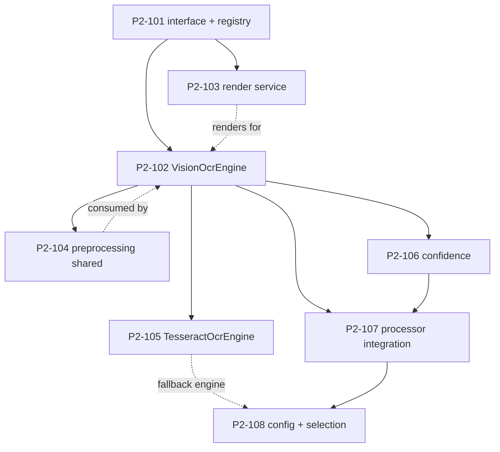

# Milestone 2.1 — OCR Engine: Engineering Specification

**Source of truth:** `docs/PHASE_2_IMPLEMENTATION_SPECIFICATION.md` v1.1 (**FROZEN**, Engineering Baseline 2026-08-01), Milestone 2.1 row (§3) + Task Breakdown §4.1.
**Baseline:** `docs/PHASE_2_ENGINEERING_BASELINE.md` (binding addenda §10 do not affect 2.1).
**Scope of this document:** expand Milestone 2.1 into executable engineering tasks. **No code is implemented by this document.**
**Status:** Derived from the frozen baseline; not independently frozen.

---

## 1. Milestone Overview (normative, from frozen spec)

| Field | Value |
|-------|-------|
| **Objective** | Maximize OCR completeness and reliability: no silent page truncation (configurable limit), an offline fallback, preprocessing for noisy images, and confidence surfaced to notes/frontmatter. |
| **Scope (in)** | OCR engine interface + registry; `VisionOcrEngine` (refactor of current path with page batching + retry); `TesseractOcrEngine` (optional offline plugin); shared preprocessing module (`imaging/preprocess.py` — R-3); PDF page-render service; `OcrResult` model with per-page confidence; config incl. prompt templates (R-6). |
| **Scope (out)** | Layout preservation (Phase 7 per MEDD), multi-language OCR model selection (feeds later from 2.2 language), ML handwriting recognition. |
| **Current implementation** | `_ocr_extract_from_pdf()` (`app/infrastructure/routing/processor_impls.py:71-104`): PyMuPDF render (hardcoded 2× zoom, hardcoded 5-page cap `min(len(doc), 5)`), temp PNG files, per-page `describe_image`, no confidence, no preprocessing, no retry. Vision/Handwriting processors embed hardcoded prompts. |
| **Target state** | `DocumentOcrService` orchestrates engines; per-page `PageOcrResult(page_no, text, confidence)`; engine selection by config; preprocessing applied before engine; failures degrade per-page with warnings; confidence flows to `ProcessedDocument` and note frontmatter. |
| **Dependencies** | Existing: `PyMuPDF>=1.24.0`, `OllamaVisionClient`. Optional (new, dev-time only unless enabled): `Pillow`, `pytesseract` + Tesseract binary. Wheel availability must be verified for `cp314-win_amd64` at milestone start (R-5 / Baseline R11). |
| **Backward compatibility** | Default `engine="auto"` + `page_limit=5` reproduces today's behavior; `ProcessedDocument` gains optional `ocr: OcrResult | None`; processors keep identical `process()` signatures. |
| **Rollback** | `intelligence.ocr.enabled: false` restores Phase-1 in-processor behavior with zero code change; **no legacy branch retained** (R-4). |
| **Estimated effort** | 4–5 dev-days (tasks total ~6 d; milestone is at the size ceiling — see §5 note and frozen review O-2). |
| **Complexity / Risk** | Medium / medium (highest per-task risk: P2-107 processor integration). |

---

## 2. Normative Interfaces (from frozen spec — do not alter)

```python
class OcrEngine(Protocol):
    supported_kinds: set[str]
    def run(self, source: Path, *, prompt: str, preprocess: bool = True) -> OcrResult

class DocumentOcrService:
    def __init__(self, engines: list[OcrEngine]) -> None
    def register(self, engine: OcrEngine) -> None
    def extract(self, document) -> OcrResult          # engine selection by config
```

- Public APIs: `DocumentOcrService`, `OcrResult`, `PageOcrResult`, `get_default_ocr_service(settings)`.
- Internal APIs: `VisionOcrEngine`, `TesseractOcrEngine`, `render_pdf_pages(pdf_path, zoom)`, `preprocess_image(path)`.
- Result model: `OcrResult` (per-page `PageOcrResult(page_no, text, confidence)`; aggregated confidence; empty-page flag).
- Package layout (§7.2 frozen): `app/infrastructure/document_intelligence/ocr/` = `engines.py`, `pdf.py`, `models.py`; preprocessing lives in shared `app/infrastructure/document_intelligence/imaging/preprocess.py`.

## 3. Normative Configuration (frozen — do not alter)

```yaml
intelligence:
  ocr:
    enabled: true            # false ⇒ Phase-1 in-processor behavior (R-4)
    engine: "auto"           # auto = vision primary, tesseract fallback
    page_limit: 5            # pages OCR'd; 0 = all
    zoom: 2.0
    preprocess: false
    tesseract_cmd: ""        # explicit path if not on PATH
    tesseract_lang: "eng"
    confidence_threshold: 0.0
    max_pages: 200           # hard cap
  prompts:
    ocr: "<default OCR prompt with {language} slot>"            # R-6
    handwriting: "<default handwriting prompt with {language} slot>"  # R-6
    vision: "<default vision prompt with {language} slot>"      # R-6 (2.5)
```

Rollback contract: `enabled: false` must return Phase-1-identical documents; no `engine="legacy"` value exists (R-4).

---

## 4. Task Breakdown

### P2-101 — OCR plugin interface + registry

| Field | Detail |
|-------|--------|
| **Task ID** | P2-101 |
| **Objective** | Define the `OcrEngine` protocol and a `DocumentOcrService` registry (register/select/extract) with a deterministic empty-registry error. |
| **Purpose** | The pluggable seam every other 2.1 task builds on; isolates the vision/Tesseract dependencies behind a stable interface (MEDD §7.2). |
| **Dependencies** | None (milestone foundation). |
| **Files likely affected** | `app/infrastructure/document_intelligence/ocr/__init__.py` (new), `ocr/base.py` (new), `ocr/models.py` (new — `OcrResult`/`PageOcrResult` skeleton, extended by P2-106). |
| **Classes likely affected** | `DocumentOcrService` (new), `OcrEngine` (Protocol, new). |
| **Interfaces** | `OcrEngine` protocol + `DocumentOcrService` as in §2; `get_default_ocr_service(settings)` factory stub. |
| **Implementation Steps** | (1) Create package `ocr/`; (2) define `OcrEngine` Protocol (`supported_kinds`, `run`); (3) implement `DocumentOcrService` with `register`, `select` (first engine matching config + `supported_kinds`), `extract` (delegates to selected engine, passes prompt); (4) define minimal `OcrResult`/`PageOcrResult` pydantic models (text; confidence field added in P2-106); (5) add the `get_default_ocr_service(settings)` factory returning an empty registry until P2-102/P2-105 land; (6) empty-registry `extract()` raises a clear error. |
| **Configuration Changes** | None (config consumed at P2-108). |
| **Testing Strategy** | Unit: registry register/select; empty-registry error; protocol conformance smoke test (a fake engine). |
| **Acceptance Criteria** | `OcrEngine` protocol + `DocumentOcrService.register/select/extract` work with an empty-engines error. |
| **Definition of Done** | Interface reviewed, unit-tested, no behavior change to existing processors. |
| **Rollback Plan** | Pure addition; not wired anywhere yet — removal is a safe revert. |
| **Estimated Complexity** | Low. |
| **Risk** | Low. |

---

### P2-102 — `VisionOcrEngine` (refactor of current path)

| Field | Detail |
|-------|--------|
| **Task ID** | P2-102 |
| **Objective** | Move the current vision-model OCR path (`_ocr_extract_from_pdf`) into a `VisionOcrEngine` implementing `OcrEngine`, with page batching and a bounded retry, preserving Phase-1 text output. |
| **Purpose** | Removes ~100+ lines of hardcoded logic from `processor_impls.py`; makes the vision path a swappable engine and enables per-page degradation. |
| **Dependencies** | P2-101. Implementation sequence: P2-103 lands before this task's engine body so `render_pdf_pages` exists (see §5). |
| **Files likely affected** | `ocr/engines.py` (new), `routing/processor_impls.py` (remove `_ocr_extract_from_pdf` internals). |
| **Classes likely affected** | `VisionOcrEngine` (new), `OllamaVisionClient` (minor: page-batch helper). |
| **Interfaces** | Implements `OcrEngine.run(source, *, prompt, preprocess)`; `supported_kinds = {"scanned_pdf", "image"}`. |
| **Implementation Steps** | (1) Implement `VisionOcrEngine` using `render_pdf_pages` (P2-103) with the configured `zoom` and page limit; (2) per page: write temp PNG → call `OllamaVisionClient.describe_image` → collect text; (3) sequential page loop with early stop on empty page; (4) bounded retry (1 retry) on transient vision error, per page — a failed page yields `""` + warning, never aborts the pass; (5) `preprocess=True` applies `preprocess_image` (P2-104) before the vision call; (6) temp files under `tempfile` with `finally` unlink; (7) delete the extracted code from `processor_impls.py`. |
| **Configuration Changes** | Consumes `intelligence.ocr.{zoom,page_limit,max_pages,preprocess}` (values already defined; no new keys). |
| **Testing Strategy** | Unit: engine extracts same text as Phase 1 for ≤5 pages (mocked vision); page-limit behavior; retry on failure; per-page failure doesn't abort; temp files cleaned. |
| **Acceptance Criteria** | Extracts the same text as Phase 1 for ≤5 pages; page limit now configurable; temp files cleaned. |
| **Definition of Done** | All existing `test_processors.py` OCR tests pass unchanged. |
| **Rollback Plan** | `intelligence.ocr.enabled: false` (wired at P2-107) restores Phase-1 path; additive. |
| **Estimated Complexity** | Medium. |
| **Risk** | Medium. |

---

### P2-103 — PDF page-render service

| Field | Detail |
|-------|--------|
| **Task ID** | P2-103 |
| **Objective** | Extract page rendering into `render_pdf_pages(pdf_path, zoom)`: per-page PNG bytes with configurable zoom/limit, per-page error isolation, no temp-file leaks. |
| **Purpose** | Single render path shared by the OCR engine and later milestones; isolates PyMuPDF rendering and its failure modes. |
| **Dependencies** | P2-101 (module exists). |
| **Files likely affected** | `ocr/pdf.py` (new). |
| **Classes likely affected** | None existing (new `render_pdf_pages` function). |
| **Interfaces** | `render_pdf_pages(pdf_path: Path, *, zoom: float, page_limit: int | None, max_pages: int) -> Iterator[PageImage]` where `PageImage` carries `page_no` and PNG `bytes`. |
| **Implementation Steps** | (1) Open via PyMuPDF; (2) render each page at `zoom` (72 dpi × zoom) to PNG bytes; (3) enforce `page_limit` (0 = all, capped by `max_pages`); (4) a render failure returns a per-page error entry (skip), never aborting the document; (5) no file writes (bytes in memory) or use tempdir + `finally` cleanup if a later step needs files; (6) log per-page render timing. |
| **Configuration Changes** | Consumes `intelligence.ocr.{zoom,page_limit,max_pages}`; no new keys. |
| **Testing Strategy** | Unit: per-page PNG bytes returned; zoom changes output; limit (0, 5, 10) honored; render failure → per-page skip; no temp-file leaks (tmp dir empty after). |
| **Acceptance Criteria** | `render_pdf_pages()` returns per-page PNG bytes with configurable zoom/limit; render failure → per-page error, not abort. |
| **Definition of Done** | Unit tests; no temp-file leaks. |
| **Rollback Plan** | Not wired to processors yet; removal is a safe revert. |
| **Estimated Complexity** | Low. |
| **Risk** | Low. |

---

### P2-104 — Image preprocessing pipeline (shared module)

| Field | Detail |
|-------|--------|
| **Task ID** | P2-104 |
| **Objective** | Implement the shared preprocessing module `imaging/preprocess.py`: deskew, denoise, and CLAHE transforms applied when enabled, original preserved on error. |
| **Purpose** | Improves OCR on dark/noisy/rotated scans (G33); shared with Milestone 2.5 — **one module, not two** (R-3). |
| **Dependencies** | P2-102. |
| **Files likely affected** | `imaging/preprocess.py` (new — shared with 2.5, R-3), `config/default.yaml` (`intelligence.ocr.preprocess: false`). |
| **Classes likely affected** | `Preprocessor` (new) — `process(path) -> Path` (returns temp processed path). |
| **Interfaces** | `preprocess_image(path) -> Path` (public, reused by 2.5); `class Preprocessor: def process(self, path: Path) -> Path`. |
| **Implementation Steps** | (1) Implement deskew (Hough/radon estimate on synthetic fixtures), denoise (e.g., fastNlMeans or median), CLAHE (contrast-limited adaptive histogram equalization); (2) apply in fixed order deskew → denoise → CLAHE; (3) on any transform error, return the original path + logged warning; (4) guard dimensions before processing (decompression-bomb safe bounds deferred to P2-503; enforce a sane max here); (5) temp output via `tempfile` + caller cleanup. |
| **Configuration Changes** | `intelligence.ocr.preprocess: false` (default off); no other new keys. |
| **Testing Strategy** | Unit: deskew angle test on a synthetic 5°-rotated image; denoise/CLAHE applied (transform differences asserted); error path returns original; absent-Pillow → skip with logged warning (**C-3 DoD clause**). |
| **Acceptance Criteria** | Deskew/denoise/CLAHE transforms applied when enabled; original preserved on error. |
| **Definition of Done** | Transform unit tests; toggle default off; absent-Pillow DoD: skip preprocessing with logged warning. |
| **Rollback Plan** | `intelligence.ocr.preprocess: false` (default) disables; additive module. |
| **Estimated Complexity** | Medium. |
| **Risk** | Medium. |

---

### P2-105 — `TesseractOcrEngine` (optional)

| Field | Detail |
|-------|--------|
| **Task ID** | P2-105 |
| **Objective** | Implement an optional offline `TesseractOcrEngine` (pytesseract) for printed text with a clear, actionable `ImportError` when the dependency is absent (G06 pattern). |
| **Purpose** | Offline-first OCR without the vision model; fulfills the "Tesseract fallback" requirement of `engine="auto"` and MEDD §7.2. |
| **Dependencies** | P2-101. |
| **Files likely affected** | `ocr/engines.py` (extend), `pyproject.toml` (optional extra `intelligence`: `pytesseract`). |
| **Classes likely affected** | `TesseractOcrEngine` (new). |
| **Interfaces** | Implements `OcrEngine.run`; `supported_kinds = {"scanned_pdf", "image"}`; invoked via pytesseract library API only (no shell subprocess — security). |
| **Implementation Steps** | (1) Import pytesseract lazily inside `run`; on `ImportError` raise a clear error with install instructions (G06 pattern); (2) accept an image path (rendered page or preprocessed image); (3) call pytesseract with `tesseract_cmd` (if configured) and `tesseract_lang`; (4) map Tesseract's per-page confidence (`image_to_data`/OSD or `--psm` aggregation) into `PageOcrResult.confidence`; (5) Tesseract binary absent on PATH → clear error + `pam doctor` hint (wired at P2-108). |
| **Configuration Changes** | Consumes `intelligence.ocr.tesseract_cmd`, `tesseract_lang`; no new keys. |
| **Testing Strategy** | Unit: offline printed-text OCR on a real PNG fixture (skipped when binary absent, `@pytest.mark.integration`); ImportError message when pytesseract missing; absent-binary error path. |
| **Acceptance Criteria** | Installed → offline printed-text OCR works; absent → clear `ImportError` (G06 pattern). |
| **Definition of Done** | Optional-dep test guarded by import; offline path proven; absent-binary DoD: clear error + logged warning. |
| **Rollback Plan** | Optional extra uninstall restores prior behavior; not in the default engine path for non-PDF kinds. |
| **Estimated Complexity** | Medium. |
| **Risk** | Medium. |

---

### P2-106 — Confidence + diagnostics

| Field | Detail |
|-------|--------|
| **Task ID** | P2-106 |
| **Objective** | Extend `OcrResult` with per-page confidence and aggregation; flag empty/low-confidence pages in logs; expose confidence for notes/frontmatter. |
| **Purpose** | OCR quality becomes observable and filterable; surfaces silent-quality loss (MEDD §7.2 "confidence" responsibility). |
| **Dependencies** | P2-102 (engines produce confidence). |
| **Files likely affected** | `ocr/models.py` (extend), `processor_impls.py` (log wiring), `domain/processed_document.py` (additive `ocr: OcrResult | None`), note template frontmatter. |
| **Classes likely affected** | `OcrResult`, `PageOcrResult` (fields), `ProcessedDocument` (additive field). |
| **Interfaces** | `PageOcrResult(page_no, text, confidence)`; `OcrResult(pages, confidence, empty_pages)` with aggregation helpers. |
| **Implementation Steps** | (1) Add `confidence: float` to `PageOcrResult`; (2) engines populate confidence (vision: client confidence where available, else sentinel; Tesseract: per-page data); (3) `OcrResult` aggregates mean confidence + lists empty/low-confidence pages; (4) log warning per empty/low-confidence page; (5) attach `OcrResult` to `ProcessedDocument.ocr` (additive, defaults `None`); (6) surface confidence in note frontmatter when present. |
| **Configuration Changes** | Consumes `intelligence.ocr.confidence_threshold` (pages below it are flagged); no new keys. |
| **Testing Strategy** | Unit: per-page confidence values; aggregation math; empty/low-confidence flagging; `ProcessedDocument.ocr` defaults to `None` when disabled. |
| **Acceptance Criteria** | `OcrResult` carries per-page confidence; empty/low-confidence pages flagged in logs. |
| **Definition of Done** | Unit tests for aggregation; schema additive only. |
| **Rollback Plan** | Additive field; `enabled: false` keeps it `None`. |
| **Estimated Complexity** | Low. |
| **Risk** | Medium. |

---

### P2-107 — Processor integration

| Field | Detail |
|-------|--------|
| **Task ID** | P2-107 |
| **Objective** | Route `OCRProcessor`, `HandwritingProcessor`, and `VisionProcessor` through `DocumentOcrService`; move their hardcoded prompts to `intelligence.prompts.*` (R-6); preserve the vision-required no-fallback guard. |
| **Purpose** | The single wiring point where the new OCR service replaces the inline path end-to-end; highest-risk task in the milestone. |
| **Dependencies** | P2-102, P2-106. |
| **Files likely affected** | `routing/processor_impls.py` (`OCRProcessor`, `HandwritingProcessor`, `VisionProcessor`), `pipelines/ingest_workflow.py`, `core/config.py` (prompt template plumbing), `config/default.yaml` (`intelligence.prompts.*`). |
| **Classes likely affected** | `OCRProcessor`, `HandwritingProcessor`, `VisionProcessor`, `IngestionWorkflow`. |
| **Interfaces** | Processors keep identical `process()` signatures; they obtain `DocumentOcrService` from the factory and call `extract`. |
| **Implementation Steps** | (1) Inject `DocumentOcrService` (from `get_default_ocr_service(settings)`) into the three processors; (2) `OCRProcessor` → `service.extract` with OCR prompt; `HandwritingProcessor` → extract with handwriting prompt; `VisionProcessor` → keep image semantics via the vision engine with the vision prompt; (3) move the three hardcoded prompt strings into `intelligence.prompts.{ocr,handwriting,vision}` with a `{language}` slot, defaults byte-identical to today's strings (R-6); (4) preserve the existing no-fallback raise when a vision-required kind has no vision engine; (5) wire the service construction in `IngestionWorkflow`/factory; (6) delete the old inline `_ocr_extract*` + `_looks_handwritten` helpers from `processor_impls.py`. |
| **Configuration Changes** | `intelligence.prompts.{ocr,handwriting,vision}` (new keys; defaults byte-identical — R-6). |
| **Testing Strategy** | Unit: each processor delegates to the service (mocked service); prompt templates resolve from config and substitute `{language}`; regression: full `test_processors.py` + `test_processor_wiring.py` + workflow routing tests. |
| **Acceptance Criteria** | All three processors consume `DocumentOcrService`; vision-required no-fallback guard preserved; hardcoded OCR/Handwriting prompts moved to config (R-6). |
| **Definition of Done** | Wiring tests; full suite green. |
| **Rollback Plan** | `intelligence.ocr.enabled: false` restores Phase-1 in-processor behavior with zero code change (no legacy branch — R-4). |
| **Estimated Complexity** | Medium. |
| **Risk** | High (largest wiring blast radius; mitigate per frozen O-2: split per-processor sub-tasks if it grows). |

---

### P2-108 — OCR config + engine selection

| Field | Detail |
|-------|--------|
| **Task ID** | P2-108 |
| **Objective** | Bind the full `intelligence.ocr` config to engine selection, `engine="auto"` (vision → Tesseract fallback), page-limit behavior, and a `pam doctor` hint for OCR engine availability. |
| **Purpose** | Makes the milestone's behavior configurable and diagnosable; verifies the default reproduces Phase-1 behavior (C-5). |
| **Dependencies** | P2-102–107. |
| **Files likely affected** | `core/config.py` (`IntelligenceSettings.ocr`, `prompts`), `config/default.yaml`, `cli` (doctor hint), `ocr/__init__.py` (`get_default_ocr_service` selection). |
| **Classes likely affected** | `Settings`, `get_default_ocr_service`, CLI doctor command. |
| **Interfaces** | `get_default_ocr_service(settings) -> DocumentOcrService` implements selection; no public signature change. |
| **Implementation Steps** | (1) Model the `intelligence.ocr` + `intelligence.prompts` blocks in `IntelligenceSettings`; (2) implement selection: `engine="auto"` → vision engine, falling back to Tesseract for printed text when vision unavailable; explicit engine names select directly; (3) enforce `page_limit` (0 = all) and `max_pages` cap through the service; (4) add a `pam doctor` hint reporting vision model presence + Tesseract binary/path + optional-dep availability; (5) default-config test asserting Phase-1-equivalent selection (C-5). |
| **Configuration Changes** | All `intelligence.ocr.*` + `intelligence.prompts.*` keys bound (values per §3). |
| **Testing Strategy** | Unit: engine selection matrix (auto/vision/tesseract/unknown-engine error); page-limit 0/5/10; defaults reproduce Phase 1; config parse tests. |
| **Acceptance Criteria** | `engine="auto"` picks vision, falls back to Tesseract; per-page limit works; default reproduces Phase 1. |
| **Definition of Done** | Config tests; default reproduces Phase 1; doctor hint present. |
| **Rollback Plan** | Defaults are Phase-1-equivalent; every knob has an explicit default. |
| **Estimated Complexity** | Low. |
| **Risk** | Low. |

---

## 5. Implementation Order

| Step | Tasks | Rationale |
|------|-------|-----------|
| 0 | **Preflight (not a task):** verify `pytesseract`/`Pillow`/`PyMuPDF` wheels resolve for `cp314-win_amd64` via `pip download --only-binary` (R-5 / Baseline R11). |
| 1 | P2-101 | Foundation protocol + registry + model skeleton — everything depends on it. |
| 2 | P2-103 | Render service lands before P2-102's engine body (declared dep is P2-101; sequencing chosen to avoid rework — see P2-102). |
| 3 | P2-102 | `VisionOcrEngine` on top of `render_pdf_pages`. |
| 4 | P2-104 ‖ P2-105 | Shared preprocessing and Tesseract engine are independent — parallelize. |
| 5 | P2-106 | Confidence aggregation (engines now emit it). |
| 6 | P2-107 | Processor integration (single wiring point; full suite regression). |
| 7 | P2-108 | Config binding + engine selection + doctor; milestone gate. |

**Critical path:** P2-101 → P2-103 → P2-102 → P2-106 → P2-107 → P2-108. **Parallel:** P2-104 ‖ P2-105. **Hard order:** P2-107 needs P2-102 + P2-106; P2-108 needs all.

## 6. Dependency Graph



Edges: P2-102→P2-103 and P2-102→P2-104 are consumption edges (both may run before or after per §5); the **task-dependency (hard) edges** are P2-101→{102,103}, P2-102→{104,105,106}, {102,106}→107, {102…107}→108.

## 7. Testing Plan

| Layer | Scope | Command / Marker |
|-------|-------|------------------|
| Unit | Registry/selection; page-limit (0/5/10); confidence aggregation; preprocessing transforms; Tesseract ImportError; render-error per-page skip; temp-file cleanup; prompt templating; config selection matrix | `tests/unit/test_ocr_engine.py`, `tests/unit/test_processors.py` — `python -m pytest tests/unit -q -p no:cacheprovider` |
| Integration | End-to-end scanned-PDF fixture through `IngestionWorkflow` (mocked vision) asserting text grows with `page_limit`; real Tesseract PNG (skipped if binary absent) | `tests/integration/test_ocr_pipeline.py` — `@pytest.mark.integration`, opt-in `-m integration`, hermetic |
| Regression | `test_processors.py` (incl. `test_scanned_pdf_requires_pymupdf`), `test_processor_wiring.py`, workflow routing — pass unchanged | `python -m pytest tests -q -p no:cacheprovider` |
| Performance | Render ≤ 2 s/page (2× zoom); OCR vision path 10–30 s/page (loose bound, logged); preprocessing ≤ 300 ms/page | §8.4 ceilings, `time.perf_counter` assertions |
| Manual | `pam ingest` on a 10-page scanned PDF + a photo; verify full text, confidence frontmatter, no temp leakage | §8.5 checklist |
| Benchmark | OCR CER on 5-image reference set (vision vs Tesseract vs preprocessed-vision); preprocessing reduces CER ≥ 25% on noisy photos | `docs/05_Document_Intelligence_Benchmarks.md` |

Absent-dependency paths (Pillow, pytesseract) are import-guarded; each optional-dep task carries the C-3 DoD clause.

## 8. Review Checklist (milestone gate)

- [ ] P2-101 registry + protocol reviewed; empty-registry error tested.
- [ ] P2-102 vision engine text-equal to Phase 1 for ≤5 pages (mocked vision).
- [ ] P2-103 render service: per-page error isolation, zoom/limit honored, no temp leaks.
- [ ] P2-104 shared `imaging/preprocess.py`: transforms tested; default off; absent-Pillow fallback.
- [ ] P2-105 Tesseract engine: import-guarded; offline path proven; binary-absent error clear.
- [ ] P2-106 confidence aggregation + `ProcessedDocument.ocr` additive only.
- [ ] P2-107 all three processors consume `DocumentOcrService`; prompts from config (R-6); no-fallback guard preserved; full suite green.
- [ ] P2-108 `engine="auto"` selection, page limits, defaults reproduce Phase 1 (C-5), doctor hint.
- [ ] All 432 pre-existing tests pass unchanged; coverage ≥ 80%; `ruff` no new errors; `mypy` no new type errors.
- [ ] Per-task atomic commits; rollback via `intelligence.ocr.enabled: false` verified.
- [ ] Optional-dep wheels verified on `cp314-win_amd64` (R-5); changelog + 01 report + MEDD §7.2 updated.
- [ ] Milestone 2.1 completion report produced before Milestone 2.2 begins (frozen §12 gates).

---

*End of Milestone 2.1 Engineering Specification.*
