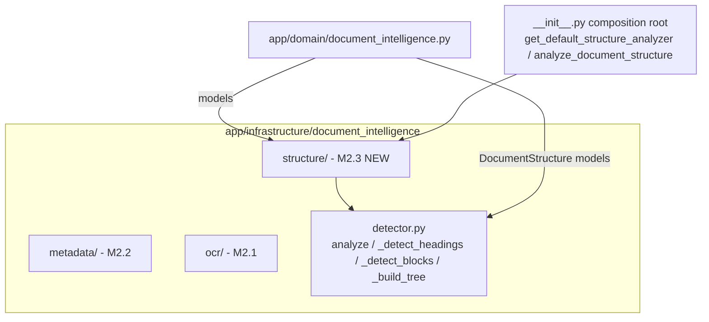
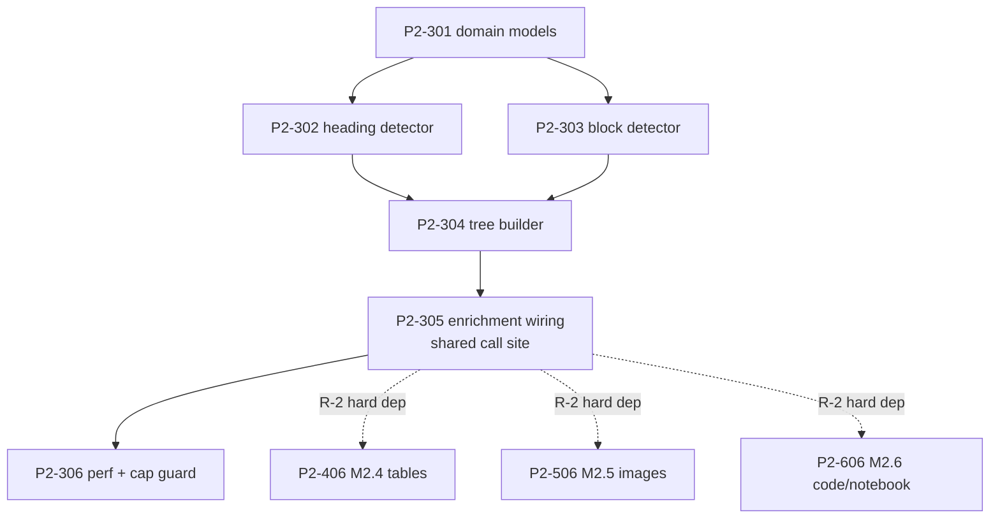
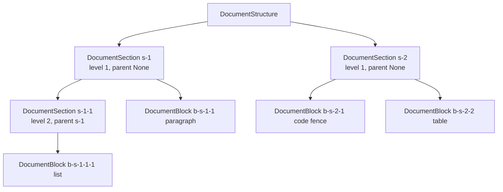

# Milestone 2.3 — Document Structure Analysis: Engineering Specification

**Source of truth:** `docs/PHASE_2_IMPLEMENTATION_SPECIFICATION.md` v1.1 (**FROZEN**, Engineering Baseline 2026-08-01), Milestone 2.3 row (§3) + Task Breakdown §4.3.
**Baseline:** `docs/PHASE_2_ENGINEERING_BASELINE.md`. **Binding addenda §10 that apply here:** (3) `intelligence.structure.enrich_analysis_input: false` listed in the 2.3 config block.
**Predecessors:** Milestones 2.1 and 2.2 complete and approved (M2.2 gate: ✅ Milestone 2.2 Approved, 2026-08-01). The M2.2 lessons below (§11) are binding for this milestone's wiring.
**Scope of this document:** expand Milestone 2.3 into executable engineering tasks. **No code is implemented by this document.**
**Version:** 1.1 (remediated per `docs/PHASE_2_MILESTONE_2_3_SPECIFICATION_REVIEW.md` — R-1 + C-1…C-7 + O-1…O-4; remediation record: `docs/PHASE_2_MILESTONE_2_3_SPECIFICATION_REMEDIATION_REPORT.md`). Status: 🔒 **FROZEN** (2026-08-01) per `docs/PHASE_2_MILESTONE_2_3_SPECIFICATION_FREEZE.md` — ✅ Ready for Freeze (`docs/PHASE_2_MILESTONE_2_3_SPECIFICATION_REVIEW_2.md`). This is the binding implementation contract; do not modify unless a future engineering review identifies a blocker.

---

## 1. Objectives

| # | Objective | Success measure |
|---|-----------|-----------------|
| 1 | Detect the hierarchical structure of a document — headings, sections, paragraphs, lists, code fences, blockquotes, tables — and represent it in typed models. | A nested `DocumentStructure` (sections with `id`, `title`, `level`, `parent_id`, `blocks`, `start_char`, `end_char`) is produced for any text-bearing document. |
| 2 | Attach the structure to the document that actually survives the pipeline so it is available to later consumers (Phase 3/4). | `document.metadata.extra["structure"]` is populated on the enriched `SourceDocument` for text-bearing kinds when `intelligence.structure.enabled: true`; the key is absent otherwise. |
| 3 | Establish the shared enrichment attachment point inside `_run_routed_processor` that Milestones 2.4/2.5/2.6 reuse (review R-2, hard dependency). | P2-305 lands the enrichment hook; P2-406/P2-506/P2-606 consume the same call site. |
| 4 | Provide the foundation contract for Phase 3 hierarchical chunking (MEDD G14 / §7.3) and Phase 4 parent-child retrieval, without implementing either. | `DocumentStructure` is documented as the chunking input contract (MEDD §7.3 target architecture); the consumption seam is pinned (Phase 3 reads `metadata.extra["structure"]` → `DocumentStructure.model_validate`, mapping `DocumentSection.id` → chunk `parent_id`); no Phase-3 features ship. |
| 5 | Preserve chunker behavior byte-for-byte. | `SemanticChunker` regression suite passes unchanged; the chunker keeps its internal heading-split copy this phase. |

---

## 2. Scope

### 2.1 In scope

- `DocumentStructure` / `DocumentSection` / `DocumentBlock` domain models with IDs, levels, parent IDs, and char offsets.
- ATX-heading hierarchy detector (nested `#` levels → parent/child tree).
- Block detector: paragraph, list, code fence, blockquote, Markdown table.
- Structure tree builder: sections contain blocks; contiguous char offsets; stable section IDs.
- Enrichment of structure into `document.metadata.extra["structure"]` on the enriched `SourceDocument` for text-bearing kinds, gated by `intelligence.structure.enabled` — reusing the proven `parent_id` channel (`ingest_workflow.py:397`).
- Enrichment call site inside `_run_routed_processor` (shared with 2.4/2.5/2.6).
- Size cap guard: structure analysis skipped for extracted text > 5 MB.
- Unit/integration/regression tests, fixtures committed to the repository.

### 2.2 Out of scope (explicitly deferred — R10 guard)

- **NLP sentence segmentation** (MEDD G12, Phase 3.1) — not this milestone.
- **Semantic topic segmentation** (roadmap 3.4) — not this milestone.
- **Token-aware chunk sizing** (MEDD G13) and **hierarchical chunk consumption** (MEDD G14) — Phase 3.
- **Chunking changes of any kind:** `SemanticChunker` keeps its own internal `_split_by_headings` copy; no behavior change.
- **Structure-aware prompting:** the LLM analysis prompt input remains raw/OCR text + existing metadata; structure-aware prompting is opt-in only via `intelligence.structure.enrich_analysis_input: false` default (addendum 3, §1.3/R-7 contract).
- **Note-template/TOC rendering from structure** — deferred to a later phase (documented input only).
- **HTML/markup parsing beyond best-effort regex handling** (fenced `#` disambiguation only).

---

## 3. Dependencies

| Dependency | Type | Detail |
|------------|------|--------|
| `re` (stdlib) | Required, new use | Heading/block line classification. |
| `pydantic` | Required, existing | Domain models (already a project dependency). |
| `DocumentMetadataService` / hook registry (M2.2) | Existing | Registry/builder conventions reused; `app/infrastructure/document_intelligence/__init__.py` is the composition root. |
| `SourceDocument.metadata.extra` (M2.2 state) | Existing | The persistence channel: structure is serialized into `metadata.extra["structure"]`, exactly as `parent_id`/`attachment_paths` already ride there. `ProcessedDocument` is **not** modified (R-1 deviation from frozen P2-305 — see §5.4). |
| `IngestionWorkflow._run_routed_processor` (M2.2 state) | Existing | Enrichment call site (additive, after processor success). |
| `intelligence` settings plumb chain (M2.2) | Existing | `create_default` → `from_runtime` → `__init__` pattern proven by P2-203 remediation; reused for `structure.enabled`. |
| **None new** | — | Zero new runtime or optional dependencies. Pure stdlib parsing. |

**Environment:** Python 3.14.6 on Windows — no wheel verification needed this milestone (no new packages).

**Phase prerequisite:** M2.2 complete and approved; all 605 unit + 14 integration tests remain green; coverage ≥ 80%.

---

## 4. Public Interfaces

### 4.1 Normative interfaces (from frozen spec — do not alter)

```python
class StructureAnalyzer:
    """Detect and build the hierarchical structure of source text."""
    def analyze(self, text: str, source: str) -> DocumentStructure: ...
```

- `DocumentStructure` holds `sections: list[DocumentSection]`.
- **Public APIs:** `analyze_document_structure(text, source)`, `StructureAnalyzer`, `DocumentStructure`, `DocumentSection`, `DocumentBlock`.
- **Internal APIs:** `_detect_headings(lines)`, `_detect_blocks(text, ranges)`, `_build_tree(sections)`.

### 4.2 Domain models (additive, in `app/domain/document_intelligence.py`)

```python
class DocumentBlock:
    block_id: str          # stable, e.g. "b-<section_id>-<n>"
    type: str              # "paragraph" | "list" | "code" | "blockquote" | "table"
    text: str
    start_char: int
    end_char: int

class DocumentSection:
    id: str                # stable, e.g. "s-1" / "s-1-1"
    title: str
    level: int             # 1..6, from ATX heading depth
    parent_id: str | None
    start_char: int
    end_char: int
    blocks: list[DocumentBlock]

class DocumentStructure:
    sections: list[DocumentSection]
```

- Offsets are relative to the **exact text string passed to `analyze`** — the same text the pipeline will chunk (offsets-drift mitigation, frozen §3).
- **Serialization contract:** the analyzer result travels as `document.metadata.extra["structure"] = structure.model_dump(mode="json")` on the enriched `SourceDocument` (see §5.4). Consumers deserialize via `DocumentStructure.model_validate(extra["structure"])`. No field is added to `ProcessedDocument` (R-1 deviation — see §5.4).

### 4.3 Package layout

`app/infrastructure/document_intelligence/structure/` = `detector.py` (analyzer + `_detect_headings` + `_detect_blocks` + `_build_tree`); models in shared `app/domain/document_intelligence.py`; composition root `app/infrastructure/document_intelligence/__init__.py` exposes `analyze_document_structure` and `get_default_structure_analyzer()`.

---

## 5. Architecture Changes

### 5.1 No pipeline stages added; no flow reordered

Structure analysis is a pure enrichment attached at the existing `_run_routed_processor` call site (`app/pipelines/ingest_workflow.py:421`) — exactly the pattern proven by M2.2 (size guard → pre-hooks → ingestor → extractor merge → post-hooks). The analyzer runs **after** the routed processor succeeds and **before** chunking; its result is stored on the enriched document under `metadata.extra["structure"]` (see §5.4).

### 5.2 Placement

```mermaid
graph LR
    subgraph ingestion["DocumentIngestionService (M2.2)"]
        SG[Size guard] --> PRE[Pre-hooks] --> ING[Ingestor]
        ING --> EXT[Metadata extractor merge]
        EXT --> POST[Post-hooks]
    end
    ING --> CLASS[DocumentClassifier]
    CLASS --> ROUTE[Routed processor]
    ROUTE --> STRUC[StructureAnalyzer P2-301..306]
    STRUC --> DOC[enriched SourceDocument<br/>metadata.extra["structure"]]
    DOC --> CHUNK[SemanticChunker - UNCHANGED this phase]
    DOC --> NOTE[Note generation - unchanged]
    STRUC -. shared call site .-> M24[M2.4 tables]
    STRUC -. shared call site .-> M25[M2.5 images]
    STRUC -. shared call site .-> M26[M2.6 code/notebook]
    DOC -. Phase 3 input contract .-> P3[Hierarchical chunking G14]
```

- **No required refactoring** of existing components (frozen §3): the enrichment call is additive inside `_run_routed_processor` after processor success.
- The analyzer is **not** registered as a hook or extractor — it is a fixed service (consistent with the C-1 boundary: registry covers extensible kinds only).

### 5.3 Config plumbing (M2.2 lesson L1/L2)

`intelligence.structure.enabled` must reach the analyzer through the **complete production chain**: `Settings` → `IngestionWorkflow.from_runtime(settings=settings)` → `_run_routed_processor`. Both `true` and `false` paths verified by behavior-level tests (see §13), mirroring the P2-203 `mime_enabled` remediation.

### 5.4 Structure enrichment channel (R-1 remediation — deviation from frozen P2-305)

Frozen P2-305 said "enrichment into `ProcessedDocument`"; the review (R-1) proved that object is **discarded** by `_run_routed_processor` — only `confidence`/`ocr`/`extracted_text`/`source_type` are consumed, and the object returned up the pipeline is an enriched `SourceDocument` whose pydantic config is `extra="forbid"` (`app/domain/documents.py:27`). The remediation reuses the proven `parent_id` channel (`_ingest_child` writes `extra["parent_id"]` at `ingest_workflow.py:397`):

1. After `result = processor.process(document)` succeeds, when `structure.enabled` is true and `result.source_type in TEXT_BEARING_KINDS`, run `analyzer.analyze(result.extracted_text or document.text, str(document.source))`.
2. Serialize: `structure_dict = structure.model_dump(mode="json")` (an empty `DocumentStructure` yields `{"sections": []}`).
3. Store on the enriched document, exactly like `parent_id`: `enriched.metadata.extra["structure"] = structure_dict` (extend the extra dict inside the existing `model_copy`/update step).
4. `enabled: false`, a kind outside `TEXT_BEARING_KINDS`, or a raised/oversize analyzer → **no** `"structure"` key (document identical to M2.2 state — R-4).
5. The key survives on `IngestionWorkflowResult.document` and the persisted note metadata (extra keys are already carried and ignored by the note template — proven by `parent_id`/`attachment_paths`).

**Consumers (Phase 3+):** read `metadata.extra.get("structure")`, `DocumentStructure.model_validate(...)`, and map `DocumentSection.id` → chunk `parent_id` (MEDD §7.3 "parent ID assignment"). No consumer this milestone (R-7/R10 guard).

- **Reentrancy (O-2):** `analyze()` is pure and reentrant — no shared mutable state; all state is local to the call (safe under future parallel ingestion).

---

## 6. Data Flow

```mermaid
sequenceDiagram
    participant CLI as CLI / worker
    participant WF as IngestionWorkflow
    participant RP as _run_routed_processor
    participant SA as StructureAnalyzer
    participant DOC as enriched SourceDocument
    participant CH as SemanticChunker (unchanged)

    CLI->>WF: ingest(source)
    WF->>RP: _process_document(doc)
    RP->>RP: routed processor succeeds (existing OCR/analysis)
    alt structure.enabled == true AND kind in TEXT_BEARING_KINDS
        RP->>SA: analyze(text=result.extracted_text or doc.text, source=source)
        SA->>SA: _detect_headings(lines) -> heading positions
        SA->>SA: _detect_blocks(text, ranges) -> typed blocks w/ offsets
        SA->>SA: _build_tree(sections) -> nested DocumentStructure
        alt text length > 5 MB (P2-306 cap)
            SA-->>RP: skip + warn, no structure
        end
        SA-->>RP: DocumentStructure (never raises; degenerate -> empty)
        RP->>DOC: enriched.metadata.extra["structure"] = structure.model_dump(mode="json")
    else
        RP->>DOC: no "structure" key (M2.2-identical)
    end
    RP-->>WF: enriched document (survives the pipeline)
    WF->>CH: chunk(doc.text)  # byte-identical behavior
    WF->>DOC: persist note + structure with analysis (IngestionWorkflowResult)
```

**Key invariants:**
- The analyzer receives `result.extracted_text or document.text` — the **exact text** later chunked (`enriched.text` at `_run_knowledge_engine`), so offsets never drift.
- `structure` is built on the extracted/OCR text (post-ingestion), not on the source file.
- Fenced code containing `#` must not create headings; headings inside HTML/attributes are best-effort (documented limitation).
- Degenerate input (empty text) → empty structure, never an exception.

---

## 7. Configuration

```yaml
intelligence:
  structure:
    enabled: true                 # false ⇒ no "structure" key; M2.2-identical documents (R-4)
    enrich_analysis_input: false  # addendum 3; CONTRACT-ONLY this milestone (C-5) - no code reads it (R-7)
```

- **Normative keys (do not alter):** `enabled`, `enrich_analysis_input`.
- **`enrich_analysis_input` is a contract-only field** (baseline addendum 3 / R-7): declared for the future structure-aware-prompting contract, **not read by any code this milestone** (L5 exception — recorded in §11.3 and the remediation report). No task may consume it in M2.3.
- **Code constants (`ponytail:` fixed defaults — no config keys, L5):**
  - `TEXT_BEARING_KINDS = frozenset({"markdown", "text"})` — this pins the "text-bearing kinds" that objective 2 / AC4 refer to. PDF and OCR-prose kinds are **excluded** this milestone (upgrade path: extend the set when a consumer exists).
  - `max_structure_text_bytes = 5_000_000` (Baseline risk R5) — analyzed text above this is skipped with a single warning.
  - `MAX_HEADING_LEVEL = 6` (ATX) — heading levels deeper than 6 normalize to level 6 (C-4).
  - `MAX_SECTIONS = 10_000` — exceeded → warn + truncate in tree order, never raise (C-4).
- Rollback contract: `intelligence.structure.enabled: false` returns documents identical to the M2.2 state — no `metadata.extra["structure"]` key is written and all consumers treat a missing key as "no structure".

---

## 8. Acceptance Criteria

| # | Criterion | Evidence |
|---|-----------|----------|
| AC1 | Nested ATX headings produce the correct parent/child hierarchy. | Hierarchy unit tests (e.g. `# A` → `## B` → `### C` ⇒ A.parent=None, B.parent=A, C.parent=B). |
| AC2 | Code fences and fenced `#` lines are **not** mis-split as headings. | Fence-vs-heading disambiguation tests (fenced block containing `# not a heading`). |
| AC3 | Blocks (paragraph/list/fence/blockquote/table) are detected with accurate `start_char`/`end_char`. | Block-type + offset-accuracy tests on a committed fixture. |
| AC4 | `IngestionWorkflowResult.document.metadata.extra["structure"]` is populated (as a serialized `DocumentStructure`) for kinds in `TEXT_BEARING_KINDS` when `enabled: true`; absent when disabled or for other kinds. | Integration test: markdown + text files through `IngestionWorkflow` assert a non-empty `extra["structure"]` deserializable to `DocumentStructure` with stable section IDs; `enabled: false` ⇒ key absent. |
| AC5 | Chunker behavior is byte-identical (regression). | All existing chunking tests (`test_knowledge_engine.py` overlap suite, `test_text_preprocessing.py`) pass unchanged. |

---

## 9. Definition of Done

- [ ] `DocumentStructure` / `DocumentSection` / `DocumentBlock` models with IDs, levels, parent IDs, offsets (P2-301).
- [ ] Heading hierarchy detector — nested ATX → correct tree; fenced `#` not mis-split (P2-302).
- [ ] Block detector — paragraph/list/fence/blockquote/table with accurate char offsets (P2-303).
- [ ] Structure tree builder — sections contain blocks; offsets contiguous; degenerate input → empty tree (P2-304).
- [ ] Enrichment into `document.metadata.extra["structure"]` via `_run_routed_processor` (R-1 channel, §5.4), gated by `structure.enabled` + `TEXT_BEARING_KINDS` (P2-305).
- [ ] 5 MB size cap guard + `MAX_HEADING_LEVEL`/`MAX_SECTIONS` caps + O(n) timing ceiling (P2-306).
- [ ] Offsets verified against sample documents (fixture-based).
- [ ] All gates green: 605 unit + 14 integration tests pass unchanged; coverage ≥ 80%; `ruff` zero new errors; `mypy` zero new type errors.
- [ ] Documentation updated: `changelog.md`, MEDD §7.3 chunking target-architecture input contract, 01 report structure section.
- [ ] Milestone 2.3 completion report produced before Milestone 2.4 begins (frozen §12 gates).

---

## 10. Risks

| # | Risk | L/I | Mitigation |
|---|------|-----|------------|
| R1 | Regex edge cases: fenced code containing `#`, `#` inside HTML/attributes, deeply nested lists, list-continuation lines. | M/M | Fence-state machine before heading match; heading rule `^#{1,6}\s+\S` — deliberately stricter than `SemanticChunker._HEADING_PATTERN` (`^#{1,6}\s+.+`, fence-unaware): the chunker stays unchanged (AC5) while the detector is fence-correct (AC2, O-3); best-effort elsewhere (documented); never raises (frozen §3 failure modes). |
| R2 | Offsets drift if text is normalized elsewhere (heading/list normalization in `clean_text`, M2.2 §2.4). | M/M | Structure is built on the **exact text the pipeline will chunk** (post-clean, post-ingestion); test asserts offsets on the same normalized text. |
| R3 | `metadata.extra` growth for large docs (Baseline R5). | M/M | 5 MB skip cap (P2-306); `MAX_SECTIONS` bound (P2-306); compact model (no duplicated text beyond block text; offsets stored). |
| R4 | `structure.enabled` not consumed through the full production chain (M2.2 lesson: P2-203 F1, P2-208 R1). | M/H | Normative wiring path (§5.3) enforced; behavior-level tests for both config paths (true → analyzer invoked; false → skipped). |
| R5 | Enrichment hook breaks ingestion if the analyzer fails. | M/H | Analyzer contract: never raises (M2.2 per-hook try/except lesson L4); a raised analyzer is caught, logged, `structure=None`, ingestion continues. |
| R6 | Scope creep into Phase 3 (chunking/consumption) or Phase 4 (parent-child retrieval). | M/H | Explicit out-of-scope list (§2.2); review gate rejects Phase-3 features (Baseline R10); chunker regression suite guards behavior. |
| R7 | Coverage drops below 80% with the new parser surface. | M/M | Parser suite targets ≥ 90%; per-milestone coverage check (`fail_under=80`). |
| R8 | Stable section IDs change across runs. | M/M | Deterministic ID scheme from heading order (`s-1`, `s-1-1`, ...); integration test asserts stable IDs across repeated ingestion. |

---

## 11. Implementation Order

### 11.1 Task breakdown (frozen §4.3 — normative)

| ID | Task | Priority | Deps | Complexity | Est. | Risk | Files | DoD |
|----|------|----------|------|------------|------|------|-------|-----|
| P2-301 | Structure domain models | P0 | — | Low | 0.5 d | L | `domain/document_intelligence.py` | `DocumentStructure`, `DocumentSection`, `DocumentBlock` with IDs, levels, parent ids, offsets |
| P2-302 | Heading hierarchy detector | P0 | P2-301 | Medium | 1 d | M | `structure/detector.py` (new) | Nested ATX headings → correct tree; fenced `#` not mis-split |
| P2-303 | Block detector (paragraph/list/fence/blockquote/table) | P0 | P2-301 | Medium | 1 d | M | `structure/detector.py` | Blocks typed with accurate char offsets |
| P2-304 | Structure tree builder | P0 | P2-302, P2-303 | Low | 0.5 d | L | `structure/detector.py` | Sections contain blocks; offsets contiguous; degenerate input → empty tree |
| P2-305 | Enrichment into the enriched document (`metadata.extra["structure"]`) | P0 | P2-304 | Low | 0.5 d | M | `ingest_workflow.py`, `core/config.py`, `config/default.yaml` (R-1 deviation: `ProcessedDocument` untouched — §5.4) | `extra["structure"]` populated for kinds in `TEXT_BEARING_KINDS` when enabled; absent otherwise |
| P2-306 | Performance + cap guard | P1 | P2-305 | Low | 0.25 d | L | `structure/detector.py` (config is defined in P2-305 — C-6) | Skip > 5 MB text; `MAX_HEADING_LEVEL`/`MAX_SECTIONS` enforced; O(n) timing test |

**Total:** 6 tasks, task-sum 3.75 d → **milestone budget 4 dev-days** (C-1 reconciliation; rounded with buffer, matching the M2.2 addendum-4 precedent for a frozen estimate of 3 d).

### 11.2 Waves

| Wave | Tasks | Rationale |
|------|-------|-----------|
| 0 | **Preflight (not a task):** confirm M2.2 gate closed (completion report exists, all tests green, coverage ≥ 80%). No wheel check needed (no new deps). |
| 1 | P2-301 | Models first — everything else consumes them. |
| 2 | P2-302 ‖ P2-303 | Heading detector and block detector are independent of each other once models exist. |
| 3 | P2-304 | Tree builder consumes both detectors. |
| 4 | P2-305 | Enrichment wiring — the milestone integration point and the shared call site for 2.4/2.5/2.6 (R-2). |
| 5 | P2-306 | Cap + timing ceiling on the completed analyzer. |

**Critical path:** P2-301 → P2-302 → P2-304 → P2-305 (and P2-301 → P2-303 → P2-304). **Parallel:** P2-302 ‖ P2-303 (wave 2). **Hard dependency outbound (R-2):** P2-305 must land **before** any M2.4/M2.5/M2.6 wiring task (P2-406, P2-506, P2-606).

### 11.3 Lessons from M2.2 applied (binding)

| Lesson | Source | Applied as |
|--------|--------|------------|
| L1 | P2-203 F1: `mime_enabled` defined but never read | `structure.enabled` consumed through the full `Settings → from_runtime → _run_routed_processor` chain; both config paths tested. |
| L2 | P2-208 R1: runtime settings dropped in production wiring | Enrichment reachable from both CLI (`entry.py`) and queue worker (`worker.py`); no settings dropped. |
| L3 | P2-207: additive-only enrichment, `enabled: false` → byte-identical | `enabled: false` returns M2.2-identical documents; no legacy branch (R-4). |
| L4 | P2-206: per-hook try/except containment | Analyzer failure → logged + `structure=None`, ingestion continues; never raises. |
| L5 | `url_timeout_seconds` defined-but-unconsumed | No config keys declared that are not consumed; 5 MB cap stays a code constant. **Declared exception (C-5):** `enrich_analysis_input` is a contract-only field mandated by addendum 3 / R-7 — documented as such in §7, consumed by no code this milestone. |
| L6 | M2.2 per-type committed fixtures | Structure fixtures (nested headings, fenced code, lists, blockquotes, table) committed to `tests/fixtures/`. |

---

## 12. Engineering Review Checklist (milestone gate)

- [ ] P2-301 models reviewed: `DocumentStructure`/`DocumentSection`/`DocumentBlock` additive, offsets typed, pydantic models placed in `app/domain/document_intelligence.py` per the `MetadataExtraction` precedent (O-1); `ProcessedDocument` untouched.
- [ ] P2-302 heading detector: nested ATX → correct tree (AC1); fenced `#` not mis-split (AC2); fence-state machine verified.
- [ ] P2-303 block detector: paragraph/list/fence/blockquote/table typed with accurate offsets (AC3).
- [ ] P2-304 tree builder: sections contain blocks; offsets contiguous; empty/invalid input → empty tree; `MAX_HEADING_LEVEL`/`MAX_SECTIONS` caps enforced (C-4).
- [ ] P2-305 enrichment: `structure.enabled` consumed via full production chain (L1/L2); `enabled: false` → no `extra["structure"]` key (AC4); analyzer failures contained (L4); result stored via the `metadata.extra` channel (§5.4); call site shared for 2.4/2.5/2.6 (R-2).
- [ ] P2-306: > 5 MB text skipped with warning; O(n) timing ceiling asserted.
- [ ] Chunker regression: `test_knowledge_engine.py` + `test_text_preprocessing.py` pass unchanged (AC5).
- [ ] All 605 unit + 14 integration tests pass; coverage ≥ 80% (parser suite ≥ 90%); `ruff`/`mypy` zero new errors.
- [ ] Per-task atomic commits; rollback via `intelligence.structure.enabled: false` verified.
- [ ] Documentation: `changelog.md` + MEDD §7.3 input contract + 01 report updated.
- [ ] Milestone 2.3 completion report produced before Milestone 2.4 begins.

---

## 13. Testing Strategy

| Layer | Scope | Command / Marker |
|-------|-------|------------------|
| Unit | Heading hierarchy (nested → parent/child); fence vs heading disambiguation; list/paragraph/blockquote detection; offset accuracy on a committed fixture; empty/invalid input → empty structure; `MAX_HEADING_LEVEL`/`MAX_SECTIONS` caps (C-4); model round-trip; `model_dump`/`model_validate` serialization round-trip (R-1 channel) | `tests/unit/test_structure_analysis.py` (new) — `python -m pytest tests/unit -q -p no:cacheprovider` |
| Integration | Markdown + text files through `IngestionWorkflow` asserting `result.document.metadata.extra["structure"]` deserializes to a non-empty `DocumentStructure` with stable section IDs across repeated runs; `enabled: false` path → key absent; kinds outside `TEXT_BEARING_KINDS` → key absent; CLI and worker paths both reach the analyzer | `tests/integration/test_structure_pipeline.py` (new) — `@pytest.mark.integration`, opt-in `-m integration`, hermetic |
| Regression | All chunking tests unchanged (`test_knowledge_engine.py`, `test_text_preprocessing.py`); M2.2 ingestion/metadata/workflow suites unchanged | `python -m pytest tests -q -p no:cacheprovider --cov=app --cov-report=term` |
| Performance | Structure analysis ≤ 1 s for 1 MB text (frozen §8.4 ceiling); O(n) single linear scan; 5 MB skip verified with `time.perf_counter` assertions | Perf assertions inside unit suite |
| Manual | `pam ingest` a nested-heading Markdown file and a plain-text file; verify note unchanged (chunker untouched), structure present under `metadata.extra["structure"]` on the workflow result document, note output byte-identical (template ignores extra keys), `enabled: false` restores prior output | §8 checklist |
| Benchmark | N/A this milestone (deterministic parsing; covered by perf ceiling) | — |

Fixtures (committed): `tests/fixtures/structure/nested_headings.md`, `fenced_code.md`, `lists_and_quotes.md`, `table_block.md`, `empty.md`, `oversize_text.txt` (generated in-test, > 5 MB).

---

## 14. Rollback Strategy

| Level | Mechanism | Detail |
|-------|-----------|--------|
| Per-feature | `intelligence.structure.enabled: false` | Structure enrichment skipped; no `metadata.extra["structure"]` key written; documents identical to M2.2 state with zero code change (R-4). |
| Data | Additive only | New optional key `metadata.extra["structure"]`; no field added, removed, or re-typed on any domain model; no migration. |
| Code | No deprecated branch | Rollback is flag + additive-schema only; no `legacy` value, no duplication (L3). |
| Dependency | None new | No optional extras introduced; nothing to uninstall. |
| Process | Git safety | Each task = one atomic commit (Phase-1 convention); a failing milestone is reverted by reverting its commit range; `docs/` committed with code. |
| Review | Milestone gate | M2.3 gets its own review before 2.4 begins; a milestone violating backward compatibility (AC5 chunker regression) is reverted before compounding. |

---

## 15. Mermaid Diagrams

### 15.1 Architecture — StructureAnalyzer within the intelligence subsystem



### 15.2 Data flow — enrichment and downstream contract

```mermaid
flowchart LR
    A[Source] --> B[DocumentIngestionService]
    B --> C[DocumentClassifier]
    C --> D[Router + processor]
    D --> E{structure.enabled?}
    E -- true, text-bearing --> F[StructureAnalyzer<br/>O(n) scan, 5 MB cap]
    E -- false / not text-bearing --> G[no "structure" key]
    F --> H[enriched SourceDocument<br/>metadata.extra["structure"]]
    G --> H
    H --> I[Note generation - unchanged]
    H --> J[SemanticChunker - unchanged]
    H -. Phase 3 input contract .-> K[Hierarchical chunking G14]
    F -. shared call site (P2-305) .-> L[M2.4 tables / M2.5 images / M2.6 code]
```

### 15.3 Task dependency graph



### 15.4 Document structure tree (target model)



---

*End of Milestone 2.3 Engineering Specification (v1.1 — 🔒 FROZEN 2026-08-01).*
