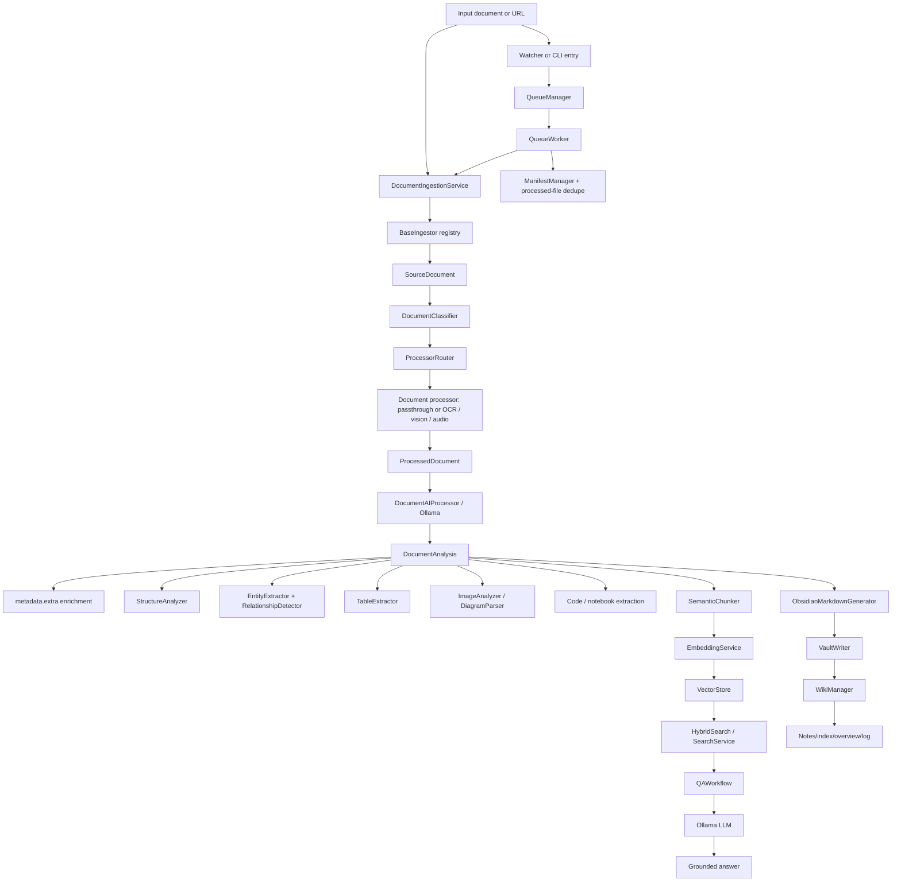

# PAM V1 Architecture (source-verified)

This document describes the architecture that actually exists in the frozen V1.0.0 implementation. It intentionally excludes planned or historical features that are not present in the source tree.

## 1. Architecture at a glance

PAM is a local-first document memory system. The runtime path is:

Input document
    ↓
Ingestion
    ↓
Classification and routing
    ↓
Document processing / intelligence
    ↓
Extraction / OCR / tables / images / metadata
    ↓
Chunking
    ↓
Embedding and indexing
    ↓
Hybrid retrieval
    ↓
Context construction
    ↓
LLM generation
    ↓
Grounded response and vault writing

The implementation is organized into a thin CLI layer, orchestration pipelines, domain models, and concrete infrastructure services.

## 2. Actual component layout

| Layer | Actual components | Responsibility |
| --- | --- | --- |
| `app/cli/` | `entry.py` | Typer command surface for ingest, status, doctor, config, watch, search, ask |
| `app/pipelines/` | `ingest_workflow.py` | End-to-end document-to-note pipeline |
| `app/application/` | `qa_workflow.py`, `ai_processor.py` | Retrieval and ground-truth QA orchestration |
| `app/domain/` | documents, analysis, notes, processed_document, vector_store, semantic_chunking, knowledge_graph | Data contracts and models |
| `app/infrastructure/ingestion/` | per-type ingestors | Read and normalize raw source files or URLs |
| `app/infrastructure/routing/` | classifier, router, processor implementations | Select a processor based on document type |
| `app/infrastructure/document_intelligence/` | metadata, ocr, structure, tables, images, entities, relationships, graph | Extraction and enrichment |
| `app/infrastructure/semantic_chunking.py` | `SemanticChunker`, `ChunkingPolicy` | Split text into semantic chunks |
| `app/infrastructure/vector_store.py` | `VectorStore` | In-memory embedding index with JSON persistence |
| `app/infrastructure/search.py` | `SemanticSearch`, `HybridSearch`, `SearchService` | Hybrid retrieval |
| `app/infrastructure/llm/` | `OllamaClient` and model wrappers | Local LLM / embedding calls |
| `app/infrastructure/vault/` | `VaultWriter`, `WikiManager` | Obsidian note persistence |
| `app/watcher/` | `service.py`, `scanner.py` | File-system watch and queue trigger |
| `app/queue/` | `manager.py`, `worker.py`, `state.py`, `models.py`, `stats.py` | Persistent queue processing |
| `app/core/config.py` | `Settings` and config models | Runtime configuration |
| `app/infrastructure/state/manifest.py` | `ManifestManager` | processed-file dedupe tracking |

## 3. End-to-end flow in Mermaid

## 4. What happens when a document enters PAM?

There are two main entry points:

- The CLI: `pam ingest ...` or `pam watch`
- The watcher: `WatchService` monitors an inbox directory and enqueues discovered files

The real live path is:

1. A file is discovered by `WatchService.start()` and `FileSystemEventHandler.on_created()`.
2. The file is checked with `should_watch_file()` and a queue item is created.
3. `QueueManager.enqueue()` keeps a thread-safe FIFO queue and deduplicates by resolved path.
4. `QueueWorker.process_next()` dequeues one item at a time.
5. The worker computes a SHA-256, checks `ManifestManager.contains_hash()`, and skips duplicates.
6. The workflow runs `IngestionWorkflow.run(source, expected_source_type=...)`.
7. The source is normalized and sent to `DocumentIngestionService.ingest()`.
8. The ingestor registry chooses the correct `BaseIngestor` implementation for the type.

That means a document does not enter a single monolithic parser. It enters a registry-driven pipeline where the source type decides the ingestor and the downstream processor.

## 5. How ingestion works

### 5.1 Ingestion registry

`DocumentIngestionService` owns the registry of concrete ingestors, including:

- `YouTubeTranscriptIngestor`
- `GitHubReadmeIngestor`
- `PdfIngestor`
- `MarkdownIngestor`
- `TextIngestor`
- `CodeIngestor`
- `CSVIngestor`
- `SpreadsheetIngestor`
- `ImageIngestor`
- `DocxIngestor`
- `PptxIngestor`
- `AudioIngestor`
- `VideoIngestor`
- `DiagramIngestor`
- `ArchiveIngestor`
- `EmailIngestor`
- `NotebookIngestor`
- `DatabaseIngestor`
- `ResearchIngestor`

Each ingestor implements `BaseIngestor.ingest()` and is chosen by `can_ingest()`.

### 5.2 Metadata enrichment

After ingesting each source, `DocumentIngestionService._enrich_document()` runs the metadata service when enabled. The metadata feature set is handled by:

- `DocumentMetadataService`
- `DEFAULT_EXTRACTORS`
- `IngestionHook` pre/post hook registry

This is how the system adds metadata like title, timestamps, language, file-type details, and other extracted attributes before deeper processing.

### 5.3 Size and failure controls

The ingestion boundary enforces size limits with `MetadataSettings.max_file_size_mb` and returns `DocumentIngestionResult` with structured errors instead of crashing the whole process. `IngestionWorkflow.run()` checks for a failed result and raises `IngestionWorkflowError`.

## 6. How classification and processing happen

The classification layer is real and code-driven:

- `DocumentClassifier` decides a content `kind`
- `ProcessorRouter` selects a `processor_name` and `model_name`
- `default_processors()` populates the router with actual processors

The system does not use a single all-purpose processor. It routes based on content class:

- plain text / markdown / web / code / config / PDF / docx / pptx / research / csv / spreadsheet / notebook / video / archive / email
- plus media-specific categories handled by OCR or vision processors

The actual processor implementations live in `app/infrastructure/routing/processor_impls.py`.

Examples:

- `TextProcessor`, `MarkdownProcessor`, `PDFProcessor`, `NotebookProcessor`
- `VisionProcessor`, `OCRProcessor`, `HandwritingProcessor`, `AudioProcessor`

`IngestionWorkflow._run_routed_processor()` calls the selected processor, enriches the resulting document with structure, entities, relationships, tables, images, and code metadata, then returns a `ProcessedDocument` and OCR result.

## 7. How OCR, tables, images, and metadata are handled

### 7.1 OCR

OCR is handled through the `DocumentOcrService` registry and `OcrEngine` protocol.

Actual flow:

- `DocumentOcrService.select(kind, engine="auto")`
- `OCRProcessor`, `HandwritingProcessor`, or `VisionProcessor` uses it
- `service.extract(document, prompt=..., preprocess=...)` runs the selected engine

The OCR service is configured in `Settings.intelligence.ocr` and can be toggled under `settings.intelligence.ocr.enabled`. `preprocess` can be enabled specifically for OCR or image processing.

### 7.2 Tables

The table layer is implemented with a registry-based extractor service. The workflow calls `_enrich_tables()` after routing. It extracts table data and stores it under `document.metadata.extra["tables"]` and then renders those tables into the generated note body.

The actual render path is:

- `TableExtractor` / `get_table_extractor()`
- `MarkdownTableRenderer`
- `ObsidianMarkdownGenerator._tables_section()`

### 7.3 Images and diagrams

Image intelligence is implemented in the `document_intelligence/images` subsystem.

Actual components include:

- `ImageAnalyzer`
- `DiagramParser`
- `drawio_to_mermaid()`
- `MultiImageExtractor`
- `Preprocessor`

This is used when documents or image sources require diagram or image analysis. The flow is not a full visual pipeline; it is a pragmatic local metadata-and-diagram enrichment path layered into the existing pipeline.

### 7.4 Metadata and graph enrichment

After extraction, the workflow adds:

- `structure` via `StructureAnalyzer`
- `entities` via `EntityExtractor`
- `relationships` via `RelationshipDetector`
- `knowledge_graph` via `DocumentGraphBuilder`
- `tables` via table extraction
- `images` via image extraction
- `code_structure` / `notebook_structure` via code inspection

All of these are saved on `document.metadata.extra` before AI analysis.

## 8. How the document is divided into chunks

Chunking happens in `app/infrastructure/semantic_chunking.py`.

The primary implementation is `SemanticChunker`, which:

1. Splits text by headings
2. Detects structured block types such as code fences, HTML tables, Markdown tables, callouts, definitions, and lists
3. Keeps structured content atomic instead of splitting across block boundaries
4. Applies `ChunkingPolicy` to respect heading and size constraints
5. Generates `DocumentChunk` records with metadata such as heading, heading path, and source details

The chunker resolves a sentence tokenizer at construction time via `get_sentence_tokenizer()`. The default is `"auto"`, which prefers NLTK `punkt_tab` when available and falls back to a heuristic tokenizer when not.

The main chunking knobs come from `ChunkingPolicy`:

- `heading_size_step`
- `min_chunk_chars`
- `snap_overlap`
- `snap_max_back`
- `heading_overlap_boundary`

This is the actual V1 semantic chunker used before indexing.

## 9. How information is indexed

Indexing is a two-part flow:

### 9.1 Embeddings

`EmbeddingService` builds embeddings from chunk text using the configured Ollama embedding model. The pipeline stores chunk-level vectors in `VectorStore`.

`VectorStore` is an in-memory store keyed by `VectorEntry.id` with JSON persistence to a manifest file such as `data/manifests/vector_store.json`.

Each `VectorEntry` stores:

- `id`
- `text`
- `embedding`
- `source`
- `source_type`
- `chunk_index`
- `start_char` / `end_char`
- `metadata`

### 9.2 BM25 lexical index

For lexical retrieval, `HybridSearch` builds a `BM25Index` over chunk text and keeps the index updated when the vector store version changes. That lets retrieval combine dense semantic similarity and sparse lexical ranking using reciprocal rank fusion.

The actual retrieval stack is:

- `VectorStore.search()` for cosine similarity
- `BM25Index.search()` for lexical scoring
- `HybridSearch.search()` for RRF fusion
- `SearchService.search()` as the facade used by the app

## 10. How retrieval happens

The main retrieval facade is `SearchService` in `app/infrastructure/search.py`.

The actual steps are:

1. `SearchService.search(query, top_k=..., filter=..., min_score=...)`
2. It calls `_embed_query()` to generate an embedding from the question
3. `HybridSearch.search()` executes:
   - semantic dense retrieval from `VectorStore`
   - lexical BM25 search from the text corpus
   - reciprocal rank fusion with `k=60`
4. Hits are filtered by exact match on field names and metadata keys
5. Hits are returned as `SearchHit` objects containing `text`, `source`, `score`, metadata, and chunk provenance

This is the actual retrieval pipeline used for grounded question answering.

## 11. How the LLM receives context

The QA path is `QAWorkflow` in `app/application/qa_workflow.py`.

Actual behavior:

1. `QAWorkflow.ask()` calls `SearchService.search()`
2. `build_context()` turns the top hits into a bounded context block
3. The system uses `MAX_CONTEXT_CHUNKS = 8` and `MAX_CONTEXT_CHARS = 12000`
4. `build_qa_user_prompt()` assembles the user prompt with the retrieved source context
5. `OllamaClient.generate_text()` sends the final prompt to the local LLM

This makes the answer grounded in retrieved evidence, not a blind free-form response. The answer object contains the generated answer plus the `SearchHit` list used to ground it.

## 12. How the result is written and stored

After the AI analysis is complete, `IngestionWorkflow._process_document()` calls:

- `ObsidianMarkdownGenerator.generate(...)`
- `VaultWriter.save(note)`
- `WikiManager.upsert_note(note)`

The wiki manager writes or updates generated notes while preserving user-managed content outside the PAM managed markers.

It keeps the following files in the vault root:

- `Notes/` for generated notes
- `index.md` for a generated note index
- `overview.md` for summary statistics
- `log.md` for note creation/update log entries

`ManifestManager` also tracks processed files by SHA-256 and generated note name in `data/manifests/processed_files.json` so duplicates are skipped and the queue can recover safely.

## 13. How the watcher and queue system works

The watcher is implemented in `app/watcher/service.py` and uses `watchdog`.

Actual flow:

1. `WatchService.start()` creates an observer for the inbox.
2. `_InboxCreatedHandler.on_created()` receives file events.
3. It calls `_wait_for_stable_file()` to avoid queueing partially written files.
4. It creates a `QueueItem` and enqueues it via `QueueManager`.
5. `QueueWorker` removes one item at a time and calls the ingestion pipeline.
6. `QueueStateStore` persists queue state so it can be restored after restart.

Queue semantics:

- FIFO behavior via `deque`
- duplicate protection via resolved-path tracking
- processing-path protection while a file is actively handled
- persisted recoverable state for queue restart safety

The queue is intentionally single-worker in configuration (`workers: int = 1`), so the current runtime is serial, not parallelized.

## 14. Configuration system

`app/core/config.py` loads validated configuration from multiple layers:

1. default values in the Pydantic models
2. `config/default.yaml`
3. environment-specific files under `config/`
4. environment variables prefixed by `PAM_`

The actual settings groups include:

- `app`
- `paths`
- `ollama`
- `logging`
- `watcher`
- `queue`
- `manifest`
- `processing`
- `models`
- `intelligence.*`
- `chunking.*`

This is the runtime configuration backbone for the CLI, queue, vault, watcher, and model selection.

## 15. Error handling and operational guardrails

The implementation contains targeted fail-safe behavior instead of a single monolithic error handler.

Examples from source code:

- `DocumentIngestionService.ingest()` catches unsupported source and ingestion failures and returns a structured result instead of crashing
- `IngestionWorkflow.run()` raises `IngestionWorkflowError` when the ingestion result is invalid
- `QueueWorker._process_item()` catches ingest and AI errors and marks the item as failed without killing the worker
- `ManifestManager` quarantines a corrupted manifest and rebuilds it instead of crashing
- `HybridSearch` degrades to dense-only or lexical-only when the embedding or BM25 path fails
- `QAWorkflow` raises `QAError` when generation cannot succeed
- the queue worker and watcher avoid queueing unstable files by waiting for size stability before processing

This means the system is local-first and resilient, but it is still intentionally a single-machine, single-worker pipeline over a local filesystem and local Ollama runtime.

## 16. Summary

The V1 architecture is a clear local document-intelligence pipeline:

- ingest raw files and URLs
- classify and route by content type
- enrich with metadata, OCR, structure, tables, images, entities, and relationships
- chunk text semantically
- embed and index it
- retrieve via hybrid search
- ground a local LLM answer in the retrieved context
- write the result back to an Obsidian vault and track progress in manifests and logs

Everything above is implemented in the current source tree and is the actual V1 design described in this repository.
