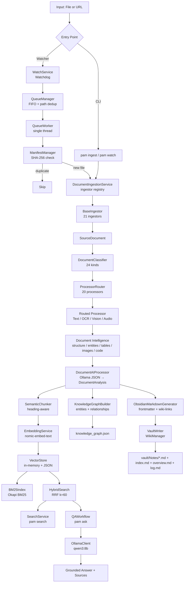
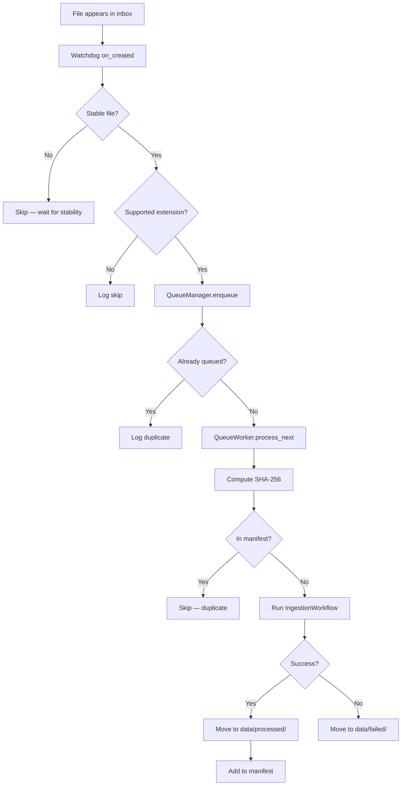

# PAM — Personal AI Memory: Project & Ingestion Reference

> **Personal reference document.** Reverse-engineered from source code, configuration, and documentation on 2026-08-18. No source code was modified.

---

## SECTION 1 — What Is My Project?

### Beginner Explanation

PAM (Personal AI Memory) is a local-first tool that takes your scattered files — notes, PDFs, code, spreadsheets, images, audio — and turns them into a searchable knowledge base you can ask questions against. It runs entirely on your machine using a local AI server (Ollama). Nothing leaves your computer.

You drop files into an inbox folder (or point the CLI at them), PAM reads them, extracts the text (using OCR for scanned docs or images), breaks the text into chunks, converts those chunks into numerical representations (embeddings), stores them, and lets you search or ask natural-language questions against everything it has ingested. It also generates Obsidian-compatible Markdown notes with wiki-links so you can browse your knowledge visually.

### Technical Explanation

PAM is a **local-first RAG (Retrieval-Augmented Generation) system** built in Python 3.11+ with a Clean Architecture layout. It implements a complete document-intelligence pipeline:

1. **Ingestion** — 20+ ingestors handle local files and two external sources (GitHub READMEs, YouTube transcripts).
2. **Classification & Routing** — A heuristic classifier maps documents to 24 kinds; a processor router selects one of 20 registered processors.
3. **Document Intelligence** — Extracted text is enriched with structure analysis, entity/relationship extraction, table extraction, image metadata, code structure, and OCR (for scanned PDFs and images).
4. **Chunking** — A heading-aware semantic chunker splits text into overlapping segments.
5. **Embedding** — Chunks are embedded via Ollama (`nomic-embed-text`) and stored in an in-memory vector store with JSON persistence.
6. **Retrieval** — Hybrid search fuses dense cosine similarity with BM25 lexical ranking via reciprocal rank fusion (RRF, k=60).
7. **RAG QA** — `pam ask` retrieves grounded context and asks a local LLM to answer with `[SOURCE N]` citations.
8. **Vault Output** — Generated Obsidian notes with frontmatter, wiki-links, and a knowledge graph are written to a local vault.

### Project Metadata

| Attribute | Value |
|---|---|
| **Name** | Personal AI Memory (PAM) |
| **Current Version** | V1.0.0 (Stable Local MVP, frozen) |
| **Python** | 3.11+ (CI-tested on 3.11, 3.12, 3.13) |
| **License** | MIT |
| **Author** | GiridharBM |
| **Repository** | `github.com/GiridharBM/AI-Memory` |
| **Status** | Complete — all 6 phases + RAG QA shipped |

### Major Technologies

| Component | Technology |
|---|---|
| CLI | Typer + Rich |
| Config | Pydantic Settings + YAML (layered: default → env → PAM_* vars) |
| LLM / Embeddings | Ollama (local server at `localhost:11434`) |
| Embedding Model | `nomic-embed-text` |
| General Text Model | `qwen3:8b` |
| Programming Model | `qwen2.5-coder:7b` |
| Vision / OCR Model | `qwen2.5vl:latest` |
| Audio Transcription | `faster-whisper` (base model, CPU) |
| OCR Fallback | Tesseract (optional, via `pytesseract`) |
| PDF Parsing | `pypdf` (text-layer), `PyMuPDF` (page rendering for OCR) |
| Spreadsheets | `openpyxl` |
| Tables | `pdfplumber` (PDF tables, default) |
| File Watching | Watchdog |
| Logging | structlog |
| Testing | pytest + coverage (89.80% coverage, 1375 passing tests) |
| Linting | Ruff |
| Type Checking | mypy |
| CI | GitHub Actions (Ubuntu, Python 3.11/3.12/3.13) |
| Vector Store | Custom in-memory + atomic JSON persistence |
| BM25 | Pure-Python Okapi BM25 (no external dependency) |

### Architecture Components

| Layer | Key Modules |
|---|---|
| CLI | `app/cli/entry.py` |
| Pipelines | `app/pipelines/ingest_workflow.py` |
| Application | `app/application/ai_processor.py`, `app/application/qa_workflow.py` |
| Domain | `app/domain/` (Pydantic models: documents, analysis, notes, routing, vector_store, knowledge_graph, semantic_chunking) |
| Infrastructure — Ingestion | `app/infrastructure/ingestion/` (21 ingestors) |
| Infrastructure — Routing | `app/infrastructure/routing/` (classifier, router, 20 processors) |
| Infrastructure — Intelligence | `app/infrastructure/document_intelligence/` (OCR, metadata, structure, tables, images, entities, relationships, graph, code) |
| Infrastructure — Search | `app/infrastructure/search.py`, `app/infrastructure/bm25.py`, `app/infrastructure/vector_store.py` |
| Infrastructure — Embeddings | `app/infrastructure/embeddings.py` |
| Infrastructure — LLM | `app/infrastructure/llm/` (OllamaClient, OllamaVisionClient, WhisperTranscriber) |
| Infrastructure — Vault | `app/infrastructure/vault/` (VaultWriter, WikiManager) |
| Infrastructure — Chunking | `app/infrastructure/semantic_chunking.py`, `app/infrastructure/sentence_tokenizer.py` |
| Infrastructure — State | `app/infrastructure/state/` (ManifestManager, hashing) |
| Watcher | `app/watcher/service.py`, `app/watcher/scanner.py`, `app/watcher/filters.py` |
| Queue | `app/queue/` (QueueManager, QueueWorker, QueueStateStore, RuntimeStats) |
| Config | `app/core/config.py`, `app/core/extensions.py` |

---

## SECTION 2 — Phase-by-Phase Implementation

| Phase | Intended Work | Actual Implementation | Important Files | Tests | Status |
|---|---|---|---|---|---|
| **Phase 1** — Foundation (v0.1.0) | 21 foundation fixes: pipeline reliability, config validation, dedup, failures folder, watch/queue shutdown, OCR/LLM error handling, missing-library routing, blank/empty/unsupported content | All 21 fixes implemented and committed | `app/core/config.py`, `app/infrastructure/state/manifest.py`, `app/watcher/service.py`, `app/queue/worker.py` | 421 passed, 86.07% coverage | VERIFIED IMPLEMENTED |
| **M2.1** — OCR Engine (v0.2.0) | `OcrEngine` protocol, `DocumentOcrService`, vision-model primary + Tesseract fallback, PDF page rendering, confidence scoring, preprocessing | All implemented. Vision engine uses `OllamaVisionClient`; Tesseract is optional. PDF rendering via PyMuPDF with zoom/page-limit config. | `app/infrastructure/document_intelligence/ocr/engines.py`, `ocr/base.py`, `ocr/pdf.py`, `ocr/models.py` | 506 passed, 87.02% | VERIFIED IMPLEMENTED |
| **M2.2** — Metadata Extraction (v0.3.0) | Extractor registry, MIME detection (ADR-001), language detection, pre/post hooks, email-attachment child ingestion | All implemented. MIME detection is extension-first with python-magic fallback. Language detection via `py3langid`. Email attachments are re-ingested as child documents. | `app/infrastructure/document_intelligence/metadata/`, `app/infrastructure/ingestion/email_ingestor.py` | 605 passed, 86.80% | VERIFIED IMPLEMENTED |
| **M2.3** — Structure Analysis (v0.4.0) | Heading-hierarchy + block detection → `DocumentStructure` with stable IDs and char offsets | Implemented. `StructureAnalyzer` produces heading hierarchy, block types, stable IDs, and exact character offsets. Output stored in `metadata.extra["structure"]`. | `app/infrastructure/document_intelligence/structure/` | 747 passed, 88.43% | VERIFIED IMPLEMENTED |
| **M2.4** — Table Intelligence (v0.5.0) | TableExtractor registry: CSV/TSV, spreadsheet (merged-cell flatten), PDF (pdfplumber default per ADR-002) | Implemented. GFM markdown rendering in notes. Tables are searchable as raw text in chunks. | `app/infrastructure/document_intelligence/tables/` | 778 passed, 88.29% | VERIFIED IMPLEMENTED |
| **M2.5** — Image Intelligence (v0.6.0) | EXIF extraction, drawio→Mermaid, PDF embedded-image extraction, config-driven preprocessing | Implemented. Standalone images get metadata. PDF-embedded images extracted to metadata. Standalone images can be OCR'd by vision model. | `app/infrastructure/document_intelligence/images/`, `app/infrastructure/document_intelligence/imaging/` | 825 passed, 88.00% | VERIFIED IMPLEMENTED |
| **M2.6** — Code & Notebook Intelligence (v0.7.0) | stdlib-AST code parser + fallback, notebook parser | Implemented. Python code parsed via `ast`; other languages use heuristic regex fallback. Notebooks: JSON cell extraction. | `app/infrastructure/document_intelligence/code/`, `app/infrastructure/ingestion/notebook_ingestor.py` | 947 passed, 88.88% | VERIFIED IMPLEMENTED |
| **M3.1** — Sentence Segmentation (v0.8.0) | Pluggable `SentenceTokenizer` protocol, NLTK `punkt_tab` (auto), stdlib heuristic fallback | Implemented. Resolved at construction time. `auto` prefers NLTK, degrades to heuristic. | `app/infrastructure/sentence_tokenizer.py` | 1059 passed, 89.03% | VERIFIED IMPLEMENTED |
| **M3.2** — Hierarchical Chunking (v0.9.0) | `SemanticChunker` over heading hierarchy, parent_id seam, adaptive policy, atomic code/tables | Implemented. Heading/block/list/sentence-aware. Structured content (code, tables, blockquotes, callouts, definitions) kept atomic. Overlap with configurable policy. | `app/infrastructure/semantic_chunking.py` | 1125 passed | VERIFIED IMPLEMENTED |
| **Phase 4** — Knowledge Graph (v0.10.0) | Entity extraction, co-occurrence relationship detection, per-document graph, JSON persistence, query layer | Implemented. `EntityExtractor`, `RelationshipDetector`, `DocumentGraphBuilder`. Graph persisted as JSON. Graph summaries in notes. | `app/infrastructure/knowledge_graph.py`, `app/infrastructure/document_intelligence/entities/`, `app/infrastructure/document_intelligence/relationships/`, `app/infrastructure/document_intelligence/graph/` | 1273 passed | VERIFIED IMPLEMENTED |
| **Phase 5** — Hybrid Retrieval (v0.11.0) | `SearchService` facade, BM25 (k1=1.5, b=0.75), RRF (k=60), filters, `pam search` | Implemented. Dense cosine + BM25 fused by RRF. Exact-match metadata filters. Graceful degradation (embedder failure → lexical-only). | `app/infrastructure/search.py`, `app/infrastructure/bm25.py` | 1384 passed, 90.00% | VERIFIED IMPLEMENTED |
| **Phase 6** — Hardening (v0.12.0) | Failure isolation, performance optimization, security/config audit, E2E validation | Implemented. 25/25 E2E pass. Perf: ingest ~271ms/20k vectors, search ~190ms. | `docs/PHASE_6_FINAL_APPROVAL.md` | 1398 passed, 90.04% | VERIFIED IMPLEMENTED — APPROVED |
| **RAG QA** (v1.0.0) | `pam ask`: hybrid retrieval → grounded prompt → Ollama → answer + `[SOURCE N]` citations | Implemented. `QAWorkflow`, bounded context (8 chunks / 12k chars), injection guard, refusal on insufficient context. | `app/application/qa_workflow.py`, `app/prompts/qa.py` | 1375 passed, 89.80% | VERIFIED IMPLEMENTED |

---

## SECTION 3 — Complete Architecture

### High-Level Flow



### Architectural Layers

| Layer | Responsibility | Key Boundary |
|---|---|---|
| **CLI** (`app/cli/`) | User interface. Typer commands: `ingest`, `watch`, `search`, `ask`, `status`, `doctor`, `config`. | Pure presentation — delegates everything to pipelines and infrastructure. |
| **Pipelines** (`app/pipelines/`) | End-to-end orchestration. `IngestionWorkflow.run()` wires ingestion → classification → routing → processing → AI analysis → chunking → embedding → vault writing → graph persistence. | Coordinates infrastructure services; contains no domain logic. |
| **Application** (`app/application/`) | Use cases. `DocumentAIProcessor` (document analysis via Ollama JSON), `QAWorkflow` (RAG question answering). | Orchestration of infrastructure for a specific user goal. |
| **Domain** (`app/domain/`) | Pure Pydantic data models. `SourceDocument`, `DocumentAnalysis`, `ObsidianNote`, `DocumentChunk`, `VectorEntry`, `KnowledgeGraph`, `DocumentClassification`, etc. | No infrastructure imports. No side effects. Contracts only. |
| **Infrastructure** (`app/infrastructure/`) | Concrete implementations: ingestion, routing, OCR, embeddings, vector store, BM25, search, LLM clients, vault writing, knowledge graph, state management. | Implements domain contracts and interfaces. |
| **Watcher** (`app/watcher/`) | Background file-system monitoring via Watchdog. Detects new files in inbox, enqueues them. | Independent service; communicates via queue. |
| **Queue** (`app/queue/`) | FIFO processing queue with state persistence, single worker, Rich progress display. | Serial processing; recovery across restarts. |
| **Config** (`app/core/`) | Layered configuration: YAML → env-specific → PAM_* env vars. Pydantic Settings models. Extension registries. | Read-only at runtime; loaded once at startup. |
| **Prompts** (`app/prompts/`) | LLM prompt templates for document analysis and QA. | Pure string functions; no side effects. |
| **Templates** (`app/templates/`) | Obsidian Markdown note generation. | Pure generation; no I/O. |

---

## SECTION 4 — Complete Ingestion Pipeline

### End-to-End Flow

```
File/URL
  │
  ▼
Entry Point
  ├── CLI: pam ingest <type> <path>
  └── Watcher: WatchService → on_created → QueueManager.enqueue
        │
        ▼
  QueueWorker.process_next()
        │
        ▼
  ManifestManager.hash_for_path(path) → SHA-256
        │
        ▼
  ManifestManager.contains_hash(digest)?
        ├── YES → Skip (duplicate detected)
        └── NO → Continue
              │
              ▼
  IngestionWorkflow.run(source)
        │
        ▼
  DocumentIngestionService.ingest(source)
        │
        ├── 1. Normalize source (Path or URL)
        ├── 2. Run pre-hooks (metadata.hooks.pre)
        ├── 3. Select ingestor: iterate registry, first can_ingest() wins
        │       ├── YouTubeTranscriptIngestor (URL → youtube_transcript_api)
        │       ├── GitHubReadmeIngestor (URL → GitHub API)
        │       ├── PdfIngestor (.pdf → pypdf)
        │       ├── NotebookIngestor (.ipynb → JSON cell extraction)
        │       ├── MarkdownIngestor (.md → UTF-8 + clean_text)
        │       ├── CodeIngestor (28 extensions → raw read)
        │       ├── ConfigIngestor (.toml/.ini/.cfg/.conf/.env → raw read)
        │       ├── TextIngestor (.txt → UTF-8/UTF-8-SIG)
        │       ├── CSVIngestor (.csv/.tsv → raw read)
        │       ├── SpreadsheetIngestor (.xlsx → openpyxl)
        │       ├── ImageIngestor (.png/.jpg/etc → metadata only)
        │       ├── DocxIngestor (.docx → python-docx if installed)
        │       ├── PptxIngestor (.pptx → python-pptx if installed)
        │       ├── AudioIngestor (.mp3/.wav/etc → metadata only)
        │       ├── VideoIngestor (.mp4/.mkv/etc → metadata only)
        │       ├── DiagramIngestor (.drawio/.mmd → raw text)
        │       ├── ArchiveIngestor (.zip/.tar/.gz → file listing)
        │       ├── EmailIngestor (.eml → stdlib email + attachment extraction)
        │       ├── DatabaseIngestor (.sqlite/.db → schema + sample rows)
        │       ├── ResearchIngestor (.bib/.ris → regex parsers)
        │       └── EpubIngestor (.epub → XML parse — currently broken)
        ├── 4. Enrich document metadata (MIME, language, EXIF, etc.)
        ├── 5. Run post-hooks (metadata.hooks.post)
        └── Return SourceDocument
              │
              ▼
  DocumentClassifier.classify(document)
        │   ├── Extension → kind mapping (EXTENSION_KIND_MAP)
        │   ├── MIME detection (extension-first, python-magic fallback)
        │   ├── Language detection (py3langid)
        │   └── Returns: kind, requires_ocr, requires_vision, requires_table, requires_code
        │
        ▼
  ProcessorRouter.select(classification)
        │   ├── Match classification.kind against registered RoutedProcessors
        │   └── Returns: processor_name + model_name
        │
        ▼
  IngestionWorkflow._run_routed_processor()
        │
        ├── Run selected processor (TextProcessor, OCRProcessor, VisionProcessor, AudioProcessor, etc.)
        │     └── Processor returns: extracted_text, confidence, source_type
        │
        ├── Enrich: structure analysis (StructureAnalyzer)
        ├── Enrich: entity extraction (EntityExtractor)
        ├── Enrich: relationship detection (RelationshipDetector)
        ├── Enrich: document graph (DocumentGraphBuilder)
        ├── Enrich: table extraction (TableExtractor — CSV/spreadsheet/PDF)
        ├── Enrich: image extraction (MultiImageExtractor — PDF embedded images)
        ├── Enrich: code/notebook structure (parse_code / notebook cells)
        │
        └── Return enriched SourceDocument
              │
              ▼
  DocumentAIProcessor.process(document)
        │   ├── Build prompt from document text + metadata
        │   ├── Send to Ollama (qwen3:8b) as structured JSON request
        │   ├── Validate response against DocumentAnalysis schema
        │   ├── Retry up to 2 times on malformed JSON
        │   └── Return: DocumentAnalysis (21 fields)
        │
        ▼
  Knowledge Engine
        │
        ├── SemanticChunker.chunk(text, source, source_type)
        │     ├── Split by headings (ATX # through ######)
        │     ├── Detect blocks: code fences, tables, blockquotes, callouts, definitions, lists
        │     ├── Keep structured content atomic
        │     ├── Split oversized sections by sentences (NLTK or heuristic)
        │     ├── Apply overlap (200 chars tail-prepend)
        │     └── Return: list[DocumentChunk]
        │
        ├── EmbeddingService.embed_batch(texts)
        │     ├── Ollama embed endpoint (nomic-embed-text)
        │     ├── Batch embedding
        │     ├── Count-mismatch guard
        │     └── Return: list[EmbeddingResult]
        │
        ├── VectorStore.add_batch(entries)
        │     ├── In-memory dict keyed by chunk_id
        │     ├── Atomic JSON save (tmp → os.replace)
        │     └── Version bumped for BM25 cache invalidation
        │
        ├── KnowledgeGraphBuilder.build_from_analysis(analysis, source)
        │     ├── Extract concept/entity/definition/topic nodes
        │     ├── Create mentioned_in/defined_in/related_to edges
        │     ├── Merge with existing graph
        │     └── Persist to knowledge_graph.json
        │
        └── Cross-document linking
              ├── Semantic search for top 3 chunks against existing store
              └── Link similar chunks from different sources (min_score 0.7)
              │
              ▼
  ObsidianMarkdownGenerator.generate(document, analysis, ocr_confidence)
        │   ├── YAML frontmatter (title, tags, source, date, etc.)
        │   ├── Summary, key concepts, definitions, entities
        │   ├── Related topics, tags, Q&A, flashcards
        │   ├── Tables section (GFM markdown)
        │   ├── Knowledge graph section
        │   └── Wiki-links for concepts, definitions, entities
        │
        ▼
  VaultWriter.save(note)
        │   ├── WikiManager.upsert_note(note)
        │   ├── Write vault/Notes/<title>.md
        │   ├── Update index.md, overview.md, log.md
        │   └── Create placeholder notes for unresolved wiki-links
        │
        ▼
  ManifestManager.add_processed_file(path, sha256, extension, note_name)
        │
        ▼
  Move source to data/processed/
```

---

## SECTION 5 — All Supported File Types

### Fully Supported (VERIFIED IMPLEMENTED — end-to-end working)

| File Type | Extensions | Processor | Model | Output | Limitations |
|---|---|---|---|---|---|
| Markdown | `.md`, `.markdown` | MarkdownProcessor | qwen3:8b | Text + AI analysis + chunks + embeddings | None significant |
| Plain Text | `.txt` | TextProcessor | qwen3:8b | Text + AI analysis + chunks + embeddings | None significant |
| PDF (text layer) | `.pdf` | PDFProcessor | qwen3:8b | Extracted text + AI analysis | Page numbers lost at chunk level; PDF-embedded images stored but not understood |
| CSV / TSV | `.csv`, `.tsv` | TableProcessor | qwen3:8b | Raw text + table extraction → GFM markdown | Tables searchable only as raw text |
| XLSX Spreadsheet | `.xlsx` | TableProcessor | qwen3:8b | Cell data + merged-cell flatten → GFM markdown | `.xls` and `.ods` fail (openpyxl limitation) |
| Jupyter Notebook | `.ipynb` | NotebookProcessor | qwen3:8b | Cell extraction + code structure | Cell outputs capped at 10 |
| Source Code | `.py .js .ts .jsx .tsx .java .c .cpp .cs .go .rb .rs .php .sh .bash .kt .swift .dart .scala .r .m .ps1 .sql .css .scss .less .vue .svelte` (28 extensions) | CodeProcessor | qwen2.5-coder:7b | Raw text + AST structure (Python) or heuristic (others) | No tree-sitter; Python-only AST |
| Config Files | `.toml .ini .cfg .conf .env` | ConfigProcessor | qwen3:8b | Raw text | None significant |
| Email | `.eml` | EmailProcessor | qwen3:8b | Parsed email + attachments re-ingested as child docs | `.msg` not supported; max 20 attachments |
| SQLite Database | `.sqlite`, `.db` | DatabaseProcessor | qwen3:8b | Schema + sample rows | Read-only; no full data extraction |
| Research | `.bib`, `.ris` | ResearchProcessor | qwen3:8b | Regex-parsed entries | Limited to standard fields |
| GitHub README | URL | GitHubReadmeIngestor | qwen3:8b | Downloaded README text | Network required; only README, not full repo |
| YouTube Transcript | URL | YouTubeTranscriptIngestor | qwen3:8b | Transcript text | Network required; transcript only, no video |

### Partially Supported (PARTIALLY IMPLEMENTED)

| File Type | Extensions | Processor | Model | Output | Limitations |
|---|---|---|---|---|---|
| Images | `.png .jpg .jpeg .gif .webp .bmp .tiff .heic .svg` | VisionProcessor | qwen2.5vl:latest | Metadata (EXIF); vision OCR makes text searchable | No text at ingest without OCR; `.heic` degrades silently; requires Ollama vision model |
| Audio | `.mp3 .wav .m4a .flac .ogg .aac` | AudioProcessor | faster-whisper | Transcription (if whisper available), otherwise empty text | Requires `faster-whisper` installed; metadata only if not available |
| Video | `.mp4 .mkv .mov .avi .webm` | VideoProcessor | qwen2.5vl:latest | **Metadata only** — no extraction/transcription | No audio extraction, no frame extraction, no ASR. Passthrough only. |
| LaTeX | `.tex` | TextProcessor | qwen3:8b | Raw source text | Not rendered; no math interpretation |
| Web Formats | `.html .htm .xml .json .rss .log` | WebProcessor / TextProcessor | qwen3:8b | Raw text only | Not reachable via watcher; direct ingest only |
| Diagrams | `.drawio`, `.mmd` | DiagramProcessor | qwen3:8b | Label/source text only | `.drawio` → Mermaid conversion attempted; `.vsdx` reads as garbage |
| Archives | `.zip .tar .gz` | ArchiveProcessor | qwen3:8b | File listing only | No content extraction from archive members |
| DOCX | `.docx` | DocxProcessor | qwen3:8b | Text extraction | Requires `python-docx` — **not in requirements.txt**; must be installed manually |
| PPTX | `.pptx` | PptxProcessor | qwen3:8b | Text extraction | Requires `python-pptx` — **not in requirements.txt**; must be installed manually |

### Broken / Claimed But Failing (NOT FOUND / NOT VERIFIED or DOCUMENTED ONLY)

| File Type | Extensions | Reason |
|---|---|---|
| EPUB | `.epub` | `epub_ingestor.py` parses a path string as XML — always fails |
| RTF | `.rtf` | Routed to raw-text fallback; no real parsing |
| ODT | `.odt` | Routed to raw-text fallback; no real parsing |
| XLS | `.xls` | openpyxl cannot read `.xls` format |
| ODS | `.ods` | openpyxl cannot read `.ods` format |
| PPT | `.ppt` | python-pptx reads `.pptx` only |
| ODP | `.odp` | python-pptx reads `.pptx` only |
| Visio | `.vsdx` | Read as raw binary text → garbage |
| 7Z | `.7z` | Not implemented |
| RAR | `.rar` | Not implemented |

### Not Implemented (NOT FOUND / NOT VERIFIED)

| File Type | Notes |
|---|---|
| `.msg` (Outlook) | Listed in EMAIL_EXTENSIONS but no ingestor handles it |
| `.puml` (PlantUML) | Not implemented |
| Generic HTTP/HTTPS URLs | Not implemented (only GitHub and YouTube URLs) |

### Watcher vs Ingestor Coverage

The **watcher** (`pam watch`) only monitors 53 extensions defined in `PROCESSABLE_EXTENSIONS`:
`.md .txt .pdf .csv .xlsx` + 28 code + 9 image + 6 audio + 5 video.

The **ingestor registry** supports more extensions (90+), but types like `.docx`, `.ipynb`, `.eml`, `.bib`, `.ris`, `.tex`, `.html` are only reachable via `pam ingest` — the watcher ignores them unless `watcher.supported_extensions` is manually extended in config.

---

## SECTION 6 — Handwritten Document Processing

### Classification

Handwritten documents are classified as kind `"handwritten"` by the `DocumentClassifier` when the source type is explicitly set to `"handwritten"`. There is **no automatic handwriting detection** — the system does not analyze an image to determine if it contains handwriting.

### Processing Pipeline (VERIFIED IMPLEMENTED)

```
Image/Scanned PDF (source_type="handwritten")
  │
  ▼
ProcessorRouter → HandwritingProcessor
  │
  ▼
HandwritingProcessor.process(document)
  │
  ├── Uses DocumentOcrService.select("handwriting")
  │     └── Selects VisionOcrEngine (default: qwen2.5vl:latest)
  │
  ├── For PDF: render pages via PyMuPDF (zoom 2.0, page_limit 5, max_pages 200)
  │     └── Per-page: save as temp PNG → OllamaVisionClient.describe_image()
  │
  ├── For image: OllamaVisionClient.describe_image() directly
  │     └── Prompt: "This is a handwritten document. Transcribe all handwritten text..."
  │
  ├── Optional preprocessing (if intelligence.ocr.preprocess=true)
  │     └── Pillow-based deskew/denoise/CLAHE (opt-in, off by default)
  │
  ▼
Extracted text (may be empty if vision model fails)
  │
  ▼
Flows into normal pipeline:
  ├── Structure analysis
  ├── Entity extraction
  ├── AI analysis (qwen3:8b)
  ├── Chunking
  ├── Embedding
  └── Vector storage
```

### Key Details

| Aspect | Implementation |
|---|---|
| **OCR Engine** | Vision model primary (`qwen2.5vl:latest` via Ollama) |
| **Fallback** | Tesseract (optional; requires binary + pytesseract) |
| **Prompt** | Configured in `config/default.yaml` under `intelligence.prompts.handwriting` |
| **Page Processing** | Page-by-page for PDFs; single-pass for images |
| **Preprocessing** | Optional (off by default); Pillow-based deskew/denoise/CLAHE |
| **Confidence** | Vision engine does not report confidence (returns `None`) |
| **Languages** | Depends on vision model capability; no language-specific handling |

### Limitations

- **No automatic handwriting detection.** The system must be told explicitly via `source_type="handwritten"`.
- **No handwriting-specific model.** Uses the same vision model as general OCR.
- **Preprocessing is off by default.** Must be enabled via `intelligence.ocr.preprocess=true`.
- **Confidence is not reported** by the vision engine.
- **Quality depends entirely** on the Ollama vision model's capability.

---

## SECTION 7 — OCR

### What OCR Is

OCR (Optical Character Recognition) converts images and scanned documents into machine-readable text. PAM uses OCR when a PDF has no text layer (scanned PDF) or when processing standalone images.

### OCR Models Used

| Engine | Model/Tool | Type | Status |
|---|---|---|---|
| **Vision OCR** (primary) | `qwen2.5vl:latest` via Ollama | Vision-language model | VERIFIED IMPLEMENTED — default engine |
| **Tesseract OCR** (fallback) | Tesseract binary via `pytesseract` | Traditional OCR | PARTIALLY IMPLEMENTED — requires manual install of Tesseract binary + pytesseract package |

### Which Documents Trigger OCR

| Trigger | Condition | Evidence |
|---|---|---|
| **Scanned PDF** | `pypdf` returns empty text → `source_type="scanned_pdf"` → `OCRProcessor` invoked | `app/infrastructure/routing/processor_impls.py`, `app/infrastructure/routing/processors.py` |
| **Handwritten document** | `source_type="handwritten"` → `HandwritingProcessor` invoked | Same as above |
| **Standalone image** | `kind="image"` → `VisionProcessor` invoked → OCR via vision model | Same as above |

### Printed Text vs Handwriting

Both use the same vision model (`qwen2.5vl:latest`) with different prompts:
- **OCR prompt**: `"This is a scanned PDF page. Extract all visible text accurately."`
- **Handwriting prompt**: `"This is a handwritten document. Transcribe all handwritten text as accurately as possible."`
- **Vision prompt**: `"Analyze this image. If it contains handwritten text, transcribe all handwritten text accurately. If it contains printed text or digital content, extract all visible text."`

### Languages

No language-specific OCR handling. The vision model's language capability determines what languages can be read. Tesseract supports language configuration via `intelligence.ocr.tesseract_lang` (default: `"eng"`).

### Output

OCR text replaces or appends to `document.text` and flows into the normal chunking/embedding pipeline, making scanned/handwritten content searchable.

### Confidence

- **Vision engine**: Does not report confidence (returns `None`).
- **Tesseract engine**: Reports mean word confidence from `pytesseract.image_to_data()` output.
- Confidence is recorded in the note but never gates retrieval.

### Fallback

If OCR fails entirely (missing Tesseract binary, empty vision result), the system logs a warning and continues with empty text. The document ends up in `data/failed/` only if the overall pipeline fails.

### Limitations

- Vision OCR requires a running Ollama server with a vision-capable model.
- Tesseract requires a separate binary installation.
- PDF page rendering uses PyMuPDF with configurable zoom (default 2.0) and page limit (default 5 pages, max 200).
- OCR preprocessing (deskew/denoise/CLAHE) is off by default.
- Layout preservation is not implemented.
- OCR confidence is recorded but not used for quality gating.

---

## SECTION 8 — Audio Processing

### Current State: PARTIALLY IMPLEMENTED

Audio ingestion has two paths:

**Path 1: Ingestion (metadata only)** — Always works
```
Audio file (.mp3/.wav/.m4a/.flac/.ogg/.aac)
  │
  ▼
AudioIngestor.ingest()
  ├── Creates SourceDocument with empty text
  ├── Extracts metadata: title (stem), modified_at, mime_type
  └── Returns SourceDocument (text="")
```

**Path 2: Transcription (if faster-whisper available)** — Conditional
```
Audio file
  │
  ▼
AudioProcessor.process(document)
  │
  ├── Checks if transcriber is available (WhisperTranscriber)
  │     └── Lazily imports faster_whisper.WhisperModel
  │
  ├── If available:
  │     ├── WhisperTranscriber.transcribe(audio_path)
  │     │     ├── Loads model: WhisperModel("base", device="cpu")
  │     │     ├── Calls model.transcribe(audio_path, beam_size=5)
  │     │     └── Joins segment texts → returns string
  │     └── Sets document.text = transcript
  │
  └── If not available:
        └── document.text remains empty
```

### Model/Configuration

| Setting | Value |
|---|---|
| **ASR Engine** | `faster-whisper` (not standard Whisper) |
| **Model Size** | `base` (configurable via `WhisperTranscriber(model_size=...)`) |
| **Device** | `cpu` (configurable) |
| **Beam Size** | 5 |
| **Timestamps** | Available from segments but **not preserved** — only text is kept |
| **Config Key** | `models.audio: faster-whisper` (display name; actual library is `faster_whisper`) |

### What Is NOT Implemented

- No audio preprocessing (noise reduction, normalization)
- No timestamps preserved in output
- No speaker diarization
- No language detection for audio
- No chunking by audio segments — transcript is treated as plain text
- `faster-whisper` is **not in requirements.txt** — must be installed manually
- If not installed, audio files get empty text and fail at the AI analysis step

---

## SECTION 9 — Video Processing

### Current State: METADATA ONLY (NOT FOUND for actual extraction)

Video ingestion is a **passthrough** that captures only metadata:

```
Video file (.mp4/.mkv/.mov/.avi/.webm)
  │
  ▼
VideoIngestor.ingest()
  ├── Creates SourceDocument with empty text
  ├── Extracts metadata: title (stem), modified_at, mime_type
  └── Returns SourceDocument (text="")
```

The `VideoProcessor` in the router is registered with model key `"vision"`, but the actual `VideoIngestor` produces empty text. The routed processor for video does nothing beyond what the ingestor provides.

### What Is NOT Implemented

| Feature | Status |
|---|---|
| Audio extraction from video | NOT IMPLEMENTED |
| ASR / speech-to-text on audio track | NOT IMPLEMENTED |
| Frame extraction | NOT IMPLEMENTED |
| OCR on frames | NOT IMPLEMENTED |
| Vision model analysis of frames | NOT IMPLEMENTED |
| Caption/subtitle extraction | NOT IMPLEMENTED |
| Video metadata (duration, resolution, etc.) | NOT IMPLEMENTED (only file-level metadata) |
| Timestamps | NOT IMPLEMENTED |

**Video files are ingested but produce no searchable content.** They end up as empty-text documents that will fail at the AI analysis step (Ollama cannot analyze empty text meaningfully).

---

## SECTION 10 — Watcher / Queue / Worker

### What the Watcher Monitors

| Aspect | Implementation |
|---|---|
| **Directory** | `data/inbox/` (configurable via `watcher.inbox_path`) |
| **Events** | File creation only (`on_created`) |
| **File modification** | NOT monitored |
| **File deletion** | NOT monitored |
| **Recursive** | Configurable (`watcher.recursive`, default `true`) |
| **Polling interval** | 1 second (configurable) |
| **Stability check** | Waits for file size to stabilize (2 checks, 0.5s delay) before queueing |
| **Supported extensions** | 53 extensions (configurable via `watcher.supported_extensions`) |

### Queue

| Aspect | Implementation |
|---|---|
| **Type** | FIFO (deque-based) |
| **Workers** | 1 (single-threaded, configured via `queue.workers`) |
| **Max size** | 1000 (configurable) |
| **State persistence** | `data/manifests/queue_state.json` — restored on restart |
| **Duplicate protection** | Path-based dedup in QueueManager (resolved paths) |
| **Processing protection** | While a file is being processed, it cannot be re-queued |

### Worker

| Aspect | Implementation |
|---|---|
| **Processing** | One item at a time, serial |
| **Retry** | No retry for individual items; failed items go to `data/failed/` |
| **Failure handling** | Catch-all exception handler; item marked FAILED; source moved to `data/failed/` |
| **Graceful shutdown** | On Ctrl+C: stops accepting new events, waits for current item, saves queue state, flushes logs |
| **Progress display** | Rich progress bars with step descriptions, percentage, elapsed/remaining time |
| **SHA-256 dedup** | Computed before processing; manifest checked; duplicates skipped |
| **Manifest save** | Atomic (tmp → os.replace); disk failure keeps in-memory record |

### Diagram



---

## SECTION 11 — Document Lifecycle

### Stages

| Stage | What Happens | Where |
|---|---|---|
| **Created** | User places file in `data/inbox/` or runs `pam ingest` | Filesystem |
| **Detected** | Watcher's `on_created` fires; stability check passes | `app/watcher/service.py` |
| **Queued** | `QueueManager.enqueue()` adds to FIFO; state saved | `app/queue/manager.py`, `app/queue/state.py` |
| **Dedup Check** | SHA-256 computed; manifest checked | `app/infrastructure/state/manifest.py` |
| **Classified** | `DocumentClassifier` determines kind (24 kinds) | `app/infrastructure/routing/classifier.py` |
| **Routed** | `ProcessorRouter` selects processor + model | `app/infrastructure/routing/router.py` |
| **Processed** | Routed processor extracts text; intelligence enriches | `app/infrastructure/routing/processor_impls.py` |
| **AI Analysis** | Ollama generates 21-field DocumentAnalysis | `app/application/ai_processor.py` |
| **Chunked** | SemanticChunker splits text into overlapping chunks | `app/infrastructure/semantic_chunking.py` |
| **Embedded** | Ollama nomic-embed-text generates vectors | `app/infrastructure/embeddings.py` |
| **Indexed** | Vectors stored in VectorStore; BM25 index auto-rebuilt | `app/infrastructure/vector_store.py`, `app/infrastructure/bm25.py` |
| **Graph Built** | Entities/relationships extracted; graph persisted | `app/infrastructure/knowledge_graph.py` |
| **Note Written** | ObsidianMarkdownGenerator + VaultWriter | `app/infrastructure/vault/` |
| **Manifest Updated** | Entry added with SHA-256, path, note name | `app/infrastructure/state/manifest.py` |
| **Archived** | Source moved to `data/processed/` | `app/queue/worker.py` |

### What Happens When a Document Changes

**There is no automatic re-processing.** The system uses SHA-256 dedup:

- If a file is modified, its SHA-256 changes → it will be processed as a **new document**.
- The old chunks remain in the vector store with the old content.
- A new set of chunks is added for the new content.
- The old note in the vault is **updated** (not duplicated) because `WikiManager.upsert_note()` writes to the same path.
- **Old vectors are NOT removed.** This means modified documents leave orphaned vectors in the store.

### What Happens When a Document Is Deleted

**Nothing automatic happens.** The system has no file-deletion monitoring:

- The watcher does not watch for `on_deleted` events.
- Old chunks remain in the vector store.
- The old note remains in the vault.
- The manifest entry remains.
- There is no garbage collection or document-level delete.

---

## SECTION 12 — Deduplication

### Duplicate File Detection

| Type | Mechanism | Evidence |
|---|---|---|
| **Duplicate files** | SHA-256 hash of file contents, checked against manifest | `app/infrastructure/state/hashing.py`, `app/infrastructure/state/manifest.py` |
| **Duplicate ingestion events** | Path-based dedup in QueueManager (resolved paths) | `app/queue/manager.py` |
| **Duplicate chunks** | NOT IMPLEMENTED — chunks are always added | No chunk-level dedup found |
| **Duplicate embeddings** | NOT IMPLEMENTED — embeddings are always added | No embedding-level dedup found |

### Hashing Details

| Aspect | Implementation |
|---|---|
| **Algorithm** | SHA-256 |
| **Granularity** | Whole-file (streaming, 8192-byte chunks) |
| **Supported types** | `.md .pdf .txt .csv .xlsx` + 28 code + 9 image + 6 audio + 5 video |
| **Storage** | `data/manifests/processed_files.json` |
| **Entry fields** | `sha256`, `original_filename`, `original_path`, `processed_at`, `extension`, `status`, `generated_note` |
| **Corruption handling** | Quarantine corrupted manifest → recreate from scratch |

### Limitations

- No chunk-level dedup: if the same content appears in two documents, both sets of chunks are stored.
- No embedding-level dedup.
- No document-level delete/GC: modified files leave orphaned vectors.
- SHA-256 is computed on the original file; if the file is moved but unchanged, the hash still matches.

---

## SECTION 13 — Metadata

### Document-Level Metadata

| Field | Source | Why It Matters |
|---|---|---|
| `document_id` | Derived from source path | Unique identifier for the document |
| `filename` | `SourceDocument.filename` | Human-readable name |
| `source` | `SourceDocument.source` | Original path or URL |
| `source_path` | `SourceDocument.source_path` | Resolved filesystem path |
| `source_type` | Classifier/ingestor | Document kind (markdown, pdf, code, etc.) |
| `mime_type` | Extension-first detection + python-magic fallback | File format identification |
| `language` | `py3langid` detection | Language-specific processing |
| `title` | From metadata extractors or filename stem | Display title |
| `modified_at` | File timestamp | Freshness tracking |
| `tags` | AI-generated (DocumentAnalysis) | Categorization |
| `created_at` | Ingestion time | When the document was processed |

### Chunk-Level Metadata

| Field | Source | Why It Matters |
|---|---|---|
| `chunk_id` | `{source}::chunk_{index}` | Unique chunk identifier |
| `chunk_index` | Sequential within document | Position in document |
| `start_char` / `end_char` | Character offsets in original text | Precise text location |
| `heading` | SemanticChunker heading detection | Section context |
| `heading_level` | ATX heading depth (1-6) | Hierarchy |
| `heading_path` | Full heading hierarchy path | Nested context |
| `parent_heading` | Nearest lower-level heading | Parent context |
| `language` | Detected language | Language context |
| `structure_type` | Block type (table, code, blockquote, etc.) | Content type |
| `callout_type` | Callout tag (note, warning, etc.) | Obsidian callout type |
| `language` (code) | Programming language from fence info | Code context |

### AI Analysis Metadata (21 Fields)

| Field | Type | Description |
|---|---|---|
| `suggested_note_title` | str | Generated note title |
| `summary` | str | Document summary |
| `key_concepts` | list | Key concepts with importance scores |
| `definitions` | list | Term definitions |
| `important_entities` | list | Named entities with types |
| `related_topics` | list | Related topics |
| `tags` | list | Generated tags |
| `suggested_related_notes` | list | Links to related notes |
| `questions_and_answers` | list | Q&A pairs |
| `flashcards` | list | Study flashcards |
| `multiple_choice_questions` | list | MCQs |
| `short_answer_questions` | list | Short answer questions |
| `long_answer_questions` | list | Long answer questions |
| `revision_notes` | list | Revision/study notes |
| `metadata` | dict | Source metadata |
| `language` | str | Detected language |
| `confidence` | float | Processing confidence |
| `processing_notes` | str | Processing notes |
| `ocr_confidence` | float | OCR confidence (if applicable) |
| `processing_confidence` | float | Overall processing confidence |
| `tables` | list | Extracted tables (in metadata.extra) |

### Obsidian Note Metadata (Frontmatter)

Generated notes include YAML frontmatter with: title, summary, tags, source, source_type, date, ocr_confidence, processing_confidence, language, and wiki-link suggestions.

### What Is NOT Tracked

- Audio timestamps (transcript segments lose timing info)
- Video timestamps
- Page numbers at chunk level (pages are joined before chunking)
- Cross-document relationships in metadata (only in knowledge graph)
- User annotations or ratings

---

## SECTION 14 — Obsidian

### Role of Obsidian

PAM uses Obsidian as a **viewing layer and knowledge management layer**:

| Role | Status | Evidence |
|---|---|---|
| **Source data** | NOT Obsidian — source files are local filesystem | Source files are ingested from `data/inbox/` |
| **Viewing layer** | YES — vault notes are designed for Obsidian | `vault/Notes/*.md` with wiki-links, frontmatter |
| **Knowledge management layer** | YES — wiki-links connect related notes | WikiManager creates placeholder notes for unresolved links |
| **Retrieval source** | NO — retrieval uses vector store, not Obsidian | `app/infrastructure/vector_store.py` |
| **Graph source** | PARTIAL — Obsidian has its own graph view from wiki-links | PAM also builds a separate knowledge graph (JSON) |
| **Synchronization source** | NO — PAM writes to vault; Obsidian reads | One-way: PAM → vault |

### Vault Structure

```
vault/
├── Notes/              # Generated notes (one per ingested document)
│   ├── <Title>.md      # Note with frontmatter + wiki-links
│   └── ...
├── index.md            # Auto-generated note index
├── overview.md         # Summary statistics
├── log.md              # Creation/update log
├── Versions/           # Version tracking
└── .obsidian/          # Obsidian workspace settings (tracked in git)
```

### How Notes Are Generated

1. `ObsidianMarkdownGenerator.generate()` creates an `ObsidianNote` with:
   - YAML frontmatter (title, tags, source, date, etc.)
   - Summary, key concepts, definitions, entities
   - Related topics, tags, Q&A, flashcards
   - Tables section (GFM markdown)
   - Knowledge graph section
   - Wiki-links for concepts, definitions, entities

2. `VaultWriter.save()` delegates to `WikiManager.upsert_note()`:
   - Writes `vault/Notes/<title>.md`
   - Updates `index.md` (note listing)
   - Updates `overview.md` (statistics)
   - Updates `log.md` (creation log)
   - Creates placeholder notes for unresolved `[[wiki-links]]`

### Wiki-Links

- Concepts, definitions, entities, and related topics render as `[[wiki links]]`
- Unresolved links get placeholder notes created automatically
- The vault grows into a connected knowledge base over time
- Obsidian's built-in graph view visualizes these connections

### Frontmatter Example

```yaml
---
title: "Python decorators"
tags: [python, programming, decorators, functions]
source: "data/inbox/python-decorators.md"
source_type: "markdown"
date: 2026-08-11
language: "en"
ocr_confidence: null
processing_confidence: null
---
```

### Watcher Integration

PAM's watcher and Obsidian's watcher are **separate**:
- PAM's watcher monitors `data/inbox/` for new files to ingest
- Obsidian watches `vault/` for note changes (built-in)
- There is no bidirectional sync

### Limitations

- Vault content is **not gitignored** (appears in `git status`)
- No bidirectional sync — PAM writes, Obsidian reads
- User-edited notes are never overwritten by PAM
- No Obsidian plugin or integration — purely file-based

---

# FINAL SECTION

## What I Actually Built

A **complete local-first RAG system** with:

- **20+ file ingestors** handling documents, code, notebooks, spreadsheets, images, audio, email, databases, research files, and two external sources (GitHub, YouTube)
- **24-kind document classifier** with extension-first MIME detection
- **20 registered processors** with model routing (text, OCR, vision, audio)
- **OCR pipeline** — vision model primary, Tesseract fallback, page-by-page PDF rendering
- **Document intelligence** — 21-field AI analysis, structure analysis, entity/relationship extraction, table extraction, image metadata, code structure
- **Semantic chunking** — heading-aware, block-aware, sentence-aware, with overlap and adaptive policy
- **Hybrid retrieval** — dense cosine + BM25 + RRF (k=60) with filters
- **RAG question answering** — `pam ask` with grounded context, injection guard, `[SOURCE N]` citations
- **Knowledge graph** — entity/relationship extraction, JSON persistence, graph summaries in notes
- **Obsidian vault output** — wiki-links, frontmatter, placeholder notes, index/overview/log
- **Watcher + queue** — automatic inbox processing, SHA-256 dedup, state persistence, graceful shutdown
- **CLI** — `pam ingest`, `pam watch`, `pam search`, `pam ask`, `pam status`, `pam doctor`, `pam config`
- **1375 passing tests**, 89.80% coverage, CI on Python 3.11/3.12/3.13

## What Is Partially Implemented

- **Audio transcription** — `faster-whisper` integration exists but is optional (not in requirements.txt); without it, audio gets empty text
- **DOCX/PPTX parsing** — works if `python-docx`/`python-pptx` are manually installed (not declared dependencies)
- **Image understanding** — standalone images can be OCR'd by vision model; PDF-embedded images are extracted as metadata but never understood
- **Video processing** — metadata only; no extraction/transcription path
- **Tesseract OCR** — fallback engine exists but requires manual Tesseract binary installation
- **Image preprocessing** — deskew/denoise/CLAHE pipeline exists but is off by default

## What Is Experimental

- **Cross-document linking** — finds similar chunks from different sources (min_score 0.7) but does not persist the links meaningfully
- **Knowledge graph merging** — `KnowledgeGraphBuilder.merge_graphs()` exists and works, but cross-document graph connections are limited

## What Is Planned (V2 Roadmap — NOT IMPLEMENTED)

- External vector database (ChromaDB / FAISS / Qdrant)
- Cross-encoder re-ranking
- Query rewriting
- Parent-child retrieval
- PDF-embedded image understanding
- Multi-strategy chunking selection
- Neo4j / NetworkX graph storage
- REST API, web UI, auth, multi-user
- Docker, monitoring, production deployment
- Autonomous AI agent (tutor, research assistant, daily summaries)
- Evaluation framework (retrieval/hallucination metrics)
- Token counting / LLM truncation
- Document-level delete/GC for vector store

## What Was Mentioned But Could Not Be Verified

- **Handwriting detection** — documentation mentions handwritten document processing, but there is no automatic detection; it requires explicit `source_type="handwritten"` at ingest time
- **macOS support** — designed to be cross-platform but not validated in CI
- **`.heic` image support** — listed in IMAGE_EXTENSIONS but documented as degrading silently
- **`.msg` email format** — listed in EMAIL_EXTENSIONS but no ingestor handles it
- **`pam doctor` intelligence health check** — OCR diagnostics exist; full intelligence health check was deferred

## Most Important Discoveries

1. **The vector store has no delete/GC.** Modified files create duplicate vectors; orphaned vectors accumulate. This is a significant gap for long-term use.
2. **Video is completely hollow.** Files are ingested but produce no content — they fail at AI analysis.
3. **Audio depends on an undeclared dependency.** `faster-whisper` is not in requirements.txt; without it, audio gets empty text.
4. **DOCX/PPTX are undeclared dependencies.** They work if manually installed but will fail on a stock `pip install`.
5. **Several formats are claimed but broken.** EPUB always fails; RTF/ODT/XLS/ODS/PPT/ODP/VSDX are non-functional.
6. **The watcher monitors only 53 of 90+ classified extensions.** Many ingestible types are watcher-inaccessible.
7. **Page numbers are lost at chunk level.** Pages are joined before chunking, so PDF chunk provenance is approximate.
8. **Tables are displayed well but retrieved only as raw text.** The GFM rendering is note-only; search uses the flat text already in the chunk.
9. **The BM25 index is rebuilt lazily** (only when VectorStore.version changes), not on every query — this was an intentional optimization.
10. **The project is well-tested** (1375 tests, 89.80% coverage) and the CI pipeline is solid (ruff, mypy, pytest on 3 Python versions).

---

*Document created 2026-08-18. Source code was inspected but not modified. No git changes were made.*
