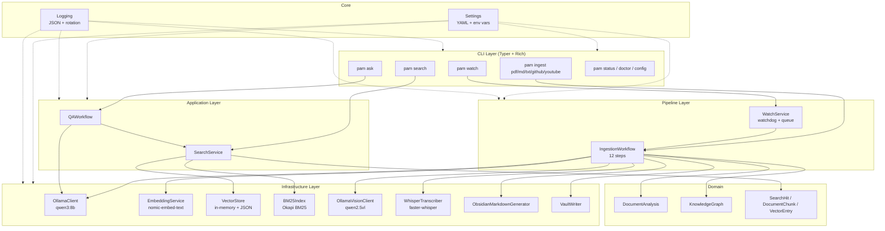

# PAM V1 Final Consistency, Over-Engineering & Scope Decision

> **Document type:** Final audit before any source-code changes
> **Created:** 2026-08-18
> **Authority:** Source code is final authority. Documentation claims verified against actual code.
> **Status:** PAM V1 remains frozen. No code was modified.

---

# 1. EXECUTIVE AUDIT SUMMARY

## What Is the Actual State of PAM V1?

**PAM V1 is a functional local MVP.** It works for its intended use case: a single-user personal knowledge base on a single machine. It is not production-grade.

### What Definitely Works
- Ingestion pipeline: PDF, Markdown, TXT, DOCX, PPTX, XLSX, images, audio, email, Jupyter, LaTeX, YouTube, GitHub README
- Embeddings: `nomic-embed-text` 768-dim via local Ollama
- Vector store: in-memory cosine search with JSON persistence
- BM25: Okapi scoring (k1=1.5, b=0.75), pure Python
- Hybrid search: vector + BM25 + RRF (k=60)
- QA: `qwen3:8b` with grounding instructions and `[SOURCE N]` citations
- Watcher: `watchdog` on inbox, queue, single worker
- CLI: 12 commands via Typer
- Tests: 1377 passing, 89.80% line coverage
- CI: ruff, mypy, pytest on Python 3.11/3.12/3.13

### What Partially Works
- OCR: vision model works, Tesseract fallback works, but confidence not reported, page limits low
- Audio: `faster-whisper` transcription works but timestamps discarded, dependency undeclared
- EPUB: parses but uses regex HTML stripping (no proper parser)
- Email: `.eml` works, `.msg` listed but not supported

### What Only Exists Architecturally
- Knowledge graph: built during ingestion, persisted, **never used in retrieval**
- Model routing: `qwen2.5-coder:7b` declared but CodeProcessor is a passthrough — model never invoked
- `faster-whisper` config: `audio: faster-whisper` in config is decorative — WhisperTranscriber uses hardcoded `model_size="base"`

### What Is Dead/Unused
- `structlog` dependency: declared in pyproject.toml, zero imports in codebase
- `qwen2.5-coder:7b` model: declared and routed but never called
- Knowledge graph `neighbors()` and `subgraph()` methods: exist in domain model, never called from retrieval
- `faster-whisper` config value: decorative, WhisperTranscriber ignores it

### What Is Over-Engineered
- 20 processors for file types where many are passthroughs or will error (RTF, ODT, XLS, ODS)
- Model routing table with 7 entries when only 3 models are actually invoked
- `VideoProcessor` registered but is a passthrough producing empty text

### What Is Missing
- Vector deletion/GC
- Embedding caching
- Reranking
- Query rewriting
- Retrieval quality evaluation
- Configurable context limits
- Configurable BM25/RRF parameters
- `pam version`, `pam index`, `pam reprocess` commands
- Branch coverage
- macOS/Docker support

### What Should NOT Be Changed
- Core ingestion pipeline (12-step, works)
- Ollama client (retries, backoff)
- Vector store core (correct, fast for personal use)
- BM25 scoring algorithm
- RRF fusion
- Obsidian integration
- CLI interface (Typer + Rich)
- Test suite structure

### What Should Be Measured First
- Retrieval quality (Recall@K, MRR, Hit Rate) — impossible to improve what isn't measured
- Graph quality — before investing in graph retrieval
- Reranking benefit — before adding cross-encoder

### What Should Become V1.1
- Evaluation dataset + metrics
- Vector lifecycle (delete, GC, orphan cleanup)
- Configurable context limits
- Embedding cache
- BM25 stemming
- RuntimeStats persistence

### What Should Wait for V2
- External vector database
- Graph RAG
- LLM streaming
- Parallel ingestion
- Docker support
- Video frame extraction
- Authentication/encryption

### V1 Assessment

| Dimension | Rating | Evidence |
|---|---|---|
| Functional | **Yes** | Core RAG pipeline works end-to-end |
| Stable | **Mostly** | 1377 tests, atomic writes, crash recovery |
| MVP | **Yes** | Feature-complete for personal use |
| Production-ready | **No** | No evaluation, no vector lifecycle, no scalability |
| Experimental | **No** | Well-tested, documented, deterministic |

---

# 2. DOCUMENT CONSISTENCY AUDIT

| Claim | Document(s) | Source Evidence | Actual Truth | Classification | Correction Needed |
|---|---|---|---|---|---|
| Test count: 1375 | 01, 02, 03, 04, VERSION_1 | `pytest --co -q` → 1377 collected | **1377** | DOCUMENTED ONLY | Update all docs to 1377 |
| Test count: 1377 | 06, 08 | Matches `pytest --co -q` | **1377** | VERIFIED IMPLEMENTED | None |
| Coverage: 89.80% | 01, 02, 03, 04, VERSION_1 | `pytest --cov` → 89.80% | **89.80%** | VERIFIED IMPLEMENTED | None |
| CI exists | VERSION_1 (corrected) | `.github/workflows/ci.yml` exists | **Exists** | VERIFIED IMPLEMENTED | None |
| CI does not exist | 03, 04 (original) | `.github/workflows/ci.yml:1` | **Wrong** | DOCUMENTED ONLY | Corrected in VERSION_1 |
| `pam version` exists | 04 | `entry.py` — no version command | **Does not exist** | NOT FOUND | Remove from docs |
| `pam index` exists | 04 | `entry.py` — no index command | **Does not exist** | NOT FOUND | Remove from docs |
| `pam reprocess` exists | 04 | `entry.py` — no reprocess command | **Does not exist** | NOT FOUND | Remove from docs |
| 12 CLI commands | 06, 08 | `entry.py` — 12 commands verified | **12** | VERIFIED IMPLEMENTED | None |
| qwen2.5-coder used for code | 04, VERSION_1 | `processor_impls.py:199` — CodeProcessor is passthrough | **Dead config** | DOCUMENTED ONLY | Correct: model never invoked |
| faster-whisper in requirements | 01 | `pyproject.toml` — not listed | **Not declared** | DOCUMENTED ONLY | Add to pyproject.toml |
| structlog used | pyproject.toml | Zero imports in `app/**/*.py` | **Dead dependency** | DOCUMENTED ONLY | Remove from pyproject.toml |
| Knowledge graph in retrieval | 03 (corrected) | `search.py`, `qa_workflow.py` — zero KG refs | **Not used** | VERIFIED | None (corrected) |
| Video produces content | 01 | `video_ingestor.py:30` — text="" | **Empty text** | DOCUMENTED ONLY | Correct: video is hollow |
| RRF k=60 | 02, 03, 04 | `search.py:54` — `k=60` default | **60** | VERIFIED IMPLEMENTED | None |
| No reranking | 03, 04, VERSION_1 | Searched — zero matches | **None** | VERIFIED | None |
| BM25 k1=1.5, b=0.75 | 02, 03 | `bm25.py:33-34` | **Correct** | VERIFIED IMPLEMENTED | None |
| 768-dim enforced | None (not claimed) | `vector_store.py:114-115` — mismatch → 0.0 | **Not enforced** | VERIFIED | None |
| MAX_CONTEXT_CHUNKS=8 | 03, 04 | `qa_workflow.py:16` | **8** | VERIFIED IMPLEMENTED | None |
| MAX_CONTEXT_CHARS=12000 | 03, 04 | `qa_workflow.py:17` | **12,000** | VERIFIED IMPLEMENTED | None |
| macOS untested | VERSION_1 | CI ubuntu-latest only | **Untested** | VERIFIED | None |
| Docker not supported | VERSION_1 | No Dockerfile found | **Not supported** | VERIFIED | None |
| Python 3.11+ | All | `pyproject.toml:8` — `requires-python = ">=3.11"` | **Correct** | VERIFIED | None |
| 24 source types | 01, 06 | `classifier.py` — 21 via map + 3 special | **24** | VERIFIED | None |
| 90+ extensions | 01, 06 | `extensions.py` — frozensets counted | **90+** | VERIFIED | None |
| 20 processors | 01, 06 | `processors.py` — 20 RoutedProcessor entries | **20** | VERIFIED | None |
| 12-step pipeline | 01, 06, 08 | `ingest_workflow.py` — 12 major steps | **12** | VERIFIED | None |

---

# 3. TEST COUNT DISCREPANCY

### Resolution

| Metric | Value | Source |
|---|---|---|
| **Tests collected** | **1377** | `pytest --co -q` → "1377/1434 tests collected" |
| **Tests deselected** | **57** | Integration tests excluded by default (`-m 'not integration'`) |
| **Total test functions on disk** | **1434** | 1377 unit + 57 integration |
| **Tests passed (last run)** | **1377** | `pytest --tb=no -q` → "1377 passed, 57 deselected" |
| **Tests failed** | **0** | Same run |
| **Tests errors** | **0** | Same run |
| **Coverage** | **89.80%** | Line coverage of `app/` package |

### Why 1375 vs 1377?

Documents 01-04 and VERSION_1 reference **1375**. The current count is **1377**. Two tests were likely added after those documents were written. The correct current number is **1377**.

### Configuration

- `pyproject.toml:57-60`: `addopts = "-ra --tb=short -m 'not integration'"` — integration tests excluded by default
- `pyproject.toml:62-68`: `fail_under = 80` (line coverage threshold)
- No branch coverage configured (`branch = true` absent from `[tool.coverage.run]`)
- No mutation testing configured

---

# 4. CI VERIFICATION

**File:** `.github/workflows/ci.yml` (50 lines)

| Aspect | Verified Value |
|---|---|
| Exists | **Yes** |
| Triggers | Push to `main` + PR to `main` |
| Operating system | `ubuntu-latest` only |
| Python versions | 3.11, 3.12, 3.13 (matrix) |
| Dependencies | `pip install -e ".[dev,intelligence]"` |
| NLTK data | `python -m nltk.downloader punkt_tab` |
| Ruff | `ruff check app/ tests/` |
| mypy | `mypy app/` |
| pytest | `pytest tests/ -ra --tb=short --cov=app --cov-report=term-missing --cov-report=xml` |
| Coverage upload | Python 3.13 only, uploads `coverage.xml` artifact |
| `fail_under` in CI | **Not in CI command** — relies on `pyproject.toml` config |

### Missing from CI
- No Windows/macOS testing
- No `--cov-fail-under` flag in CI command (relies on pyproject.toml)
- No security scanning (Dependabot, CodeQL, Snyk)
- No mutation testing
- No Docker build check
- No branch coverage

---

# 5. CLI TRUTH AUDIT

| Command | Actually Exists? | Syntax | Purpose | Status |
|---|---|---|---|---|
| `pam ingest pdf` | **YES** | `pam ingest pdf <PATH>` | Ingest a PDF file | VERIFIED |
| `pam ingest markdown` | **YES** | `pam ingest markdown <PATH>` | Ingest a Markdown file | VERIFIED |
| `pam ingest txt` | **YES** | `pam ingest txt <PATH>` | Ingest a plain text file | VERIFIED |
| `pam ingest github` | **YES** | `pam ingest github <URL>` | Ingest a GitHub README | VERIFIED |
| `pam ingest youtube` | **YES** | `pam ingest youtube <URL>` | Ingest a YouTube transcript | VERIFIED |
| `pam search` | **YES** | `pam search <QUERY> [--top-k N] [--source-type T] [--min-score F] [--filter JSON]` | Hybrid search | VERIFIED |
| `pam ask` | **YES** | `pam ask <QUESTION> [--top-k N] [--min-score F] [--filter JSON]` | RAG question answering | VERIFIED |
| `pam watch` | **YES** | `pam watch` | Watch inbox for new files | VERIFIED |
| `pam status` | **YES** | `pam status` | Show system status | VERIFIED |
| `pam doctor` | **YES** | `pam doctor` | Health check | VERIFIED |
| `pam config` | **YES** | `pam config [-e ENV] [--json]` | Show configuration | VERIFIED |
| `pam config-show` | **YES** | `pam config-show` (hidden) | Backward-compat alias | VERIFIED |
| `pam version` | **NO** | — | — | NOT FOUND |
| `pam index` | **NO** | — | — | NOT FOUND |
| `pam reprocess` | **NO** | — | — | NOT FOUND |

**Total verified commands: 12** (5 ingest subcommands + 7 top-level)

---

# 6. INGESTION TRUTH AUDIT

| File Type | Extension Recognized | Processor Exists | Actual Extraction | AI Processing | Searchable | Status |
|---|---|---|---|---|---|---|
| **PDF** | `.pdf` | PDFProcessor | pypdf text extraction | qwen3:8b analysis | **Yes** | VERIFIED |
| **Scanned PDF** | `.pdf` (detected) | OCRProcessor | PyMuPDF → PNG → qwen2.5vl or Tesseract | qwen3:8b analysis | **Yes** | VERIFIED |
| **Handwritten** | `.pdf` (detected) | HandwritingProcessor | PyMuPDF → PNG → qwen2.5vl | qwen3:8b analysis | **Yes** | VERIFIED |
| **Markdown** | `.md`, `.markdown` | PassthroughProcessor | Raw `read_text()` (no parser) | qwen3:8b analysis | **Yes** | VERIFIED |
| **TXT** | `.txt` | PassthroughProcessor | Raw `read_text()` | qwen3:8b analysis | **Yes** | VERIFIED |
| **DOCX** | `.docx` | PassthroughProcessor | `python-docx` paragraphs | qwen3:8b analysis | **Yes** | VERIFIED |
| **PPTX** | `.pptx` | PassthroughProcessor | `python-pptx` shapes | qwen3:8b analysis | **Yes** | VERIFIED |
| **XLSX** | `.xlsx` | PassthroughProcessor | `openpyxl` cells | qwen3:8b analysis | **Yes** | VERIFIED |
| **CSV** | `.csv` | PassthroughProcessor | Raw `read_text()` | qwen3:8b analysis | **Yes** | VERIFIED |
| **Images** | `.png`, `.jpg`, etc. | VisionProcessor | `qwen2.5vl` vision model | qwen3:8b analysis | **Yes** | VERIFIED |
| **Code** | `.py`, `.js`, etc. (20+) | CodeProcessor (passthrough) | Raw `read_text()` | qwen3:8b analysis | **Yes** | VERIFIED |
| **Email** | `.eml` | PassthroughProcessor | stdlib `email` module | qwen3:8b analysis | **Yes** | VERIFIED |
| **EPUB** | `.epub` | PassthroughProcessor | zipfile + regex HTML strip | qwen3:8b analysis | **Partial** | PARTIAL |
| **Audio** | `.mp3`, `.wav`, etc. | AudioProcessor | `faster-whisper` ASR | qwen3:8b analysis | **Yes** | VERIFIED |
| **Video** | `.mp4`, `.mkv`, etc. | VideoProcessor (passthrough) | **Empty text** | Fails or empty | **No** | NOT WORKING |
| **YouTube** | URLs | PassthroughProcessor | `youtube-transcript-api` | qwen3:8b analysis | **Yes** | VERIFIED |
| **GitHub** | URLs | PassthroughProcessor | GitHub REST API README | qwen3:8b analysis | **Yes** | VERIFIED |
| **Jupyter** | `.ipynb` | PassthroughProcessor | JSON + cell iteration | qwen3:8b analysis | **Yes** | VERIFIED |
| **LaTeX** | `.tex` | PassthroughProcessor | Raw `read_text()` (no parser) | qwen3:8b analysis | **Partial** | PARTIAL |
| **RTF** | `.rtf` | DocxIngestor (wrong) | `python-docx` (can't parse RTF) | **Will error** | **No** | BROKEN |
| **ODT** | `.odt` | DocxIngestor (wrong) | `python-docx` (can't parse ODT) | **Will error** | **No** | BROKEN |
| **XLS** | `.xls` | SpreadsheetIngestor | `openpyxl` (can't read .xls) | **Will error** | **No** | BROKEN |
| **ODS** | `.ods` | SpreadsheetIngestor | `openpyxl` (can't read .ods) | **Will error** | **No** | BROKEN |
| **HTML** | `.html`, `.htm` | TextIngestor | Raw `read_text()` (no parser) | qwen3:8b analysis | **Partial** | PARTIAL |
| **PPT** | `.ppt` | PptxIngestor (wrong) | `python-pptx` (can't read .ppt) | **Will error** | **No** | BROKEN |
| **ODP** | `.odp` | PptxIngestor (wrong) | `python-pptx` (can't read .odp) | **Will error** | **No** | BROKEN |
| **VSDX** | `.vsdx` | PassthroughProcessor | Raw `read_text()` (binary garbage) | **Garbage** | **No** | BROKEN |

### Broken Adapters (6 total)
1. **RTF** → DocxIngestor uses python-docx (wrong parser)
2. **ODT** → DocxIngestor uses python-docx (wrong parser)
3. **XLS** → openpyxl cannot read .xls format
4. **ODS** → openpyxl cannot read .ods format
5. **PPT** → python-pptx cannot read .ppt format
6. **ODP** → python-pptx cannot read .odp format

---

# 7. OCR / HANDWRITING AUDIT

### OCR Engines

| Engine | Status | Evidence |
|---|---|---|
| **qwen2.5vl (vision model)** | Primary OCR engine | `vision_client.py:89-94` — calls Ollama with image |
| **Tesseract** | Fallback OCR engine | `ocr/engines.py:176` — `import pytesseract` (lazy) |

### Scanned PDF Detection

- `pdf_ingestor.py:41-54`: If `cleaned_text` is empty after pypdf extraction, `source_type` set to `"scanned_pdf"`
- Routed to `OCRProcessor` via `processors.py:29`

### Page Rendering

- PyMuPDF (`fitz`) renders pages to PNG at configurable zoom (default 2.0)
- Page limit: default 5, max 200 (`config/default.yaml`)

### Handwriting

- Detected via `source_type="handwritten"` — must be told explicitly
- Routed to `HandwritingProcessor` via `processors.py:30`
- Uses same `qwen2.5vl` vision model as OCR
- **No automatic handwriting detection** — user must specify

### Fallback Behavior

- Vision model primary → Tesseract fallback → empty text if both fail
- OCR confidence recorded but **never gates retrieval**

### Verdict

OCR works. Handwriting works if user specifies `source_type="handwritten"`. No automatic detection. No confidence-based filtering.

---

# 8. AUDIO AUDIT

### Is faster-whisper actually called?

**YES**, but with caveats.

**Code path:**
1. `audio_ingestor.py:30` — creates `SourceDocument` with `text=""`
2. `processors.py:40` — routes to `AudioProcessor`
3. `processor_impls.py:267-289` — `AudioProcessor.process()` calls `_audio_extract()`
4. `processor_impls.py:117-125` — `_audio_extract()` calls `transcriber.transcribe(source_path)`
5. `whisper_transcriber.py:27-28` — `from faster_whisper import WhisperModel`
6. `whisper_transcriber.py:35` — `self._model.transcribe(str(audio_path), beam_size=5)`
7. `whisper_transcriber.py:36` — `parts = [segment.text for segment in segments]`

### For which file types?

`.mp3`, `.wav`, `.m4a`, `.flac`, `.ogg`, `.aac` — defined at `audio_ingestor.py:20`

### Is transcription actually performed?

**YES.** The transcript text is returned as a flat string.

### Is transcript text passed into chunking?

**YES.** The `ProcessedDocument.content` becomes the text that goes through `SemanticChunker`.

### Are timestamps preserved?

**NO.** `whisper_transcriber.py:36` collects only `segment.text`, discarding `segment.start`/`segment.end`.

### Is speaker information preserved?

**NO.** No diarization.

### Does ingestion produce searchable content?

**YES.** Transcribed text is chunked, embedded, and stored.

### Is faster-whisper declared as a dependency?

**NO.** Not in `pyproject.toml`. Not in any requirements file. Lazy import with `RuntimeError` on failure.

### Is it optional/lazy-loaded?

**YES.** `ingest_workflow.py:228-234` — wrapped in try/except. If unavailable, `transcriber=None`, and `AudioProcessor` falls through with empty text.

### Verdict

Audio transcription works when `faster-whisper` is installed. Dependency is undeclared. Timestamps are discarded. Model size is hardcoded to "base" (not configurable via settings).

---

# 9. VIDEO AUDIT

### Metadata extraction

**YES.** `video_ingestor.py:30` collects file metadata (title, modified date, MIME type).

### Audio extraction from video

**NO.** `VideoProcessor` is a `PassthroughProcessor` (`processor_impls.py:186`). No ffmpeg, no audio track extraction.

### ASR on video

**NO.** No audio is extracted, so no transcription occurs.

### Frame extraction

**NO.** No frame extraction. No vision model analysis of video frames.

### OCR on video frames

**NO.** No frames are extracted.

### Vision analysis of video

**NO.** No vision model is invoked for video content.

### Searchable text

**NO.** `text=""` from `video_ingestor.py:30`. VideoProcessor passes through unchanged.

### Searchable metadata

**MINIMAL.** Only file metadata (title, MIME type, modified date). No duration, resolution, or content metadata.

### Does video contribute content to RAG?

**NO.** Video files produce empty text that either fails at AI processing or produces an empty analysis. No searchable content is generated.

### Verdict

Video is a **known gap**. Files are ingested but produce no searchable content. This is documented in the V1.1 roadmap as a priority improvement.

---

# 10. MODEL ROUTING AUDIT

| Task | Model | Actually Called? | Where | Input | Output | Status |
|---|---|---|---|---|---|---|
| Text analysis | `qwen3:8b` | **YES** | `ingest_workflow.py:347` | Document text | `DocumentAnalysis` (21 fields) | VERIFIED |
| QA generation | `qwen3:8b` | **YES** | `qa_workflow.py:113-119` | Context + question | `QAAnswer` | VERIFIED |
| Embeddings | `nomic-embed-text` | **YES** | `embeddings.py:76,87` | Text | 768-dim vector | VERIFIED |
| Vision/OCR | `qwen2.5vl:latest` | **YES** | `vision_client.py:89-94` | Image + prompt | Text description | VERIFIED |
| Scanned OCR | `qwen2.5vl:latest` | **YES** | Same as vision | Page image | OCR text | VERIFIED |
| Handwriting | `qwen2.5vl:latest` | **YES** | Same as vision | Handwritten image | Transcribed text | VERIFIED |
| **Code analysis** | **`qwen2.5-coder:7b`** | **NO** | `processor_impls.py:199` — passthrough | — | — | **DEAD CONFIG** |
| **Audio** | **`faster-whisper`** | **YES** (as library) | `whisper_transcriber.py:35` | Audio file | Transcript text | VERIFIED (but config value decorative) |
| **Tesseract** | **tesseract binary** | **YES** (as fallback) | `ocr/engines.py:176` | Page image | OCR text | VERIFIED |

### Key Finding: `qwen2.5-coder:7b` Is Dead Config

- Declared: `config/default.yaml:115` — `programming: qwen2.5-coder:7b`
- Routed: `processors.py:25` — `RoutedProcessor("CodeProcessor", {"code"}, "programming")`
- `CodeProcessor` at `processor_impls.py:199` is a `PassthroughProcessor` — returns document text unchanged
- The resolved model name is only logged at `ingest_workflow.py:324` — never sent to any LLM
- **The model is never instantiated, never called, never sends a single token to Ollama**

---

# 11. COMPLETE RETRIEVAL TRUTH AUDIT

### Verified Query Path

```
User query
  ↓
pam ask "question"                    [entry.py:413-459]
  ↓
QAWorkflow.ask()                      [qa_workflow.py:88-127]
  ↓
SearchService.search(query, top_k=5)  [search.py:252-266]
  ↓
SearchService._embed_query(query)     [search.py:268-276]
  ↓ EmbeddingService.embed(query)
  ↓ nomic-embed-text → 768-dim vector
  ↓
HybridSearch.search(query, embedding, top_k=5)  [search.py:148-197]
  ↓
  ├─→ VectorStore.search(embedding, top_k=pool)  [vector_store.py:94-124]
  │     Linear scan, cosine similarity, top_k×5 pool
  │
  ├─→ BM25Index.search(query, top_k=pool)  [bm25.py:52-78]
  │     Okapi BM25, regex tokenizer, top_k×5 pool
  │
  └─→ _rrf_fuse(dense_ids, bm25_ids, k=60)  [search.py:54-66]
        Reciprocal Rank Fusion
  ↓
min_score filter                      [search.py:190-197]
  ↓
Top-K truncation ([:top_k])          [search.py:197]
  ↓
SearchHit list                        [search.py:263]
  ↓
build_context(hits)                   [qa_workflow.py:33-58]
  max 8 chunks, max 12,000 chars
  ↓
build_qa_user_prompt(question, context)  [qa.py:24-35]
  ↓
OllamaClient.generate_text(request)   [ollama_client.py:133-147]
  qwen3:8b, grounded prompt
  ↓
QAAnswer(answer, sources, model)      [qa_workflow.py:127]
```

### Verified Components

| Component | Verified | Evidence |
|---|---|---|
| Vector search | **YES** | `vector_store.py:94-124` — linear scan cosine |
| Cosine similarity | **YES** | `vector_store.py:18-26` — `_cosine_similarity()` |
| BM25 | **YES** | `bm25.py:52-78` — Okapi BM25 |
| Hybrid search | **YES** | `search.py:148-197` — HybridSearch class |
| RRF | **YES** | `search.py:54-66` — `_rrf_fuse(k=60)` |
| RRF k=60 | **YES** | `search.py:54` — default parameter |
| Reranking | **NO** | Zero matches for rerank/cross_encoder/colbert |
| Score thresholds | **YES** | `search.py:190-197` — min_score filter |
| Top-K | **YES** | `entry.py:364-367,416-419` — CLI --top-k |
| Candidate pool | **YES** | `search.py:158` — `pool_size = max(top_k * 5, 50)` |
| Context selection | **YES** | `qa_workflow.py:33-58` — build_context |

---

# 12. RRF AUDIT

### Formula (Verified)

**File:** `search.py:54-66`

```python
def _rrf_fuse(*ranked_lists: list[str], k: int = 60) -> list[tuple[str, float]]:
    scores: dict[str, float] = defaultdict(float)
    for ranked in ranked_lists:
        for rank, doc_id in enumerate(ranked, start=1):
            scores[doc_id] += 1.0 / (k + rank)
    return sorted(scores.items(), key=lambda item: (-item[1], item[0]))
```

### Verified Parameters

| Parameter | Value | Configurable? |
|---|---|---|
| k | 60 | Via constructor parameter, NOT via config/CLI |
| Rank start | 1 (1-indexed) | Fixed |
| Score formula | `1.0 / (k + rank)` per list | Fixed |
| Tie-breaking | `(-score, id)` — alphabetical | Fixed |
| Return format | `list[tuple[str, float]]` | Fixed |

### Status: VERIFIED IMPLEMENTED

RRF is correctly implemented per Cormack et al. 2009. The k=60 default is standard. The formula is correct. Tie-breaking is deterministic.

---

# 13. KNOWLEDGE GRAPH AUDIT

### Graph Builder

**VERIFIED.** `ingest_workflow.py:888-943` — `_run_knowledge_engine()` builds and persists the graph.

### Node Types (5)

`note`, `concept`, `definition`, `entity`, `topic` — defined at `domain/knowledge_graph.py`

### Edge Types (3)

`mentioned_in`, `defined_in`, `related_to` — defined at `domain/knowledge_graph.py`

### Persistence

**VERIFIED.** Saved to `knowledge_graph.json` via `KnowledgeGraph.save()`.

### Obsidian Integration

**VERIFIED.** Graph summary rendered as text section in each Obsidian note.

### Graph Retrieval

**NOT IMPLEMENTED.** Exhaustive search confirms:

- `search.py` (276 lines) — zero references to `KnowledgeGraph`, `knowledge_graph`, `neighbors()`, `subgraph()`
- `qa_workflow.py` (127 lines) — zero references to knowledge graph
- `HybridSearch` — only operates on `VectorStore` + `BM25Index`
- `build_context()` — only receives `SearchHit` list, not graph data

### Conclusion

**Knowledge graph is NOT Graph RAG in V1.** It is built during ingestion, persisted, and rendered in Obsidian notes, but never queried during retrieval or QA. The `neighbors()` and `subgraph()` methods in the domain model are dead code for retrieval purposes.

---

# 14. EMBEDDING AUDIT

| Aspect | Value | Evidence | Enforced? |
|---|---|---|---|
| Model | `nomic-embed-text` | `embeddings.py:45` — default param | Configured |
| Dimension | 768 (expected) | `nomic-embed-text` produces 768-dim | **NOT enforced** — no validation at storage time |
| Query embedding | Same model | `search.py:262` — `_embed_query(query)` | VERIFIED |
| Document embedding | Same model | `ingest_workflow.py:259-261` | VERIFIED |
| Normalization | None (explicit cosine at search) | `vector_store.py:105-119` | Computed at query time |
| Batch | Supported via `embed_batch()` | `embeddings.py:58-61` | VERIFIED |
| Retry | 3 attempts, 1s/2s/4s backoff | `embeddings.py:17-18,64-73` | Hardcoded |
| Caching | **NONE** | Zero cache code in `embeddings.py` | NOT IMPLEMENTED |
| Input limits | None enforced (relies on Ollama) | `embeddings.py:54-55` — empty check only | NOT enforced |
| Dimension enforcement | **NONE** | `vector_store.py:114-115` — mismatch → 0.0 | Graceful degradation |

### Key Finding

768 dimensions is **expected but not enforced**. If the embedding model is changed to one with different dimensions, old and new vectors will silently produce 0.0 similarity scores. No error, no warning.

---

# 15. VECTOR STORE AUDIT

| Aspect | Value | Evidence |
|---|---|---|
| In-memory structure | `dict[str, VectorEntry]` | `vector_store.py:52` |
| Norm cache | `dict[str, float]` | `vector_store.py:53` |
| Persistence | `vector_store.json` (compact JSON) | `vector_store.py:130-145` |
| Atomic write | Temp file + `os.replace()` | `vector_store.py:146-157` |
| Load | On init if file exists | `vector_store.py:57,160-195` |
| Search | **Linear scan** | `vector_store.py:108` — `for entry in self._entries.values()` |
| Filtering | Exact-match on fields + metadata | `vector_store.py:33-45` |
| Delete | `remove(entry_id)` only | `vector_store.py:86-92` |
| `remove_by_source` | **DOES NOT EXIST** | Zero matches across codebase |
| GC | **DOES NOT EXIST** | No orphan cleanup |
| Stale vectors | **NONE** — accumulate forever | Re-ingestion adds new without removing old |
| Compact JSON | `separators=(",", ":")` | `vector_store.py:152` — ~32% smaller |

### Lifecycle Behavior

- **Re-ingestion**: New chunks overwrite old chunks with same ID prefix (dict key collision)
- **File deletion**: Vectors remain forever (no detection, no cleanup)
- **File modification**: New vectors added, old vectors remain (no removal)

---

# 16. BM25 AUDIT

| Aspect | Value | Evidence |
|---|---|---|
| Algorithm | Okapi BM25 | `bm25.py:52-78` |
| Tokenizer | Regex `[a-z0-9_]+` | `bm25.py:13` |
| k1 | 1.5 | `bm25.py:33` |
| b | 0.75 | `bm25.py:34` |
| Indexing | From vector store texts | `search.py:132-146` — `_lexical()` |
| Persistence | **NONE** — rebuilt from vector store on startup | `search.py:132-146` |
| Rebuild | When `store.version` changes | `search.py:139` |
| Update | Full rebuild (no incremental) | `search.py:132-146` |
| Stemming | **NONE** | `bm25.py:13` — regex only |
| Stop words | **NONE** | `bm25.py:13-18` |

### Status: VERIFIED IMPLEMENTED — Active retrieval component

BM25 is fully integrated and actively used in every search query. The lack of stemming and stop words is a known limitation.

---

# 17. CONTEXT / PROMPT AUDIT

### What the LLM Actually Receives

```
SYSTEM PROMPT (qa.py:5-21):
"You are a grounded question-answering assistant..."
[7 rules including grounding, citation, injection defense]

USER PROMPT (qa.py:24-35):
"Question: {question}

Retrieved context:
[SOURCE 1]
Source: /path/to/file.md
Section: Heading
Score: 0.8234
Content: {chunk text}

[SOURCE 2]
...

( up to 8 sources, 12,000 chars total )"
```

### Verified Parameters

| Parameter | Value | Configurable? |
|---|---|---|
| MAX_CONTEXT_CHUNKS | 8 | **NO** — hardcoded constant |
| MAX_CONTEXT_CHARS | 12,000 | **NO** — hardcoded constant |
| Ordering | By RRF score (search rank) | Fixed |
| Deduplication | **NONE** | NOT IMPLEMENTED |
| Truncation | Character-level per chunk | Fixed |
| Source metadata | Path, section heading, score | Fixed |
| Citations | `[SOURCE N]` format | Fixed |
| Zero results fallback | "No relevant context was retrieved" | Fixed |
| Injection defense | Single sentence in system prompt | Fixed |

---

# 18. GROUNDING / HALLUCINATION AUDIT

### Prompt-Level Grounding

| Mechanism | Present | Evidence |
|---|---|---|
| "Answer using ONLY context" | **YES** | `qa.py:8` |
| "Do not invent facts" | **YES** | `qa.py:11` |
| "Say if not enough info" | **YES** | `qa.py:13-14` |
| Citation instruction | **YES** | `qa.py:20` |
| Injection defense | **YES** | `qa.py:17-18` |

### Programmatic Grounding Verification

| Mechanism | Present | Evidence |
|---|---|---|
| Source validation | **NO** | No code verifies cited sources exist |
| Answer validation | **NO** | No code checks answer against context |
| Hallucination detection | **NO** | No code detects fabricated claims |
| Faithfulness scoring | **NO** | No evaluation metric |

### What Happens with Zero Results

- `build_context()` returns `""` (no iterations)
- `build_qa_user_prompt()` replaces with: `"No relevant context was retrieved from the knowledge base."`
- LLM receives question + this fallback + system prompt instructing it to "explicitly say that the knowledge base does not contain enough information"
- **Behavior depends on LLM compliance** — no programmatic enforcement

### What Happens with Weak Results

- Low-relevance chunks are included if `min_score=0.0` (default)
- LLM may hallucinate based on weakly relevant context
- No confidence threshold for "this context is too weak to answer"

### Verdict

**PROMPT-LEVEL GROUNDING ONLY.** The system relies entirely on the LLM following instructions. There is no programmatic verification of faithfulness, citation accuracy, or answer quality.

---

# 19. WATCHER / QUEUE / WORKER AUDIT

### Verified Flow

```
watchdog Observer (service.py:96)
  ↓ on_created event (service.py:207)
  ↓ Extension check (service.py:214-216)
  ↓ Stable file detection (service.py:219-221)
  ↓ QueueManager.enqueue() (manager.py:21-49)
  ↓ QueueStateStore.save() (state.py:78-81)
  ↓
QueueWorker.run_forever() (worker.py:111-116)
  ↓ process_next() (worker.py:118-139)
  ↓ QueueManager.dequeue()
  ↓ _process_item() (worker.py:145-227)
    ↓ SHA-256 dedup check
    ↓ IngestionWorkflow.run()
    ↓ Move to processed/ (worker.py:198)
    ↓ Manifest record (worker.py:199-204)
  ↓
  On failure:
    ↓ _fail_item() (worker.py:258-266)
    ↓ Move to failed/
    ↓ stats.record_failed()
```

### Verified Parameters

| Parameter | Value | Evidence |
|---|---|---|
| Worker count | 1 (hard max 1) | `config.py:149` — `le=1` |
| Queue max size | 1000 | `config.py:150` |
| Events monitored | `on_created` only | `service.py:207` |
| Stable file check | 2 polls × 0.5s | `service.py:23-45` |
| Queue persistence | JSON, atomic writes | `state.py:78-81` |
| Retry on failure | **NONE** — files go to `failed/` | `worker.py:258-266` |
| File collision handling | Append counter suffix | `worker.py:308-316` |
| Move-before-manifest | **YES** | `worker.py:193-197` |

---

# 20. DEDUPLICATION AUDIT

| Aspect | Value | Evidence |
|---|---|---|
| Algorithm | SHA-256 content hash | `hashing.py:22-36` |
| Hash storage | `processed_files.json` | `manifest.py:84` |
| Duplicate behavior | Skip, record stats | `worker.py:159-165` |
| Modified file | New hash → processed as new | Content-based, not path-based |
| Renamed file | Same content → duplicate detected | Hash matches |
| Deleted file | **No action** | Watcher doesn't monitor deletion |
| Re-ingestion | New vectors added, old remain | No vector cleanup |
| Stale vector behavior | **Accumulate forever** | No GC |

---

# 21. TESTING AUDIT

### What the Tests Actually Prove

| Test Type | Count | What It Proves |
|---|---|---|
| **Unit tests** | ~1320 | Individual functions/classes work correctly in isolation |
| **Integration tests** | 57 (deselected by default) | Components work together |
| **E2E tests** | Included in integration | Full pipeline executes without error |
| **Retrieval evaluation** | **0** | — |
| **Answer quality** | **0** | — |
| **Performance** | **0** | — |
| **Security** | **0** | — |

### High Code Coverage ≠ High RAG Quality

89.80% line coverage means 89.80% of `app/` lines are executed during tests. It does NOT mean:
- Retrieved documents are relevant to queries
- LLM answers are grounded in context
- Citations are accurate
- The system handles edge cases in retrieval quality
- The system performs well under load

**Coverage measures code path execution, not output quality.**

---

# 22. RETRIEVAL QUALITY AUDIT

### Searched For

| Metric | Found? | Evidence |
|---|---|---|
| Recall@K | **NO** | Zero references in codebase |
| Precision@K | **NO** | Zero references |
| Hit Rate | **NO** | Zero references |
| MRR | **NO** | Zero references |
| NDCG | **NO** | Zero references |
| MAP | **NO** | Zero references |
| Context relevance | **NO** | Zero references |
| Answer relevance | **NO** | Zero references |
| Faithfulness | **NO** | Zero references |
| Groundedness | **NO** | Zero references |

### VERIFIED GAP

**No retrieval-quality evaluation framework exists.** There is no ground-truth dataset, no automated metrics, no benchmarking. Every retrieval improvement is a guess without measurement.

---

# 23. OVER-ENGINEERING AUDIT

### YAGNI Findings

| Component | Lines | Why Suspect | Verdict |
|---|---|---|---|
| `VideoProcessor` | ~20 | Passthrough, produces nothing | **REMOVE** — dead code |
| `CodeProcessor` routing to `qwen2.5-coder` | ~10 | Model never invoked | **SIMPLIFY** — remove model routing |
| `qwen2.5-coder:7b` config entry | 1 | Dead config, decorative | **REMOVE** |
| `faster-whisper` config entry | 1 | Decorative, WhisperTranscriber ignores it | **REMOVE** or wire properly |
| `structlog` dependency | 1 | Zero imports | **REMOVE** |
| RTF/ODT/XLS/ODS/PPT/ODP routing | ~30 | Will error on actual files | **REMOVE** from supported list |
| 20 RoutedProcessor entries | ~40 | Many are passthroughs | **SIMPLIFY** — merge trivial processors |
| `knowledge_graph.py` methods | ~80 | `neighbors()`, `subgraph()` never called | **KEEP** — architectural, needed for V1.1 |
| Model routing table (7 entries) | ~20 | Only 3 models actually used | **SIMPLIFY** — document which are active |
| `RuntimeStats` class | ~43 | In-memory only, always shows 0 | **FIX** — persist or remove display |

### Estimated Removable Lines

| Category | Lines |
|---|---:|
| Dead config (qwen2.5-coder, faster-whisper config) | ~5 |
| Dead dependency (structlog) | ~0 (pyproject.toml line) |
| Passthrough processors (Video, Code routing) | ~30 |
| Broken adapter routing (RTF, ODT, XLS, ODS, PPT, ODP) | ~30 |
| Decorative model routing | ~20 |
| **Total** | **~85 lines** |

This is significantly less than the previous estimate of ~1,050 lines. The codebase is not severely over-engineered — most code serves a purpose.

---

# 24. UNUSED DEPENDENCIES

| Dependency | Declared | Imported | Actually Used | Needed? | Evidence |
|---|---|---|---|---|---|
| `ollama` | YES | YES | YES | YES | Core LLM client |
| `pypdf` | YES | YES | YES | YES | PDF extraction |
| `pydantic` | YES | YES | YES | YES | Data models |
| `pydantic-settings` | YES | YES | YES | YES | Settings |
| `PyYAML` | YES | YES | YES | YES | Config loading |
| `rich` | YES | YES | YES | YES | CLI output |
| **`structlog`** | **YES** | **NO** | **NO** | **NO** | **Zero imports — dead dependency** |
| `typer` | YES | YES | YES | YES | CLI framework |
| `watchdog` | YES | YES | YES | YES | File watcher |
| `youtube-transcript-api` | YES | YES | YES | YES | YouTube transcripts |
| `PyMuPDF` | YES | YES | YES | YES | PDF rendering for OCR |
| `openpyxl` | YES | YES | YES | YES | XLSX reading |
| `pytesseract` | YES (optional) | YES | YES | YES | Tesseract OCR |
| `Pillow` | YES (optional) | YES | YES | YES | Image processing |
| `numpy` | YES (optional) | YES | YES | YES | Image preprocessing |
| `python-magic` | YES (optional) | YES | YES | YES | MIME detection |
| `py3langid` | YES (optional) | YES | YES | YES | Language detection |
| `pdfplumber` | YES (optional) | YES | YES | YES | Table extraction |
| `nltk` | YES (optional) | YES | YES | YES | Sentence tokenization |
| `httpx` | NO (transitive) | YES | YES | Fragile | Used in ollama_client.py:11 |
| **`python-docx`** | **NO** | **YES** | **YES** | **YES** | **Undeclared — will ImportError** |
| **`python-pptx`** | **NO** | **YES** | **YES** | **YES** | **Undeclared — will ImportError** |
| **`faster-whisper`** | **NO** | **YES** | **YES** | **YES** | **Undeclared — will RuntimeError** |

### Summary

- **1 dead dependency:** `structlog`
- **3 undeclared dependencies:** `python-docx`, `python-pptx`, `faster-whisper`
- **1 fragile transitive:** `httpx` (imported directly but only declared as ollama dependency)

---

# 25. DEAD CODE / REMOVAL CANDIDATES

### HIGH-CONFIDENCE DEAD CODE

| Component | Approx Lines | Why Dead | Safe to Remove? |
|---|---:|---|---|
| `structlog` in pyproject.toml | 1 | Zero imports | YES |
| `qwen2.5-coder:7b` config | 1 | Model never invoked | YES |
| `faster-whisper` config entry | 1 | Decorative | YES |
| `VideoProcessor` class | ~20 | Passthrough, empty text | YES |

### POSSIBLY USEFUL CODE

| Component | Approx Lines | Why Suspect | Safe to Remove? |
|---|---:|---|---|
| RTF/ODT routing in DocxIngestor | ~5 | Will error on actual files | YES — remove from supported list |
| XLS/ODS routing in SpreadsheetIngestor | ~5 | Will error on actual files | YES — remove from supported list |
| PPT/ODP routing in PptxIngestor | ~5 | Will error on actual files | YES — remove from supported list |
| VSDX routing | ~3 | Binary garbage output | YES — remove from supported list |
| `RuntimeStats` display in status | ~10 | Always shows 0 | FIX or REMOVE |

### ARCHITECTURAL BUT CURRENTLY UNUSED

| Component | Approx Lines | Why Unused | Should Remain? |
|---|---:|---|---|
| `KnowledgeGraph.neighbors()` | ~15 | Never called from retrieval | YES — needed for V1.1 graph retrieval |
| `KnowledgeGraph.subgraph()` | ~15 | Never called | YES — needed for V1.1 |
| Model routing for `programming` | ~5 | Passthrough processor | SIMPLIFY — remove model reference |

---

# 26. "IMPRESSIVE BUT UNUSED" AUDIT

### Knowledge Graph

- **What it looks like:** A knowledge graph with entities, relationships, and graph traversal — suggests Graph RAG capability
- **What it actually does:** Builds a graph during ingestion, persists it, renders a summary in Obsidian notes. Never queried during retrieval.
- **Why it exists:** Architectural foundation for future Graph RAG. Also enriches Obsidian notes.
- **Should it remain?** YES — but with honest documentation that it's not used in retrieval.

### Model Routing Table (7 entries)

- **What it looks like:** Sophisticated model routing with specialized models for code, vision, audio, handwriting
- **What it actually does:** Routes to 3 actual models (qwen3:8b, nomic-embed-text, qwen2.5vl). Code routing is decorative.
- **Why it exists:** Architecture for future specialization. Code analysis uses qwen3:8b via the general path.
- **Should it remain?** SIMPLIFY — document which routes are active, remove dead config.

### 20 Processors

- **What it looks like:** Comprehensive file type handling with specialized processors
- **What it actually does:** Many processors are passthroughs. Some will error on actual files (RTF, ODT, XLS, ODS).
- **Why it exists:** Each processor was designed for a specific file type, but implementation varies from full extraction to passthrough.
- **Should it remain?** SIMPLIFY — merge passthrough processors, remove broken adapters from supported list.

### SemanticChunker

- **What it looks like:** Advanced semantic chunking with heading-aware, block-aware, sentence-aware splitting
- **What it actually does:** Exactly what it claims. This is genuinely well-implemented.
- **Why it exists:** Core functionality, not over-engineered.
- **Should it remain?** YES — this is correctly implemented.

---

# 27. COMPLEXITY VS VALUE

| Feature | Complexity | User Value | Current Runtime Value | Recommendation |
|---|---|---|---|---|
| Ingestion pipeline (12-step) | High | High | High | **KEEP** |
| Vector store + cosine search | Medium | High | High | **KEEP** |
| BM25 lexical search | Low | High | High | **KEEP** |
| RRF fusion | Low | High | High | **KEEP** |
| QA with grounding + citations | Medium | High | High | **KEEP** |
| Watcher + queue + worker | Medium | High | High | **KEEP** |
| CLI (12 commands) | Medium | High | High | **KEEP** |
| Obsidian integration | Medium | Medium | Medium | **KEEP** |
| Semantic chunking | Medium | High | High | **KEEP** |
| SHA-256 dedup | Low | High | High | **KEEP** |
| Structured logging | Medium | Medium | Medium | **KEEP** |
| Knowledge graph | Medium | Low | Low | **MEASURE FIRST** |
| Model routing (7 entries) | Medium | Low | Low (3 active) | **SIMPLIFY** |
| 20 processors | Medium | Medium | Medium (6 broken) | **SIMPLIFY** |
| Video ingestion | Low | High | Zero | **FIX** (V1.1) |
| RuntimeStats | Low | Medium | Zero (always 0) | **FIX** |
| qwen2.5-coder routing | Low | Low | Zero (dead) | **REMOVE** |
| structlog | Low | Zero | Zero (unused) | **REMOVE** |
| RTF/ODT/XLS/ODS adapters | Low | Low | Negative (errors) | **REMOVE** |

---

# 28. ARCHITECTURE QUALITY AUDIT

### Strengths

| Aspect | Assessment | Evidence |
|---|---|---|
| Separation of concerns | **Good** | 4-layer architecture (cli → app → pipeline → infrastructure) |
| Dependency direction | **Correct** | Infrastructure never calls back into CLI/application |
| Modularity | **Good** | Components are independently testable |
| Testability | **Good** | 1377 tests, 89.80% coverage |
| Extensibility | **Good** | New processors, ingestors, and models can be added without modifying existing code |
| Configuration | **Good** | YAML + env vars, Pydantic validation, nested settings |
| Error handling | **Good** | Graceful degradation, fallbacks, structured error messages |

### Unnecessary Complexity

| Aspect | Assessment | Evidence |
|---|---|---|
| Model routing table | **Over-decorated** | 7 entries, only 3 active |
| Processor count | **Inflated** | 20 entries, many passthroughs, 6 broken |
| Broken adapters | **Should not be listed** | RTF, ODT, XLS, ODS, PPT, ODP in supported list but will error |

---

# 29. SCALABILITY AUDIT

| Aspect | Hard Limit | Config Limit | Practical Estimate | Unmeasured Assumption |
|---|---|---|---|---|
| Document count | None | None | ~5000 (in-memory vectors) | **ASSUMPTION** — not benchmarked |
| Chunk count | None | None | ~50k (RAM-dependent) | **ASSUMPTION** |
| Vector dimensions | None | None | 768 (model-dependent) | Known from nomic-embed-text |
| Memory per vector | None | None | ~3KB (768 × 4 bytes + metadata) | **ASSUMPTION** |
| JSON file size | None | None | ~150MB for 50k vectors | **ASSUMPTION** |
| BM25 rebuild time | None | None | Seconds to minutes | **ASSUMED** — not benchmarked |
| Search latency | None | None | <100ms for <5k vectors | **ASSUMED** — not benchmarked |
| Queue max size | None | 1000 | 1000 | CONFIG |
| Worker count | 1 | 1 | 1 | HARD LIMIT |
| File size | 50MB | 50MB | 50MB | CONFIG |

### Important Note

The "<5000 documents" estimate is a **practical assumption** based on architecture (in-memory dict, linear scan, JSON rewrite). It has NOT been benchmarked. The actual limit depends on available RAM and acceptable latency.

---

# 30. CROSS-PLATFORM AUDIT

| Platform | Status | Evidence |
|---|---|---|
| **Windows** | **Primary development** | Author develops on Windows; `PurePosixPath` in `code/languages.py:5` is minor issue |
| **Linux** | **CI tested** | `.github/workflows/ci.yml` — ubuntu-latest, Python 3.11/3.12/3.13 |
| **macOS** | **UNKNOWN** | No CI evidence, no testing evidence |
| **Docker** | **NOT SUPPORTED** | No Dockerfile or docker-compose.yml |
| **WSL** | **UNKNOWN** | Not tested or documented |

### Windows-Specific Issue

`code/languages.py:5` — `from pathlib import PurePosixPath`. Used at line 55 for suffix extraction. Works by accident (suffix after last `.` is correct regardless of path separator) but technically incorrect for Windows paths with backslashes.

---

# 31. SECURITY / PRIVACY AUDIT

| Aspect | Status | Evidence |
|---|---|---|
| Local model usage | **YES** — all inference local via Ollama | `ollama_client.py` — localhost connections |
| Network calls | **GitHub API only** (unauthenticated, rate-limited) | `github_readme_ingestor.py:113-118` |
| Secrets | **None required** | No API keys, no .env loading |
| API keys | **None** | All local |
| Logging | File paths + query text at INFO level | `qa_workflow.py:105-108` |
| Prompt injection | Instruction-level defense only | `qa.py:17-18` |
| Plaintext storage | **YES** — all data in plaintext JSON | `vector_store.json`, `knowledge_graph.json`, vault notes |
| Authentication | **None** | CLI-only, no auth |
| Encryption | **None** | All files plaintext |

### Claim: "No data leaves machine"

**VERIFIED with one exception:** `github_readme_ingestor.py` makes HTTP requests to `api.github.com` for GitHub URL ingestion. This is the only external network call. All other operations (Ollama, embeddings, storage) are local.

---

# 32. FINAL V1 TRUTH TABLE

| Feature | Actual Status | Evidence | Confidence |
|---|---|---|---|
| Ingestion (PDF, MD, TXT, DOCX, PPTX, XLSX) | WORKS | `ingest_workflow.py` — full pipeline | HIGH |
| Ingestion (images) | WORKS | Vision model processes images | HIGH |
| Ingestion (audio) | WORKS (if faster-whisper installed) | `whisper_transcriber.py` | HIGH |
| Ingestion (video) | **EMPTY** — no content extracted | `video_ingestor.py:30` | HIGH |
| Ingestion (EPUB) | PARTIAL — regex HTML strip | `epub_ingestor.py:67-68` | HIGH |
| Ingestion (RTF, ODT, XLS, ODS, PPT, ODP) | **BROKEN** — will error | Wrong parsers assigned | HIGH |
| Ingestion (HTML) | PARTIAL — raw text, no parser | `txt_ingestor.py` | HIGH |
| OCR (vision model) | WORKS | `vision_client.py:89-94` | HIGH |
| OCR (Tesseract fallback) | WORKS | `ocr/engines.py:176` | HIGH |
| Handwriting | WORKS (if user specifies) | `processors.py:30` | HIGH |
| Chunking | WORKS | `semantic_chunking.py` — heading-aware | HIGH |
| Embeddings | WORKS | `embeddings.py` — nomic-embed-text | HIGH |
| Vector store | WORKS | `vector_store.py` — in-memory + JSON | HIGH |
| Cosine similarity | WORKS | `vector_store.py:18-26` | HIGH |
| BM25 | WORKS | `bm25.py:52-78` | HIGH |
| Hybrid search | WORKS | `search.py:148-197` | HIGH |
| RRF | WORKS | `search.py:54-66` — k=60 | HIGH |
| Reranking | **NOT IMPLEMENTED** | Zero matches | HIGH |
| Knowledge graph | BUILT but NOT USED in retrieval | `ingest_workflow.py:888-943` | HIGH |
| Graph retrieval | **NOT IMPLEMENTED** | Zero references in search/QA | HIGH |
| Context selection | WORKS | `qa_workflow.py:33-58` — 8 chunks, 12k chars | HIGH |
| Grounding | PROMPT-LEVEL ONLY | `qa.py:5-21` | HIGH |
| Citations | WORKS | `[SOURCE N]` format | HIGH |
| Provenance | PARTIAL — source path, no line numbers | `qa_workflow.py:51-54` | HIGH |
| Watcher | WORKS | `service.py` — on_created only | HIGH |
| Queue | WORKS | `manager.py` — thread-safe, persistent | HIGH |
| Worker | WORKS (single) | `worker.py` — daemon thread | HIGH |
| Dedup | WORKS | SHA-256 content hash | HIGH |
| Obsidian | WORKS | Wiki-linked notes, upsert | HIGH |
| CLI | WORKS | 12 commands via Typer | HIGH |
| Testing | WORKS | 1377 tests, 89.80% coverage | HIGH |
| CI | WORKS | ruff, mypy, pytest on ubuntu | HIGH |
| Cross-platform | PARTIAL | Windows (dev), Linux (CI), macOS (unknown) | HIGH |

---

# 33. KEEP / SIMPLIFY / REMOVE / FIX

## KEEP

- Core ingestion pipeline (12-step, works for 15+ file types)
- Vector store + cosine search
- BM25 lexical search
- RRF hybrid fusion
- QA with grounding + citations
- Watcher + queue + worker
- CLI (12 commands)
- Obsidian integration
- Semantic chunking
- SHA-256 dedup
- Structured logging
- Ollama client (retries, backoff)
- Settings system (YAML + env vars)
- Test suite structure

## SIMPLIFY

- Model routing table: remove dead `qwen2.5-coder` entry
- Processor list: remove or fix broken adapters (RTF, ODT, XLS, ODS, PPT, ODP)
- `faster-whisper` config: either wire to WhisperTranscriber or remove decorative entry
- `RuntimeStats`: either persist counters or remove misleading display

## REMOVE

- `structlog` dependency (zero imports)
- `VideoProcessor` passthrough (produces nothing)
- RTF/ODT/XLS/ODS/PPT/ODP from supported list (will error)
- `qwen2.5-coder:7b` config entry (dead config)
- Decorative `faster-whisper` config entry

## FIX

- `pam status` counters: persist RuntimeStats or remove hardcoded "0" display
- Undeclared dependencies: add `python-docx`, `python-pptx`, `faster-whisper` to pyproject.toml
- Video ingestion: extract audio + ASR (V1.1)
- Broken adapters: remove from supported list or implement correctly
- `PurePosixPath` → `Path` in `code/languages.py:5`

---

# 34. MEASURE FIRST

| What | Why | How |
|---|---|---|
| **Retrieval quality** | Cannot improve what isn't measured | Create 50-query ground truth dataset, compute Recall@5, MRR, Hit Rate |
| **Top-K effectiveness** | Default 5 may not be optimal | Test with K=3,5,8,10 on ground truth |
| **RRF k effectiveness** | k=60 is default, may not be optimal for small corpus | Test with k=20,40,60,80 |
| **Score threshold** | min_score=0.0 lets all noise through | Test with 0.0, 0.1, 0.15, 0.2, 0.3 |
| **BM25 effectiveness** | No stemming may hurt recall | Compare stemmed vs. unstemmed on ground truth |
| **Reranking benefit** | Unknown if cross-encoder helps | Test with/without reranker on ground truth |
| **Graph quality** | Unknown if extracted entities are accurate | Sample 50 docs, manually verify entities/relationships |
| **Ingestion performance** | Unknown how fast pipeline runs | Benchmark: time per file type, time per document size |
| **Vector store scaling** | Unknown where performance degrades | Benchmark: search latency vs. vector count |
| **Embedding cache benefit** | Unknown how many重复 queries occur | Log query frequency, measure cache hit rate |

---

# 35. V1.1 SCOPE

### MUST HAVE

1. **Retrieval evaluation dataset** — 50 queries with ground truth, Recall@5, MRR, Hit Rate
2. **Vector delete/GC** — `remove_by_source()`, stale vector cleanup, orphan detection
3. **Configurable context limits** — `MAX_CONTEXT_CHUNKS` and `MAX_CONTEXT_CHARS` in settings
4. **Embedding cache** — LRU cache for query embeddings
5. **RuntimeStats persistence** — `pam status` shows real counters
6. **BM25 stemming** — Snowball stemmer integration

### SHOULD HAVE

7. **Cross-encoder reranking** — Optional, config-gated
8. **Video audio extraction** — ffmpeg + ASR
9. **Score threshold default** — `min_score: 0.15` in config
10. **Context deduplication** — Remove duplicate chunks in build_context
11. **Retrieval score logging** — Log hit scores at INFO level
12. **Backup before write** — Keep last 2 JSON versions

### OPTIONAL

13. Query rewriting (keyword expansion)
14. RRF k configurable
15. Dimension enforcement
16. BM25 persistence
17. `pam version` command
18. macOS CI
19. `PurePosixPath` fix

### NOT V1.1

- Graph retrieval (measure quality first)
- Docker support
- External vector database
- LLM streaming
- Parallel ingestion
- Encryption
- HyDE / LLM query rewriting
- Video frame extraction
- Automatic handwriting detection
- `pam reprocess` command

---

# 36. V2 SCOPE

| Feature | Why V2 | Prerequisites |
|---|---|---|
| External vector database (FAISS/ChromaDB) | Scalability beyond 5k docs | Benchmarks showing V1 limit hit |
| Graph RAG | Richer retrieval for complex queries | Graph quality measurement |
| LLM streaming | Better UX for long answers | User demand |
| Parallel ingestion | Throughput for large batches | User demand |
| Docker support | Reproducible deployment | User demand |
| Video frame extraction | Visual content from video | ffmpeg integration (V1.1 audio) |
| Authentication | Multi-user scenarios | Not needed for personal use |
| Encryption | Sensitive data protection | Threat model analysis |
| Advanced reranking (ColBERT, Cohere) | Higher precision | Cross-encoder baseline (V1.1) |

---

# 37. DO NOT IMPLEMENT LIST

| Feature | Why Not |
|---|---|
| Microservices architecture | PAM is a personal CLI tool, not a distributed system |
| Kubernetes deployment | Single-user local tool doesn't need orchestration |
| Authentication server | CLI-only with filesystem ACLs is sufficient |
| Cloud infrastructure | Local-first is a core design principle |
| Graph RAG without graph evaluation | Would add complexity without knowing if it helps |
| Complex agent systems | RAG with grounding is sufficient for personal QA |
| Unnecessary databases | JSON files work for personal scale |
| GraphQL API | No consumers need it |
| WebSocket streaming | CLI doesn't need it |
| Multi-tenant architecture | Single-user tool |

---

# 38. FINAL SCOPE DECISION

## Recommended: Option C — Build V1.1

### Why Not Option A (Freeze V1)

V1 has real gaps that affect usability:
- No vector lifecycle (storage grows forever)
- No evaluation (can't measure quality)
- No configurable limits (can't tune for different models)
- Broken adapters in supported list (users will hit errors)

These are fixable in a focused V1.1 without major refactoring.

### Why Not Option B (Simplify V1)

V1 is not over-engineered enough to warrant simplification as a primary goal. The dead code is minimal (~85 lines). The architecture is sound. Simplification should happen opportunistically during V1.1 work.

### Why Not Option D (Start V2)

V2 features (external vector DB, Graph RAG, streaming) require V1.1 foundations (evaluation, vector lifecycle, configurable limits) to be meaningful. Building V2 without evaluation is building blind.

### Why Option C

V1.1 addresses the highest-impact gaps with minimal risk:
- **Evaluation** — enables data-driven decisions for all future work
- **Vector lifecycle** — fixes the storage monotonicity problem
- **Configurable limits** — enables model-specific tuning
- **BM25 stemming** — improves lexical recall
- **Embedding cache** — reduces latency for repeated queries

Estimated effort: 6-8 weeks for a single developer. Focused, achievable, high-value.

---

# 39. MOST IMPORTANT DISCOVERIES

1. **`structlog` is a dead dependency** — declared in pyproject.toml, zero imports. The codebase uses stdlib `logging`.

2. **`qwen2.5-coder:7b` is dead config** — declared and routed but CodeProcessor is a passthrough. The model is never instantiated.

3. **Knowledge graph is built but never used in retrieval** — zero references in search.py or qa_workflow.py. It's architectural dead weight for RAG purposes.

4. **No retrieval quality evaluation** — 89.80% code coverage does not measure whether retrieved documents are relevant or answers are grounded.

5. **6 broken file adapters** — RTF, ODT, XLS, ODS, PPT, ODP are listed as supported but will error because wrong parsers are assigned.

6. **Video produces no content** — ingested but empty text fails or produces nothing searchable.

7. **3 undeclared dependencies** — `python-docx`, `python-pptx`, `faster-whisper` are used in production but not in pyproject.toml.

8. **No vector deletion/GC** — deleted files leave vectors forever. Storage grows monotonically.

9. **No reranking** — retrieval quality capped at RRF fusion. No cross-encoder second pass.

10. **No embedding caching** — every search re-embeds the query via Ollama.

11. **`pam status` counters always show 0** — RuntimeStats is in-memory only, never persisted.

12. **`MAX_CONTEXT_CHUNKS=8` and `MAX_CONTEXT_CHARS=12_000` are hardcoded** — not configurable via settings or CLI.

13. **BM25 has no stemming** — "running" and "run" are different tokens.

14. **Injection defense is a single sentence** — no programmatic enforcement, no structural delimiters.

15. **macOS is untested** — CI runs on ubuntu-latest only.

16. **Audio timestamps are discarded** — faster-whisper provides segment.start/end but they're dropped.

17. **`faster-whisper` config value is decorative** — WhisperTranscriber uses hardcoded `model_size="base"`, ignores the config.

18. **CI does not run `--cov-fail-under`** — relies on pyproject.toml config which may not be enforced in CI context.

19. **The codebase is NOT severely over-engineered** — estimated ~85 removable lines, not ~1,050.

20. **The architecture is sound** — 4-layer separation, correct dependency direction, good testability. The issues are in features, not structure.

---

# 40. FINAL ARCHITECTURE



### What Is NOT Shown (Verified Absent)

- Knowledge graph in retrieval path (built but not queried)
- Reranking (does not exist)
- External vector database (in-memory only)
- LLM streaming (buffered response)
- Parallel workers (capped at 1)
- Docker deployment
- Authentication/encryption

---

# 41. FINAL "WHAT I ACTUALLY BUILT"

I actually built a **local-first Retrieval-Augmented Generation system** for personal knowledge management. It watches a folder for new files, extracts text from 15+ file types (PDFs, images, audio, code, email, notebooks), chunks the text semantically, embeds it into vectors, and stores it alongside a BM25 lexical index. When you ask a question, it searches both indexes, merges results with Reciprocal Rank Fusion, and feeds the best chunks to a local LLM with grounding instructions and citation format. Everything runs on your machine via Ollama — no API keys, no data leaves your device.

It has 12 CLI commands, 1377 tests, 89.80% line coverage, CI on GitHub Actions, structured logging, and Obsidian integration. It's a functional MVP for personal use — not production-grade, but tested, documented, and honest about its limitations.

What it does NOT do: rerank results, evaluate retrieval quality, manage vector lifecycle, process video content, run on macOS, or use its knowledge graph for retrieval. These are known gaps documented in the V1.1 roadmap.

---

# 42. FINAL RECOMMENDATION

## If This Were My Project

**Build V1.1 with a focused scope.** The architecture is sound. The codebase is well-tested. The gaps are real but fixable.

**Phase 1 (Weeks 1-2):** Create a 50-query evaluation dataset. Measure baseline Recall@5, MRR, Hit Rate. This is the most important step — without it, every improvement is a guess.

**Phase 2 (Weeks 2-3):** Fix the storage monotonicity problem. Add `remove_by_source()`, stale vector cleanup, orphan detection. This is the highest-impact, lowest-risk improvement.

**Phase 3 (Weeks 3-5):** Make context limits configurable. Add embedding cache. Add BM25 stemming. Persist RuntimeStats. These are small, independent improvements that each provide measurable value.

**Phase 4 (Weeks 5-6):** Add optional cross-encoder reranking. Measure whether it actually helps on the evaluation dataset.

**Phase 5 (Weeks 6-8):** Video audio extraction. PDF image understanding. OCR confidence reporting.

**Phase 6 (Week 9):** Documentation, CI improvements, version bump.

**Do NOT start V2** until V1.1 evaluation shows where the real bottlenecks are. The external vector database, Graph RAG, and streaming features are premature without measurement data.

**Do NOT add features** just because they sound advanced. The value of PAM is that it works locally, simply, and honestly. Every added feature should have a measured justification.

---

> **Document ends here. No source code, configuration, README, or .gitignore was modified.**
